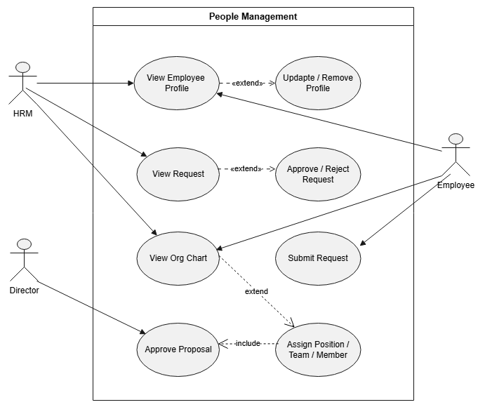
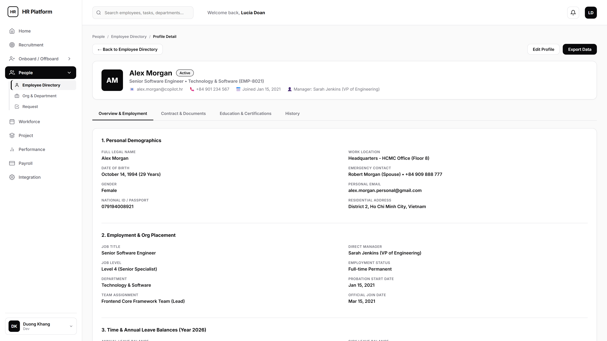
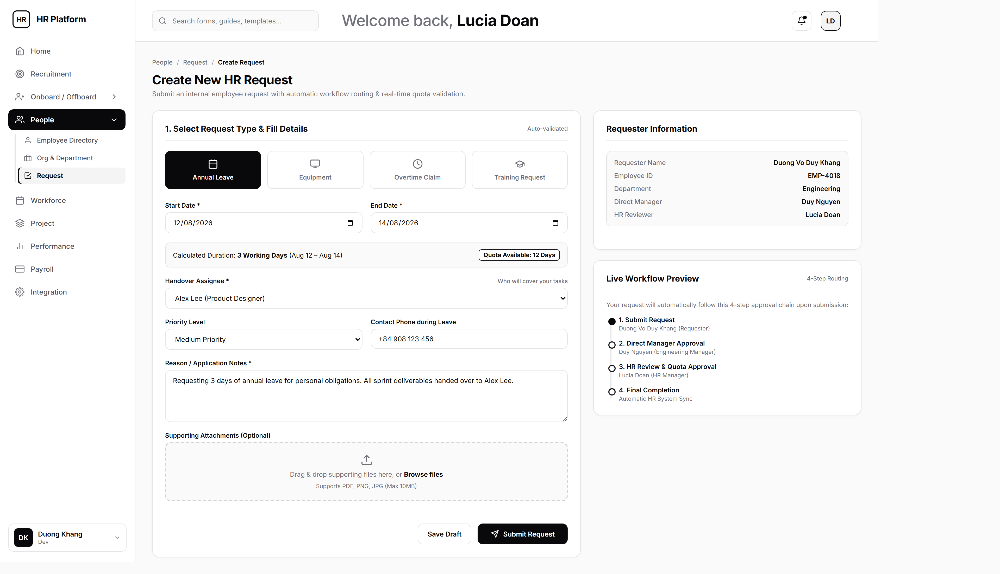
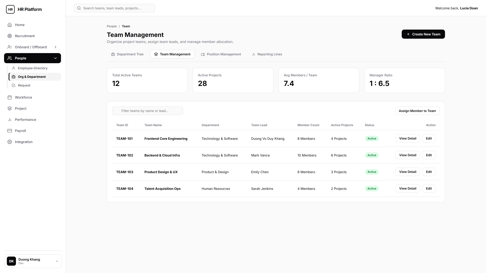
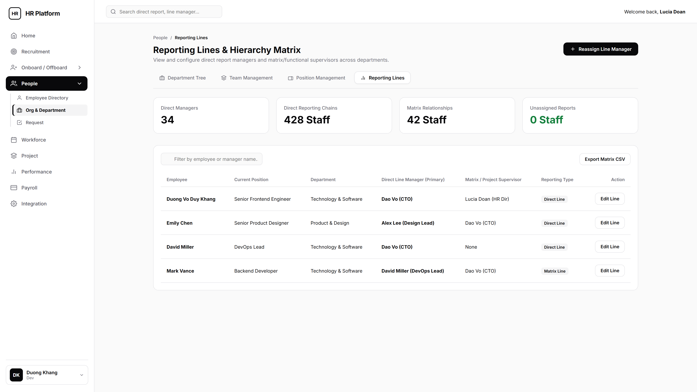
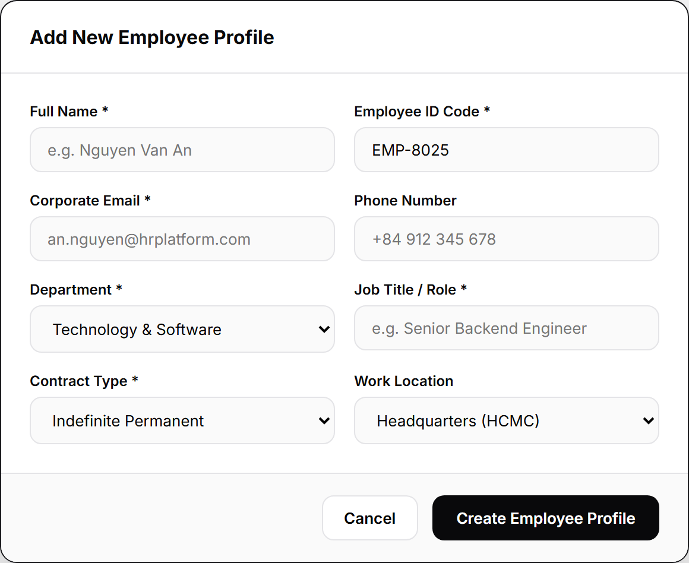
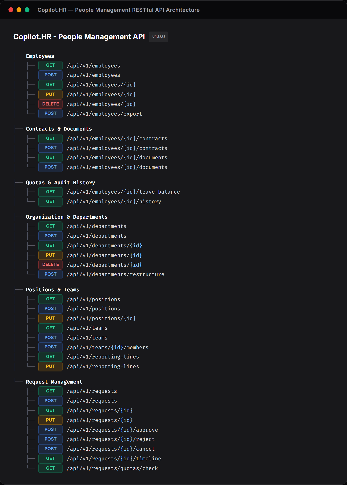
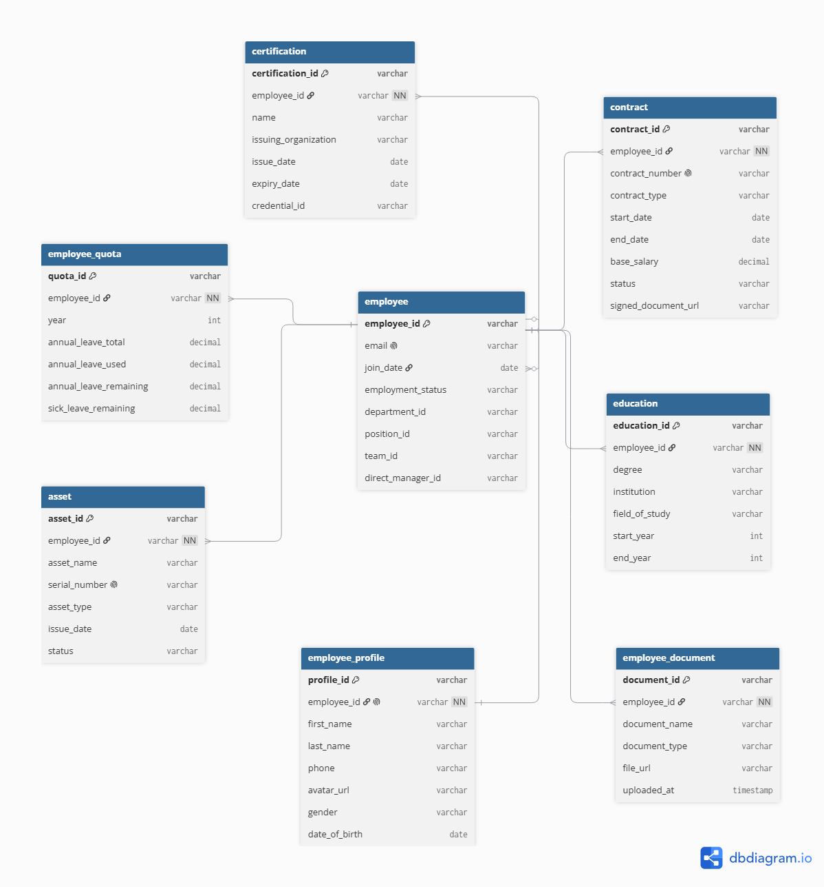

# Workforce Management System - Copilot.HR

## I. System Requirements & Functional Analysis

### I.1. System Actors

| No. | Actor | Main Responsibilities |
| --: | :--- | :--- |
| 1 | **System admin** | Manage user accounts, roles, permissions, system settings, and audit logs. |
| 2 | **HR Staff** | Manage employee profiles, onboarding/offboarding tasks, leave balances, and day-to-day HR operations. |
| 3 | **Manager** | Manage team members, assign tasks, approve timesheets, approve leave requests, and review employee performance. |
| 4 | **Staff** | Clock in/out, track working time, submit timesheets, request leave, and manage assigned tasks. |
| 5 | **Client** | Track assigned project progress, team allocation, milestones, and billing history. |
| 6 | **Candidate** | Apply for open job positions, submit personal profiles, and track interview status. |
| 7 | **Third party** | External service integrations (Email provider, Cloud storage, Calendar, Payroll gateway). |
| 8 | **Tenant admin** | Represents an organization using the platform, with isolated data, organization settings, and company-wide access controls. |

---

### I.2. Feature Functionalities Mindmap

```mermaid
flowchart LR

    %% =====================================================
    %% ROOT
    %% =====================================================

    WMS["Workforce Management System<br/>(BambooHR + Hubstaff)"]:::rootStyle


    %% =====================================================
    %% LEFT-SIDE MODULES
    %% =====================================================

    Auth["Authentication & Access"]:::authModule
    Recruitment["Recruitment"]:::recruitmentModule
    People["People Management"]:::peopleModule
    Performance["Performance"]:::performanceModule
    Integration["Integration"]:::integrationModule
    Payroll["Payroll"]:::payrollModule


    %% =====================================================
    %% RIGHT-SIDE MODULES
    %% =====================================================

    Onboarding["Onboarding & Offboarding"]:::onboardingModule
    Workforce["Workforce Management"]:::workforceModule
    Project["Project Management"]:::projectModule


    %% =====================================================
    %% ROOT CONNECTIONS
    %% =====================================================

    Auth --> WMS
    Recruitment --> WMS
    People --> WMS
    Performance --> WMS
    Integration --> WMS
    Payroll --> WMS

    WMS --> Onboarding
    WMS --> Workforce
    WMS --> Project


    %% =====================================================
    %% AUTHENTICATION & ACCESS
    %% =====================================================

    AuthenticationManagement["Authentication Management"]:::criticalFeature
    AccountManagement["Account Management"]:::highFeature
    RolePermissionManagement["Role & Permission Management"]:::criticalFeature

    AuthenticationManagement --> Auth
    AccountManagement --> Auth
    RolePermissionManagement --> Auth


    %% =====================================================
    %% RECRUITMENT
    %% =====================================================

    RecruitmentDashboard["Recruitment Dashboard"]:::highFeature
    JobManagement["Job Management"]:::criticalFeature
    RequirementManagement["Recruitment Requirement Management"]:::criticalFeature
    ApplicationManagement["Application Management"]:::criticalFeature
    OfferManagement["Offer Management"]:::criticalFeature
    RecruitmentSchedule["Recruitment Schedule Management"]:::highFeature
    InterviewManagement["Interview Management"]:::criticalFeature
    AIRecruitment["AI Recruitment Content Management"]:::highFeature
    RecruitmentTemplate["Recruitment Template Management"]:::highFeature

    RecruitmentDashboard --> Recruitment
    JobManagement --> Recruitment
    RequirementManagement --> Recruitment
    ApplicationManagement --> Recruitment
    OfferManagement --> Recruitment
    RecruitmentSchedule --> Recruitment
    InterviewManagement --> Recruitment
    AIRecruitment --> Recruitment
    RecruitmentTemplate --> Recruitment


    %% =====================================================
    %% PEOPLE MANAGEMENT
    %% =====================================================

    EmployeeDirectory["Employee Directory Management"]:::criticalFeature
    EmployeeProfile["Employee Profile Management"]:::criticalFeature
    OrganizationChart["Organization Chart Management"]:::criticalFeature
    DepartmentManagement["Department Management"]:::criticalFeature
    TeamManagement["Team Management"]:::highFeature
    PositionManagement["Position Management"]:::criticalFeature
    EmployeeRequest["Employee Request Management"]:::criticalFeature

    EmployeeDirectory --> People
    EmployeeProfile --> People
    OrganizationChart --> People
    DepartmentManagement --> People
    TeamManagement --> People
    PositionManagement --> People
    EmployeeRequest --> People


    %% =====================================================
    %% PERFORMANCE
    %% =====================================================

    GoalManagement["Goal Management"]:::highFeature
    PerformanceReview["Performance Review Management"]:::highFeature

    GoalManagement --> Performance
    PerformanceReview --> Performance


    %% =====================================================
    %% INTEGRATION
    %% =====================================================

    ExternalIntegration["External Integration Management"]:::highFeature
    APIWebhook["API & Webhook Management"]:::highFeature
    ApprovalWorkflow["Approval Workflow Management"]:::highFeature

    ExternalIntegration --> Integration
    APIWebhook --> Integration
    ApprovalWorkflow --> Integration


    %% =====================================================
    %% PAYROLL
    %% =====================================================

    PayslipManagement["Payslip Management"]:::criticalFeature
    PayCompensation["Pay & Compensation Management"]:::highFeature
    PayrollDocument["Payroll Document Management"]:::highFeature
    PayrollHistory["Payroll History Management"]:::highFeature
    BenefitsManagement["Benefits Management"]:::highFeature

    PayslipManagement --> Payroll
    PayCompensation --> Payroll
    PayrollDocument --> Payroll
    PayrollHistory --> Payroll
    BenefitsManagement --> Payroll


    %% =====================================================
    %% ONBOARDING & OFFBOARDING
    %% =====================================================

    OnboardingManagement["Onboarding Management"]:::criticalFeature
    OnboardingAutomation["Onboarding Automation Management"]:::highFeature
    DayOneReadiness["Day One Readiness Management"]:::criticalFeature
    OnboardingTask["Onboarding Task Management"]:::highFeature
    OnboardingProgress["Onboarding Progress Tracking"]:::criticalFeature
    OnboardingTemplate["Onboarding Template Management"]:::criticalFeature
    OnboardingIntegration["Onboarding Integration Management"]:::highFeature
    OffboardingManagement["Offboarding Management"]:::criticalFeature

    Onboarding --> OnboardingManagement
    Onboarding --> OnboardingAutomation
    Onboarding --> DayOneReadiness
    Onboarding --> OnboardingTask
    Onboarding --> OnboardingProgress
    Onboarding --> OnboardingTemplate
    Onboarding --> OnboardingIntegration
    Onboarding --> OffboardingManagement


    %% =====================================================
    %% WORKFORCE MANAGEMENT
    %% =====================================================

    AttendanceManagement["Attendance Management"]:::criticalFeature
    TimesheetOvertime["Timesheet & Overtime Management"]:::criticalFeature
    WorkSchedule["Work Schedule Management"]:::highFeature
    LeaveManagement["Leave Management"]:::criticalFeature
    WorkLocation["Work Location & Geofence Management"]:::highFeature

    Workforce --> AttendanceManagement
    Workforce --> TimesheetOvertime
    Workforce --> WorkSchedule
    Workforce --> LeaveManagement
    Workforce --> WorkLocation


    %% =====================================================
    %% PROJECT MANAGEMENT
    %% =====================================================

    ProjectManagement["Project Management"]:::criticalFeature
    TaskManagement["Task Management"]:::criticalFeature
    ProjectMemberManagement["Project Member Management"]:::criticalFeature
    CapabilityManagement["Capability Management"]:::criticalFeature
    ProjectTaskTracking["Project & Task Time Tracking"]:::criticalFeature
    ProductivityMonitoring["Productivity Monitoring"]:::highFeature
    ScreenshotTracking["Screenshot, App & Website Tracking"]:::highFeature

    Project --> ProjectManagement
    Project --> TaskManagement
    Project --> ProjectMemberManagement
    Project --> CapabilityManagement
    Project --> ProjectTaskTracking
    Project --> ProductivityMonitoring
    Project --> ScreenshotTracking


    %% =====================================================
    %% STYLES
    %% =====================================================

    classDef rootStyle fill:#1d3557,stroke:#457b9d,stroke-width:4px,color:#ffffff,font-weight:bold,font-size:17px;

    classDef authModule fill:#2f9e44,stroke:#237a35,stroke-width:3px,color:#ffffff,font-weight:bold;
    classDef recruitmentModule fill:#7950f2,stroke:#5f3dc4,stroke-width:3px,color:#ffffff,font-weight:bold;
    classDef peopleModule fill:#74b816,stroke:#5c940d,stroke-width:3px,color:#ffffff,font-weight:bold;
    classDef onboardingModule fill:#9c36b5,stroke:#862e9c,stroke-width:3px,color:#ffffff,font-weight:bold;
    classDef workforceModule fill:#f59f00,stroke:#e67700,stroke-width:3px,color:#ffffff,font-weight:bold;
    classDef projectModule fill:#4263eb,stroke:#364fc7,stroke-width:3px,color:#ffffff,font-weight:bold;
    classDef payrollModule fill:#0ca678,stroke:#087f5b,stroke-width:3px,color:#ffffff,font-weight:bold;
    classDef performanceModule fill:#e64980,stroke:#c2255c,stroke-width:3px,color:#ffffff,font-weight:bold;
    classDef integrationModule fill:#1098ad,stroke:#0b7285,stroke-width:3px,color:#ffffff,font-weight:bold;

    classDef criticalFeature fill:#fff3cd,stroke:#ff9800,stroke-width:3px,color:#7a4b00,font-weight:bold;
    classDef highFeature fill:#ffffff,stroke:#b0bec5,stroke-width:1.5px,color:#37474f;
```

---

## II. Information Architecture (IA) Sitemap

Link Sitemap IA: [Relume Sitemap Project](https://www.relume.ai/app/project/P3513106_M_AsmXcsz2LE9p9i5egRRtV2aMuaJQ4-Pj5YjjiDkKo#mode=sitemap)

---

## III. Use Case Diagrams

---

## IV. People Management - UI/UX Specifications

Comprehensive documentation of user interface screens, major popup modals, and slide-over drawers for the **People Management** module in **Copilot.HR**.

### IV.1. Summary UI/UX Asset Matrix

| Category | Description | Count | Assets List |
| :--- | :--- | :---: | :--- |
| **Main Screens** | Primary application workflow and dashboard screens | **9** | `EmployeeDirectory`, `EmployeeProfileDetail`, `OrgDepartment`, `RequestManagement`, `CreateRequest`, `TrackingRequest`, `PositionManagement`, `TeamManagement`, `ReportingLines` |
| **Major Popups & Drawers** | Modal dialogs and slide-over forms for data creation and approval | **3** | `AddEmployeeModal`, `AddDepartmentDrawer`, `AddContractModal` |
| **TOTAL** | **Total Key UI/UX Assets Documented** | **12** | **12 Major Screens & Component Modals** |

---

### IV.2. Main Screens & Sub-Screens

#### 1.1 Employee Directory Screen
**Trigger:** Click `People` -> `Employee Directory` in the sidebar.  
**Description:** Central workforce catalog displaying searchable employee records, KPI metrics, status filters, and quick action toolbars.

---

#### 1.2 Employee Profile Detail Screen
**Trigger:** Click any employee row in the Employee Directory table.  
**Description:** Dedicated 360-degree employee profile screen featuring breadcrumbs navigation, employee header banner, and consolidated tabs for Overview & Employment, Contract & Documents, Education & Certifications, and History.

---

#### 1.3 Organization & Department Screen
**Trigger:** Click `People` -> `Org & Department` in the sidebar.  
**Description:** Interactive organizational structure canvas featuring department hierarchy tree, roster table view, branch filters, and zoom controls.

---

#### 1.4 Request Management Screen
**Trigger:** Click `People` -> `Request` in the sidebar.  
**Description:** Management dashboard for employee HR requests, leave approvals, status filtering, and workflow processing.

---

#### 1.5 Create HR Request Screen
**Trigger:** Click `+ Create Request` button on the Request Management page.  
**Description:** Two-column interactive form for submitting annual leave, equipment, or policy requests with automatic quota validation.

---

#### 1.6 Tracking Request Progress Screen
**Trigger:** Click `View Timeline` or any request item in the Request Management table.  
**Description:** Real-time request progress tracker displaying approval workflow steps, reviewer comments, and timeline status.

---

#### 1.7 Position & Job Title Management Screen
**Trigger:** Click `Position Management` subnav link in Org & Department.  
**Description:** Management screen defining organizational job titles, competency levels, salary bands, and headcount quotas.

---

#### 1.8 Team Management Screen
**Trigger:** Click `Team Management` subnav link in Org & Department.  
**Description:** Workspace for organizing project teams, designating team leads, and allocating member resources.

---

#### 1.9 Reporting Lines & Hierarchy Matrix Screen
**Trigger:** Click `Reporting Lines` subnav link in Org & Department.  
**Description:** Organizational matrix displaying direct report managers, functional line supervisors, and reporting relationships.

---

### IV.3. Major PopUp Modals & Drawers

#### 2.1 Add New Employee Profile Modal
**Trigger:** Click `Add Employee` button on the Employee Directory toolbar.  
**Description:** Modal popup form for registering a new employee profile with personal demographics, corporate email, role, and department assignment.

---

#### 2.2 Add Department Drawer
**Trigger:** Click `Add Department` button on the Organization & Department page header.  
**Description:** Slide-over drawer for configuring new department entities, parent division alignment, location branch, and manager assignments.

---

#### 2.3 Add Labor Contract Modal
**Trigger:** Click `+ Add Contract` button on the Employee Profile Contract tab.  
**Description:** Form popup for registering official labor contracts, compensation terms, effective dates, and document attachments.

---

## V. People Management - RESTful API Specifications

Comprehensive API inventory for the People Management module divided into Employee Directory, Organization & Department, and Request Management domains. Interactive Swagger API documentation: [Copilot.HR Employee Directory API - SwaggerHub](https://app.swaggerhub.com/apis/ouuniversity/copilothr-employee-directory-api/1.0.0#/Documents).

---

### V.1. Employee Directory APIs

| Method | URL Endpoint | Role | Parameters / Query | Status Code | Description |
| :---: | :--- | :--- | :--- | :---: | :--- |
| `GET` | `/api/v1/employees` | `Staff, Manager, HR Staff, HR Manager, Tenant Admin, System Admin` | Query: `query`, `department`, `status`, `page`, `limit` | `200`, `401` | Retrieve a paginated list of employees with search and department/status filtering options. |
| `POST` | `/api/v1/employees` | `HR Staff, HR Manager, Tenant Admin` | Body: `fullName`, `corporateEmail`, `department`, `jobTitle`, `phoneNumber` | `201`, `400` | Register a new employee profile into the system directory. |
| `GET` | `/api/v1/employees/{id}` | `Staff, Manager, HR Staff, HR Manager, Tenant Admin` | Path: `id` | `200`, `404` | Retrieve comprehensive 360-degree employee profile details. |
| `PUT` | `/api/v1/employees/{id}` | `Staff, HR Staff, HR Manager, Tenant Admin` | Path: `id`, Body: `phoneNumber`, `personalEmail`, `residentialAddress` | `200`, `400` | Update personal demographics or work contact details for an employee. |
| `DELETE` | `/api/v1/employees/{id}` | `HR Manager, Tenant Admin` | Path: `id` | `200`, `404` | Deactivate or offboard an employee profile account. |
| `GET` | `/api/v1/employees/{id}/contracts` | `Staff, HR Staff, HR Manager, Tenant Admin` | Path: `id` | `200`, `404` | Retrieve labor contract history, base salary, and active employment contract. |
| `POST` | `/api/v1/employees/{id}/contracts` | `HR Staff, HR Manager, Tenant Admin` | Path: `id`, Body: `contractNumber`, `contractType`, `baseSalary`, `effectiveDate` | `201`, `400` | Register a new labor contract with compensation details and effective date. |
| `GET` | `/api/v1/employees/{id}/documents` | `Staff, HR Staff, HR Manager, Tenant Admin` | Path: `id` | `200`, `404` | Fetch list of uploaded verification documents (Identity Card, Medical Clearance, Tax Records). |
| `POST` | `/api/v1/employees/{id}/documents` | `Staff, HR Staff, HR Manager, Tenant Admin` | Path: `id`, FormData: `documentType`, `file` | `201`, `400` | Upload a new identity or verification document for an employee. |
| `GET` | `/api/v1/employees/{id}/leave-balance` | `Staff, Manager, HR Staff, HR Manager, Tenant Admin` | Path: `id` | `200`, `404` | Retrieve remaining annual leave and sick leave quota balances for the current year. |
| `GET` | `/api/v1/employees/{id}/history` | `Manager, HR Staff, HR Manager, Tenant Admin` | Path: `id` | `200`, `404` | Fetch audit trail history including promotions, job level updates, and contract sign-offs. |
| `POST` | `/api/v1/employees/export` | `Manager, HR Staff, HR Manager, Tenant Admin` | Body: `department`, `fileFormat` | `200`, `400` | Export filtered employee directory records to CSV or Excel file format. |

---

### V.2. Organization & Department APIs

| Method | URL Endpoint | Role | Parameters / Query | Status Code | Description |
| :---: | :--- | :--- | :--- | :---: | :--- |
| `GET` | `/api/v1/departments` | `Staff, Manager, HR Staff, HR Manager, Tenant Admin` | Query: `branch` | `200`, `401` | Retrieve the interactive organizational tree hierarchy and department roster metrics. |
| `POST` | `/api/v1/departments` | `HR Staff, HR Manager, Tenant Admin` | Body: `departmentName`, `parentDepartmentId`, `departmentLeadId`, `locationBranch` | `201`, `400` | Register a new operational department entity into the organizational structure. |
| `GET` | `/api/v1/departments/{id}` | `Staff, Manager, HR Staff, HR Manager, Tenant Admin` | Path: `id` | `200`, `404` | Fetch comprehensive department details, department lead, headcount, and budget allocation. |
| `PUT` | `/api/v1/departments/{id}` | `HR Staff, HR Manager, Tenant Admin` | Path: `id`, Body: `departmentName`, `parentDepartmentId`, `departmentLeadId` | `200`, `400` | Modify department name, parent division, department lead, or location branch. |
| `DELETE` | `/api/v1/departments/{id}` | `HR Manager, Tenant Admin` | Path: `id` | `200`, `404` | Archive or deactivate an existing department entity. |
| `POST` | `/api/v1/departments/restructure` | `Manager, HR Manager, Tenant Admin` | Body: `sourceNodeId`, `targetDepartmentId`, `reason` | `202`, `400` | Queue an organizational restructuring or employee reassignment drag-and-drop event for Director/CEO approval. |
| `GET` | `/api/v1/positions` | `Staff, Manager, HR Staff, HR Manager, Tenant Admin` | None | `200` | Retrieve all defined organizational job titles, competency levels (L1-L6), and salary band ranges. |
| `POST` | `/api/v1/positions` | `HR Staff, HR Manager, Tenant Admin` | Body: `title`, `jobLevel`, `minSalaryUSD`, `maxSalaryUSD` | `201`, `400` | Create a new job position title with assigned salary band and job level. |
| `PUT` | `/api/v1/positions/{id}` | `HR Staff, HR Manager, Tenant Admin` | Path: `id`, Body: `title`, `jobLevel`, `minSalaryUSD`, `maxSalaryUSD` | `200`, `400` | Update job description, level, or salary band range for a position title. |
| `GET` | `/api/v1/teams` | `Staff, Manager, HR Staff, HR Manager, Tenant Admin` | None | `200` | Retrieve all active cross-functional project teams, designated team leads, and member counts. |
| `POST` | `/api/v1/teams` | `Manager, HR Staff, HR Manager, Tenant Admin` | Body: `teamName`, `teamLeadId` | `201`, `400` | Register a new cross-functional project team. |
| `POST` | `/api/v1/teams/{id}/members` | `Manager, HR Staff, HR Manager, Tenant Admin` | Path: `id`, Body: `employeeId`, `action` | `200`, `400` | Assign or remove employee member allocations within a project team. |
| `GET` | `/api/v1/reporting-lines` | `Staff, Manager, HR Staff, HR Manager, Tenant Admin` | None | `200` | Fetch supervisor relationships across direct report managers and functional matrix line managers. |
| `PUT` | `/api/v1/reporting-lines` | `HR Staff, HR Manager, Tenant Admin` | Body: `employeeId`, `newManagerId`, `reportingType` | `200`, `400` | Update direct report supervisor or functional line manager for an employee. |

---

### V.3. Request Management APIs

| Method | URL Endpoint | Role | Parameters / Query | Status Code | Description |
| :---: | :--- | :--- | :--- | :---: | :--- |
| `GET` | `/api/v1/requests` | `Staff, Manager, HR Staff, HR Manager, Tenant Admin` | Query: `type`, `status`, `applicantId`, `page`, `limit` | `200`, `401` | Retrieve a paginated list of HR requests filtered by request type, approval status, or applicant. |
| `POST` | `/api/v1/requests` | `Staff, Manager` | Body: `requestType`, `startDate`, `endDate`, `reason`, `urgencyLevel` | `201`, `400` | Submit a new HR request (Annual Leave, Equipment, Policy) with automatic quota validation. |
| `GET` | `/api/v1/requests/{id}` | `Staff, Manager, HR Staff, HR Manager, Tenant Admin` | Path: `id` | `200`, `404` | Retrieve full request metadata, applicant details, approval steps, and attached proof files. |
| `PUT` | `/api/v1/requests/{id}` | `Staff, Manager` | Path: `id`, Body: `requestType`, `startDate`, `endDate`, `reason` | `200`, `400` | Modify an existing draft HR request prior to submission. |
| `POST` | `/api/v1/requests/{id}/approve` | `Manager, HR Manager, Tenant Admin` | Path: `id`, Body: `comment` | `200`, `400` | Approve a pending request step. Automatically advances workflow to next approver or executes final approval. |
| `POST` | `/api/v1/requests/{id}/reject` | `Manager, HR Manager, Tenant Admin` | Path: `id`, Body: `reason` | `200`, `400` | Reject a pending HR request with mandatory reviewer feedback comments. |
| `POST` | `/api/v1/requests/{id}/cancel` | `Staff, Manager` | Path: `id` | `200`, `400` | Cancel a submitted request by the applicant prior to final approval execution. |
| `GET` | `/api/v1/requests/{id}/timeline` | `Staff, Manager, HR Staff, HR Manager, Tenant Admin` | Path: `id` | `200`, `404` | Retrieve step-by-step progress tracker timeline, reviewer audit logs, and approval timestamps. |
| `GET` | `/api/v1/requests/quotas/check` | `Staff, Manager` | Query: `applicantId`, `leaveType`, `requestedDays` | `200`, `400` | Validate available annual or sick leave balance before submitting a leave request. |

---

## VI. People Management - Database ERD & Schema

**Total System Tables**: **20 Tables**

---

### VI.1. Master Table Relationships Matrix

| # | Table Name | Description | Primary Key (PK) | Foreign Keys (FK) | Relationships & Cardinality |
| :---: | :--- | :--- | :--- | :--- | :--- |
| **1** | **`COMPANY_BRANCH`** | Office locations & regional hubs | `branch_id` | *None* | `DEPARTMENT` (1:N) |
| **2** | **`DEPARTMENT`** | Operational units & hierarchy | `department_id` | `parent_department_id`, `department_lead_id`, `branch_id` | `DEPARTMENT` (Self N:1), `COMPANY_BRANCH` (N:1), `EMPLOYEE` (1:1 Lead), `TEAM` (1:N), `POSITION` (1:N) |
| **3** | **`TEAM`** | Cross-functional project teams | `team_id` | `department_id`, `team_lead_id` | `DEPARTMENT` (N:1), `EMPLOYEE` (1:1 Lead), `TEAM_MEMBER` (1:N) |
| **4** | **`POSITION`** | Job titles & salary bands | `position_id` | `department_id` | `DEPARTMENT` (N:1), `EMPLOYEE` (1:N) |
| **5** | **`REPORTING_LINE`** | Direct & Matrix reporting lines | `reporting_id` | `employee_id`, `manager_id` | `EMPLOYEE` (N:1 Subordinate), `EMPLOYEE` (N:1 Manager) |
| **6** | **`TEAM_MEMBER`** | Multi-team memberships & capacity | `member_id` | `team_id`, `employee_id` | `TEAM` (N:1), `EMPLOYEE` (N:1) |
| **7** | **`EMPLOYEE`** | Central employee system account | `employee_id` | `department_id`, `position_id`, `team_id`, `direct_manager_id` | `DEPARTMENT` (N:1), `POSITION` (N:1), `TEAM` (N:1), `EMPLOYEE` (Self N:1), `EMPLOYEE_PROFILE` (1:1) |
| **8** | **`EMPLOYEE_PROFILE`** | Personal demographical details (1:1) | `profile_id` | `employee_id` | `EMPLOYEE` (1:1) |
| **9** | **`CONTRACT`** | Labor contracts & base pay | `contract_id` | `employee_id` | `EMPLOYEE` (N:1) |
| **10** | **`EDUCATION`** | Academic degrees & universities | `education_id` | `employee_id` | `EMPLOYEE` (N:1) |
| **11** | **`CERTIFICATION`** | Professional certifications | `certification_id` | `employee_id` | `EMPLOYEE` (N:1) |
| **12** | **`ASSET`** | Hardware devices assigned to staff | `asset_id` | `employee_id` | `EMPLOYEE` (N:1) |
| **13** | **`EMPLOYEE_DOCUMENT`** | Scanned identity & HR files | `document_id` | `employee_id` | `EMPLOYEE` (N:1) |
| **14** | **`EMPLOYEE_QUOTA`** | Annual leave & quota balance | `quota_id` | `employee_id` | `EMPLOYEE` (N:1) |
| **15** | **`REQUEST_TYPE`** | Categories & default SLA rules | `type_id` | *None* | `TICKET_REQUEST` (1:N), `WORKFLOW_STEP` (1:N) |
| **16** | **`TICKET_REQUEST`** | Employee ticket applications | `request_id` | `employee_id`, `type_id`, `handover_employee_id` | `EMPLOYEE` (N:1), `REQUEST_TYPE` (N:1), `APPROVAL_LOG` (1:N), `REQUEST_ATTACHMENT` (1:N), `HANDOVER_TASK` (1:N) |
| **17** | **`WORKFLOW_STEP`** | Multi-stage approval sequence | `step_id` | `type_id` | `REQUEST_TYPE` (N:1), `APPROVAL_LOG` (1:N) |
| **18** | **`APPROVAL_LOG`** | Audit trail of manager approvals | `log_id` | `request_id`, `step_id`, `approver_id` | `TICKET_REQUEST` (N:1), `WORKFLOW_STEP` (N:1), `EMPLOYEE` (N:1) |
| **19** | **`REQUEST_ATTACHMENT`** | Supporting files for requests | `attachment_id` | `request_id` | `TICKET_REQUEST` (N:1) |
| **20** | **`HANDOVER_TASK`** | Work handover checklist items | `task_id` | `request_id` | `TICKET_REQUEST` (N:1) |

---

### VI.2. ERD Diagram Visuals

#### 2.1 Organization Domain

---

#### 2.2 Employee Directory Domain

---

#### 2.3 Request Management Domain

---

## VII. High-Priority System Features Matrix (48)

| No. | Module                       | Feature                             | Impact   | Short Description                                                                                     |
| --: | ---------------------------- | ----------------------------------- | -------- | ----------------------------------------------------------------------------------------------------- |
|   1 | **Auth**                     | Authentication Management           | Critical | Manage authentication, login sessions, password-related access, and secure system entry.              |
|   2 | **Auth**                     | Account Management                  | High     | Manage user accounts and account status.                                                              |
|   3 | **Auth**                     | Role & Permission Management        | Critical | Manage roles, permissions, and access control across the platform.                                    |
|   4 | **Recruitment**              | Recruitment Dashboard               | High     | Display recruitment actions, summary data, and recruitment pipeline Kanban.                           |
|   5 | **Recruitment**              | Job Management                      | Critical | Manage job pipeline, job list, job information, recruitment metrics, and recent applications.         |
|   6 | **Recruitment**              | Recruitment Requirement Management  | Critical | Create, view, search, filter, and maintain recruitment requirements and hiring details.               |
|   7 | **Recruitment**              | Application Management              | Critical | Manage candidate applications, candidate information, application details, and CV/resume files.       |
|   8 | **Recruitment**              | Offer Management                    | Critical | Manage offers, offer information, offer templates, and email acceptance synchronization.              |
|   9 | **Recruitment**              | Recruitment Schedule Management     | High     | Manage recruitment schedules, calendar events, and upcoming recruitment activities.                   |
|  10 | **Recruitment**              | Interview Management                | Critical | Manage interview information, evaluations, and interview notes.                                       |
|  11 | **Recruitment**              | AI Recruitment Content Management   | High     | Generate recruitment content and support AI-assisted public job publishing.                           |
|  12 | **Recruitment**              | Recruitment Template Management     | High     | Manage reusable templates used across recruitment activities.                                         |
|  13 | **People**                   | Employee Directory Management       | Critical | Search, filter, and manage employee directory information, status, history, and contract views.       |
|  14 | **People**                   | Employee Profile Management         | Critical | Manage employee personal information, education, certificates, documents, contracts, and history.     |
|  15 | **People**                   | Organization Chart Management       | Critical | Search and explore organization structure through the organization chart.                             |
|  16 | **People**                   | Department Management               | Critical | Manage departments, department information, assignments, teams, managers, and positions.              |
|  17 | **People**                   | Team Management                     | High     | Manage teams, team information, and assigned members.                                                 |
|  18 | **People**                   | Position Management                 | Critical | Manage positions, position information, and assigned employees.                                       |
|  19 | **People**                   | Employee Request Management         | Critical | Create, search, view, and track employee requests and activity history.                               |
|  20 | **Onboarding & Offboarding** | Onboarding Management               | Critical | Manage candidates through onboarding stages and generated onboarding plans.                           |
|  21 | **Onboarding & Offboarding** | Onboarding Automation Management    | High     | Manage process automation, contract mapping, AI mapping assistance, and automation activity.          |
|  22 | **Onboarding & Offboarding** | Day One Readiness Management        | Critical | Manage Day One readiness, readiness checklists, and Day One information.                              |
|  23 | **Onboarding & Offboarding** | Onboarding Task Management          | High     | Manage assigned setup tasks and onboarding task lists.                                                |
|  24 | **Onboarding & Offboarding** | Onboarding Progress Tracking        | Critical | Track onboarding progress, attention items, and recent feedback.                                      |
|  25 | **Onboarding & Offboarding** | Onboarding Template Management      | Critical | Create, search, categorize, select, and maintain reusable onboarding templates.                       |
|  26 | **Onboarding & Offboarding** | Onboarding Integration Management   | High     | Manage onboarding integrations, configurations, health, endpoints, messages, and activities.          |
|  27 | **Onboarding & Offboarding** | Offboarding Management              | Critical | Manage employee offboarding processes.                                                                |
|  28 | **Workforce**                | Attendance Management               | Critical | Manage clock in/out, breaks, attendance records, and attendance exceptions.                           |
|  29 | **Workforce**                | Timesheet & Overtime Management     | Critical | Manage timesheets, manual/offline time, overtime, correction, review, and approval.                   |
|  30 | **Workforce**                | Work Schedule Management            | High     | Manage shifts, assignments, recurring schedules, and schedule conflicts.                              |
|  31 | **Workforce**                | Leave Management                    | Critical | Manage leave policies, balances, requests, approvals, and holiday calendars.                          |
|  32 | **Workforce**                | Work Location & Geofence Management | High     | Manage work locations, GPS tracking, geofence clock-in, and field attendance.                         |
|  33 | **Project**                  | Project Management                  | Critical | Manage projects, project information, lifecycle, status, and core project configuration.              |
|  34 | **Project**                  | Project Member Management           | Critical | Manage employees assigned to projects and project membership information.                             |
|  35 | **Project**                  | Capability Management               | Critical | Manage capabilities associated with projects and organize project work by capability.                 |
|  36 | **Project**                  | Project & Task Time Tracking        | Critical | Track employee work time against projects and tasks.                                                  |
|  37 | **Project**                  | Productivity Monitoring             | High     | Monitor active time, idle time, workload, utilization, and productivity patterns.                     |
|  38 | **Project**                  | Screenshot, App & Website Tracking  | High     | Capture screenshots and track applications and websites during work sessions.                         |
|  39 | **Payroll**                  | Payslip Management                  | Critical | Manage employee payslip documents, including viewing, publishing, downloading, and historical access. |
|  40 | **Payroll**                  | Pay & Compensation Management       | High     | Maintain salary, hourly rates, compensation information, and related employee pay records.            |
|  41 | **Payroll**                  | Payroll Document Management         | High     | Store and manage payroll-related documents and supporting payroll records.                            |
|  42 | **Payroll**                  | Payroll History Management          | High     | Maintain and review historical payroll information and records.                                       |
|  43 | **Payroll**                  | Benefits Management                 | High     | Maintain employee benefit eligibility, enrollment, and benefit-related records.                       |
|  44 | **Performance**              | Goal Management                     | High     | Manage employee and team goals, progress, and one-on-one activities.                                  |
|  45 | **Performance**              | Performance Review Management       | High     | Manage review cycles, assessments, feedback, and performance reviews.                                 |
|  46 | **Integration**              | External Integration Management     | High     | Manage integrations with external email, calendar, storage, accounting, and workforce services.       |
|  47 | **Integration**              | API & Webhook Management            | High     | Manage public APIs and webhook-based integrations.                                                    |
|  48 | **Integration**              | Approval Workflow Management        | High     | Manage configurable multi-level approval workflows across business processes.                         |

