## Feature Mindmap

```mermaid
flowchart LR

    %% =====================================================
    %% ROOT
    %% =====================================================

    WMS["Workforce Management System<br/>(BambooHR + Hubstaff)"]:::rootStyle


    %% =====================================================
    %% LEFT-SIDE MODULES
    %% =====================================================

    Auth["Authentication & Access"]:::authModule
    Recruitment["Recruitment"]:::recruitmentModule
    People["People Management"]:::peopleModule
    Performance["Performance"]:::performanceModule
    Integration["Integration"]:::integrationModule


    %% =====================================================
    %% RIGHT-SIDE MODULES
    %% =====================================================

    Onboarding["Onboarding & Offboarding"]:::onboardingModule
    Workforce["Workforce Management"]:::workforceModule
    Project["Project Management"]:::projectModule
    Payroll["Payroll"]:::payrollModule


    %% =====================================================
    %% ROOT CONNECTIONS
    %% =====================================================

    Auth --> WMS
    Recruitment --> WMS
    People --> WMS
    Performance --> WMS
    Integration --> WMS

    WMS --> Onboarding
    WMS --> Workforce
    WMS --> Project
    WMS --> Payroll


    %% =====================================================
    %% AUTHENTICATION & ACCESS
    %% =====================================================

    AuthenticationManagement["Authentication Management"]:::criticalFeature
    AccountManagement["Account Management"]:::highFeature
    RolePermissionManagement["Role & Permission Management"]:::criticalFeature

    AuthenticationManagement --> Auth
    AccountManagement --> Auth
    RolePermissionManagement --> Auth


    %% =====================================================
    %% RECRUITMENT
    %% =====================================================

    RecruitmentDashboard["Recruitment Dashboard"]:::highFeature
    JobManagement["Job Management"]:::criticalFeature
    RequirementManagement["Recruitment Requirement Management"]:::criticalFeature
    ApplicationManagement["Application Management"]:::criticalFeature
    OfferManagement["Offer Management"]:::criticalFeature
    RecruitmentSchedule["Recruitment Schedule Management"]:::highFeature
    InterviewManagement["Interview Management"]:::criticalFeature
    AIRecruitment["AI Recruitment Content Management"]:::highFeature
    RecruitmentTemplate["Recruitment Template Management"]:::highFeature

    RecruitmentDashboard --> Recruitment
    JobManagement --> Recruitment
    RequirementManagement --> Recruitment
    ApplicationManagement --> Recruitment
    OfferManagement --> Recruitment
    RecruitmentSchedule --> Recruitment
    InterviewManagement --> Recruitment
    AIRecruitment --> Recruitment
    RecruitmentTemplate --> Recruitment


    %% =====================================================
    %% PEOPLE MANAGEMENT
    %% =====================================================

    EmployeeDirectory["Employee Directory Management"]:::criticalFeature
    EmployeeProfile["Employee Profile Management"]:::criticalFeature
    OrganizationChart["Organization Chart Management"]:::criticalFeature
    DepartmentManagement["Department Management"]:::criticalFeature
    TeamManagement["Team Management"]:::highFeature
    PositionManagement["Position Management"]:::criticalFeature
    EmployeeRequest["Employee Request Management"]:::criticalFeature

    EmployeeDirectory --> People
    EmployeeProfile --> People
    OrganizationChart --> People
    DepartmentManagement --> People
    TeamManagement --> People
    PositionManagement --> People
    EmployeeRequest --> People


    %% =====================================================
    %% PERFORMANCE
    %% =====================================================

    GoalManagement["Goal Management"]:::highFeature
    PerformanceReview["Performance Review Management"]:::highFeature

    GoalManagement --> Performance
    PerformanceReview --> Performance


    %% =====================================================
    %% INTEGRATION
    %% =====================================================

    ExternalIntegration["External Integration Management"]:::highFeature
    APIWebhook["API & Webhook Management"]:::highFeature
    ApprovalWorkflow["Approval Workflow Management"]:::highFeature

    ExternalIntegration --> Integration
    APIWebhook --> Integration
    ApprovalWorkflow --> Integration


    %% =====================================================
    %% ONBOARDING & OFFBOARDING
    %% =====================================================

    OnboardingManagement["Onboarding Management"]:::criticalFeature
    OnboardingAutomation["Onboarding Automation Management"]:::highFeature
    DayOneReadiness["Day One Readiness Management"]:::criticalFeature
    OnboardingTask["Onboarding Task Management"]:::highFeature
    OnboardingProgress["Onboarding Progress Tracking"]:::criticalFeature
    OnboardingTemplate["Onboarding Template Management"]:::criticalFeature
    OnboardingIntegration["Onboarding Integration Management"]:::highFeature
    OffboardingManagement["Offboarding Management"]:::criticalFeature

    Onboarding --> OnboardingManagement
    Onboarding --> OnboardingAutomation
    Onboarding --> DayOneReadiness
    Onboarding --> OnboardingTask
    Onboarding --> OnboardingProgress
    Onboarding --> OnboardingTemplate
    Onboarding --> OnboardingIntegration
    Onboarding --> OffboardingManagement


    %% =====================================================
    %% WORKFORCE
    %% =====================================================

    AttendanceManagement["Attendance Management"]:::criticalFeature
    TimesheetOvertime["Timesheet & Overtime Management"]:::criticalFeature
    WorkSchedule["Work Schedule Management"]:::highFeature
    LeaveManagement["Leave Management"]:::criticalFeature
    WorkLocation["Work Location & Geofence Management"]:::highFeature

    Workforce --> AttendanceManagement
    Workforce --> TimesheetOvertime
    Workforce --> WorkSchedule
    Workforce --> LeaveManagement
    Workforce --> WorkLocation


    %% =====================================================
    %% PROJECT
    %% =====================================================

    ProjectManagement["Project Management"]:::criticalFeature
    TaskManagement["Task Management"]:::criticalFeature
    ProjectTaskTracking["Project & Task Time Tracking"]:::criticalFeature
    ProductivityMonitoring["Productivity Monitoring"]:::highFeature
    ScreenshotTracking["Screenshot, App & Website Tracking"]:::highFeature

    Project --> ProjectManagement
    Project --> TaskManagement
    Project --> ProjectTaskTracking
    Project --> ProductivityMonitoring
    Project --> ScreenshotTracking


    %% =====================================================
    %% PAYROLL
    %% =====================================================

    PayrollProcessing["Payroll Processing Management"]:::criticalFeature
    CompensationManagement["Pay & Compensation Management"]:::criticalFeature
    PayrollPayment["Payroll Tax & Payment Management"]:::criticalFeature
    PayrollHistory["Payroll History Management"]:::highFeature
    BenefitsManagement["Benefits Management"]:::highFeature

    Payroll --> PayrollProcessing
    Payroll --> CompensationManagement
    Payroll --> PayrollPayment
    Payroll --> PayrollHistory
    Payroll --> BenefitsManagement


    %% =====================================================
    %% STYLES
    %% =====================================================

    classDef rootStyle fill:#1d3557,stroke:#457b9d,stroke-width:4px,color:#ffffff,font-weight:bold,font-size:17px;

    classDef authModule fill:#2f9e44,stroke:#237a35,stroke-width:3px,color:#ffffff,font-weight:bold;
    classDef recruitmentModule fill:#7950f2,stroke:#5f3dc4,stroke-width:3px,color:#ffffff,font-weight:bold;
    classDef peopleModule fill:#74b816,stroke:#5c940d,stroke-width:3px,color:#ffffff,font-weight:bold;
    classDef onboardingModule fill:#9c36b5,stroke:#862e9c,stroke-width:3px,color:#ffffff,font-weight:bold;
    classDef workforceModule fill:#f59f00,stroke:#e67700,stroke-width:3px,color:#ffffff,font-weight:bold;

    classDef projectModule fill:#4263eb,stroke:#364fc7,stroke-width:3px,color:#ffffff,font-weight:bold;
    classDef payrollModule fill:#0ca678,stroke:#087f5b,stroke-width:3px,color:#ffffff,font-weight:bold;
    classDef performanceModule fill:#e64980,stroke:#c2255c,stroke-width:3px,color:#ffffff,font-weight:bold;
    classDef integrationModule fill:#1098ad,stroke:#0b7285,stroke-width:3px,color:#ffffff,font-weight:bold;

    classDef criticalFeature fill:#fff3cd,stroke:#ff9800,stroke-width:3px,color:#7a4b00,font-weight:bold;
    classDef highFeature fill:#ffffff,stroke:#b0bec5,stroke-width:1.5px,color:#37474f;
```

---

# Copilot.HR - Master Database Architecture & ERD

**Total System Tables**: **20 Tables**

---

## 1. Master Table Relationships Matrix

| # | Table Name | Description | Primary Key (PK) | Foreign Keys (FK) | Relationships & Cardinality |
| :---: | :--- | :--- | :--- | :--- | :--- |
| **1** | **`COMPANY_BRANCH`** | Office locations & regional hubs | `branch_id` | *None* | `DEPARTMENT` (1:N) |
| **2** | **`DEPARTMENT`** | Operational units & hierarchy | `department_id` | `parent_department_id`, `department_lead_id`, `branch_id` | `DEPARTMENT` (Self N:1), `COMPANY_BRANCH` (N:1), `EMPLOYEE` (1:1 Lead), `TEAM` (1:N), `POSITION` (1:N) |
| **3** | **`TEAM`** | Cross-functional project teams | `team_id` | `department_id`, `team_lead_id` | `DEPARTMENT` (N:1), `EMPLOYEE` (1:1 Lead), `TEAM_MEMBER` (1:N) |
| **4** | **`POSITION`** | Job titles & salary bands | `position_id` | `department_id` | `DEPARTMENT` (N:1), `EMPLOYEE` (1:N) |
| **5** | **`REPORTING_LINE`** | Direct & Matrix reporting lines | `reporting_id` | `employee_id`, `manager_id` | `EMPLOYEE` (N:1 Subordinate), `EMPLOYEE` (N:1 Manager) |
| **6** | **`TEAM_MEMBER`** | Multi-team memberships & capacity | `member_id` | `team_id`, `employee_id` | `TEAM` (N:1), `EMPLOYEE` (N:1) |
| **7** | **`EMPLOYEE`** | Central employee system account | `employee_id` | `department_id`, `position_id`, `team_id`, `direct_manager_id` | `DEPARTMENT` (N:1), `POSITION` (N:1), `TEAM` (N:1), `EMPLOYEE` (Self N:1), `EMPLOYEE_PROFILE` (1:1) |
| **8** | **`EMPLOYEE_PROFILE`** | Personal demographical details (1:1) | `profile_id` | `employee_id` | `EMPLOYEE` (1:1) |
| **9** | **`CONTRACT`** | Labor contracts & base pay | `contract_id` | `employee_id` | `EMPLOYEE` (N:1) |
| **10** | **`EDUCATION`** | Academic degrees & universities | `education_id` | `employee_id` | `EMPLOYEE` (N:1) |
| **11** | **`CERTIFICATION`** | Professional certifications | `certification_id` | `employee_id` | `EMPLOYEE` (N:1) |
| **12** | **`ASSET`** | Hardware devices assigned to staff | `asset_id` | `employee_id` | `EMPLOYEE` (N:1) |
| **13** | **`EMPLOYEE_DOCUMENT`** | Scanned identity & HR files | `document_id` | `employee_id` | `EMPLOYEE` (N:1) |
| **14** | **`EMPLOYEE_QUOTA`** | Annual leave & quota balance | `quota_id` | `employee_id` | `EMPLOYEE` (N:1) |
| **15** | **`REQUEST_TYPE`** | Categories & default SLA rules | `type_id` | *None* | `TICKET_REQUEST` (1:N), `WORKFLOW_STEP` (1:N) |
| **16** | **`TICKET_REQUEST`** | Employee ticket applications | `request_id` | `employee_id`, `type_id`, `handover_employee_id` | `EMPLOYEE` (N:1), `REQUEST_TYPE` (N:1), `APPROVAL_LOG` (1:N), `REQUEST_ATTACHMENT` (1:N), `HANDOVER_TASK` (1:N) |
| **17** | **`WORKFLOW_STEP`** | Multi-stage approval sequence | `step_id` | `type_id` | `REQUEST_TYPE` (N:1), `APPROVAL_LOG` (1:N) |
| **18** | **`APPROVAL_LOG`** | Audit trail of manager approvals | `log_id` | `request_id`, `step_id`, `approver_id` | `TICKET_REQUEST` (N:1), `WORKFLOW_STEP` (N:1), `EMPLOYEE` (N:1) |
| **19** | **`REQUEST_ATTACHMENT`** | Supporting files for requests | `attachment_id` | `request_id` | `TICKET_REQUEST` (N:1) |
| **20** | **`HANDOVER_TASK`** | Work handover checklist items | `task_id` | `request_id` | `TICKET_REQUEST` (N:1) |

---

## 2. ERD Diagram Images

### Organization

---

### Employee Directory

---

### Request
