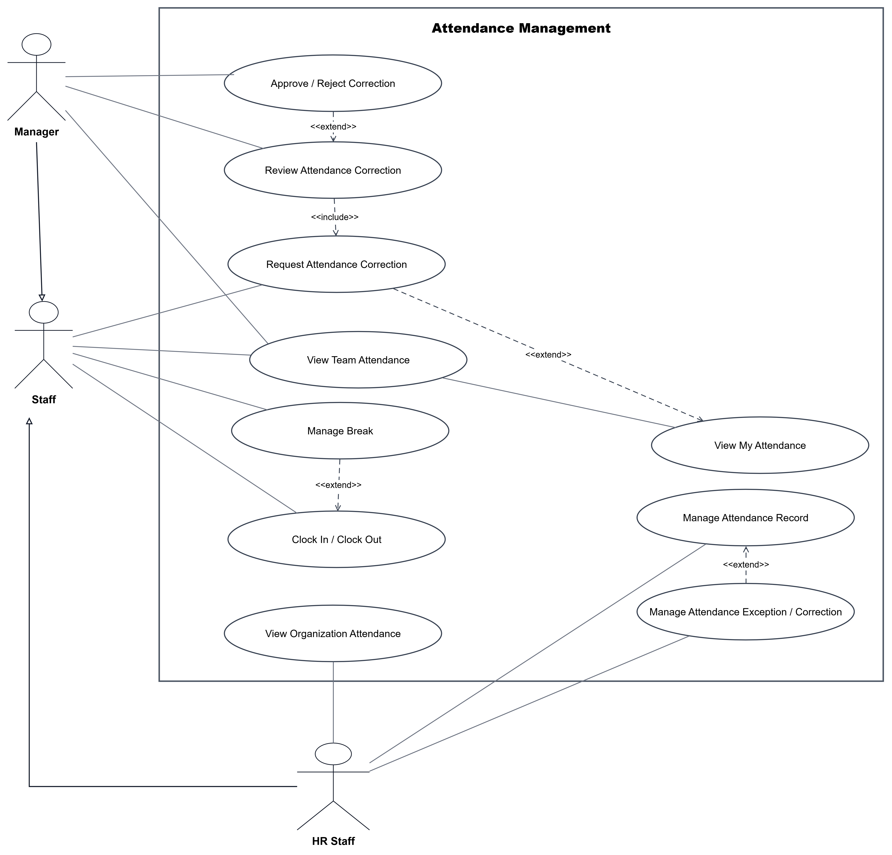
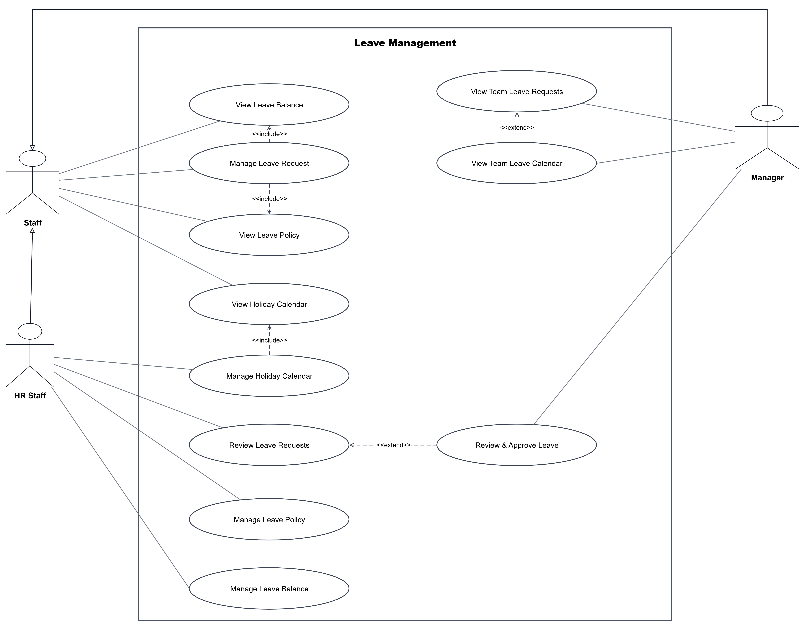
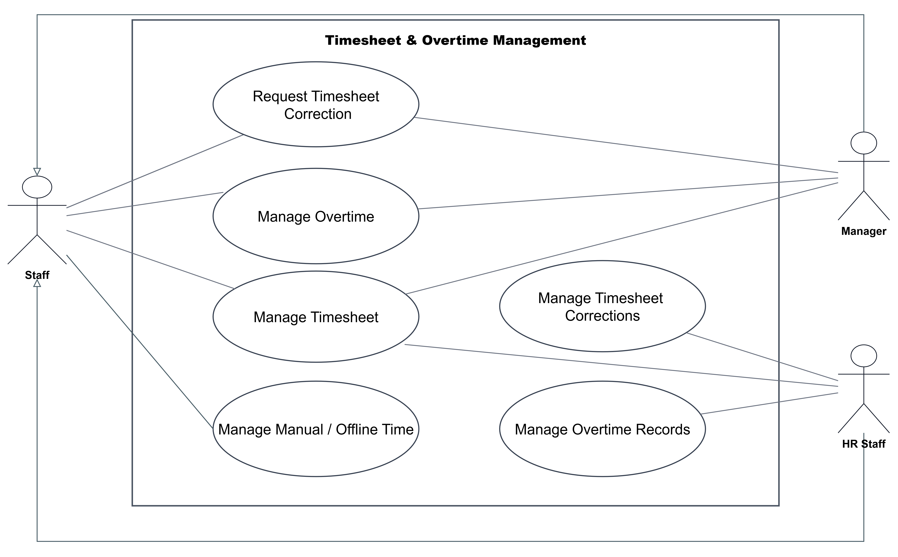
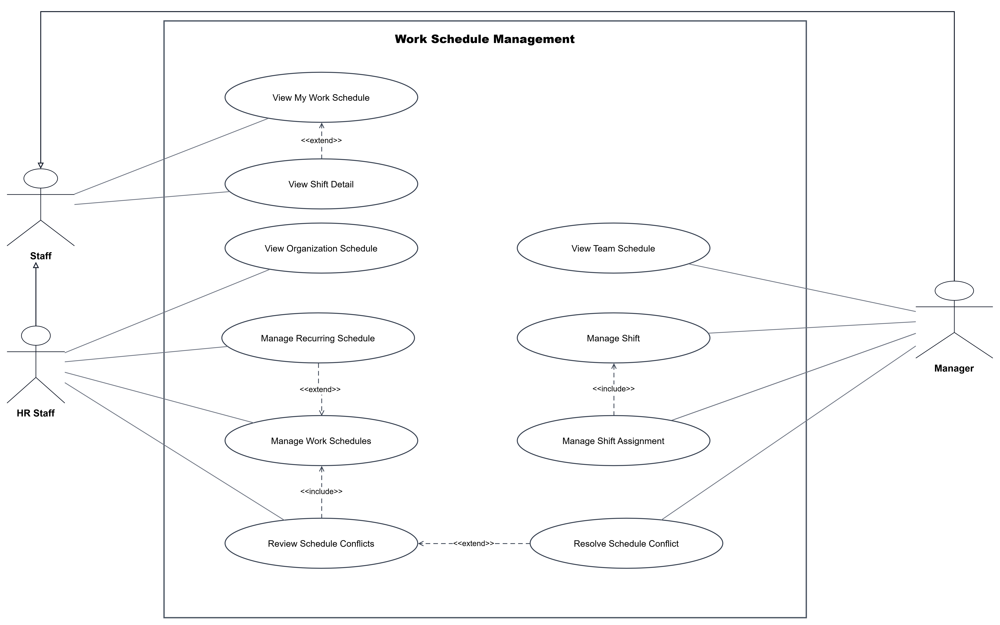

## I. Analyze and determine system requirements
## I.1. Actors

| No. | Actor            | Main Responsibilities                                                                                  |
| --: | ---------------- | ------------------------------------------------------------------------------------------------------ |
|   1 | **System admin** | Manage user accounts, roles, permissions, system settings, and audit logs.                             |
|   2 | **HR Staff**     | Manage employees, departments, positions, recruitment, onboarding, leave, and HR reports.              |
|   3 | **Manager**      | Manage team members, assign tasks, approve timesheets, approve leave requests, and review performance. |
|   4 | **Staff**     | Clock in/out, track working time, submit timesheets, request leave, and manage assigned tasks.         |
|   5 | **Client**    | Follow team assigned, the project schedule, payments and history                   |
|   6 | **Candidate**    | Apply for job openings, submit personal information, and track application status.                     |
|   7 | **Third party**    | Email service, cloud storage, calendar, payroll, payment gateway                   |
|   8 | **Tentant admin**    | Represents an organization or company using the platform, with its own users, employees, departments, settings, and isolated data. |

## I.2. Functionalites
## Workforce Management System Mindmap

```mermaid
flowchart LR

    %% =====================================================
    %% ROOT
    %% =====================================================

    WMS["Workforce Management System<br/>(BambooHR + Hubstaff)"]:::rootStyle


    %% =====================================================
    %% LEFT-SIDE MODULES
    %% =====================================================

    Auth["Authentication & Access"]:::authModule
    Recruitment["Recruitment"]:::recruitmentModule
    People["People Management"]:::peopleModule
    Performance["Performance"]:::performanceModule
    Payroll["Payroll"]:::payrollModule


    %% =====================================================
    %% RIGHT-SIDE MODULES
    %% =====================================================

    Onboarding["Onboarding & Offboarding"]:::onboardingModule
    Workforce["Workforce Management"]:::workforceModule
    Project["Project Management"]:::projectModule
    Integration["Integration"]:::integrationModule


    %% =====================================================
    %% ROOT CONNECTIONS
    %% =====================================================

    Auth --> WMS
    Recruitment --> WMS
    People --> WMS
    Performance --> WMS
    Payroll --> WMS

    WMS --> Onboarding
    WMS --> Workforce
    WMS --> Project
    WMS --> Integration


    %% =====================================================
    %% AUTHENTICATION & ACCESS
    %% =====================================================

    AuthenticationManagement["Authentication Management"]:::criticalFeature
    AccountManagement["Account Management"]:::highFeature
    RolePermissionManagement["Role & Permission Management"]:::criticalFeature

    AuthenticationManagement --> Auth
    AccountManagement --> Auth
    RolePermissionManagement --> Auth


    %% =====================================================
    %% RECRUITMENT
    %% =====================================================

    RecruitmentDashboard["Recruitment Dashboard"]:::highFeature
    JobManagement["Job Management"]:::criticalFeature
    RequirementManagement["Recruitment Requirement Management"]:::criticalFeature
    ApplicationManagement["Application Management"]:::criticalFeature
    OfferManagement["Offer Management"]:::criticalFeature
    RecruitmentSchedule["Recruitment Schedule Management"]:::highFeature
    InterviewManagement["Interview Management"]:::criticalFeature
    AIRecruitment["AI Recruitment Content Management"]:::highFeature
    RecruitmentTemplate["Recruitment Template Management"]:::highFeature

    RecruitmentDashboard --> Recruitment
    JobManagement --> Recruitment
    RequirementManagement --> Recruitment
    ApplicationManagement --> Recruitment
    OfferManagement --> Recruitment
    RecruitmentSchedule --> Recruitment
    InterviewManagement --> Recruitment
    AIRecruitment --> Recruitment
    RecruitmentTemplate --> Recruitment


    %% =====================================================
    %% PEOPLE MANAGEMENT
    %% =====================================================

    EmployeeDirectory["Employee Directory Management"]:::criticalFeature
    EmployeeProfile["Employee Profile Management"]:::criticalFeature
    OrganizationChart["Organization Chart Management"]:::criticalFeature
    DepartmentManagement["Department Management"]:::criticalFeature
    TeamManagement["Team Management"]:::highFeature
    PositionManagement["Position Management"]:::criticalFeature
    EmployeeRequest["Employee Request Management"]:::criticalFeature

    EmployeeDirectory --> People
    EmployeeProfile --> People
    OrganizationChart --> People
    DepartmentManagement --> People
    TeamManagement --> People
    PositionManagement --> People
    EmployeeRequest --> People


    %% =====================================================
    %% PERFORMANCE
    %% =====================================================

    GoalManagement["Goal Management"]:::highFeature
    PerformanceReview["Performance Review Management"]:::highFeature

    GoalManagement --> Performance
    PerformanceReview --> Performance


    %% =====================================================
    %% PAYROLL
    %% =====================================================

    PayslipManagement["Payslip Management"]:::criticalFeature
    PayCompensation["Pay & Compensation Management"]:::highFeature
    PayrollDocument["Payroll Document Management"]:::highFeature
    PayrollHistory["Payroll History Management"]:::highFeature
    BenefitsManagement["Benefits Management"]:::highFeature

    PayslipManagement --> Payroll
    PayCompensation --> Payroll
    PayrollDocument --> Payroll
    PayrollHistory --> Payroll
    BenefitsManagement --> Payroll


    %% =====================================================
    %% ONBOARDING & OFFBOARDING
    %% =====================================================

    OnboardingManagement["Onboarding Management"]:::criticalFeature
    OnboardingAutomation["Onboarding Automation Management"]:::highFeature
    DayOneReadiness["Day One Readiness Management"]:::criticalFeature
    OnboardingTask["Onboarding Task Management"]:::highFeature
    OnboardingProgress["Onboarding Progress Tracking"]:::criticalFeature
    OnboardingTemplate["Onboarding Template Management"]:::criticalFeature
    OnboardingIntegration["Onboarding Integration Management"]:::highFeature
    OffboardingManagement["Offboarding Management"]:::criticalFeature

    Onboarding --> OnboardingManagement
    Onboarding --> OnboardingAutomation
    Onboarding --> DayOneReadiness
    Onboarding --> OnboardingTask
    Onboarding --> OnboardingProgress
    Onboarding --> OnboardingTemplate
    Onboarding --> OnboardingIntegration
    Onboarding --> OffboardingManagement


    %% =====================================================
    %% WORKFORCE MANAGEMENT
    %% =====================================================

    AttendanceManagement["Attendance Management"]:::criticalFeature
    TimesheetOvertime["Timesheet & Overtime Management"]:::criticalFeature
    WorkSchedule["Work Schedule Management"]:::highFeature
    LeaveManagement["Leave Management"]:::criticalFeature
    WorkLocation["Work Location & Geofence Management"]:::highFeature

    Workforce --> AttendanceManagement
    Workforce --> TimesheetOvertime
    Workforce --> WorkSchedule
    Workforce --> LeaveManagement
    Workforce --> WorkLocation


    %% =====================================================
    %% PROJECT MANAGEMENT
    %% =====================================================

    ProjectManagement["Project Management"]:::criticalFeature
    ProjectMemberManagement["Project Member Management"]:::criticalFeature
    CapabilityManagement["Capability Management"]:::criticalFeature
    ProjectTaskTracking["Project & Task Time Tracking"]:::criticalFeature
    ProductivityMonitoring["Productivity Monitoring"]:::highFeature
    ScreenshotTracking["Screenshot, App & Website Tracking"]:::highFeature

    Project --> ProjectManagement
    Project --> ProjectMemberManagement
    Project --> CapabilityManagement
    Project --> ProjectTaskTracking
    Project --> ProductivityMonitoring
    Project --> ScreenshotTracking


    %% =====================================================
    %% INTEGRATION
    %% =====================================================

    ExternalIntegration["External Integration Management"]:::highFeature
    APIWebhook["API & Webhook Management"]:::highFeature
    ApprovalWorkflow["Approval Workflow Management"]:::highFeature

    Integration --> ExternalIntegration
    Integration --> APIWebhook
    Integration --> ApprovalWorkflow


    %% =====================================================
    %% STYLES
    %% =====================================================

    classDef rootStyle fill:#1d3557,stroke:#457b9d,stroke-width:4px,color:#ffffff,font-weight:bold,font-size:17px;

    classDef authModule fill:#2f9e44,stroke:#237a35,stroke-width:3px,color:#ffffff,font-weight:bold;
    classDef recruitmentModule fill:#7950f2,stroke:#5f3dc4,stroke-width:3px,color:#ffffff,font-weight:bold;
    classDef peopleModule fill:#74b816,stroke:#5c940d,stroke-width:3px,color:#ffffff,font-weight:bold;
    classDef performanceModule fill:#e64980,stroke:#c2255c,stroke-width:3px,color:#ffffff,font-weight:bold;
    classDef payrollModule fill:#0ca678,stroke:#087f5b,stroke-width:3px,color:#ffffff,font-weight:bold;

    classDef onboardingModule fill:#9c36b5,stroke:#862e9c,stroke-width:3px,color:#ffffff,font-weight:bold;
    classDef workforceModule fill:#f59f00,stroke:#e67700,stroke-width:3px,color:#ffffff,font-weight:bold;
    classDef projectModule fill:#4263eb,stroke:#364fc7,stroke-width:3px,color:#ffffff,font-weight:bold;
    classDef integrationModule fill:#1098ad,stroke:#0b7285,stroke-width:3px,color:#ffffff,font-weight:bold;

    classDef criticalFeature fill:#fff3cd,stroke:#ff9800,stroke-width:3px,color:#7a4b00,font-weight:bold;
    classDef highFeature fill:#ffffff,stroke:#b0bec5,stroke-width:1.5px,color:#37474f;
```



## High-Priority Features to Implement First (48)
| No. | Module                       | Feature                             | Impact   | Short Description                                                                                     |
| --: | ---------------------------- | ----------------------------------- | -------- | ----------------------------------------------------------------------------------------------------- |
|   1 | **Auth**                     | Authentication Management           | Critical | Manage authentication, login sessions, password-related access, and secure system entry.              |
|   2 | **Auth**                     | Account Management                  | High     | Manage user accounts and account status.                                                              |
|   3 | **Auth**                     | Role & Permission Management        | Critical | Manage roles, permissions, and access control across the platform.                                    |
|   4 | **Recruitment**              | Recruitment Dashboard               | High     | Display recruitment actions, summary data, and recruitment pipeline Kanban.                           |
|   5 | **Recruitment**              | Job Management                      | Critical | Manage job pipeline, job list, job information, recruitment metrics, and recent applications.         |
|   6 | **Recruitment**              | Recruitment Requirement Management  | Critical | Create, view, search, filter, and maintain recruitment requirements and hiring details.               |
|   7 | **Recruitment**              | Application Management              | Critical | Manage candidate applications, candidate information, application details, and CV/resume files.       |
|   8 | **Recruitment**              | Offer Management                    | Critical | Manage offers, offer information, offer templates, and email acceptance synchronization.              |
|   9 | **Recruitment**              | Recruitment Schedule Management     | High     | Manage recruitment schedules, calendar events, and upcoming recruitment activities.                   |
|  10 | **Recruitment**              | Interview Management                | Critical | Manage interview information, evaluations, and interview notes.                                       |
|  11 | **Recruitment**              | AI Recruitment Content Management   | High     | Generate recruitment content and support AI-assisted public job publishing.                           |
|  12 | **Recruitment**              | Recruitment Template Management     | High     | Manage reusable templates used across recruitment activities.                                         |
|  13 | **People**                   | Employee Directory Management       | Critical | Search, filter, and manage employee directory information, status, history, and contract views.       |
|  14 | **People**                   | Employee Profile Management         | Critical | Manage employee personal information, education, certificates, documents, contracts, and history.     |
|  15 | **People**                   | Organization Chart Management       | Critical | Search and explore organization structure through the organization chart.                             |
|  16 | **People**                   | Department Management               | Critical | Manage departments, department information, assignments, teams, managers, and positions.              |
|  17 | **People**                   | Team Management                     | High     | Manage teams, team information, and assigned members.                                                 |
|  18 | **People**                   | Position Management                 | Critical | Manage positions, position information, and assigned employees.                                       |
|  19 | **People**                   | Employee Request Management         | Critical | Create, search, view, and track employee requests and activity history.                               |
|  20 | **Onboarding & Offboarding** | Onboarding Management               | Critical | Manage candidates through onboarding stages and generated onboarding plans.                           |
|  21 | **Onboarding & Offboarding** | Onboarding Automation Management    | High     | Manage process automation, contract mapping, AI mapping assistance, and automation activity.          |
|  22 | **Onboarding & Offboarding** | Day One Readiness Management        | Critical | Manage Day One readiness, readiness checklists, and Day One information.                              |
|  23 | **Onboarding & Offboarding** | Onboarding Task Management          | High     | Manage assigned setup tasks and onboarding task lists.                                                |
|  24 | **Onboarding & Offboarding** | Onboarding Progress Tracking        | Critical | Track onboarding progress, attention items, and recent feedback.                                      |
|  25 | **Onboarding & Offboarding** | Onboarding Template Management      | Critical | Create, search, categorize, select, and maintain reusable onboarding templates.                       |
|  26 | **Onboarding & Offboarding** | Onboarding Integration Management   | High     | Manage onboarding integrations, configurations, health, endpoints, messages, and activities.          |
|  27 | **Onboarding & Offboarding** | Offboarding Management              | Critical | Manage employee offboarding processes.                                                                |
|  28 | **Workforce**                | Attendance Management               | Critical | Manage clock in/out, breaks, attendance records, and attendance exceptions.                           |
|  29 | **Workforce**                | Timesheet & Overtime Management     | Critical | Manage timesheets, manual/offline time, overtime, correction, review, and approval.                   |
|  30 | **Workforce**                | Work Schedule Management            | High     | Manage shifts, assignments, recurring schedules, and schedule conflicts.                              |
|  31 | **Workforce**                | Leave Management                    | Critical | Manage leave policies, balances, requests, approvals, and holiday calendars.                          |
|  32 | **Workforce**                | Work Location & Geofence Management | High     | Manage work locations, GPS tracking, geofence clock-in, and field attendance.                         |
|  33 | **Project**                  | Project Management                  | Critical | Manage projects, project information, lifecycle, status, and core project configuration.              |
|  34 | **Project**                  | Project Member Management           | Critical | Manage employees assigned to projects and project membership information.                             |
|  35 | **Project**                  | Capability Management               | Critical | Manage capabilities associated with projects and organize project work by capability.                 |
|  36 | **Project**                  | Project & Task Time Tracking        | Critical | Track employee work time against projects and tasks.                                                  |
|  37 | **Project**                  | Productivity Monitoring             | High     | Monitor active time, idle time, workload, utilization, and productivity patterns.                     |
|  38 | **Project**                  | Screenshot, App & Website Tracking  | High     | Capture screenshots and track applications and websites during work sessions.                         |
|  39 | **Payroll**                  | Payslip Management                  | Critical | Manage employee payslip documents, including viewing, publishing, downloading, and historical access. |
|  40 | **Payroll**                  | Pay & Compensation Management       | High     | Maintain salary, hourly rates, compensation information, and related employee pay records.            |
|  41 | **Payroll**                  | Payroll Document Management         | High     | Store and manage payroll-related documents and supporting payroll records.                            |
|  42 | **Payroll**                  | Payroll History Management          | High     | Maintain and review historical payroll information and records.                                       |
|  43 | **Payroll**                  | Benefits Management                 | High     | Maintain employee benefit eligibility, enrollment, and benefit-related records.                       |
|  44 | **Performance**              | Goal Management                     | High     | Manage employee and team goals, progress, and one-on-one activities.                                  |
|  45 | **Performance**              | Performance Review Management       | High     | Manage review cycles, assessments, feedback, and performance reviews.                                 |
|  46 | **Integration**              | External Integration Management     | High     | Manage integrations with external email, calendar, storage, accounting, and workforce services.       |
|  47 | **Integration**              | API & Webhook Management            | High     | Manage public APIs and webhook-based integrations.                                                    |
|  48 | **Integration**              | Approval Workflow Management        | High     | Manage configurable multi-level approval workflows across business processes.                         |


## II. Use case images

### 28. Attendance Management



### 29. Leave Management



### 30. Timesheet and Overtime Management



### 31. Work Location and Geofence Management


### 32. Work Schedule Management




## III. UI/UX
### 28. Attendence Management


## IV. DB, Entity Diagram
## V. API docs

### Attendence Management
```text
Workforce
└── Attendance Management
    ├── Attendance Dashboard
    │   ├── Dashboard Summary
    │   │   └── GET    /attendance/dashboard/summary
    │   ├── Recent Clock-ins
    │   │   └── GET    /attendance/dashboard/recent-clock-ins
    │   └── Export
    │       └── GET    /attendance/dashboard/export
    ├── Attendance Records & Exceptions
    │   ├── Attendance Records
    │   │   ├── GET    /attendance-records
    │   │   ├── POST   /attendance-records
    │   │   │          └── Create Manual Entry
    │   │   ├── GET    /attendance-records/summary
    │   │   ├── GET    /attendance-records/export
    │   │   ├── GET    /attendance-records/{recordId}
    │   │   ├── PATCH  /attendance-records/{recordId}
    │   │   └── GET    /attendance-records/{recordId}/breaks
    │   └── Attendance Exceptions
    │       ├── GET    /attendance-exceptions
    │       └── GET    /attendance-exceptions/summary
    ├── Attendance Corrections
    │   ├── Correction Requests
    │   │   ├── GET    /attendance-corrections
    │   │   ├── POST   /attendance-corrections
    │   │   ├── GET    /attendance-corrections/summary
    │   │   ├── GET    /attendance-corrections/export
    │   │   │
    │   │   ├── GET    /attendance-corrections/{correctionId}
    │   │   └── PATCH  /attendance-corrections/{correctionId}
    │   ├── Correction Review
    │   │   ├── GET    /attendance-corrections/{correctionId}/review
    │   │   ├── POST   /attendance-corrections/{correctionId}/approve
    │   │   ├── POST   /attendance-corrections/{correctionId}/reject
    │   │   └── GET    /attendance-corrections/{correctionId}/review/history
    │   └── Correction History
    │       ├── GET    /employees/{employeeId}/attendance-corrections
    │       └── GET    /attendance-records/{recordId}/corrections
    └── Reference Data
        ├── Employees
        │   ├── GET    /employees/{employeeId}
        │   └── GET    /employees/{employeeId}/attendance-records
        └── Shifts
            └── GET    /shifts/{shiftId}
```
### Leave Management
```text
Leave Management API
|
├── Leave Requests
|   ├── GET   /leave-requests
|   ├── POST  /leave-requests
|   ├── GET   /leave-requests/{requestId}
|   ├── PATCH /leave-requests/{requestId}
|   └── POST  /leave-requests/{requestId}/cancel
|
├── Leave Balances
|   ├── GET /employees/{employeeId}/leave-balances
|   ├── GET /employees/{employeeId}/leave-balances/{leaveTypeId}
|   └── GET /employees/{employeeId}/leave-balances/{leaveTypeId}/adjustments
|
├── Team Leave Calendar
|   └── GET /teams/{teamId}/leave-calendar
|
└── Reference Data
    ├── GET /leave-types
    ├── GET /leave-policies
    └── GET /holidays
```

### Time Sheet View

```text
Timesheet Review API
|
├── Team Timesheets
|   ├── GET  /timesheets
|   ├── GET  /timesheets/{timesheetId}
|   ├── POST /timesheets/{timesheetId}/approve
|   └── POST /timesheets/{timesheetId}/reject
|
├── Timesheet Entries
|   ├── GET   /timesheets/{timesheetId}/entries
|   └── PATCH /timesheets/{timesheetId}/entries/{entryId}
|
├── Timesheet Corrections
|   ├── GET  /timesheets/{timesheetId}/corrections
|   └── POST /timesheets/{timesheetId}/corrections
|
└── Reference Data
    ├── GET /employees/{employeeId}
    └── GET /departments/{departmentId}
```

