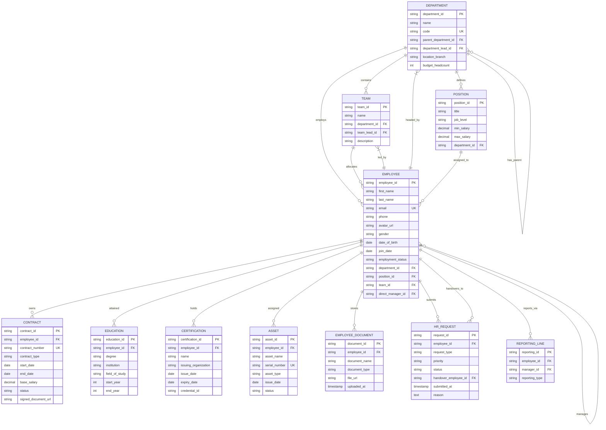

# Employee Directory Database Specification

This document defines the Entity-Relationship Diagram (ERD) and data schema for the **Employee Directory & People Management** module in Copilot.HR.

---

## 1. Entity-Relationship Diagram (ERD)

---

## 2. Data Dictionary Summary

### 📌 Entities & Relationships Table

| Entity Name | Function Description | Foreign Keys (FK) |
| :--- | :--- | :--- |
| **`EMPLOYEE`** | Central employee profile identity and personal status | `department_id`, `position_id`, `team_id`, `direct_manager_id` |
| **`DEPARTMENT`** | Operational department units and branch locations | `parent_department_id`, `department_lead_id` |
| **`TEAM`** | Project and functional teams under departments | `department_id`, `team_lead_id` |
| **`POSITION`** | Job titles, competency levels, and salary bands | `department_id` |
| **`CONTRACT`** | Labor contracts, terms, and base compensation history | `employee_id` |
| **`EDUCATION`** | Academic degrees, majors, and universities | `employee_id` |
| **`CERTIFICATION`** | Professional credentials and international certificates | `employee_id` |
| **`ASSET`** | Hardware devices assigned to personnel | `employee_id` |
| **`EMPLOYEE_DOCUMENT`** | Scanned personal documents and identity files | `employee_id` |
| **`HR_REQUEST`** | Internal employee requests (Leave, Equipment, OT) | `employee_id`, `handover_employee_id` |
| **`REPORTING_LINE`** | Direct and matrix reporting lines management | `employee_id`, `manager_id` |
