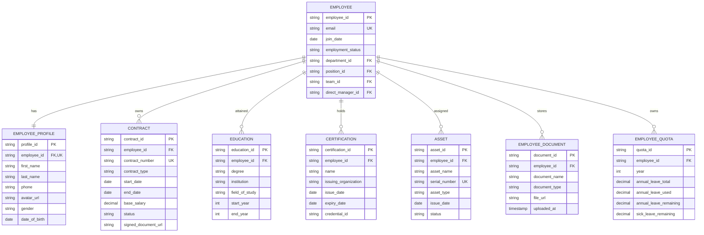

# Employee Directory Database Specification

This document defines the Entity-Relationship Diagram (ERD) and data schema for the **Employee Directory** module in Copilot.HR.

---

## 1. Entity-Relationship Diagram (ERD)

---

## 2. Use Case Diagram

---

## 3. Master Schema Code (Mermaid)

---

## 2. Data Dictionary

| Entity Name | Function Description | Primary Key (PK) | Foreign Keys (FK) |
| :--- | :--- | :--- | :--- |
| **`EMPLOYEE`** | Central employee system account and employment status | `employee_id` | `department_id`, `position_id`, `team_id`, `direct_manager_id` |
| **`EMPLOYEE_PROFILE`** | Personal demographic details (1:1 with `EMPLOYEE`) | `profile_id` | `employee_id` |
| **`CONTRACT`** | Labor contracts, terms, and base compensation history | `contract_id` | `employee_id` |
| **`EDUCATION`** | Academic degrees, majors, and universities | `education_id` | `employee_id` |
| **`CERTIFICATION`** | Professional credentials and international certificates | `certification_id` | `employee_id` |
| **`ASSET`** | Hardware devices assigned to personnel | `asset_id` | `employee_id` |
| **`EMPLOYEE_DOCUMENT`** | Scanned personal documents and identity files | `document_id` | `employee_id` |
| **`EMPLOYEE_QUOTA`** | Annual leave entitlement and balance tracking | `quota_id` | `employee_id` |
