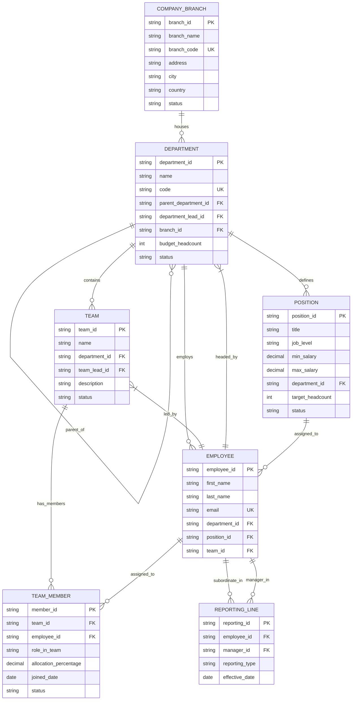

# Organization Database Specification

This document defines the Entity-Relationship Diagram (ERD) and data schema for the **Organization** module in Copilot.HR.

---

## 1. Entity-Relationship Diagram (ERD)

---

## 2. Data Dictionary

### COMPANY_BRANCH
- `branch_id` (PK, VARCHAR): Unique identifier for company branch/hub location.
- `branch_name` (VARCHAR): Name of branch (e.g., Headquarters HCMC, Hanoi Hub).
- `branch_code` (VARCHAR, UNIQUE): Short code (e.g., HQ-HCMC, HUB-HN).
- `status` (VARCHAR): Operational status (Active, Inactive).

### DEPARTMENT
- `department_id` (PK, VARCHAR): Unique department identifier.
- `name` (VARCHAR): Department title (e.g., Technology & Software).
- `parent_department_id` (FK, VARCHAR): Self-referencing FK for organizational hierarchy.
- `department_lead_id` (FK, VARCHAR): FK to `EMPLOYEE` acting as Department Head.
- `branch_id` (FK, VARCHAR): FK to `COMPANY_BRANCH`.

### TEAM
- `team_id` (PK, VARCHAR): Unique team identifier.
- `department_id` (FK, VARCHAR): Parent department.
- `team_lead_id` (FK, VARCHAR): Team lead employee.

### TEAM_MEMBER
- `member_id` (PK, VARCHAR): Unique membership assignment identifier.
- `team_id` (FK, VARCHAR): Foreign key to `TEAM`.
- `employee_id` (FK, VARCHAR): Foreign key to `EMPLOYEE`.
- `role_in_team` (VARCHAR): Member role within the team (e.g. Core Contributor, Scrum Master, Lead).
- `allocation_percentage` (DECIMAL): Capacity allocation percentage (e.g. 50%, 100%).
- `joined_date` (DATE): Date employee joined the team.
- `status` (VARCHAR): Assignment status (Active, Inactive).

### POSITION
- `position_id` (PK, VARCHAR): Position identifier.
- `job_level` (VARCHAR): Competency level (L1 to L6).
- `min_salary`, `max_salary` (DECIMAL): Salary band bounds.
