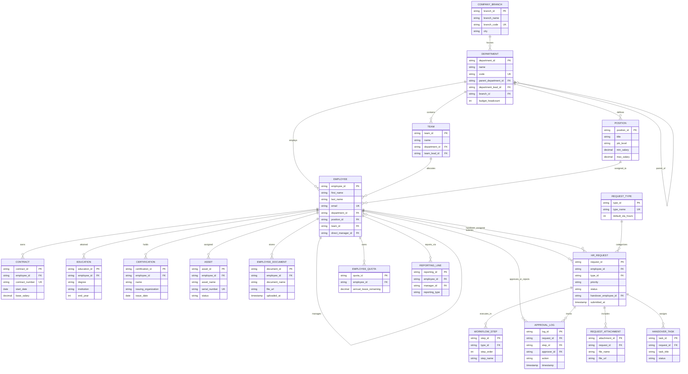

# Copilot.HR - Database Architecture & Master ERD

**Total Database Tables**: **18 Tables**

---

## 1. Master Table Relationships Matrix

| # | Table Name | Description | Primary Key (PK) | Foreign Keys (FK) | Related Table | Cardinality |
| :---: | :--- | :--- | :--- | :--- | :--- | :--- |
| **1** | **`COMPANY_BRANCH`** | Office locations and regional hubs | `branch_id` | *None* | `DEPARTMENT` | 1:N |
| **2** | **`DEPARTMENT`** | Operational units & hierarchy | `department_id` | `parent_department_id` `department_lead_id` `branch_id` | `DEPARTMENT` `EMPLOYEE` `COMPANY_BRANCH` | N:1 (Self) 1:1 N:1 |
| **3** | **`TEAM`** | Cross-functional project teams | `team_id` | `department_id` `team_lead_id` | `DEPARTMENT` `EMPLOYEE` | N:1 1:1 |
| **4** | **`POSITION`** | Job titles & salary bands | `position_id` | `department_id` | `DEPARTMENT` | N:1 |
| **5** | **`EMPLOYEE`** | Central employee profile records | `employee_id` | `department_id` `position_id` `team_id` `direct_manager_id` | `DEPARTMENT` `POSITION` `TEAM` `EMPLOYEE` | N:1 N:1 N:1 N:1 (Self) |
| **6** | **`CONTRACT`** | Labor contracts & base pay | `contract_id` | `employee_id` | `EMPLOYEE` | N:1 |
| **7** | **`EDUCATION`** | Academic degrees & universities | `education_id` | `employee_id` | `EMPLOYEE` | N:1 |
| **8** | **`CERTIFICATION`** | Professional certifications | `certification_id` | `employee_id` | `EMPLOYEE` | N:1 |
| **9** | **`ASSET`** | Hardware devices assigned to staff | `asset_id` | `employee_id` | `EMPLOYEE` | N:1 |
| **10** | **`EMPLOYEE_DOCUMENT`** | Scanned identity & HR files | `document_id` | `employee_id` | `EMPLOYEE` | N:1 |
| **11** | **`REQUEST_TYPE`** | Categories & default SLA rules | `type_id` | *None* | `HR_REQUEST` `WORKFLOW_STEP` | 1:N 1:N |
| **12** | **`HR_REQUEST`** | Employee ticket applications | `request_id` | `employee_id` `type_id` `handover_employee_id` | `EMPLOYEE` `REQUEST_TYPE` `EMPLOYEE` | N:1 N:1 N:1 |
| **13** | **`WORKFLOW_STEP`** | Multi-stage approval sequence | `step_id` | `type_id` | `REQUEST_TYPE` | N:1 |
| **14** | **`APPROVAL_LOG`** | Audit trail of manager approvals | `log_id` | `request_id` `step_id` `approver_id` | `HR_REQUEST` `WORKFLOW_STEP` `EMPLOYEE` | N:1 N:1 N:1 |
| **15** | **`REQUEST_ATTACHMENT`** | Supporting files for requests | `attachment_id` | `request_id` | `HR_REQUEST` | N:1 |
| **16** | **`EMPLOYEE_QUOTA`** | Annual leave & quota balance | `quota_id` | `employee_id` | `EMPLOYEE` | N:1 |
| **17** | **`HANDOVER_TASK`** | Work handover checklist items | `task_id` | `request_id` | `HR_REQUEST` | N:1 |
| **18** | **`REPORTING_LINE`** | Direct & Matrix reporting lines | `reporting_id` | `employee_id` `manager_id` | `EMPLOYEE` `EMPLOYEE` | N:1 N:1 |

---

## 2. Master System ERD Diagram

