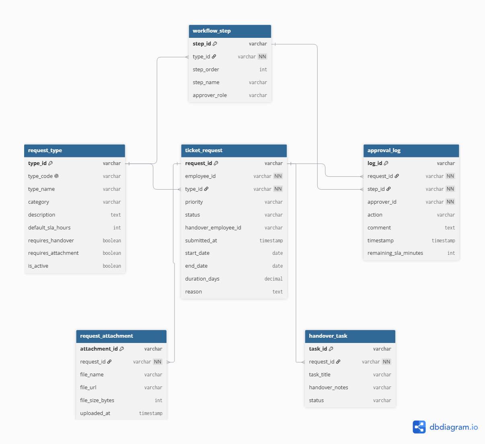
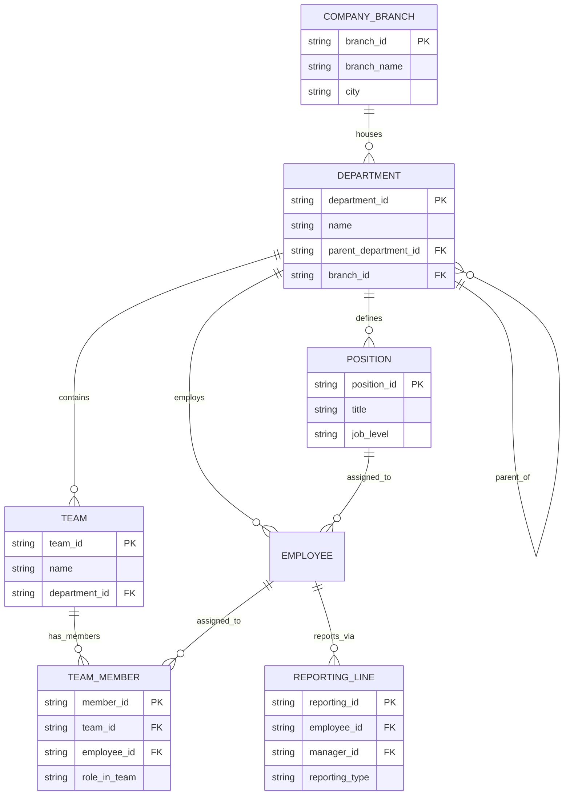
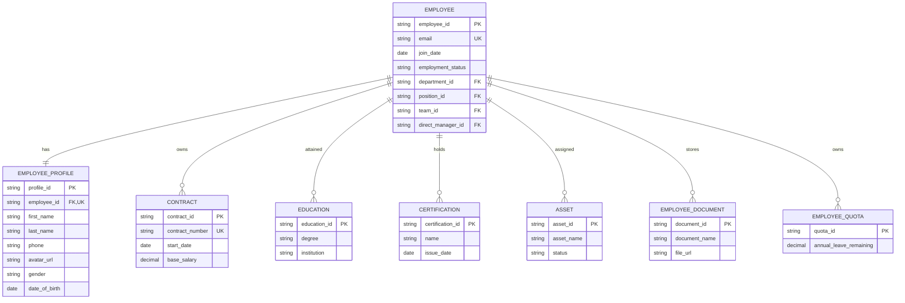
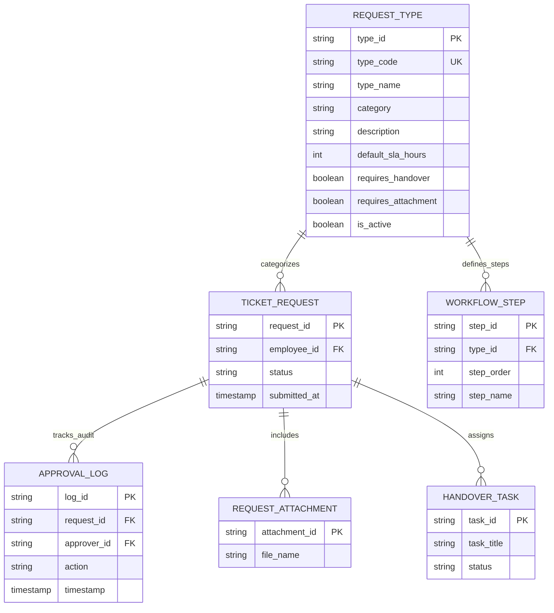

# Copilot.HR - Master Database Architecture & ERD

**Total System Tables**: **20 Tables**

---

## 1. Master Table Relationships Matrix

| # | Table Name | Presentation Slide | Description | Primary Key (PK) | Foreign Keys (FK) |
| :---: | :--- | :--- | :--- | :--- | :--- |
| **1** | **`COMPANY_BRANCH`** | **Slide 1** (Organization) | Office locations & regional hubs | `branch_id` | *None* |
| **2** | **`DEPARTMENT`** | **Slide 1** (Organization) | Operational units & hierarchy | `department_id` | `parent_department_id`, `department_lead_id`, `branch_id` |
| **3** | **`TEAM`** | **Slide 1** (Organization) | Cross-functional project teams | `team_id` | `department_id`, `team_lead_id` |
| **4** | **`POSITION`** | **Slide 1** (Organization) | Job titles & salary bands | `position_id` | `department_id` |
| **5** | **`REPORTING_LINE`** | **Slide 1** (Organization) | Direct & Matrix reporting lines | `reporting_id` | `employee_id`, `manager_id` |
| **6** | **`TEAM_MEMBER`** | **Slide 1** (Organization) | Multi-team memberships & capacity | `member_id` | `team_id`, `employee_id` |
| **7** | **`EMPLOYEE`** | **Slide 2** (Employee Directory) | Central employee system account | `employee_id` | `department_id`, `position_id`, `team_id`, `direct_manager_id` |
| **8** | **`EMPLOYEE_PROFILE`** | **Slide 2** (Employee Directory) | Personal demographical details (1:1) | `profile_id` | `employee_id` |
| **9** | **`CONTRACT`** | **Slide 2** (Employee Directory) | Labor contracts & base pay | `contract_id` | `employee_id` |
| **10** | **`EDUCATION`** | **Slide 2** (Employee Directory) | Academic degrees & universities | `education_id` | `employee_id` |
| **11** | **`CERTIFICATION`** | **Slide 2** (Employee Directory) | Professional certifications | `certification_id` | `employee_id` |
| **12** | **`ASSET`** | **Slide 2** (Employee Directory) | Hardware devices assigned to staff | `asset_id` | `employee_id` |
| **13** | **`EMPLOYEE_DOCUMENT`** | **Slide 2** (Employee Directory) | Scanned identity & HR files | `document_id` | `employee_id` |
| **14** | **`EMPLOYEE_QUOTA`** | **Slide 2** (Employee Directory) | Annual leave & quota balance | `quota_id` | `employee_id` |
| **15** | **`REQUEST_TYPE`** | **Slide 3** (Request) | Categories & default SLA rules | `type_id` | *None* |
| **16** | **`TICKET_REQUEST`** | **Slide 3** (Request) | Employee ticket applications | `request_id` | `employee_id`, `type_id`, `handover_employee_id` |
| **17** | **`WORKFLOW_STEP`** | **Slide 3** (Request) | Multi-stage approval sequence | `step_id` | `type_id` |
| **18** | **`APPROVAL_LOG`** | **Slide 3** (Request) | Audit trail of manager approvals | `log_id` | `request_id`, `step_id`, `approver_id` |
| **19** | **`REQUEST_ATTACHMENT`** | **Slide 3** (Request) | Supporting files for requests | `attachment_id` | `request_id` |
| **20** | **`HANDOVER_TASK`** | **Slide 3** (Request) | Work handover checklist items | `task_id` | `request_id` |

---

## 2. ERD Diagram Images

### Organization

---

### Employee Directory

---

### Request

---

## 3. Master System ERD Diagram

```mermaid
erDiagram
    COMPANY_BRANCH ||--o{ DEPARTMENT : "houses"
    DEPARTMENT ||--o{ DEPARTMENT : "parent_of"
    DEPARTMENT ||--o{ TEAM : "contains"
    DEPARTMENT ||--o{ POSITION : "defines"
    DEPARTMENT ||--o{ EMPLOYEE : "employs"
    
    TEAM ||--o{ TEAM_MEMBER : "has_members"
    EMPLOYEE ||--o{ TEAM_MEMBER : "assigned_to"
    POSITION ||--o{ EMPLOYEE : "assigned_to"

    EMPLOYEE ||--|| EMPLOYEE_PROFILE : "has"
    EMPLOYEE ||--o{ EMPLOYEE : "manages"
    EMPLOYEE ||--o{ CONTRACT : "owns"
    EMPLOYEE ||--o{ EDUCATION : "attained"
    EMPLOYEE ||--o{ CERTIFICATION : "holds"
    EMPLOYEE ||--o{ ASSET : "assigned"
    EMPLOYEE ||--o{ EMPLOYEE_DOCUMENT : "stores"
    EMPLOYEE ||--o{ TICKET_REQUEST : "submits"
    EMPLOYEE ||--o{ TICKET_REQUEST : "handover_assignee"
    EMPLOYEE ||--o{ EMPLOYEE_QUOTA : "owns"
    EMPLOYEE ||--o{ APPROVAL_LOG : "approves_or_rejects"
    EMPLOYEE ||--o{ REPORTING_LINE : "reports_via"

    REQUEST_TYPE ||--o{ TICKET_REQUEST : "categorizes"
    TICKET_REQUEST ||--o{ WORKFLOW_STEP : "executes_in"
    TICKET_REQUEST ||--o{ APPROVAL_LOG : "tracks"
    TICKET_REQUEST ||--o{ REQUEST_ATTACHMENT : "includes"
    TICKET_REQUEST ||--o{ HANDOVER_TASK : "assigns"

    COMPANY_BRANCH {
        string branch_id PK
        string branch_name
        string branch_code UK
        string city
    }

    DEPARTMENT {
        string department_id PK
        string name
        string code UK
        string parent_department_id FK
        string department_lead_id FK
        string branch_id FK
        int budget_headcount
    }

    TEAM {
        string team_id PK
        string name
        string department_id FK
        string team_lead_id FK
    }

    TEAM_MEMBER {
        string member_id PK
        string team_id FK
        string employee_id FK
        string role_in_team
        decimal allocation_percentage
        date joined_date
        string status
    }

    POSITION {
        string position_id PK
        string title
        string job_level
        decimal min_salary
        decimal max_salary
    }

    EMPLOYEE {
        string employee_id PK
        string email UK
        date join_date
        string employment_status
        string department_id FK
        string position_id FK
        string team_id FK
        string direct_manager_id FK
    }

    EMPLOYEE_PROFILE {
        string profile_id PK
        string employee_id FK, UK
        string first_name
        string last_name
        string phone
        string avatar_url
        string gender
        date date_of_birth
    }

    CONTRACT {
        string contract_id PK
        string employee_id FK
        string contract_number UK
        date start_date
        decimal base_salary
    }

    EDUCATION {
        string education_id PK
        string employee_id FK
        string degree
        string institution
        int end_year
    }

    CERTIFICATION {
        string certification_id PK
        string employee_id FK
        string name
        string issuing_organization
        date issue_date
    }

    ASSET {
        string asset_id PK
        string employee_id FK
        string asset_name
        string serial_number UK
        string status
    }

    EMPLOYEE_DOCUMENT {
        string document_id PK
        string employee_id FK
        string document_name
        string file_url
        timestamp uploaded_at
    }

    REQUEST_TYPE {
        string type_id PK
        string type_code UK
        string type_name
        string category
        string description
        int default_sla_hours
        boolean requires_handover
        boolean requires_attachment
        boolean is_active
    }

    TICKET_REQUEST {
        string request_id PK
        string employee_id FK
        string type_id FK
        string priority
        string status
        string handover_employee_id FK
        timestamp submitted_at
    }

    WORKFLOW_STEP {
        string step_id PK
        string type_id FK
        int step_order
        string step_name
    }

    APPROVAL_LOG {
        string log_id PK
        string request_id FK
        string step_id FK
        string approver_id FK
        string action
        timestamp timestamp
    }

    REQUEST_ATTACHMENT {
        string attachment_id PK
        string request_id FK
        string file_name
        string file_url
    }

    EMPLOYEE_QUOTA {
        string quota_id PK
        string employee_id FK
        decimal annual_leave_remaining
    }

    HANDOVER_TASK {
        string task_id PK
        string request_id FK
        string task_title
        string status
    }

    REPORTING_LINE {
        string reporting_id PK
        string employee_id FK
        string manager_id FK
        string reporting_type
    }
```

---

## 4. Sub-Module ERD Diagrams

### Organization
See detailed documentation: [Organization.md](file:///d:/Copilot.HR/databases/Organization.md)

---

### Employee Directory
See detailed documentation: [EmployeeDirectory.md](file:///d:/Copilot.HR/databases/EmployeeDirectory.md)

---

### Request
See detailed documentation: [RequestManagement.md](file:///d:/Copilot.HR/databases/RequestManagement.md)

