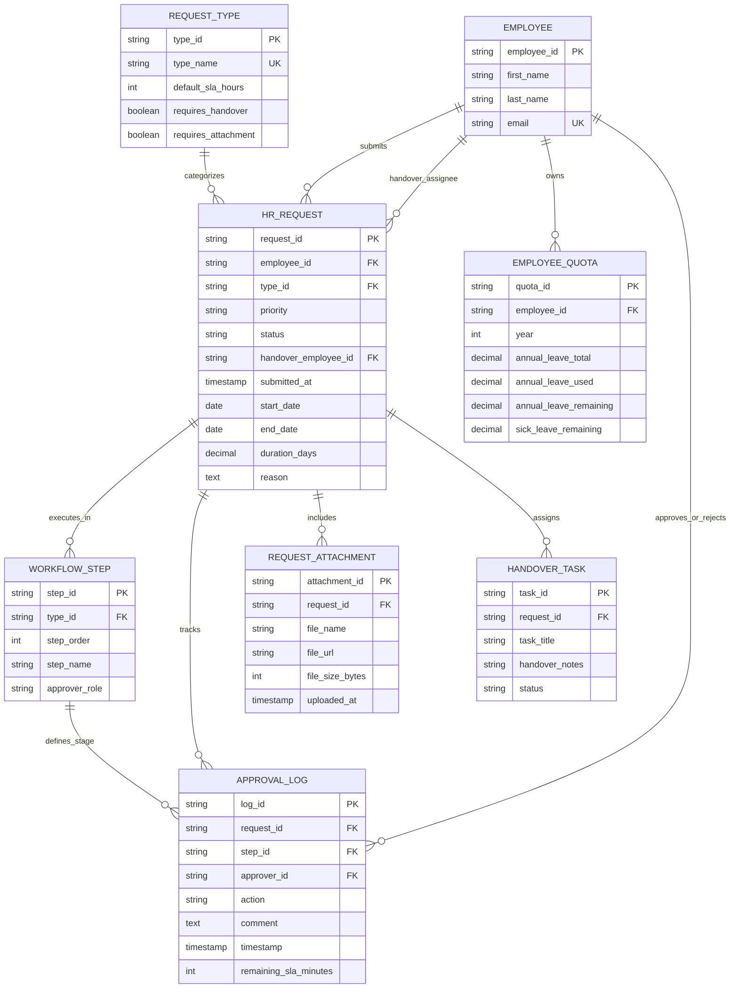

# Request Management Database Specification

This document defines the Entity-Relationship Diagram (ERD) and data schema for the **Employee Request Management & Approval Workflow** module in Copilot.HR.

---

## 1. Entity-Relationship Diagram (ERD)

---

## 2. Data Dictionary

### 📌 HR_REQUEST
- `request_id` (PK, VARCHAR): Unique ticket ID (e.g., REQ-1092).
- `employee_id` (FK, VARCHAR): Requester employee.
- `type_id` (FK, VARCHAR): FK to `REQUEST_TYPE`.
- `priority` (VARCHAR): Low, Medium, High.
- `status` (VARCHAR): Pending, Approved, Rejected, Cancelled.
- `duration_days` (DECIMAL): Auto-calculated business days requested.

### 📌 APPROVAL_LOG
- `log_id` (PK, VARCHAR): Log record identifier.
- `request_id` (FK, VARCHAR): Associated request.
- `approver_id` (FK, VARCHAR): Employee acting as approver.
- `action` (VARCHAR): Approved, Rejected, Reminder_Sent.
- `comment` (TEXT): Approval notes or rejection justification.
