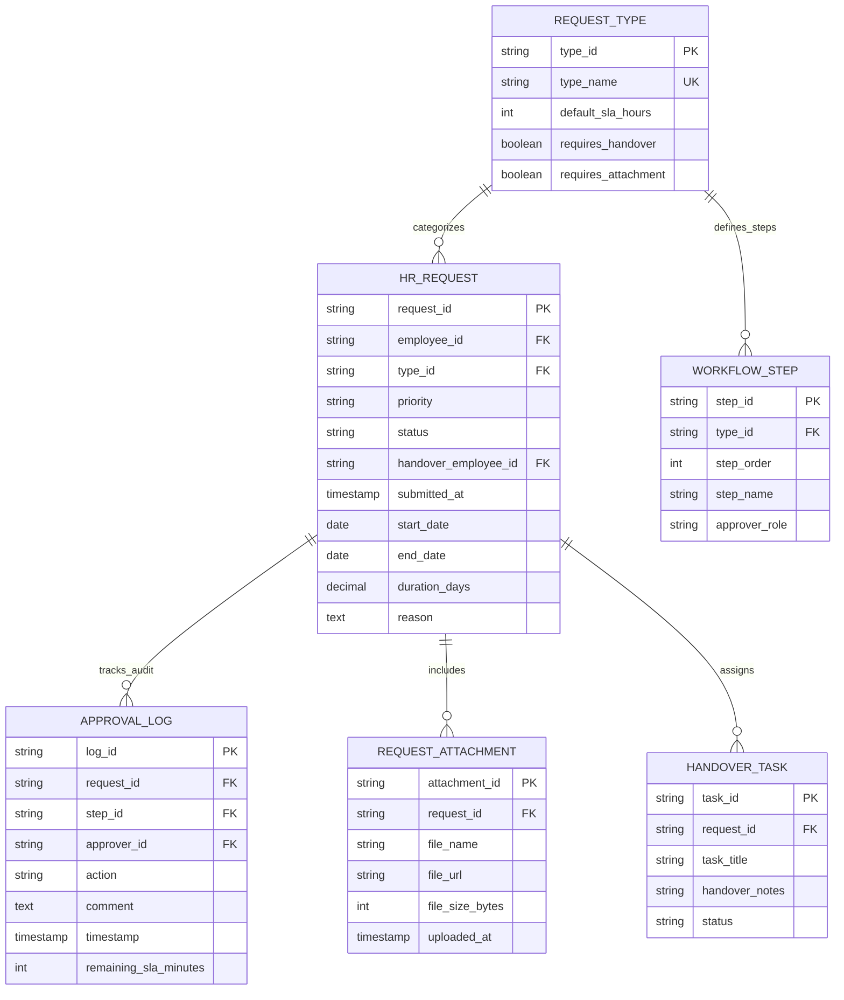

# HR Request Engine Database Specification (PPT Slide 3)

This document defines the Entity-Relationship Diagram (ERD) and data schema for the **HR Request Engine & Multi-Stage Approval Workflow** module in Copilot.HR.

---

## 1. Presentation Slide ERD Diagram (Slide 3 - 6 Tables)

---

## 2. Data Dictionary Summary (6 Core Tables)

| Entity Name | Function Description | Primary Key (PK) | Foreign Keys (FK) |
| :--- | :--- | :--- | :--- |
| **`REQUEST_TYPE`** | Categories & SLA rules for employee requests | `type_id` | *None* |
| **`HR_REQUEST`** | Employee ticket application instances | `request_id` | `employee_id`, `type_id`, `handover_employee_id` |
| **`WORKFLOW_STEP`** | Multi-stage approval sequence definition | `step_id` | `type_id` |
| **`APPROVAL_LOG`** | Immutable audit log of manager approvals & SLA tracking | `log_id` | `request_id`, `step_id`, `approver_id` |
| **`REQUEST_ATTACHMENT`** | Supporting file attachments for requests | `attachment_id` | `request_id` |
| **`HANDOVER_TASK`** | Work handover checklist items before request approval | `task_id` | `request_id` |
