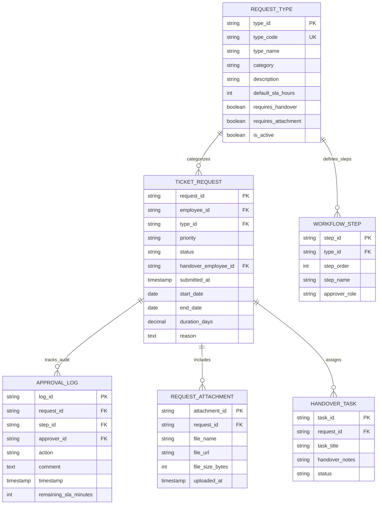

# Request Database Specification

This document defines the Entity-Relationship Diagram (ERD) and data schema for the **Request** module in Copilot.HR.

---

## 1. Entity-Relationship Diagram (ERD)

---

## 2. Use Case Diagram

---

## 3. Master Schema Code (Mermaid)

---

## 2. Data Dictionary

| Entity Name | Function Description | Primary Key (PK) | Foreign Keys (FK) |
| :--- | :--- | :--- | :--- |
| **`REQUEST_TYPE`** | Master category rules, SLAs, and approval flags | `type_id` | *None* |
| **`TICKET_REQUEST`** | Internal ticket application instances (Self-Service & HR Ops) | `request_id` | `employee_id`, `type_id`, `handover_employee_id` |
| **`WORKFLOW_STEP`** | Multi-stage approval sequence definition | `step_id` | `type_id` |
| **`APPROVAL_LOG`** | Immutable audit log of manager approvals & SLA tracking | `log_id` | `request_id`, `step_id`, `approver_id` |
| **`REQUEST_ATTACHMENT`** | Supporting file attachments for requests | `attachment_id` | `request_id` |
| **`HANDOVER_TASK`** | Work handover checklist items before request approval | `task_id` | `request_id` |
