# Copilot.HR - System Documentation

Comprehensive architecture, specification, and API documentation for **Copilot.HR**, consolidated across all core operational modules: **Integration Management**, **Onboarding Management**, **Payroll Management**, **People Management**, **Performance Management**, **Project Management**, **Recruitment Management**, and **Workforce Management**.

---

# Table of Contents
1. [1. Use Cases](#1-use-cases)
   - [1.1 Integration Management](#11-integration-management)
   - [1.2 Onboarding Management](#12-onboarding-management)
   - [1.3 Payroll Management](#13-payroll-management)
   - [1.4 People Management](#14-people-management)
   - [1.5 Performance Management](#15-performance-management)
   - [1.6 Project Management](#16-project-management)
   - [1.7 Recruitment Management](#17-recruitment-management)
   - [1.8 Workforce Management](#18-workforce-management)
2. [2. Sitemaps (Information Architecture)](#2-sitemaps-information-architecture)
   - [2.1 Integration Management](#21-integration-management)
   - [2.2 Onboarding Management](#22-onboarding-management)
   - [2.3 Payroll Management](#23-payroll-management)
   - [2.4 People Management](#24-people-management)
   - [2.5 Performance Management](#25-performance-management)
   - [2.6 Project Management](#26-project-management)
   - [2.7 Recruitment Management](#27-recruitment-management)
   - [2.8 Workforce Management](#28-workforce-management)
3. [3. UI/UX Specifications](#3-uiux-specifications)
   - [3.1 Integration Management](#31-integration-management)
   - [3.2 Onboarding Management](#32-onboarding-management)
   - [3.3 Payroll Management](#33-payroll-management)
   - [3.4 People Management](#34-people-management)
   - [3.5 Performance Management](#35-performance-management)
   - [3.6 Project Management](#36-project-management)
   - [3.7 Recruitment Management](#37-recruitment-management)
   - [3.8 Workforce Management](#38-workforce-management)
4. [4. Entity Relationship Diagrams (ERD) & Database Schemas](#4-entity-relationship-diagrams-erd--database-schemas)
   - [4.1 Integration Management](#41-integration-management)
   - [4.2 Onboarding Management](#42-onboarding-management)
   - [4.3 Payroll Management](#43-payroll-management)
   - [4.4 People Management](#44-people-management)
   - [4.5 Performance Management](#45-performance-management)
   - [4.6 Project Management](#46-project-management)
   - [4.7 Recruitment Management](#47-recruitment-management)
   - [4.8 Workforce Management](#48-workforce-management)
5. [5. API Documentation & Test Cases](#5-api-documentation--test-cases)
   - [5.1 Integration Management](#51-integration-management)
   - [5.2 Onboarding Management](#52-onboarding-management)
   - [5.3 Payroll Management](#53-payroll-management)
   - [5.4 People Management](#54-people-management)
   - [5.5 Performance Management](#55-performance-management)
   - [5.6 Project Management](#56-project-management)
   - [5.7 Recruitment Management](#57-recruitment-management)
   - [5.8 Workforce Management](#58-workforce-management)

---

## 1. Use Cases

### 1.1 Integration Management


### 1.2 Onboarding Management


### 1.3 Payroll Management


### 1.4 People Management
The People Management Use Case Diagram defines the primary system interactions between System Actors (Staff, HR Staff, Manager, HR Manager, Tenant Admin) and key module capabilities (Directory, Profile, Org Tree, Request Workflow).


### 1.5 Performance Management
#### Goal Management


#### Performance Review


#### 1-on-1 Coaching


### 1.6 Project Management


### 1.7 Recruitment Management


### 1.8 Workforce Management
#### Attendance Management


#### Leave Management


#### Timesheet and Overtime Management


#### Work Schedule Management


---

## 2. Sitemaps (Information Architecture)

### 2.1 Integration Management


### 2.2 Onboarding Management


### 2.3 Payroll Management


### 2.4 People Management


### 2.5 Performance Management


### 2.6 Project Management
#### Staff Sitemap


#### Manager Sitemap


#### HR Sitemap


### 2.7 Recruitment Management


### 2.8 Workforce Management


---

## 3. UI/UX Specifications

### 3.1 Integration Management
#### Integration Overview


#### Calendar Integration


#### Email Integration


#### Recruitment Integration


#### Sync History


---

### 3.2 Onboarding Management
#### Application Management


#### Offer Management


#### Contract Management


#### Intake Review


#### Onboarding Board


#### Assigned Task by Role


#### Tracking Onboard Progress


---

### 3.3 Payroll Management
#### Payroll Management
.png)

#### Add Payroll


#### Payslips


#### Individual Payslip


#### Compensation


#### Send Email


---

### 3.4 People Management

| Category | Description | Count | Assets List |
| :--- | :--- | :---: | :--- |
| **Main Screens** | Primary application workflow and dashboard screens | **9** | `EmployeeDirectory`, `EmployeeProfileDetail`, `OrgDepartment`, `RequestManagement`, `CreateRequest`, `TrackingRequest`, `PositionManagement`, `TeamManagement`, `ReportingLines` |
| **Major Popups & Drawers** | Modal dialogs and slide-over forms for data creation and approval | **6** | `AddEmployeeModal`, `AddDepartmentDrawer`, `AddContractModal`, `CeoApprovalModal`, `ApproveRejectModal`, `ExportEmployeeModal` |

#### Main Screens
- **Employee Directory Screen**: Central workforce catalog displaying searchable employee records, KPI metrics, status filters, and quick action toolbars.  
  

- **Employee Profile Detail Screen**: Dedicated 360-degree employee profile view with breadcrumb navigation, header banner, and consolidated tabs for Overview, Contract & Documents, Education, and Audit History.  
  

- **Organization & Department Screen**: Interactive organizational structure canvas featuring department hierarchy tree, roster headcount metrics, branch location filters, and zoom controls.  
  

- **Request Management Screen**: Management dashboard for employee HR requests, leave approvals, status filtering, and workflow processing.  
  

- **Create HR Request Screen**: Two-column interactive form for submitting annual leave, equipment, or policy requests with automatic quota balance validation and document uploads.  
  

- **Tracking Request Progress Screen**: Real-time request progress tracker displaying step-by-step approval workflow stages, reviewer audit logs, and timeline timestamps.  
  

- **Position & Job Title Management Screen**: Management screen defining organizational job titles, competency levels (L1-L6), salary band ranges, and headcount quotas.  
  

- **Team Management Screen**: Workspace for organizing cross-functional project teams, designating team leads, and allocating member capacity.  
  

- **Reporting Lines & Hierarchy Matrix Screen**: Organizational matrix displaying direct report supervisors, functional line managers, and reporting relationships.  
  

#### Major PopUp Modals & Drawers
- **Add New Employee Profile Modal**: Modal popup form for registering a new employee profile with personal demographics, corporate email, role assignment, and department placement.  
  

- **Add Department Drawer**: Slide-over drawer for configuring new department entities, parent division alignment, location branch, and department lead assignment.  
  

- **Add Labor Contract Modal**: Form popup for registering official labor contracts, compensation terms, effective start/end dates, and document attachments.  
  

- **Director & CEO Approval Pending Modal**: Confirmation popup indicating organizational restructuring or employee reassignment request pending approval.  
  

- **Approve or Reject Decision Modal**: Decision modal for approving or rejecting employee HR requests with mandatory reviewer comments.  
  

- **Export Employee Data Modal**: Configuration modal for selecting employee data columns, date ranges, and file format export options.  
  

---

### 3.5 Performance Management
#### Performance Dashboard


#### Goal Directory


#### Goal Detail


#### Self Assessment


#### 360 Feedback Portal


#### Manager Evaluation


---

### 3.6 Project Management
#### Staff UI/UX


#### HR UI/UX


#### Manager UI/UX


---

### 3.7 Recruitment Management
#### Recruitment Management


#### Requirement Management


#### Job Management


#### Application Management


#### Interview Management


#### Schedule Management


#### Offer Management


#### Template Management


---

### 3.8 Workforce Management
#### Attendance Dashboard


#### Attendance Corrections & Working State


#### Leave Management


#### Timesheet Review Detail


---

## 4. Entity Relationship Diagrams (ERD) & Database Schemas

### 4.1 Integration Management
#### System ERD Overview


#### Sub-Domain Schemas

##### Integration Overview
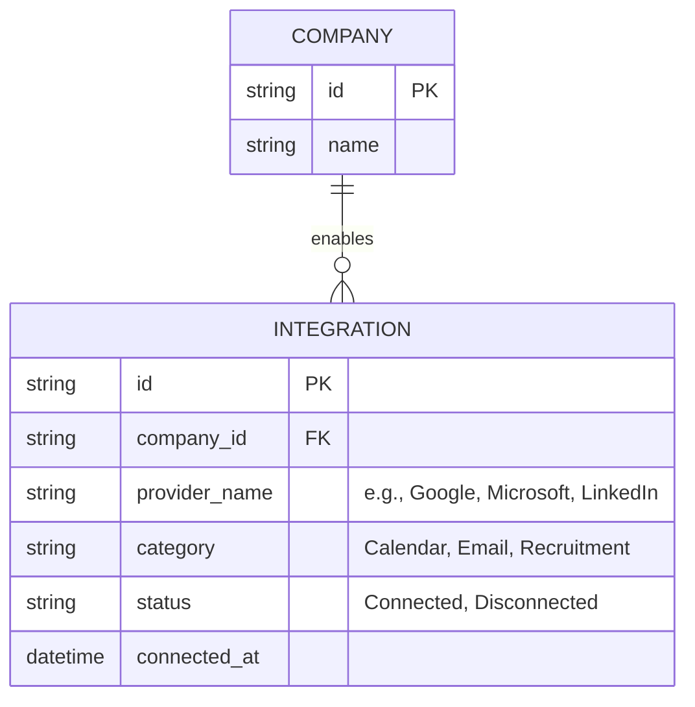
```mermaid
erDiagram
    COMPANY ||--o{ INTEGRATION : "enables"
    
    COMPANY {
        string id PK
        string name
    }

    INTEGRATION {
        string id PK
        string company_id FK
        string provider_name "e.g., Google, Microsoft, LinkedIn"
        string category "Calendar, Email, Recruitment"
        string status "Connected, Disconnected"
        datetime connected_at
    }
```

##### Calendar Integration
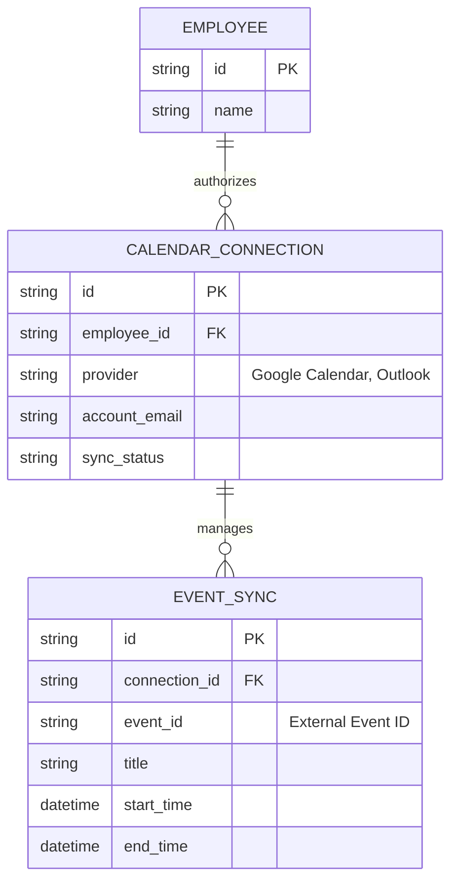
```mermaid
erDiagram
    EMPLOYEE ||--o{ CALENDAR_CONNECTION : "authorizes"
    CALENDAR_CONNECTION ||--o{ EVENT_SYNC : "manages"
    
    EMPLOYEE {
        string id PK
        string name
    }
    
    CALENDAR_CONNECTION {
        string id PK
        string employee_id FK
        string provider "Google Calendar, Outlook"
        string account_email
        string sync_status
    }
    
    EVENT_SYNC {
        string id PK
        string connection_id FK
        string event_id "External Event ID"
        string title
        datetime start_time
        datetime end_time
    }
```

##### Email Integration
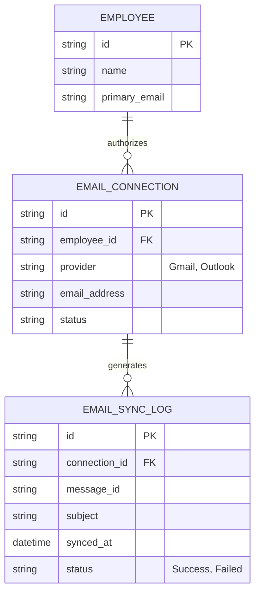
```mermaid
erDiagram
    EMPLOYEE ||--o{ EMAIL_CONNECTION : "authorizes"
    EMAIL_CONNECTION ||--o{ EMAIL_SYNC_LOG : "generates"
    
    EMPLOYEE {
        string id PK
        string name
        string primary_email
    }
    
    EMAIL_CONNECTION {
        string id PK
        string employee_id FK
        string provider "Gmail, Outlook"
        string email_address
        string status
    }
    
    EMAIL_SYNC_LOG {
        string id PK
        string connection_id FK
        string message_id
        string subject
        datetime synced_at
        string status "Success, Failed"
    }
```

##### Recruitment Integration
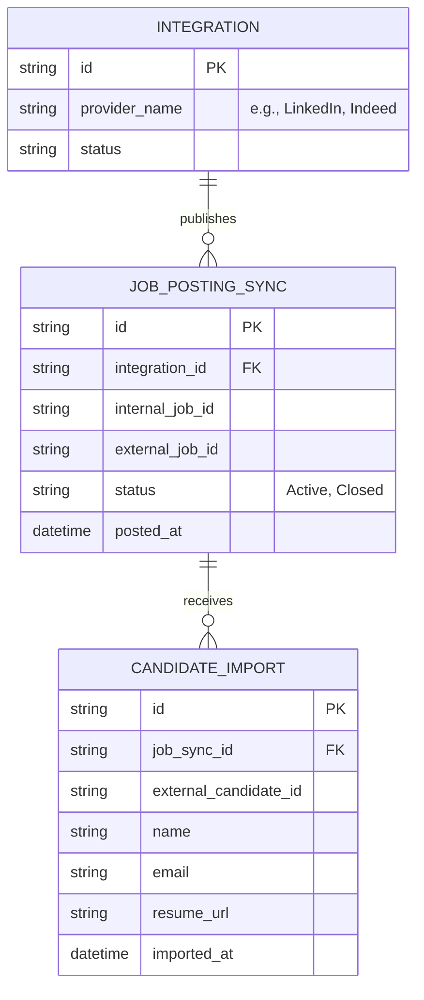
```mermaid
erDiagram
    INTEGRATION ||--o{ JOB_POSTING_SYNC : "publishes"
    JOB_POSTING_SYNC ||--o{ CANDIDATE_IMPORT : "receives"
    
    INTEGRATION {
        string id PK
        string provider_name "e.g., LinkedIn, Indeed"
        string status
    }
    
    JOB_POSTING_SYNC {
        string id PK
        string integration_id FK
        string internal_job_id
        string external_job_id
        string status "Active, Closed"
        datetime posted_at
    }
    
    CANDIDATE_IMPORT {
        string id PK
        string job_sync_id FK
        string external_candidate_id
        string name
        string email
        string resume_url
        datetime imported_at
    }
```

##### Sync History
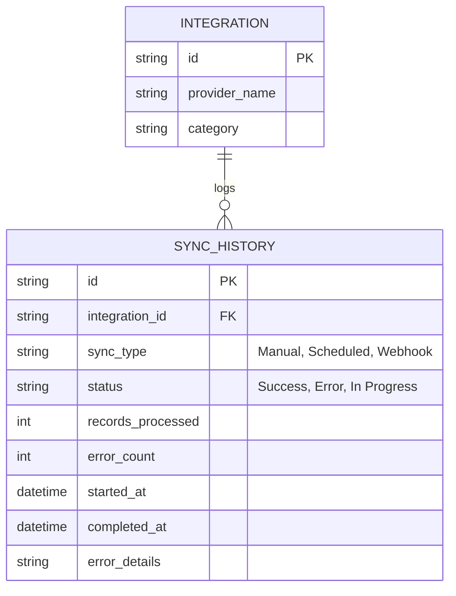
```mermaid
erDiagram
    INTEGRATION ||--o{ SYNC_HISTORY : "logs"
    
    INTEGRATION {
        string id PK
        string provider_name
        string category
    }
    
    SYNC_HISTORY {
        string id PK
        string integration_id FK
        string sync_type "Manual, Scheduled, Webhook"
        string status "Success, Error, In Progress"
        int records_processed
        int error_count
        datetime started_at
        datetime completed_at
        string error_details
    }
```

##### Full Integration ERD
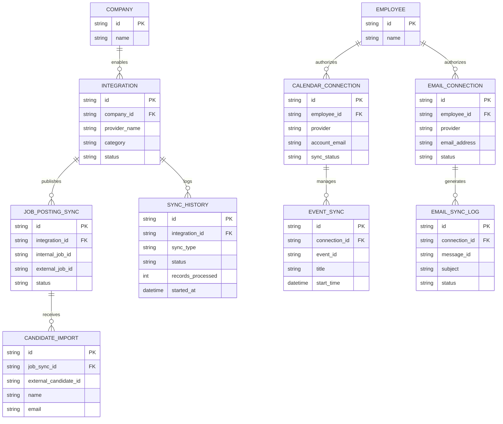
```mermaid
erDiagram
    COMPANY ||--o{ INTEGRATION : "enables"
    EMPLOYEE ||--o{ CALENDAR_CONNECTION : "authorizes"
    EMPLOYEE ||--o{ EMAIL_CONNECTION : "authorizes"
    INTEGRATION ||--o{ JOB_POSTING_SYNC : "publishes"
    INTEGRATION ||--o{ SYNC_HISTORY : "logs"
    CALENDAR_CONNECTION ||--o{ EVENT_SYNC : "manages"
    EMAIL_CONNECTION ||--o{ EMAIL_SYNC_LOG : "generates"
    JOB_POSTING_SYNC ||--o{ CANDIDATE_IMPORT : "receives"
    
    COMPANY {
        string id PK
        string name
    }

    EMPLOYEE {
        string id PK
        string name
    }
    
    INTEGRATION {
        string id PK
        string company_id FK
        string provider_name
        string category
        string status
    }
    
    CALENDAR_CONNECTION {
        string id PK
        string employee_id FK
        string provider
        string account_email
        string sync_status
    }
    
    EVENT_SYNC {
        string id PK
        string connection_id FK
        string event_id
        string title
        datetime start_time
    }
    
    EMAIL_CONNECTION {
        string id PK
        string employee_id FK
        string provider
        string email_address
        string status
    }
    
    EMAIL_SYNC_LOG {
        string id PK
        string connection_id FK
        string message_id
        string subject
        string status
    }
    
    JOB_POSTING_SYNC {
        string id PK
        string integration_id FK
        string internal_job_id
        string external_job_id
        string status
    }
    
    CANDIDATE_IMPORT {
        string id PK
        string job_sync_id FK
        string external_candidate_id
        string name
        string email
    }
    
    SYNC_HISTORY {
        string id PK
        string integration_id FK
        string sync_type
        string status
        int records_processed
        datetime started_at
    }
```

---

### 4.2 Onboarding Management
#### Application Management ERD


#### Offer Management ERD


#### Contract Management ERD


#### Intake Review ERD


#### Onboarding Board ERD


#### Assigned Task ERD


#### Tracking Onboard Progress ERD


---

### 4.3 Payroll Management
#### System ERD Overview


#### Sub-Domain Schemas

##### Payroll Management
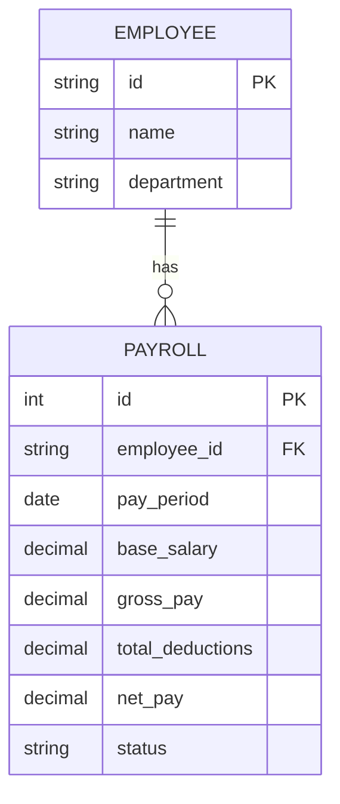
```mermaid
erDiagram
    EMPLOYEE ||--o{ PAYROLL : "has"

    EMPLOYEE {
        string id PK
        string name
        string department
    }

    PAYROLL {
        int id PK
        string employee_id FK
        date pay_period
        decimal base_salary
        decimal gross_pay
        decimal total_deductions
        decimal net_pay
        string status
    }
```

##### Add Payroll
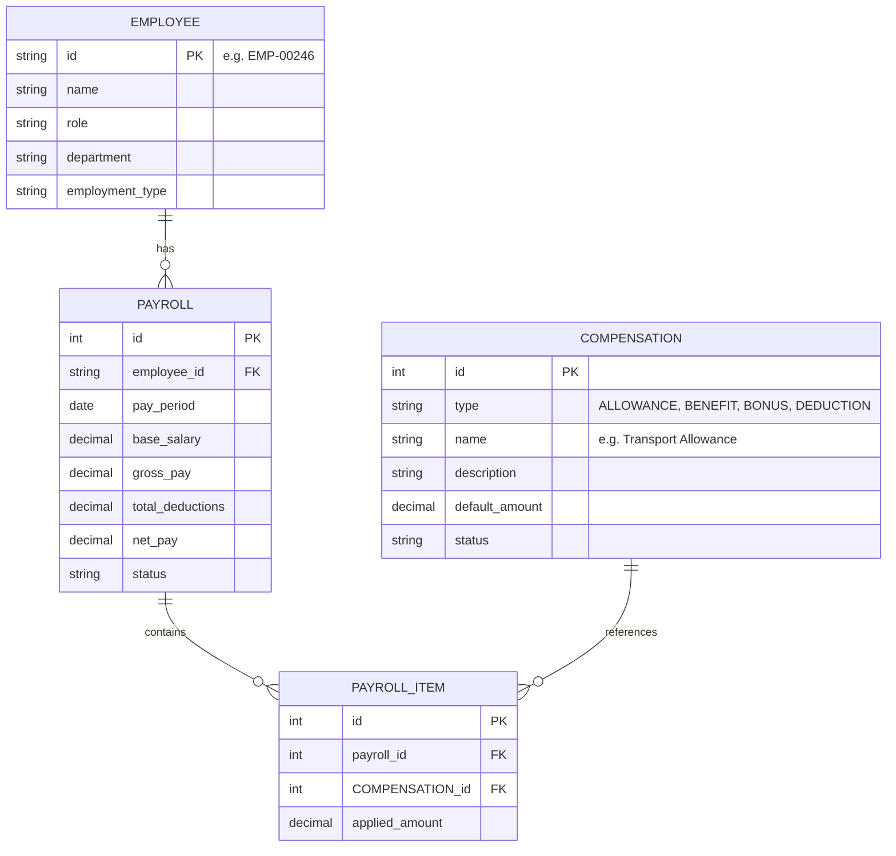
```mermaid
erDiagram
    EMPLOYEE ||--o{ PAYROLL : "has"
    PAYROLL ||--o{ PAYROLL_ITEM : "contains"
    COMPENSATION ||--o{ PAYROLL_ITEM : "references"

    EMPLOYEE {
        string id PK "e.g. EMP-00246"
        string name
        string role
        string department
        string employment_type
    }

    COMPENSATION {
        int id PK
        string type "ALLOWANCE, BENEFIT, BONUS, DEDUCTION"
        string name "e.g. Transport Allowance"
        string description
        decimal default_amount
        string status
    }

    PAYROLL {
        int id PK
        string employee_id FK
        date pay_period
        decimal base_salary
        decimal gross_pay
        decimal total_deductions
        decimal net_pay
        string status
    }

    PAYROLL_ITEM {
        int id PK
        int payroll_id FK
        int COMPENSATION_id FK
        decimal applied_amount
    }
```

##### Payslips
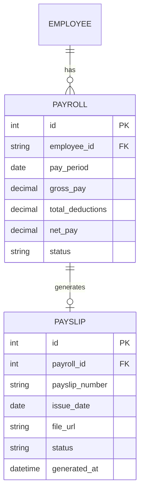
```mermaid
erDiagram
    EMPLOYEE ||--o{ PAYROLL : "has"
    PAYROLL ||--o| PAYSLIP : "generates"

    PAYROLL {
        int id PK
        string employee_id FK
        date pay_period
        decimal gross_pay
        decimal total_deductions
        decimal net_pay
        string status
    }

    PAYSLIP {
        int id PK
        int payroll_id FK
        string payslip_number
        date issue_date
        string file_url
        string status
        datetime generated_at
    }
```

##### Individual Payslip
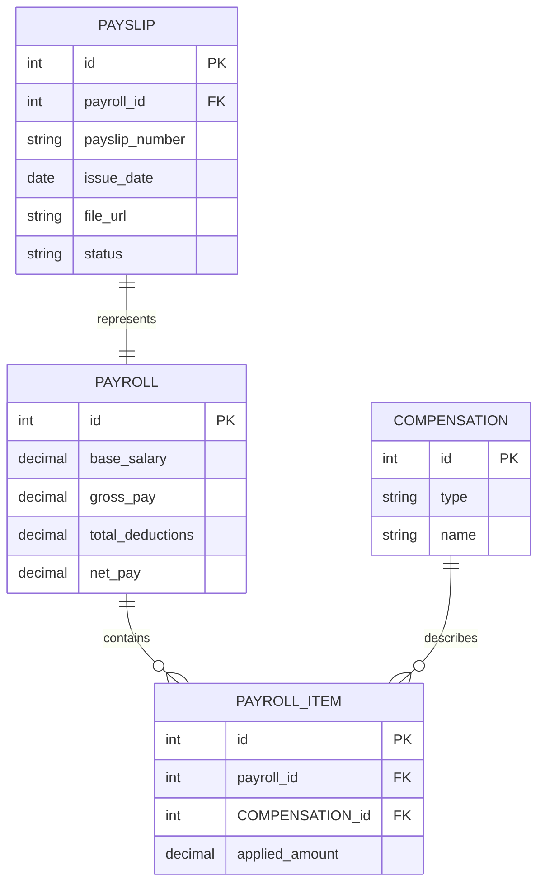
```mermaid
erDiagram
    PAYSLIP ||--|| PAYROLL : "represents"
    PAYROLL ||--o{ PAYROLL_ITEM : "contains"
    COMPENSATION ||--o{ PAYROLL_ITEM : "describes"

    PAYSLIP {
        int id PK
        int payroll_id FK
        string payslip_number
        date issue_date
        string file_url
        string status
    }

    PAYROLL {
        int id PK
        decimal base_salary
        decimal gross_pay
        decimal total_deductions
        decimal net_pay
    }

    PAYROLL_ITEM {
        int id PK
        int payroll_id FK
        int COMPENSATION_id FK
        decimal applied_amount
    }

    COMPENSATION {
        int id PK
        string type
        string name
    }
```

##### Compensation
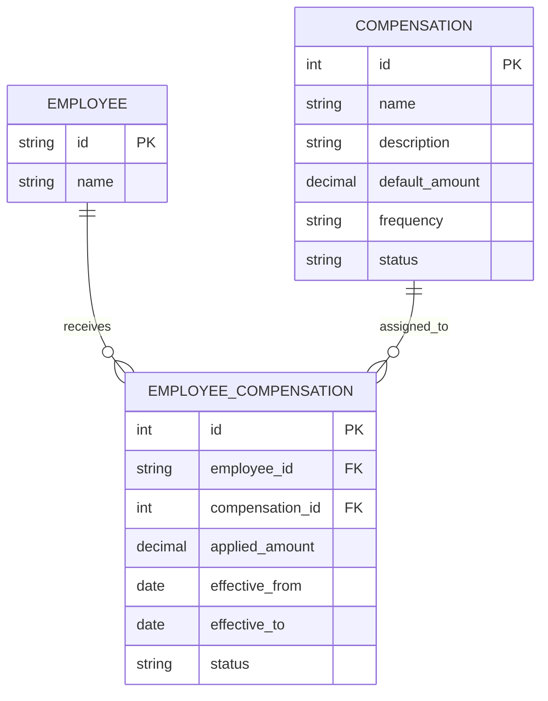
```mermaid
erDiagram
    EMPLOYEE ||--o{ EMPLOYEE_COMPENSATION : "receives"
    COMPENSATION ||--o{ EMPLOYEE_COMPENSATION : "assigned_to"

    EMPLOYEE {
        string id PK
        string name
    }

    COMPENSATION {
        int id PK
        string name
        string description
        decimal default_amount
        string frequency
        string status
    }

    EMPLOYEE_COMPENSATION {
        int id PK
        string employee_id FK
        int compensation_id FK
        decimal applied_amount
        date effective_from
        date effective_to
        string status
    }
```

##### Send Email
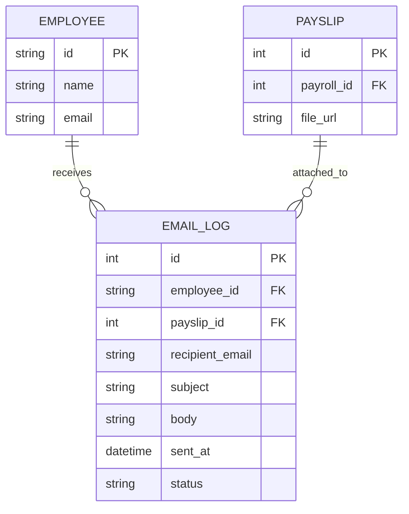
```mermaid
erDiagram
    EMPLOYEE ||--o{ EMAIL_LOG : "receives"
    PAYSLIP ||--o{ EMAIL_LOG : "attached_to"

    EMPLOYEE {
        string id PK
        string name
        string email
    }

    PAYSLIP {
        int id PK
        int payroll_id FK
        string file_url
    }

    EMAIL_LOG {
        int id PK
        string employee_id FK
        int payslip_id FK
        string recipient_email
        string subject
        string body
        datetime sent_at
        string status
    }
```

##### Full Payroll ERD
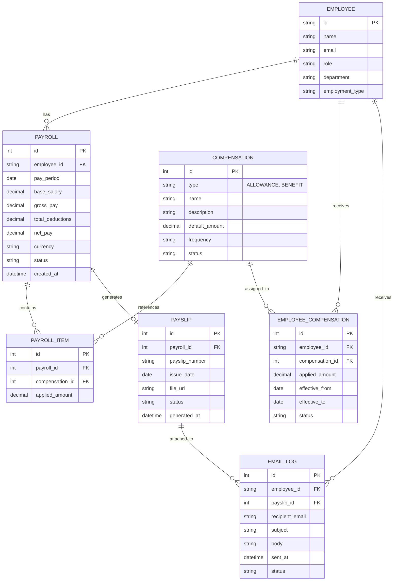
```mermaid
erDiagram
    EMPLOYEE ||--o{ PAYROLL : "has"

    PAYROLL ||--o{ PAYROLL_ITEM : "contains"
    COMPENSATION ||--o{ PAYROLL_ITEM : "references"

    PAYROLL ||--o| PAYSLIP : "generates"

    EMPLOYEE ||--o{ EMPLOYEE_COMPENSATION : "receives"
    COMPENSATION ||--o{ EMPLOYEE_COMPENSATION : "assigned_to"

    EMPLOYEE ||--o{ EMAIL_LOG : "receives"
    PAYSLIP ||--o{ EMAIL_LOG : "attached_to"

    EMPLOYEE {
        string id PK
        string name
        string email
        string role
        string department
        string employment_type
    }

    PAYROLL {
        int id PK
        string employee_id FK
        date pay_period
        decimal base_salary
        decimal gross_pay
        decimal total_deductions
        decimal net_pay
        string currency
        string status
        datetime created_at
    }

    COMPENSATION {
        int id PK
        string type "ALLOWANCE, BENEFIT"
        string name
        string description
        decimal default_amount
        string frequency
        string status
    }

    PAYROLL_ITEM {
        int id PK
        int payroll_id FK
        int compensation_id FK
        decimal applied_amount
    }

    EMPLOYEE_COMPENSATION {
        int id PK
        string employee_id FK
        int compensation_id FK
        decimal applied_amount
        date effective_from
        date effective_to
        string status
    }

    PAYSLIP {
        int id PK
        int payroll_id FK
        string payslip_number
        date issue_date
        string file_url
        string status
        datetime generated_at
    }

    EMAIL_LOG {
        int id PK
        string employee_id FK
        int payslip_id FK
        string recipient_email
        string subject
        string body
        datetime sent_at
        string status
    }
```

---

### 4.4 People Management
#### Organization Domain Schema ERD
Database relationship model covering Company Branches, Departments, Teams, Positions, and Reporting Line relationships.


#### Employee Directory Domain Schema ERD
Database entity structure covering Employee Accounts, 1:1 Profiles, Labor Contracts, Verification Documents, Education, Assets, Leave Types, and Leave Balances.


#### Request Management Domain Schema ERD
Workflow database model covering Ticket Requests, Request Types, Workflow Steps, Multi-Stage Approval Logs, and Attachments.


---

### 4.5 Performance Management
#### Performance Review ERD


#### 1-on-1 Coaching ERD


---

### 4.6 Project Management
#### System ERD Overview


#### Project Setup & Management, Member & Allocation, Effort / Time Tracking


#### Capability Management + Budget Management


#### Productivity Monitoring


---

### 4.7 Recruitment Management
#### Recruitment DB Overview


#### Organization & Recruitment Requirement


#### Job & Application


#### Interview Schedule & Evaluation


#### Offer & Recruitment Template


---

### 4.8 Workforce Management
#### Attendance Corrections ERD


#### Attendance Record ERD


#### My Attendance ERD


#### Leave Management ERD


#### Timesheet Review ERD


---

## 5. API Documentation & Test Cases

### 5.1 Integration Management
```text
BBV HR - Integration Management API
│
├── Integrations
│   ├── GET     /integrations
│   ├── POST    /integrations
│   ├── GET     /integrations/{integrationId}
│   ├── PUT     /integrations/{integrationId}
│   ├── DELETE  /integrations/{integrationId}
│   ├── POST    /integrations/{integrationId}/test
│   └── POST    /integrations/{integrationId}/reconnect
│
├── Calendar Integration
│   ├── GET     /integrations/{integrationId}/calendar-config
│   ├── PUT     /integrations/{integrationId}/calendar-config
│   └── GET     /integrations/{integrationId}/calendar-events
│
├── Email Integration
│   ├── GET     /integrations/{integrationId}/email-config
│   ├── PUT     /integrations/{integrationId}/email-config
│   ├── GET     /integrations/{integrationId}/email-templates
│   ├── POST    /integrations/{integrationId}/email-templates
│   ├── PUT     /email-templates/{templateId}
│   ├── DELETE  /email-templates/{templateId}
│   ├── GET     /integrations/{integrationId}/email-logs
│   └── POST    /integrations/{integrationId}/send-test-email
│
├── Recruitment Integration
│   ├── GET     /integrations/{integrationId}/recruitment-config
│   ├── PUT     /integrations/{integrationId}/recruitment-config
│   ├── GET     /integrations/{integrationId}/job-postings
│   ├── POST    /integrations/{integrationId}/job-postings
│   ├── POST    /job-postings/{jobPostingSyncId}/sync
│   ├── POST    /job-postings/{jobPostingSyncId}/close
│   ├── GET     /job-postings/{jobPostingSyncId}/candidate-imports
│   └── POST    /integrations/{integrationId}/application-sync
│
└── Sync History
    ├── POST    /integrations/{integrationId}/sync
    ├── GET     /sync-history
    ├── GET     /sync-history/{syncId}
    └── POST    /sync-history/{syncId}/retry
```


---

### 5.2 Onboarding Management
 
 


```text
Copilot HR - Employee Onboarding API
│
├── Application Management
│   ├── GET    /applications
│   ├── POST   /applications
│   ├── GET    /applications/{applicationId}
│   ├── PATCH  /applications/{applicationId}/stage
│   ├── GET    /applications/{applicationId}/interviews
│   ├── POST   /applications/{applicationId}/interviews
│   ├── GET    /applications/{applicationId}/evaluations
│   └── POST   /applications/{applicationId}/evaluations
│
├── Offer Management
│   ├── GET    /candidate-form-templates
│   ├── POST   /offers
│   ├── GET    /offers/{offerId}
│   ├── POST   /offers/{offerId}/send
│   └── POST   /offers/{offerId}/respond
│
├── Onboarding Intake Review
│   ├── POST   /onboarding/submissions
│   ├── GET    /onboarding/submissions/{submissionId}
│   ├── POST   /onboarding/submissions/{submissionId}/documents
│   ├── POST   /onboarding/submissions/{submissionId}/field-mappings/parse
│   ├── GET    /onboarding/submissions/{submissionId}/generated-outputs
│   └── POST   /onboarding/submissions/{submissionId}/reviews
│
├── Onboarding Board
│   ├── POST   /onboarding/cases
│   ├── GET    /onboarding/cases
│   ├── GET    /onboarding/cases/{caseId}
│   ├── GET    /onboarding/cases/{caseId}/readiness-checklist
│   ├── GET    /onboarding/cases/{caseId}/blockers
│   └── POST   /onboarding/cases/{caseId}/blockers
│
├── My Assigned Tasks
│   ├── GET    /onboarding/cases/{caseId}/tasks
│   ├── POST   /onboarding/cases/{caseId}/tasks
│   ├── POST   /onboarding/tasks/{taskId}/assignments
│   ├── GET    /onboarding/tasks/{taskId}/comments
│   └── POST   /onboarding/tasks/{taskId}/comments
│
├── Contract Management
│   ├── GET    /contract-templates
│   ├── GET    /contracts
│   ├── POST   /contracts
│   ├── GET    /contracts/{contractId}
│   ├── PATCH  /contracts/{contractId}
│   ├── POST   /contracts/{contractId}/submit-for-approval
│   ├── GET    /contracts/{contractId}/approvals
│   ├── POST   /contract-approvals/{approvalId}/decision
│   └── POST   /contracts/{contractId}/mark-signed
│
└── Tracking Onboarding Progress
    ├── POST   /onboarding/cases/{caseId}/probation
    ├── GET    /onboarding/cases/{caseId}/probation
    ├── POST   /probation/{probationId}/self-reviews
    ├── POST   /probation/{probationId}/evaluations
    ├── POST   /probation/evaluations/{evaluationId}/reviewers
    └── POST   /probation/evaluations/{evaluationId}/finalize
```

---

### 5.3 Payroll Management
```text
BBV HR - Payroll Management API
│
├── Payrolls
│   ├── GET     /payrolls
│   ├── POST    /payrolls
│   ├── POST    /payrolls/import
│   ├── GET     /payrolls/{payrollId}
│   ├── PUT     /payrolls/{payrollId}
│   └── DELETE  /payrolls/{payrollId}
│
├── Payroll Items
│   ├── GET     /payrolls/{payrollId}/items
│   ├── POST    /payrolls/{payrollId}/items
│   ├── PUT     /payrolls/{payrollId}/items/{itemId}
│   └── DELETE  /payrolls/{payrollId}/items/{itemId}
│
├── Compensations
│   ├── GET     /compensations
│   ├── POST    /compensations
│   ├── GET     /compensations/{compensationId}
│   ├── PUT     /compensations/{compensationId}
│   └── DELETE  /compensations/{compensationId}
│
├── Employee Compensations
│   ├── GET     /employee-compensations
│   ├── POST    /employee-compensations
│   ├── GET     /employee-compensations/{employeeCompensationId}
│   ├── PUT     /employee-compensations/{employeeCompensationId}
│   └── DELETE  /employee-compensations/{employeeCompensationId}
│
├── Payslips
│   ├── GET     /payslips
│   ├── POST    /payrolls/{payrollId}/payslip
│   └── GET     /payslips/{payslipId}
│
└── Payslip Email
    ├── POST    /payslips/{payslipId}/send-email
    └── GET     /email-logs
```


---

### 5.4 People Management
Access the interactive online Swagger API documentation:  
🔗 [Copilot.HR Employee Directory API - Interactive SwaggerHub Documentation](https://app.swaggerhub.com/apis/ouuniversity/copilothr-employee-directory-api/1.0.0#/Documents)

#### API Endpoint Tree Structure
```text
Copilot.HR - People Management API
│
├── Employees & Profiles
│   ├── GET     /employees
│   ├── POST    /employees
│   ├── POST    /employees/export
│   ├── GET     /employees/{id}
│   ├── PUT     /employees/{id}
│   ├── DELETE  /employees/{id}
│   ├── GET     /employees/{id}/contracts
│   ├── POST    /employees/{id}/contracts
│   ├── GET     /employees/{id}/documents
│   ├── POST    /employees/{id}/documents
│   └── GET     /employees/{id}/history
│
├── Leave Categories & Balances
│   ├── GET     /leave-types
│   ├── POST    /leave-types
│   ├── GET     /employees/{id}/leave-balance
│   └── GET     /requests/quotas/check
│
├── HR Request Management & Workflows
│   ├── GET     /requests
│   ├── POST    /requests
│   ├── GET     /requests/{id}
│   ├── PUT     /requests/{id}
│   ├── POST    /requests/{id}/approve
│   ├── POST    /requests/{id}/reject
│   ├── POST    /requests/{id}/cancel
│   └── GET     /requests/{id}/timeline
│
└── Organization & Hierarchy Matrix
    ├── GET     /departments
    ├── POST    /departments
    ├── GET     /departments/{id}
    ├── PUT     /departments/{id}
    ├── DELETE  /departments/{id}
    ├── POST    /departments/restructure
    ├── GET     /positions
    ├── POST    /positions
    ├── PUT     /positions/{id}
    ├── GET     /teams
    ├── POST    /teams
    ├── POST    /teams/{id}/members
    ├── GET     /reporting-lines
    └── PUT     /reporting-lines
```

#### API Endpoint Tables

##### Employee Directory APIs
| Method | URL Endpoint | Role | Parameters / Query | Status Code | Description |
| :---: | :--- | :--- | :--- | :---: | :--- |
| `GET` | `/api/v1/employees` | `Staff, Manager, HR Staff, HR Manager, Tenant Admin, System Admin` | Query: `query`, `department`, `status`, `page`, `limit` | `200`, `401` | Retrieve a paginated list of employees with search and department/status filtering options. |
| `POST` | `/api/v1/employees` | `HR Staff, HR Manager, Tenant Admin` | Body: `fullName`, `corporateEmail`, `department`, `jobTitle`, `phoneNumber` | `201`, `400` | Register a new employee profile into the system directory. |
| `GET` | `/api/v1/employees/{id}` | `Staff, Manager, HR Staff, HR Manager, Tenant Admin` | Path: `id` | `200`, `404` | Retrieve comprehensive 360-degree employee profile details. |
| `PUT` | `/api/v1/employees/{id}` | `Staff, HR Staff, HR Manager, Tenant Admin` | Path: `id`, Body: `phoneNumber`, `personalEmail`, `residentialAddress` | `200`, `400` | Update personal demographics or work contact details for an employee. |
| `DELETE` | `/api/v1/employees/{id}` | `HR Manager, Tenant Admin` | Path: `id` | `200`, `404` | Deactivate or offboard an employee profile account. |
| `GET` | `/api/v1/employees/{id}/contracts` | `Staff, HR Staff, HR Manager, Tenant Admin` | Path: `id` | `200`, `404` | Retrieve labor contract history, base salary, and active employment contract. |
| `POST` | `/api/v1/employees/{id}/contracts` | `HR Staff, HR Manager, Tenant Admin` | Path: `id`, Body: `contractNumber`, `contractType`, `baseSalary`, `effectiveDate` | `201`, `400` | Register a new labor contract with compensation details and effective date. |
| `GET` | `/api/v1/employees/{id}/documents` | `Staff, HR Staff, HR Manager, Tenant Admin` | Path: `id` | `200`, `404` | Fetch list of uploaded verification documents (Identity Card, Medical Clearance, Tax Records). |
| `POST` | `/api/v1/employees/{id}/documents` | `Staff, HR Staff, HR Manager, Tenant Admin` | Path: `id`, FormData: `documentType`, `file` | `201`, `400` | Upload a new identity or verification document for an employee. |
| `GET` | `/api/v1/employees/{id}/leave-balance` | `Staff, Manager, HR Staff, HR Manager, Tenant Admin` | Path: `id` | `200`, `404` | Retrieve remaining annual leave and sick leave quota balances for the current year. |
| `GET` | `/api/v1/employees/{id}/history` | `Manager, HR Staff, HR Manager, Tenant Admin` | Path: `id` | `200`, `404` | Fetch audit trail history including promotions, job level updates, and contract sign-offs. |
| `POST` | `/api/v1/employees/export` | `Manager, HR Staff, HR Manager, Tenant Admin` | Body: `department`, `fileFormat` | `200`, `400` | Export filtered employee directory records to CSV or Excel file format. |

##### Organization & Department APIs
| Method | URL Endpoint | Role | Parameters / Query | Status Code | Description |
| :---: | :--- | :--- | :--- | :---: | :--- |
| `GET` | `/api/v1/departments` | `Staff, Manager, HR Staff, HR Manager, Tenant Admin` | Query: `branch` | `200`, `401` | Retrieve the interactive organizational tree hierarchy and department roster metrics. |
| `POST` | `/api/v1/departments` | `HR Staff, HR Manager, Tenant Admin` | Body: `departmentName`, `parentDepartmentId`, `departmentLeadId`, `locationBranch` | `201`, `400` | Register a new operational department entity into the organizational structure. |
| `GET` | `/api/v1/departments/{id}` | `Staff, Manager, HR Staff, HR Manager, Tenant Admin` | Path: `id` | `200`, `404` | Fetch comprehensive department details, department lead, headcount, and budget allocation. |
| `PUT` | `/api/v1/departments/{id}` | `HR Staff, HR Manager, Tenant Admin` | Path: `id`, Body: `departmentName`, `parentDepartmentId`, `departmentLeadId` | `200`, `400` | Modify department name, parent division, department lead, or location branch. |
| `DELETE` | `/api/v1/departments/{id}` | `HR Manager, Tenant Admin` | Path: `id` | `200`, `404` | Archive or deactivate an existing department entity. |
| `POST` | `/api/v1/departments/restructure` | `Manager, HR Manager, Tenant Admin` | Body: `sourceNodeId`, `targetDepartmentId`, `reason` | `202`, `400` | Queue an organizational restructuring or employee reassignment drag-and-drop event for Director/CEO approval. |
| `GET` | `/api/v1/positions` | `Staff, Manager, HR Staff, HR Manager, Tenant Admin` | None | `200` | Retrieve all defined organizational job titles, competency levels (L1-L6), and salary band ranges. |
| `POST` | `/api/v1/positions` | `HR Staff, HR Manager, Tenant Admin` | Body: `title`, `jobLevel`, `minSalaryUSD`, `maxSalaryUSD` | `201`, `400` | Create a new job position title with assigned salary band and job level. |
| `PUT` | `/api/v1/positions/{id}` | `HR Staff, HR Manager, Tenant Admin` | Path: `id`, Body: `title`, `jobLevel`, `minSalaryUSD`, `maxSalaryUSD` | `200`, `400` | Update job description, level, or salary band range for a position title. |
| `GET` | `/api/v1/teams` | `Staff, Manager, HR Staff, HR Manager, Tenant Admin` | None | `200` | Retrieve all active cross-functional project teams, designated team leads, and member counts. |
| `POST` | `/api/v1/teams` | `Manager, HR Staff, HR Manager, Tenant Admin` | Body: `teamName`, `teamLeadId` | `201`, `400` | Register a new cross-functional project team. |
| `POST` | `/api/v1/teams/{id}/members` | `Manager, HR Staff, HR Manager, Tenant Admin` | Path: `id`, Body: `employeeId`, `action` | `200`, `400` | Assign or remove employee member allocations within a project team. |
| `GET` | `/api/v1/reporting-lines` | `Staff, Manager, HR Staff, HR Manager, Tenant Admin` | None | `200` | Fetch supervisor relationships across direct report managers and functional matrix line managers. |
| `PUT` | `/api/v1/reporting-lines` | `HR Staff, HR Manager, Tenant Admin` | Body: `employeeId`, `newManagerId`, `reportingType` | `200`, `400` | Update direct report supervisor or functional line manager for an employee. |

##### Request Management APIs
| Method | URL Endpoint | Role | Parameters / Query | Status Code | Description |
| :---: | :--- | :--- | :--- | :---: | :--- |
| `GET` | `/api/v1/requests` | `Staff, Manager, HR Staff, HR Manager, Tenant Admin` | Query: `type`, `status`, `applicantId`, `page`, `limit` | `200`, `401` | Retrieve a paginated list of HR requests filtered by request type, approval status, or applicant. |
| `POST` | `/api/v1/requests` | `Staff, Manager` | Body: `requestType`, `startDate`, `endDate`, `reason`, `urgencyLevel` | `201`, `400` | Submit a new HR request (Annual Leave, Equipment, Policy) with automatic quota validation. |
| `GET` | `/api/v1/requests/{id}` | `Staff, Manager, HR Staff, HR Manager, Tenant Admin` | Path: `id` | `200`, `404` | Retrieve full request metadata, applicant details, approval steps, and attached proof files. |
| `PUT` | `/api/v1/requests/{id}` | `Staff, Manager` | Path: `id`, Body: `requestType`, `startDate`, `endDate`, `reason` | `200`, `400` | Modify an existing draft HR request prior to submission. |
| `POST` | `/api/v1/requests/{id}/approve` | `Manager, HR Manager, Tenant Admin` | Path: `id`, Body: `comment` | `200`, `400` | Approve a pending request step. Automatically advances workflow to next approver or executes final approval. |
| `POST` | `/api/v1/requests/{id}/reject` | `Manager, HR Manager, Tenant Admin` | Path: `id`, Body: `reason` | `200`, `400` | Reject a pending HR request with mandatory reviewer feedback comments. |
| `POST` | `/api/v1/requests/{id}/cancel` | `Staff, Manager` | Path: `id` | `200`, `400` | Cancel a submitted request by the applicant prior to final approval execution. |
| `GET` | `/api/v1/requests/{id}/timeline` | `Staff, Manager, HR Staff, HR Manager, Tenant Admin` | Path: `id` | `200`, `404` | Retrieve step-by-step progress tracker timeline, reviewer audit logs, and approval timestamps. |
| `GET` | `/api/v1/requests/quotas/check` | `Staff, Manager` | Query: `applicantId`, `leaveType`, `requestedDays` | `200`, `400` | Validate available annual or sick leave balance before submitting a leave request. |

#### Swagger UI Endpoint Screenshots


---

### 5.5 Performance Management
#### Performance Swagger API Screenshots


#### API Endpoint Tree Structure
```text
Performance
└── Performance Management
    ├── Goal Management
    │   ├── Goal Cycles
    │   │   ├── GET    /goal-cycles
    │   │   ├── POST   /goal-cycles
    │   │   └── GET    /goal-cycles/{cycleId}
    │   ├── Performance Goals
    │   │   ├── GET    /goals
    │   │   ├── POST   /goals
    │   │   ├── GET    /goals/{goalId}
    │   │   ├── PUT    /goals/{goalId}
    │   │   └── PATCH  /goals/{goalId}/progress
    │   └── Goal Workflow & History
    │       ├── POST   /goals/{goalId}/approvals
    │       ├── POST   /goals/{goalId}/revisions
    │       └── GET    /goals/{goalId}/history
    ├── Performance Review Management
    │   ├── Review Cycles & Templates
    │   │   ├── GET    /review-cycles
    │   │   ├── POST   /review-cycles
    │   │   ├── GET    /review-cycles/{cycleId}
    │   │   ├── GET    /review-templates
    │   │   ├── POST   /review-templates
    │   │   └── GET    /review-templates/{templateId}/sections
    │   ├── Performance Reviews & Feedback
    │   │   ├── GET    /performance-reviews
    │   │   ├── POST   /performance-reviews
    │   │   ├── GET    /performance-reviews/{reviewId}
    │   │   ├── PATCH  /performance-reviews/{reviewId}/status
    │   │   ├── GET    /performance-reviews/{reviewId}/participants
    │   │   └── POST   /performance-reviews/{reviewId}/feedback
    │   └── Approvals & Corrections
    │       ├── POST   /performance-reviews/{reviewId}/approvals
    │       ├── POST   /performance-reviews/{reviewId}/corrections
    │       └── GET    /performance-reviews/{reviewId}/history
    ├── One-on-One Coaching Management
    │   ├── Coaching Templates & Sessions
    │   │   ├── GET    /coaching-templates
    │   │   ├── POST   /coaching-templates
    │   │   ├── GET    /one-on-ones
    │   │   ├── POST   /one-on-ones
    │   │   ├── GET    /one-on-ones/{sessionId}
    │   │   └── PATCH  /one-on-ones/{sessionId}/status
    │   └── Session Artifacts & Follow-ups
    │       ├── POST   /one-on-ones/{sessionId}/agenda-items
    │       ├── POST   /one-on-ones/{sessionId}/notes
    │       ├── POST   /one-on-ones/{sessionId}/action-items
    │       └── GET    /one-on-ones/{sessionId}/history
    └── Performance Reporting & Summaries
        └── Performance Summaries
            ├── GET    /employees/{employeeId}/performance-summary
            └── POST   /employees/{employeeId}/performance-summary/recalculate
```

---

### 5.6 Project Management
```text
BBV HR - Project Management API

├── MVP 1 - Core Project Management
│   ├── Projects
│   │   ├── GET     /projects
│   │   ├── POST    /projects
│   │   ├── GET     /projects/{projectId}
│   │   ├── PATCH   /projects/{projectId}
│   │   └── DELETE  /projects/{projectId}
│   │
│   ├── Project Members
│   │   ├── GET     /projects/{projectId}/members
│   │   ├── POST    /projects/{projectId}/members
│   │   ├── GET     /projects/{projectId}/members/{memberId}
│   │   ├── PATCH   /projects/{projectId}/members/{memberId}
│   │   ├── DELETE  /projects/{projectId}/members/{memberId}
│   │   └── PATCH   /projects/{projectId}/members/{memberId}/allocation
│   │
│   └── Project Effort
│       ├── GET     /projects/{projectId}/effort
│       ├── GET     /projects/{projectId}/effort/members
│       └── GET     /projects/{projectId}/time-entries
│
├── MVP 2 - Capability & Budget Management
│   ├── Capabilities
│   │   ├── GET     /capabilities
│   │   ├── POST    /capabilities
│   │   ├── PATCH   /capabilities/{capabilityId}
│   │   └── DELETE  /capabilities/{capabilityId}
│   │
│   ├── Employee Capabilities
│   │   ├── GET     /employees/{employeeId}/capabilities
│   │   ├── POST    /employees/{employeeId}/capabilities
│   │   ├── PATCH   /employees/{employeeId}/capabilities/{capabilityId}
│   │   └── DELETE  /employees/{employeeId}/capabilities/{capabilityId}
│   │
│   ├── Project Capability Requirements
│   │   ├── GET     /projects/{projectId}/required-capabilities
│   │   ├── POST    /projects/{projectId}/required-capabilities
│   │   ├── PATCH   /projects/{projectId}/required-capabilities/{capabilityId}
│   │   ├── DELETE  /projects/{projectId}/required-capabilities/{capabilityId}
│   │   └── GET     /projects/{projectId}/capability-gap
│   │
│   └── Project Budget
│       ├── GET     /projects/{projectId}/budget
│       ├── GET     /projects/{projectId}/budget-adjustments
│       ├── POST    /projects/{projectId}/budget-adjustments
│       ├── GET     /projects/{projectId}/budget-adjustments/{adjustmentId}
│       ├── POST    /projects/{projectId}/budget-adjustments/{adjustmentId}/approve
│       └── POST    /projects/{projectId}/budget-adjustments/{adjustmentId}/reject
│
└── MVP 3 - Productivity Monitoring
    ├── Project Productivity
    │   ├── GET     /projects/{projectId}/productivity
    │   └── GET     /projects/{projectId}/productivity/sessions
    │
    ├── Productivity Sessions
    │   ├── POST    /productivity/sessions
    │   ├── GET     /productivity/sessions/{sessionId}
    │   └── PATCH   /productivity/sessions/{sessionId}
    │
    ├── Application Tracking
    │   ├── GET     /productivity/sessions/{sessionId}/apps
    │   └── POST    /productivity/sessions/{sessionId}/apps
    │
    ├── Website Tracking
    │   ├── GET     /productivity/sessions/{sessionId}/websites
    │   └── POST    /productivity/sessions/{sessionId}/websites
    │
    └── Screenshot Tracking
        ├── GET     /productivity/sessions/{sessionId}/screenshots
        └── POST    /productivity/sessions/{sessionId}/screenshots
```

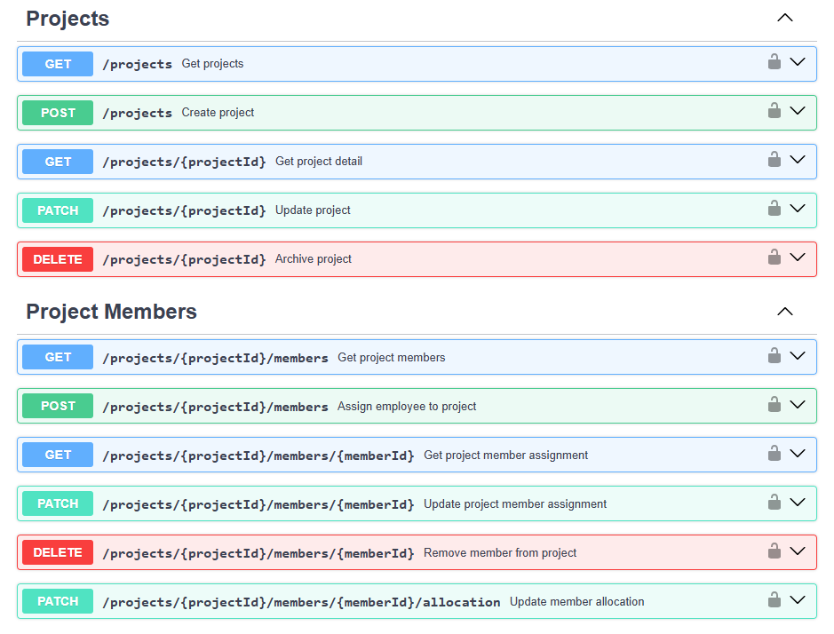
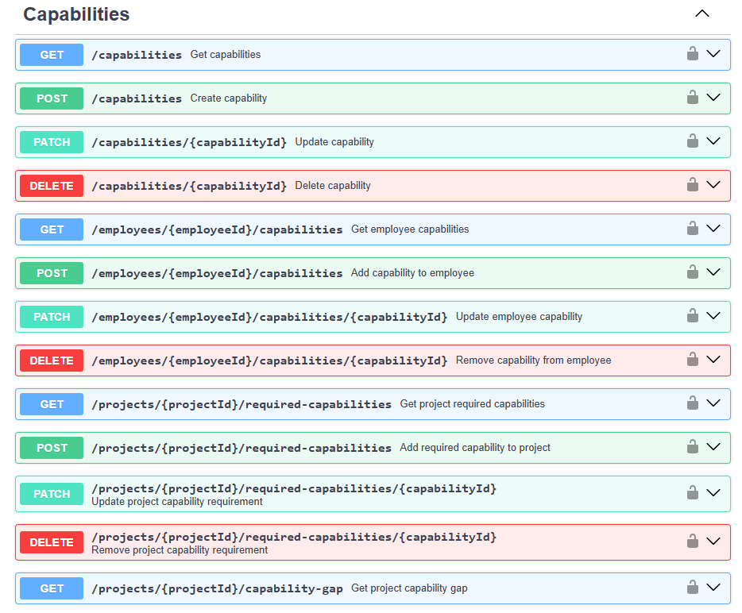
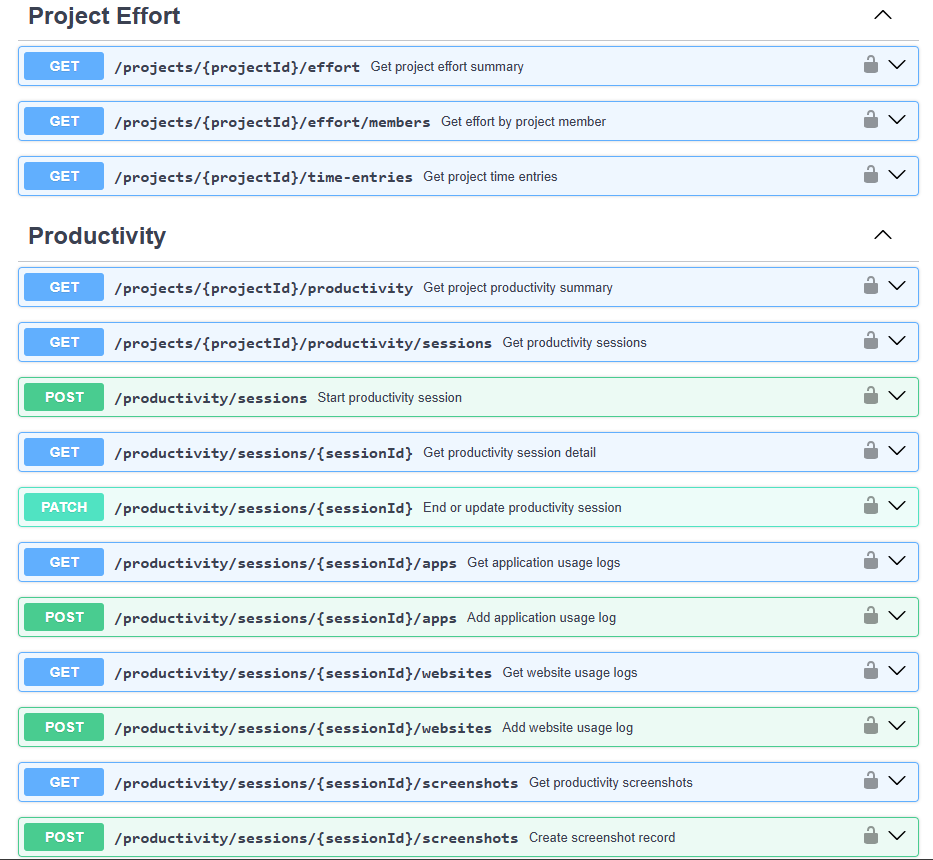
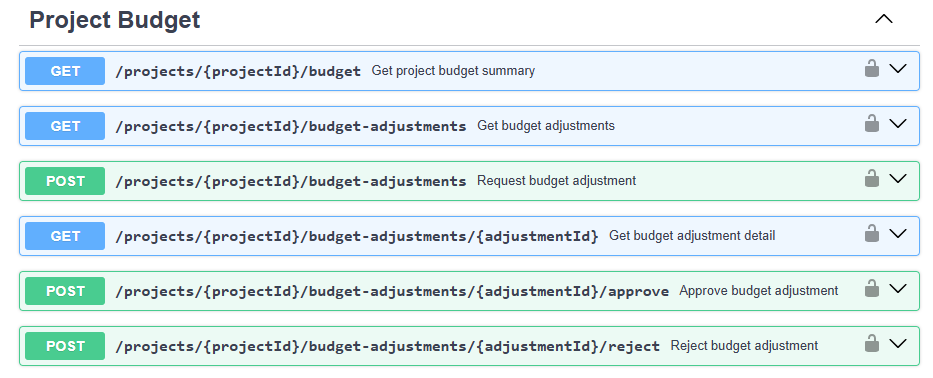

---

### 5.7 Recruitment Management
```text
BBV HR - Recruitment API
│
├── Requirements
│   ├── GET     /requirements
│   ├── POST    /requirements
│   ├── GET     /requirements/{requirementId}
│   ├── PATCH   /requirements/{requirementId}
│   └── DELETE  /requirements/{requirementId}
│
├── Jobs
│   ├── GET     /jobs
│   ├── POST    /jobs
│   ├── GET     /jobs/{jobId}
│   ├── PATCH   /jobs/{jobId}
│   ├── DELETE  /jobs/{jobId}
│   └── POST    /jobs/{jobId}/publish
│
├── Applications
│   ├── GET     /applications
│   ├── POST    /applications
│   ├── GET     /applications/{applicationId}
│   ├── PATCH   /applications/{applicationId}
│   ├── PATCH   /applications/{applicationId}/stage
│   └── POST    /applications/{applicationId}/reject
│
├── Schedules
│   ├── GET     /schedules
│   ├── POST    /schedules
│   ├── GET     /schedules/{scheduleId}
│   ├── PATCH   /schedules/{scheduleId}
│   └── POST    /schedules/{scheduleId}/cancel
│
├── Interviews
│   ├── GET     /interviews
│   ├── GET     /interviews/{interviewId}
│   ├── PATCH   /interviews/{interviewId}
│   ├── POST    /interviews/{interviewId}/evaluations
│   └── POST    /interviews/{interviewId}/decision
│
├── Offers
│   ├── GET     /offers
│   ├── POST    /offers
│   ├── GET     /offers/{offerId}
│   ├── PATCH   /offers/{offerId}
│   └── POST    /offers/{offerId}/send
│
└── Templates
    ├── GET     /templates
    ├── POST    /templates
    ├── GET     /templates/{templateId}
    ├── PATCH   /templates/{templateId}
    └── DELETE  /templates/{templateId}
```


---

### 5.8 Workforce Management
#### Interactive Swagger Docs Links
- 🔗 [Attendance Management API](https://app.swaggerhub.com/apis-docs/digitaltransformatio-4d0/Attendence-management/1.0.0)
- 🔗 [Leave Management API](https://app.swaggerhub.com/apis-docs/digitaltransformatio-4d0/leave-management)
- 🔗 [Timesheet Review API](https://app.swaggerhub.com/apis-docs/digitaltransformatio-4d0/time-sheet-review/1.0.0)

#### API Endpoint Trees

##### Attendance Management API
```text
Workforce
└── Attendance Management
    ├── Attendance Dashboard
    │   ├── Dashboard Summary
    │   │   └── GET    /attendance/dashboard/summary
    │   ├── Recent Clock-ins
    │   │   └── GET    /attendance/dashboard/recent-clock-ins
    │   └── Export
    │       └── GET    /attendance/dashboard/export
    ├── Attendance Records & Exceptions
    │   ├── Attendance Records
    │   │   ├── GET    /attendance-records
    │   │   ├── POST   /attendance-records
    │   │   ├── GET    /attendance-records/summary
    │   │   ├── GET    /attendance-records/export
    │   │   ├── GET    /attendance-records/{recordId}
    │   │   ├── PATCH  /attendance-records/{recordId}
    │   │   └── GET    /attendance-records/{recordId}/breaks
    │   └── Attendance Exceptions
    │       ├── GET    /attendance-exceptions
    │       └── GET    /attendance-exceptions/summary
    ├── Attendance Corrections
    │   ├── Correction Requests
    │   │   ├── GET    /attendance-corrections
    │   │   ├── POST   /attendance-corrections
    │   │   ├── GET    /attendance-corrections/summary
    │   │   ├── GET    /attendance-corrections/export
    │   │   ├── GET    /attendance-corrections/{correctionId}
    │   │   └── PATCH  /attendance-corrections/{correctionId}
    │   ├── Correction Review
    │   │   ├── GET    /attendance-corrections/{correctionId}/review
    │   │   ├── POST   /attendance-corrections/{correctionId}/approve
    │   │   ├── POST   /attendance-corrections/{correctionId}/reject
    │   │   └── GET    /attendance-corrections/{correctionId}/review/history
    │   └── Correction History
    │       ├── GET    /employees/{employeeId}/attendance-corrections
    │       └── GET    /attendance-records/{recordId}/corrections
    └── Reference Data
        ├── Employees
        │   ├── GET    /employees/{employeeId}
        │   └── GET    /employees/{employeeId}/attendance-records
        └── Shifts
            └── GET    /shifts/{shiftId}
```

##### Leave Management API
```text
Leave Management API
│
├── Leave Requests
│   ├── GET   /leave-requests
│   ├── POST  /leave-requests
│   ├── GET   /leave-requests/{requestId}
│   ├── PATCH /leave-requests/{requestId}
│   └── POST  /leave-requests/{requestId}/cancel
│
├── Leave Balances
│   ├── GET /employees/{employeeId}/leave-balances
│   ├── GET /employees/{employeeId}/leave-balances/{leaveTypeId}
│   └── GET /employees/{employeeId}/leave-balances/{leaveTypeId}/adjustments
│
├── Team Leave Calendar
│   └── GET /teams/{teamId}/leave-calendar
│
└── Reference Data
    ├── GET /leave-types
    ├── GET /leave-policies
    └── GET /holidays
```

##### Timesheet Review API
```text
Timesheet Review API
│
├── Team Timesheets
│   ├── GET  /timesheets
│   ├── GET  /timesheets/{timesheetId}
│   ├── POST /timesheets/{timesheetId}/approve
│   └── POST /timesheets/{timesheetId}/reject
│
├── Timesheet Entries
│   ├── GET   /timesheets/{timesheetId}/entries
│   └── PATCH /timesheets/{timesheetId}/entries/{entryId}
│
├── Timesheet Corrections
│   ├── GET  /timesheets/{timesheetId}/corrections
│   └── POST /timesheets/{timesheetId}/corrections
│
└── Reference Data
    ├── GET /employees/{employeeId}
    └── GET /departments/{departmentId}
```

#### API Test Cases Specifications

##### Attendance Management Test Cases
- **`GET /attendance/dashboard/summary`**: Valid request, zero values fallback, token missing, unauthorized.
- **`GET /attendance-records`**: Filtering by employee, date range, status, pagination, invalid range validation.
- **`POST /attendance-records`**: Manual clock-in creation, invalid clock-out timing, conflict duplicate handling.
- **`POST /attendance-corrections/{correctionId}/approve`**: Approval execution, worked hours recalculation, reviewer permission checks.

##### Leave Management Test Cases
- **`POST /leave-requests`**: Date calculation excluding holidays, leave balance validation, date overlap conflict handling.
- **`POST /leave-requests/{requestId}/cancel`**: Balance restoration on approved request cancellation.
- **`GET /teams/{teamId}/leave-calendar`**: Date filtering, approved/cancelled event inclusion rules.

##### Timesheet Review Test Cases
- **`POST /timesheets/{timesheetId}/approve`** / **`reject`**: Manager decision audit logging, status transition rules.
- **`PATCH /timesheets/{timesheetId}/entries/{entryId}`**: Duration recalculation on edit, locked timesheet protection.

##### Test Coverage Summary
| Module | API Endpoints | Main Test Areas |
| :--- | :---: | :--- |
| **Attendance Management** | 27 | Dashboard, records, exceptions, corrections, review, export, reference data |
| **Leave Management** | 12 | Requests, balances, calendar, policies, leave types, holidays |
| **Timesheet Review** | 10 | Timesheet review, approval, rejection, entries, corrections |
| **TOTAL** | **49** | **Functional, validation, security, business rules, response and data verification** |
