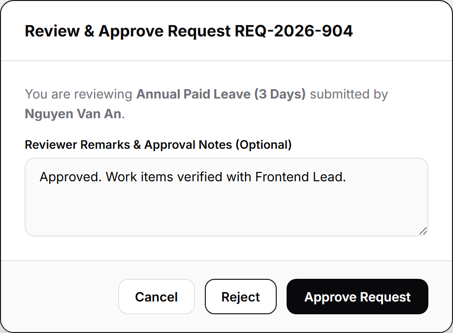

# People Management - UI/UX Specifications & Screenshot Documentation

Comprehensive documentation of user interface screens, major popup modals, and slide-over drawers for the **People Management** module in **Copilot.HR**.

---

## Summary UI/UX Asset Matrix

| Category | Description | Count | Assets List |
| :--- | :--- | :---: | :--- |
| **Main Screens** | Primary application workflow and dashboard screens | **9** | `EmployeeDirectory`, `EmployeeProfileDetail`, `OrgDepartment`, `RequestManagement`, `CreateRequest`, `TrackingRequest`, `PositionManagement`, `TeamManagement`, `ReportingLines` |
| **Major Popups & Drawers** | Modal dialogs and slide-over forms for data creation and approval | **6** | `AddEmployeeModal`, `AddDepartmentDrawer`, `AddContractModal`, `CeoApprovalModal`, `ApproveRejectModal`, `ExportEmployeeModal` |
| **TOTAL** | **Total Key UI/UX Assets Documented** | **15** | **15 Major Screens & Component Modals** |

---

## 1. Main Screens & Sub-Screens

### 1.1 Employee Directory Screen
**Trigger:** Click `People` -> `Employee Directory` in the sidebar.  
**Description:** Central workforce catalog displaying searchable employee records, KPI metrics, status filters, and quick action toolbars.

---

### 1.2 Employee Profile Detail Screen
**Trigger:** Click any employee row in the Employee Directory table.  
**Description:** Dedicated 360-degree employee profile screen featuring breadcrumbs navigation, employee header banner, and consolidated tabs for Overview & Employment, Contract & Documents, Education & Certifications, and History.

---

### 1.3 Organization & Department Screen
**Trigger:** Click `People` -> `Org & Department` in the sidebar.  
**Description:** Interactive organizational structure canvas featuring department hierarchy tree, roster table view, branch filters, and zoom controls.

---

### 1.4 Request Management Screen
**Trigger:** Click `People` -> `Request` in the sidebar.  
**Description:** Management dashboard for employee HR requests, leave approvals, status filtering, and workflow processing.

---

### 1.5 Create HR Request Screen
**Trigger:** Click `+ Create Request` button on the Request Management page.  
**Description:** Two-column interactive form for submitting annual leave, equipment, or policy requests with automatic quota validation.

---

### 1.6 Tracking Request Progress Screen
**Trigger:** Click `View Timeline` or any request item in the Request Management table.  
**Description:** Real-time request progress tracker displaying approval workflow steps, reviewer comments, and timeline status.

---

### 1.7 Position & Job Title Management Screen
**Trigger:** Click `Position Management` subnav link in Org & Department.  
**Description:** Management screen defining organizational job titles, competency levels, salary bands, and headcount quotas.

---

### 1.8 Team Management Screen
**Trigger:** Click `Team Management` subnav link in Org & Department.  
**Description:** Workspace for organizing project teams, designating team leads, and allocating member resources.

---

### 1.9 Reporting Lines & Hierarchy Matrix Screen
**Trigger:** Click `Reporting Lines` subnav link in Org & Department.  
**Description:** Organizational matrix displaying direct report managers, functional line supervisors, and reporting relationships.

---

## 2. Major PopUp Modals & Drawers

### 2.1 Add New Employee Profile Modal
**Trigger:** Click `Add Employee` button on the Employee Directory toolbar.  
**Description:** Modal popup form for registering a new employee profile with personal demographics, corporate email, role, and department assignment.

---

### 2.2 Add Department Drawer
**Trigger:** Click `Add Department` button on the Organization & Department page header.  
**Description:** Slide-over drawer for configuring new department entities, parent division alignment, location branch, and manager assignments.

---

### 2.3 Add Labor Contract Modal
**Trigger:** Click `+ Add Contract` button on the Employee Profile Contract tab.  
**Description:** Form popup for registering official labor contracts, compensation terms, effective dates, and document attachments.

---

### 2.4 Director & CEO Approval Pending Modal
**Trigger:** Drag and drop any employee or department node within the Org Tree canvas.  
**Description:** Confirmation popup indicating that an organizational restructuring or employee reassignment request has been submitted for Director/CEO approval.

---

### 2.5 Approve or Reject Decision Modal
**Trigger:** Click `Approve` or `Reject` on any pending request row.  
**Description:** Decision modal for approving or rejecting employee HR requests with mandatory reviewer comments.

---

### 2.6 Export Employee Data Modal
**Trigger:** Click `Export CSV` / `Export Data` button on the Employee Directory toolbar.  
**Description:** Configuration modal for selecting employee data columns, date ranges, and file format export options.

---

## 3. RESTful API Specifications

Comprehensive API inventory for the People Management module divided into Employee Directory, Organization & Department, and Request Management domains. Full OpenAPI 3.2.0 specifications are available in [docs/apis/openapi_people_management.yaml](file:///d:/Copilot.HR/docs/apis/openapi_people_management.yaml).

### 3.1 Employee Directory APIs

| Method | URL Endpoint | Role | Parameters / Query | Status Code | Description |
| :---: | :--- | :--- | :--- | :---: | :--- |
| `GET` | `/api/v1/employees` | `Staff, Manager, HR Staff, HR Manager, Tenant Admin, System Admin` | Query: `query`, `department`, `status`, `page`, `limit` | `200`, `401` | Retrieve a paginated list of employees with search and department/status filtering options. |
| `POST` | `/api/v1/employees` | `HR Staff, HR Manager, Tenant Admin` | Body: `fullName`, `corporateEmail`, `department`, `jobTitle`, `phoneNumber` | `201`, `400` | Register a new employee profile into the system directory. |
| `GET` | `/api/v1/employees/{id}` | `Staff, Manager, HR Staff, HR Manager, Tenant Admin` | Path: `id` | `200`, `404` | Retrieve comprehensive 360-degree employee profile details. |
| `PUT` | `/api/v1/employees/{id}` | `Staff, HR Staff, HR Manager, Tenant Admin` | Path: `id`, Body: `phoneNumber`, `personalEmail`, `residentialAddress` | `200`, `400` | Update personal demographics or work contact details for an employee. |
| `DELETE` | `/api/v1/employees/{id}` | `HR Manager, Tenant Admin` | Path: `id` | `200`, `404` | Deactivate or offboard an employee profile account. |
| `GET` | `/api/v1/employees/{id}/contracts` | `Staff, HR Staff, HR Manager, Tenant Admin` | Path: `id` | `200`, `404` | Retrieve labor contract history, base salary, and active employment contract. |
| `POST` | `/api/v1/employees/{id}/contracts` | `HR Staff, HR Manager, Tenant Admin` | Path: `id`, Body: `contractNumber`, `contractType`, `baseSalary`, `effectiveDate` | `201`, `400` | Register a new labor contract with compensation details and effective date. |
| `GET` | `/api/v1/employees/{id}/documents` | `Staff, HR Staff, HR Manager, Tenant Admin` | Path: `id` | `200`, `404` | Fetch list of uploaded verification documents (Identity Card, Medical Clearance, Tax Records). |
| `POST` | `/api/v1/employees/{id}/documents` | `Staff, HR Staff, HR Manager, Tenant Admin` | Path: `id`, FormData: `documentType`, `file` | `201`, `400` | Upload a new identity or verification document for an employee. |
| `GET` | `/api/v1/employees/{id}/leave-balance` | `Staff, Manager, HR Staff, HR Manager, Tenant Admin` | Path: `id` | `200`, `404` | Retrieve remaining annual leave and sick leave quota balances for the current year. |
| `GET` | `/api/v1/employees/{id}/history` | `Manager, HR Staff, HR Manager, Tenant Admin` | Path: `id` | `200`, `404` | Fetch audit trail history including promotions, job level updates, and contract sign-offs. |
| `POST` | `/api/v1/employees/export` | `Manager, HR Staff, HR Manager, Tenant Admin` | Body: `department`, `fileFormat` | `200`, `400` | Export filtered employee directory records to CSV or Excel file format. |

---

### 3.2 Organization & Department APIs

| Method | URL Endpoint | Role | Parameters / Query | Status Code | Description |
| :---: | :--- | :--- | :--- | :---: | :--- |
| `GET` | `/api/v1/departments` | `Staff, Manager, HR Staff, HR Manager, Tenant Admin` | Query: `branch` | `200`, `401` | Retrieve the interactive organizational tree hierarchy and department roster metrics. |
| `POST` | `/api/v1/departments` | `HR Staff, HR Manager, Tenant Admin` | Body: `departmentName`, `parentDepartmentId`, `departmentLeadId`, `locationBranch` | `201`, `400` | Register a new operational department entity into the organizational structure. |
| `GET` | `/api/v1/departments/{id}` | `Staff, Manager, HR Staff, HR Manager, Tenant Admin` | Path: `id` | `200`, `404` | Fetch comprehensive department details, department lead, headcount, and budget allocation. |
| `PUT` | `/api/v1/departments/{id}` | `HR Staff, HR Manager, Tenant Admin` | Path: `id`, Body: `departmentName`, `parentDepartmentId`, `departmentLeadId` | `200`, `400` | Modify department name, parent division, department lead, or location branch. |
| `DELETE` | `/api/v1/departments/{id}` | `HR Manager, Tenant Admin` | Path: `id` | `200`, `404` | Archive or deactivate an existing department entity. |
| `POST` | `/api/v1/departments/restructure` | `Manager, HR Manager, Tenant Admin` | Body: `sourceNodeId`, `targetDepartmentId`, `reason` | `202`, `400` | Queue an organizational restructuring or employee reassignment drag-and-drop event for Director/CEO approval. |
| `GET` | `/api/v1/positions` | `Staff, Manager, HR Staff, HR Manager, Tenant Admin` | None | `200` | Retrieve all defined organizational job titles, competency levels (L1-L6), and salary band ranges. |
| `POST` | `/api/v1/positions` | `HR Staff, HR Manager, Tenant Admin` | Body: `title`, `jobLevel`, `minSalaryUSD`, `maxSalaryUSD` | `201`, `400` | Create a new job position title with assigned salary band and job level. |
| `PUT` | `/api/v1/positions/{id}` | `HR Staff, HR Manager, Tenant Admin` | Path: `id`, Body: `title`, `jobLevel`, `minSalaryUSD`, `maxSalaryUSD` | `200`, `400` | Update job description, level, or salary band range for a position title. |
| `GET` | `/api/v1/teams` | `Staff, Manager, HR Staff, HR Manager, Tenant Admin` | None | `200` | Retrieve all active cross-functional project teams, designated team leads, and member counts. |
| `POST` | `/api/v1/teams` | `Manager, HR Staff, HR Manager, Tenant Admin` | Body: `teamName`, `teamLeadId` | `201`, `400` | Register a new cross-functional project team. |
| `POST` | `/api/v1/teams/{id}/members` | `Manager, HR Staff, HR Manager, Tenant Admin` | Path: `id`, Body: `employeeId`, `action` | `200`, `400` | Assign or remove employee member allocations within a project team. |
| `GET` | `/api/v1/reporting-lines` | `Staff, Manager, HR Staff, HR Manager, Tenant Admin` | None | `200` | Fetch supervisor relationships across direct report managers and functional matrix line managers. |
| `PUT` | `/api/v1/reporting-lines` | `HR Staff, HR Manager, Tenant Admin` | Body: `employeeId`, `newManagerId`, `reportingType` | `200`, `400` | Update direct report supervisor or functional line manager for an employee. |

---

### 3.3 Request Management APIs

| Method | URL Endpoint | Role | Parameters / Query | Status Code | Description |
| :---: | :--- | :--- | :--- | :---: | :--- |
| `GET` | `/api/v1/requests` | `Staff, Manager, HR Staff, HR Manager, Tenant Admin` | Query: `type`, `status`, `applicantId`, `page`, `limit` | `200`, `401` | Retrieve a paginated list of HR requests filtered by request type, approval status, or applicant. |
| `POST` | `/api/v1/requests` | `Staff, Manager` | Body: `requestType`, `startDate`, `endDate`, `reason`, `urgencyLevel` | `201`, `400` | Submit a new HR request (Annual Leave, Equipment, Policy) with automatic quota validation. |
| `GET` | `/api/v1/requests/{id}` | `Staff, Manager, HR Staff, HR Manager, Tenant Admin` | Path: `id` | `200`, `404` | Retrieve full request metadata, applicant details, approval steps, and attached proof files. |
| `PUT` | `/api/v1/requests/{id}` | `Staff, Manager` | Path: `id`, Body: `requestType`, `startDate`, `endDate`, `reason` | `200`, `400` | Modify an existing draft HR request prior to submission. |
| `POST` | `/api/v1/requests/{id}/approve` | `Manager, HR Manager, Tenant Admin` | Path: `id`, Body: `comment` | `200`, `400` | Approve a pending request step. Automatically advances workflow to next approver or executes final approval. |
| `POST` | `/api/v1/requests/{id}/reject` | `Manager, HR Manager, Tenant Admin` | Path: `id`, Body: `reason` | `200`, `400` | Reject a pending HR request with mandatory reviewer feedback comments. |
| `POST` | `/api/v1/requests/{id}/cancel` | `Staff, Manager` | Path: `id` | `200`, `400` | Cancel a submitted request by the applicant prior to final approval execution. |
| `GET` | `/api/v1/requests/{id}/timeline` | `Staff, Manager, HR Staff, HR Manager, Tenant Admin` | Path: `id` | `200`, `404` | Retrieve step-by-step progress tracker timeline, reviewer audit logs, and approval timestamps. |
| `GET` | `/api/v1/requests/quotas/check` | `Staff, Manager` | Query: `applicantId`, `leaveType`, `requestedDays` | `200`, `400` | Validate available annual or sick leave balance before submitting a leave request. |

