# Copilot.HR - Master System Documentation

Welcome to the master technical documentation for **Copilot.HR**. This consolidated document organizes system architecture, use case diagrams, sitemaps, UI/UX designs, database ERDs, and API route specifications across all core modules.

---

## Table of Contents
1. [I. Use Cases](#i-use-cases)
2. [II. Sitemaps](#ii-sitemaps)
3. [III. UI/UX Specifications](#iii-uiux-specifications)
4. [IV. Database Schema ERDs](#iv-database-schema-erds)
5. [V. API Specifications & Swagger Documentation](#v-api-specifications--swagger-documentation)

---

## I. Use Cases

### 1. People Management Use Case
*Illustrates primary system interactions between System Actors (Staff, HR Staff, Manager, HR Manager, Tenant Admin) and core workforce capabilities including Employee Directory, Profile Management, Org Tree structure, and Request Approval Workflows.*


---

### 2. Recruitment Management Use Case
*Defines job posting requisitions, candidate sourcing, applicant tracking (ATS), candidate screening, interview scheduling, and formal job offer approval workflows.*

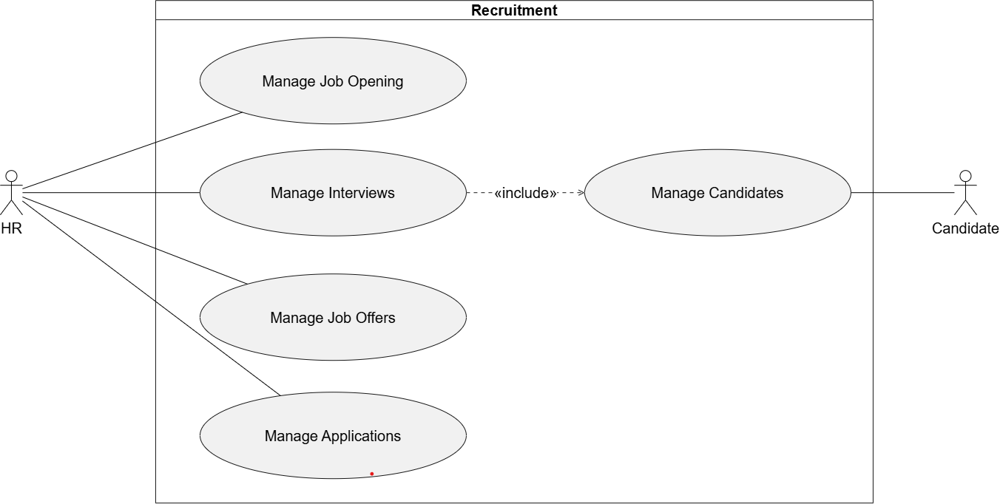

---

### 3. Onboarding Management Use Case
*Maps the digital candidate onboarding journey from offer acceptance, information submission, required document uploads, AI/OCR verification, day-one readiness tracking, to probation initiation.*


---

### 4. Payroll Management Use Case
*Details pay period processing workflows, base salary calculations, compensation allowances, statutory tax deductions, payslip generation, and automated email distribution.*

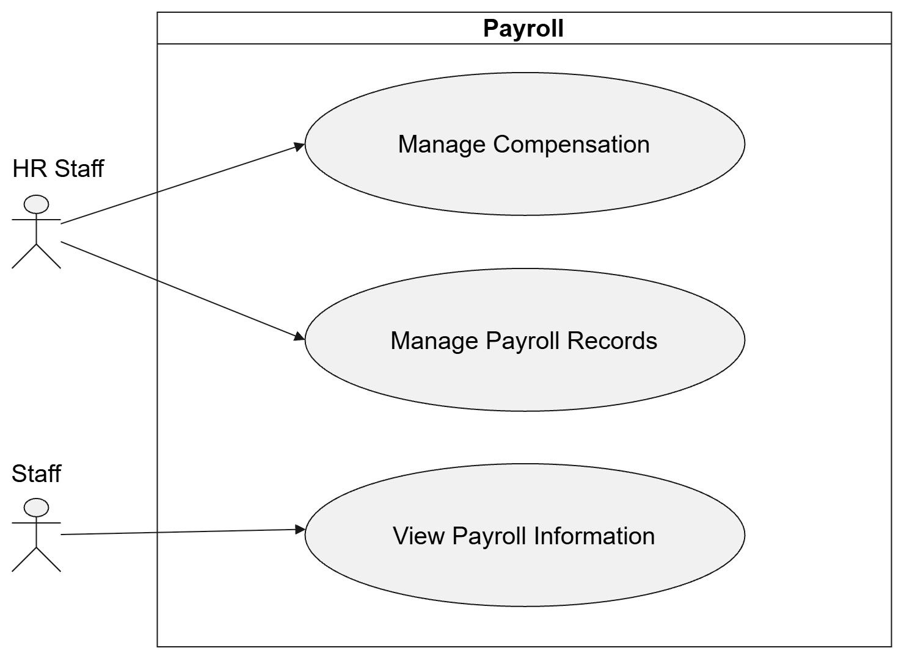

---

### 5. Workforce Management Use Cases

#### 5.1 Attendance Management Use Case
*Covers daily clock-in/out tracking, attendance exceptions, manual entry requests, and manager timekeeping correction workflows.*


#### 5.2 Leave Management Use Case
*Handles employee leave request submissions, leave balance quota tracking, policy rules, holiday calendars, and approval routing.*


#### 5.3 Timesheet & Overtime Management Use Case
*Tracks daily project effort hours, timesheet submissions, overtime request approvals, and manager review processes.*


#### 5.4 Work Schedule Management Use Case
*Defines work shift patterns, rota assignments, team scheduling, and work location/geofencing policies.*


---

### 6. Project Management Use Case
*Outlines project initiation, resource allocation, capacity planning, task time tracking, productivity monitoring, and manager timesheet approvals.*


---

### 7. Integration Management Use Case
*Illustrates third-party system connections including Google/Outlook calendars, email provider OAuth authorizations, and external HR platform sync.*

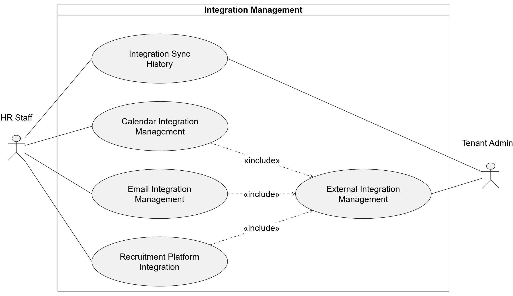

---

## II. Sitemaps

### 1. People Management Sitemap
*Information Architecture (IA) sitemap mapping site navigation for Employee Directory, 360 Profiles, Org Chart, HR Requests, Position Titles, and Team Management.*

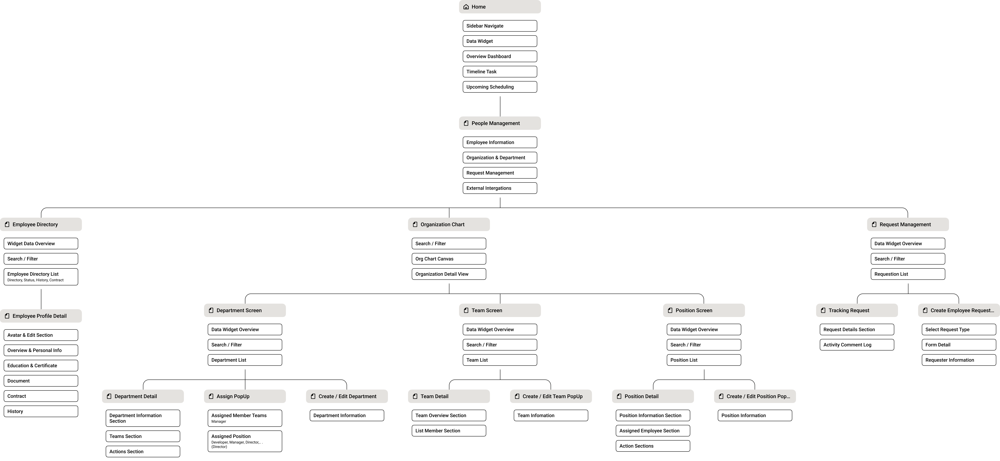

---

### 2. Recruitment Management Sitemap
*Navigation structure across Job Requisitions, Candidate Pipelines, Interview Schedules, Offer Generation, and Recruitment Templates.*


---

### 3. Onboarding Management Sitemap
*Page hierarchy covering Candidate Intake Portal, Intake Review Board, Day-One Readiness Checklist, and Probation Tracking.*

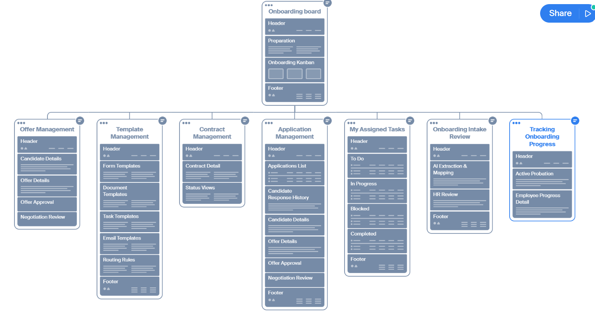

---

### 4. Payroll Management Sitemap
*Sitemap covering Payroll Cycles, Compensation Management, Payslips, and Email Logs.*

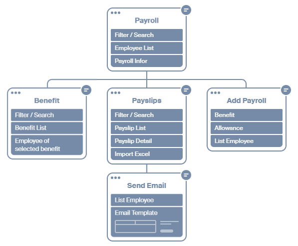

---

### 5. Workforce Management Sitemap
*Navigation structure for Attendance Dashboard, Leave Management, Timesheet Review, Work Schedules, and Corrections.*


---

### 6. Project Management Sitemaps

#### 6.1 Staff View Sitemap
*Navigation hierarchy for staff members accessing My Projects, My Capacity, My Productivity, and Time Tracking.*

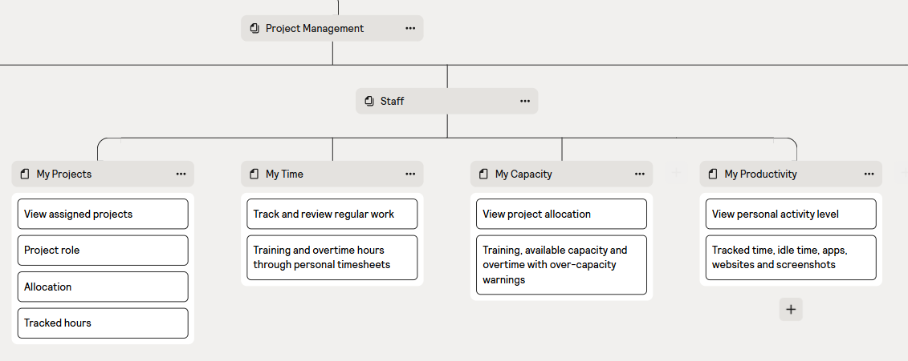

#### 6.2 Manager View Sitemap
*Management dashboard navigation for Project Creation, Resource Allocation, Project Budgets, and Timesheet Reviews.*

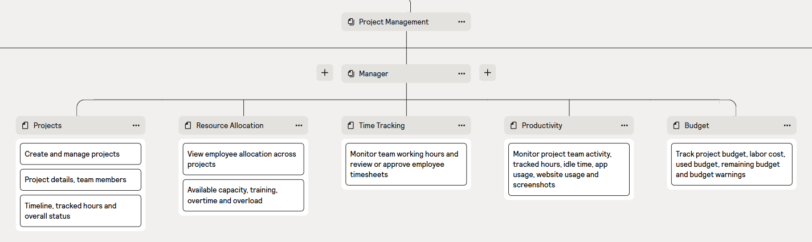

#### 6.3 HR View Sitemap
*HR navigation structure for Capacity Overviews, Resource Utilization, and Overtime & Training tracking.*

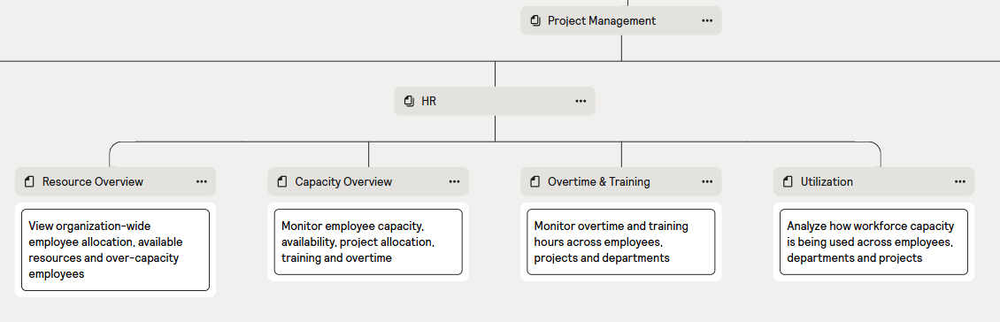

---

### 7. Integration Management Sitemap
*Navigation flow for Provider Connections, Calendar Sync Settings, and Email Logs.*

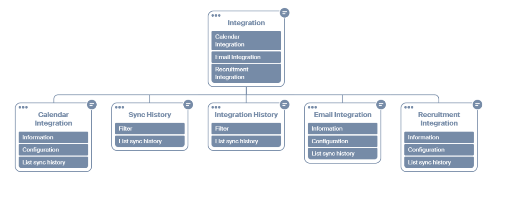

---

## III. UI/UX Specifications

### 1. People Management UI/UX

#### 1.1 Employee Directory Screen
*Central workforce catalog displaying searchable employee records, KPI metrics, status filters, and quick action toolbars.*


#### 1.2 Employee Profile Detail Screen
*360-degree employee profile view featuring breadcrumbs navigation, header banner, and consolidated tabs for Overview, Contract & Documents, Education, and History.*


#### 1.3 Organization & Department Screen
*Interactive organizational structure canvas featuring department hierarchy tree, roster headcount metrics, location branch filters, and zoom controls.*


#### 1.4 Request Management Screen
*Management dashboard for employee HR requests, leave approvals, status filtering, and workflow processing.*


#### 1.5 Create HR Request Screen
*Two-column interactive form for submitting annual leave, equipment, or policy requests with automatic quota balance validation.*


#### 1.6 Tracking Request Progress Screen
*Real-time request progress tracker displaying step-by-step approval workflow stages, reviewer audit logs, and timeline timestamps.*


#### 1.7 Position & Job Title Management Screen
*Management screen defining organizational job titles, competency levels (L1-L6), salary band ranges, and headcount quotas.*


#### 1.8 Team Management Screen
*Workspace for organizing cross-functional project teams, designating team leads, and allocating member capacity.*


#### 1.9 Reporting Lines & Hierarchy Matrix Screen
*Organizational matrix displaying direct report supervisors, functional line managers, and reporting relationships.*


#### 1.10 Add New Employee Profile Modal
*Modal popup form for registering a new employee profile with personal demographics, corporate email, role assignment, and department placement.*


#### 1.11 Add Department Drawer
*Slide-over drawer for configuring new department entities, parent division alignment, location branch, and manager assignments.*


#### 1.12 Add Labor Contract Modal
*Form popup for registering official labor contracts, compensation terms, effective start/end dates, and document attachments.*


#### 1.13 Director & CEO Approval Pending Modal
*Confirmation popup indicating organizational restructuring or employee reassignment request submitted for Director/CEO approval.*

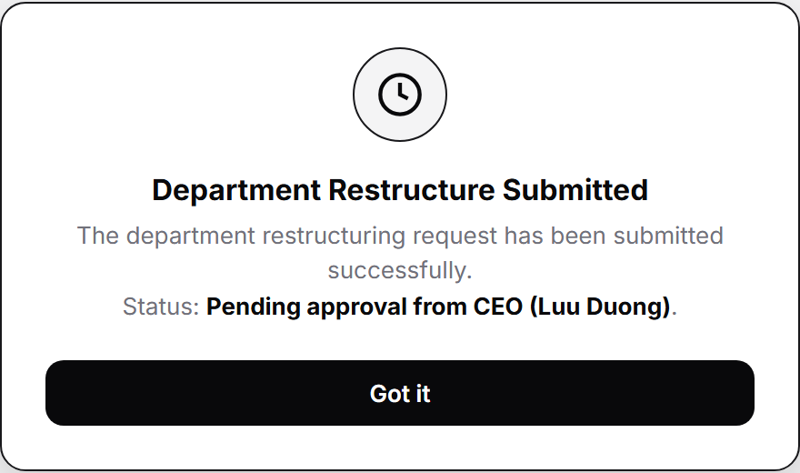

#### 1.14 Approve or Reject Decision Modal
*Decision modal for approving or rejecting employee HR requests with mandatory reviewer feedback comments.*


#### 1.15 Export Employee Data Modal
*Configuration modal for selecting employee data columns, date ranges, and file export format.*

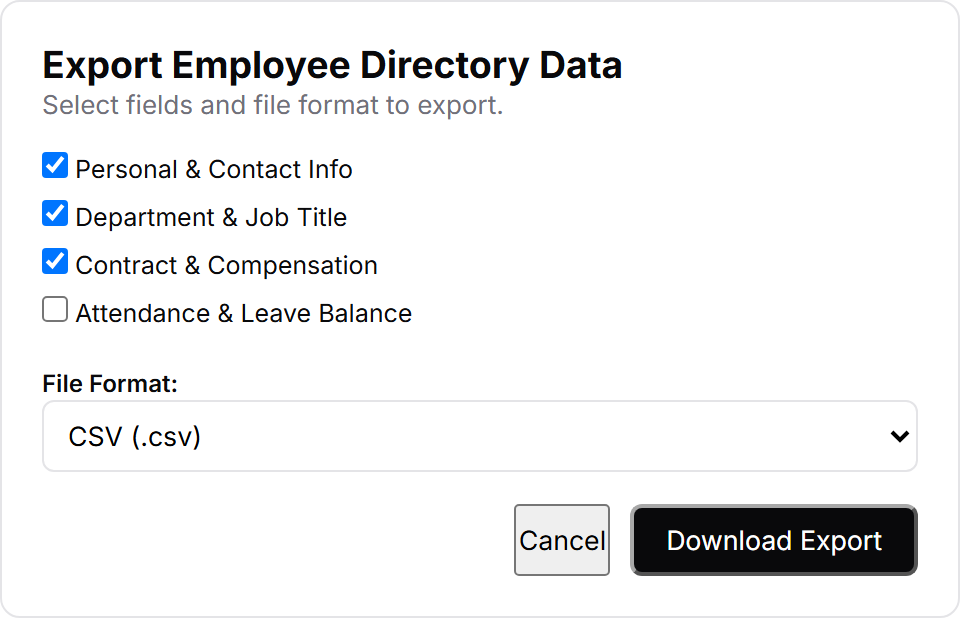

---

### 2. Recruitment Management UI/UX

#### 2.1 Recruitment Management Dashboard
*Master recruitment overview dashboard displaying active requisitions, open headcount, candidate pipeline funnels, and time-to-hire metrics.*


#### 2.2 Requirement Management Screen
*Hiring requisition screen for submitting, reviewing, and approving department staffing requirements.*


#### 2.3 Job Management Screen
*Interface for creating, editing, publishing, and archiving job vacancy postings across careers portals.*


#### 2.4 Application Management Screen
*Applicant Tracking System (ATS) Kanban board for tracking candidate application stages from screening to offer.*


#### 2.5 Interview Management Screen
*Interview panel configuration interface for assigning interviewers, candidate evaluation scorecards, and feedback rubrics.*


#### 2.6 Schedule Management Screen
*Recruitment calendar for managing candidate interview time slots and interviewer availability.*


#### 2.7 Offer Management Screen
*Offer generation portal for crafting candidate offer letters, setting compensation packages, and tracking candidate responses.*


#### 2.8 Template Management Screen
*Template repository for recruitment notification emails, job offer templates, and interview scorecards.*


---

### 3. Onboarding Management UI/UX

#### 3.1 Application Management Screen
*Pre-onboarding candidate application selection and transition into the onboarding pipeline.*


#### 3.2 Offer Management Screen
*Dashboard for tracking dispatched candidate job offers and monitoring candidate accept/decline responses.*


#### 3.3 Offer Template Screen
*Configuration editor for defining reusable candidate offer document templates.*


#### 3.4 Contract Management Screen
*Interface for generating probation contracts, sending e-signature requests, and managing signed agreements.*


#### 3.5 Intake Review Screen
*HR review portal for auditing candidate document uploads, verifying personal details, and inspecting OCR auto-extracted fields.*


#### 3.6 Onboarding Board Screen
*Kanban board for tracking new hires across Pre-Boarding, Day One, and Probation stages.*


#### 3.7 Assigned Task Screen
*Worklist screen for department staff (IT, Payroll, HR, Manager) to process assigned onboarding tasks.*


#### 3.8 Tracking Onboard Progress Screen
*Overview screen for monitoring employee probation milestones, candidate self-reviews, and performance evaluation schedules.*


---

### 4. Payroll Management UI/UX

#### 4.1 Payroll Management Dashboard
*Master payroll processing dashboard displaying pay period runs, gross salary totals, tax deductions, and net pay summaries.*

.png)

#### 4.2 Add Payroll Form
*Step-by-step form for defining pay periods, importing attendance time entries, and applying salary adjustments.*


#### 4.3 Payslips Overview Screen
*Management table listing all generated employee payslips with issue dates, status badges, and export controls.*


#### 4.4 Individual Payslip View
*Detailed payslip view itemizing base salary, allowances, statutory deductions, tax withholdings, and net payout.*


#### 4.5 Compensation & Benefits Screen
*Configuration catalog for defining recurring allowances, benefit categories, bonus structures, and deduction rules.*

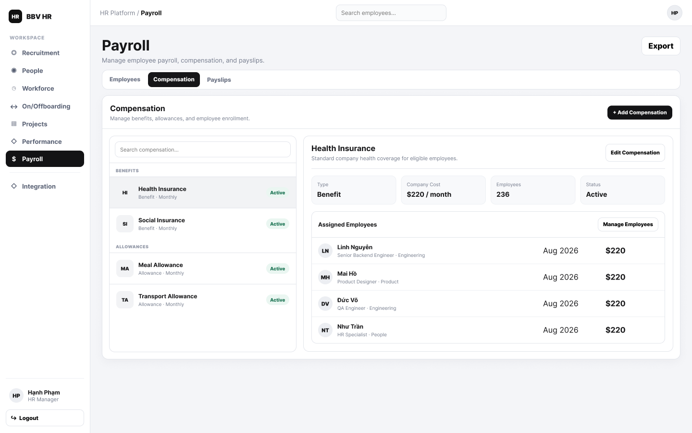

#### 4.6 Send Email Dispatch Screen
*Batch interface for emailing digital payslip PDFs directly to employee email addresses.*


---

### 5. Workforce Management UI/UX

#### 5.1 Attendance Dashboard
*Real-time attendance monitor displaying daily clock-ins, late arrivals, absences, and active employee status.*


#### 5.2 Attendance Corrections Manager View
*Manager approval portal for reviewing, approving, or rejecting employee attendance adjustment requests.*


#### 5.3 My Attendance Working State Screen
*Employee self-service screen for recording clock-in/out times, viewing work duration, and checking shift schedules.*


#### 5.4 Leave Management Dashboard
*Employee leave portal for submitting leave applications, checking annual leave quota balances, and viewing leave history.*


#### 5.5 Timesheet Review Detail Screen
*Manager timesheet inspection screen for auditing daily logged working hours, project effort breakdown, and overtime.*


---

### 6. Project Management UI/UX

#### Staff Views

##### 6.1 Staff My Capacity Screen
*Personal capacity dashboard displaying allocated working hours, assigned project workload, and availability.*


##### 6.2 Staff My Productivity Screen
*Individual productivity tracking screen displaying task completion rates, logged billable hours, and focus time analytics.*


##### 6.3 Staff My Project Screen
*Personal project list displaying active project assignments, assigned roles, and milestone deadlines.*


##### 6.4 Staff My Time Tracking Screen
*Time entry log screen for recording daily hours spent across project tasks.*


##### 6.5 Staff Project Detail Screen
*Detailed project hub displaying project description, task board, team members, and timeline.*


#### HR Views

##### 6.6 HR Capacity Overview Screen
*Company-wide capacity dashboard for monitoring resource allocation across all departments and projects.*


##### 6.7 HR Overtime & Training Screen
*Tracking dashboard for employee overtime hours, training allocations, and skill development programs.*


##### 6.8 HR Resource Overview Screen
*Resource management dashboard displaying staff availability, active project allocations, and bench capacity.*


##### 6.9 HR Utilization Screen
*Resource utilization metrics screen analyzing planned vs actual resource utilization rates.*

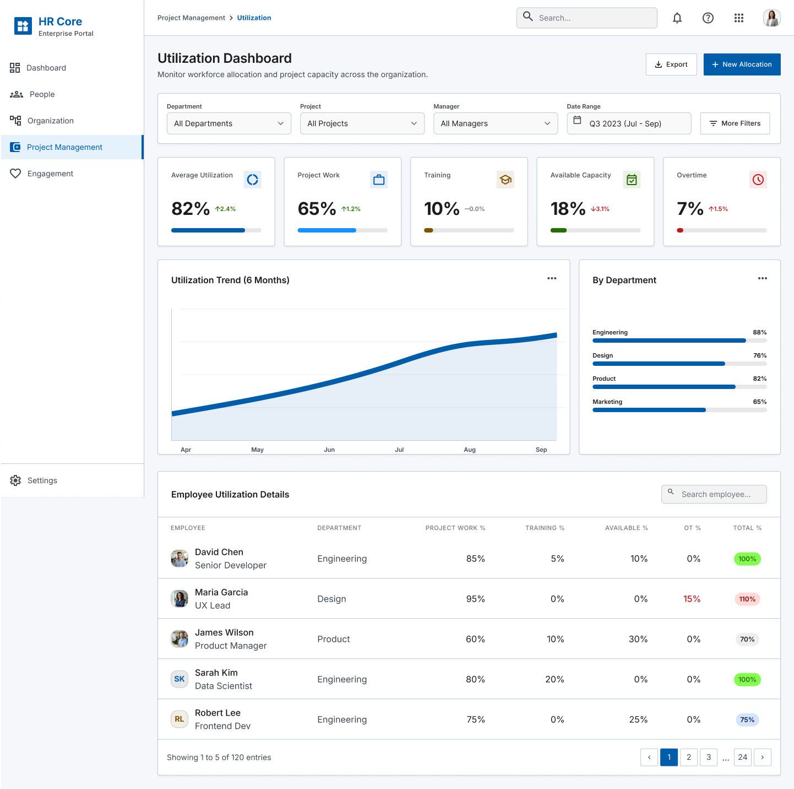

#### Manager Views

##### 6.10 PM Add Project Member Drawer
*Slide-over drawer for searching employees, adding members to a project, and setting project roles.*


##### 6.11 PM Create Project Form
*Form for creating a new project entity, setting project code, start/end dates, budget, and project manager.*


##### 6.12 PM Employee Productivity Detail Screen
*Detailed view analyzing individual employee productivity metrics and project contribution breakdown.*


##### 6.13 PM Project Budget Screen
*Financial dashboard tracking project budget allocation, actual expenditure, burn rate, and financial forecast.*


##### 6.14 PM Project Capacity View Screen
*Capacity planning canvas showing project member resource allocations across project timelines.*


##### 6.15 PM Project Detail View Screen
*Manager control center for managing project milestones, team members, tasks, and budget status.*


##### 6.16 PM Projects Dashboard Screen
*Master portfolio dashboard displaying all company projects with health indicators and progress bars.*


##### 6.17 PM Project Members List Screen
*Project roster table showing assigned team members, assigned project roles, and allocated capacity %.*


##### 6.18 PM Resource Allocation Screen
*Resource grid interface for allocating engineering and design resources across active projects.*


##### 6.19 PM Team Productivity Screen
*Team productivity analytics comparing planned vs actual effort hours and delivery velocity.*


##### 6.20 PM Time Tracking Screen
*Manager time auditing screen for reviewing detailed time entries logged by project team members.*


##### 6.21 PM Timesheet Review Screen
*Timesheet approval dashboard for reviewing and approving weekly team timesheets.*


---

### 7. Integration Management UI/UX

#### 7.1 Integration Overview Screen
*Central catalog displaying available third-party integrations (Google Workspace, Microsoft 365, LinkedIn).*

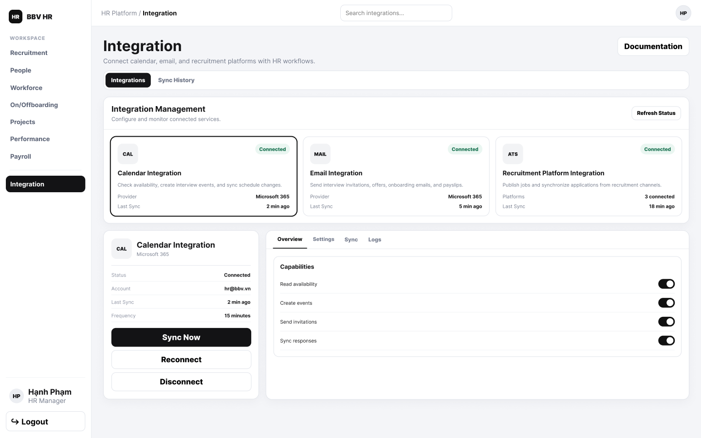

#### 7.2 Calendar Integration Screen
*Configuration screen for authorizing Google Calendar / Outlook Calendar event synchronization.*


#### 7.3 Email Integration Screen
*Setup page for connecting corporate Gmail or Outlook email accounts for automated communications.*


---

## IV. Database Schema ERDs

### 1. People Management ERD

#### 1.1 Organization Domain ERD
*Entity relationship model covering Company Branches, Departments, Teams, Positions, and Reporting Lines.*

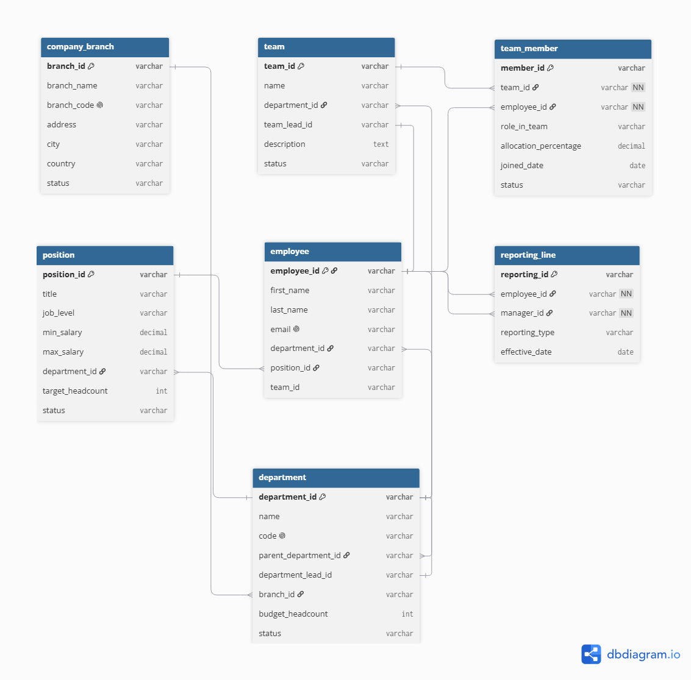

#### 1.2 Employee Directory Domain ERD
*Database structure covering Employee Accounts, Profiles, Labor Contracts, Verification Documents, Assets, and Leave Quotas.*


#### 1.3 Request Management Domain ERD
*Workflow database model covering HR Requests, Request Types, Workflow Steps, Multi-Level Approval Logs, and Attachments.*


---

### 2. Recruitment Management ERD

#### 2.1 Recruitment Database Overview ERD
*Master entity relationship model for the recruitment module.*


#### 2.2 Organization & Recruitment Requirement ERD
*Database schema linking department hiring requirements to organization structures.*


#### 2.3 Job & Application ERD
*Database relationship model connecting Job Vacancies, Candidate Profiles, and Application stages.*


#### 2.4 Interview Schedule & Evaluation ERD
*Database schema for Interview Schedules, Interview Panel Members, and Candidate Scorecard Evaluations.*


#### 2.5 Offer & Recruitment Template ERD
*Database relationship model for Job Offers, Offer Responses, and Notification Templates.*


---

### 3. Onboarding Management ERD

#### 3.1 Application Management ERD
*ERD model covering Candidate Applications and initial onboarding stage transitions.*


#### 3.2 Offer Management ERD
*ERD model for Job Offers, Offer Templates, Email Templates, and Candidate Responses.*


#### 3.3 Contract Management ERD
*ERD schema for Probation Contracts, Contract Templates, and Signing Records.*


#### 3.4 Intake Review ERD
*Database relationship model for Onboarding Submissions, Uploaded Documents, Field Mappings, and Generated PDF Outputs.*

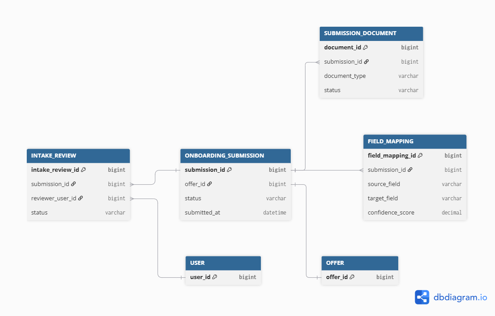

#### 3.5 Onboarding Board ERD
*ERD model for Onboarding Cases, Kanban Stages, Day-One Readiness Items, and Blockers.*


#### 3.6 Assigned Task ERD
*Database schema for Onboarding Task Templates, Assigned Tasks, Task Assignments, and Task Comments.*

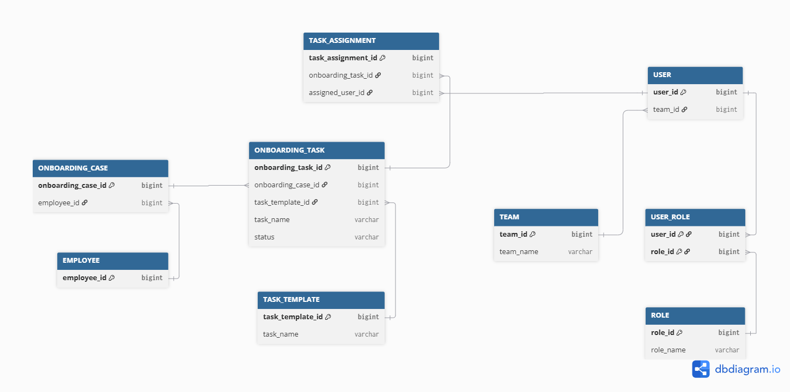

#### 3.7 Tracking Onboard Progress ERD
*ERD model covering Probation Tracking, Candidate Self-Reviews, and Performance Evaluation Rounds.*

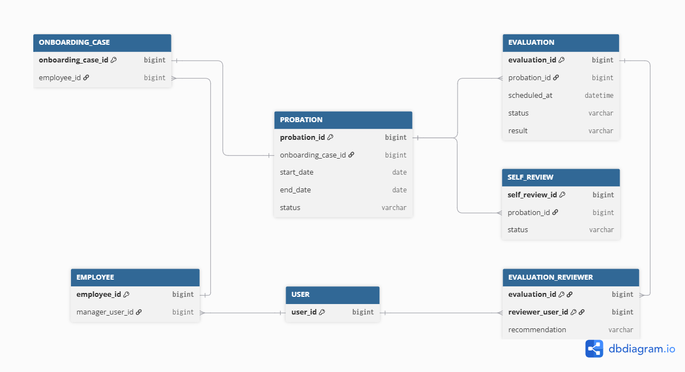

---

### 4. Payroll Management ERD

#### 4.1 Full Payroll Schema ERD
*Master entity relationship model for Payroll Runs, Base Salary, Compensation Allowances, Payroll Items, Payslips, and Email Logs.*

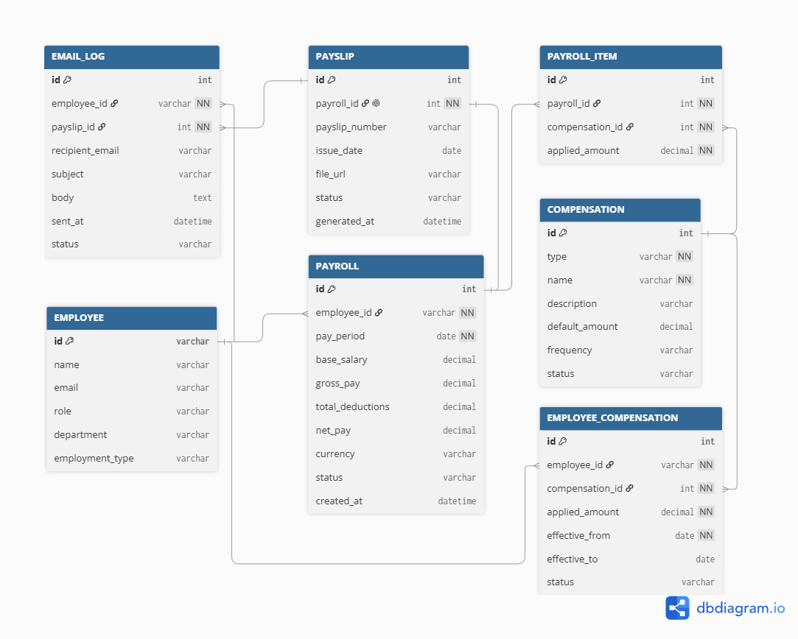

---

### 5. Workforce Management ERD

#### 5.1 Attendance Corrections ERD
*ERD model covering Attendance Correction Requests, Review Logs, and Decision History.*


#### 5.2 Attendance Record ERD
*Database schema for Daily Attendance Logs, Clock-in/out Timestamps, and Work Hours.*


#### 5.3 My Attendance ERD
*Database entity schema for Employee Working States, Shifts, and Break Logs.*


#### 5.4 Leave Management ERD
*ERD model for Employee Leave Requests, Leave Types, Leave Balances, and Approval Actions.*


#### 5.5 Time Sheet Review ERD
*Database schema for Timesheets, Timesheet Entries, Overtime Records, and Manager Reviews.*


---

### 6. Project Management ERD

#### 6.1 Project Management Master ERD Overview
*Master database schema for the Project Management module.*

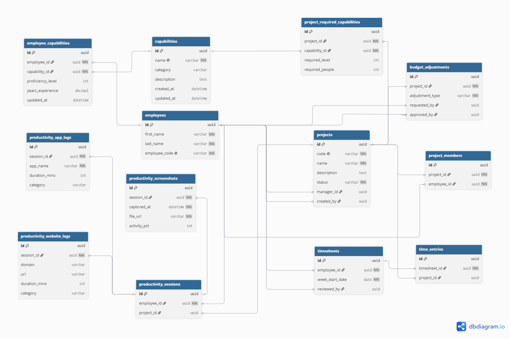

#### 6.2 Project Setup & Management ERD
*Database schema covering Projects, Project Members, Project Roles, and Time Entries.*


#### 6.3 Capability & Budget Management ERD
*ERD model for Resource Capacity Planning, Skill Capabilities, and Project Budgets.*


#### 6.4 Productivity Monitoring ERD
*Database relationship model for Task Completion Metrics, Productivity Logs, and Billable Effort Tracking.*


---

### 7. Integration Management ERD

#### 7.1 Integration Management Schema ERD
*Database schema covering Connected Integration Providers, Calendar Connections, Sync Events, and Email Sync Logs.*

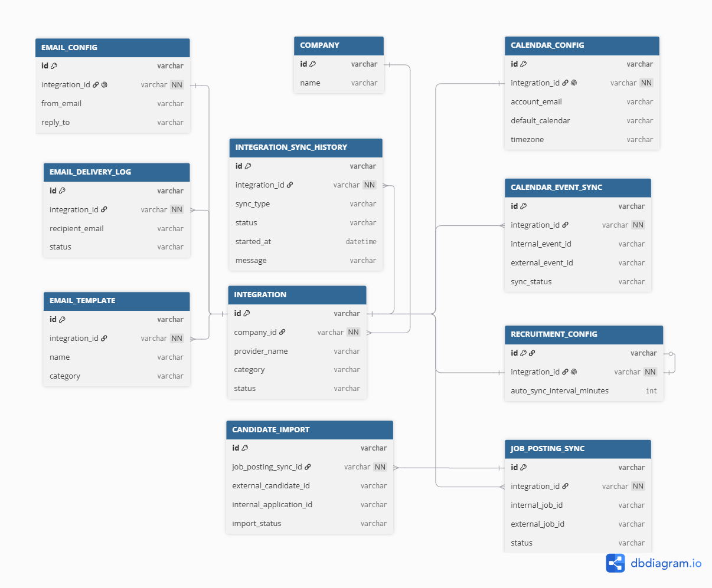

---

## V. API Specifications & Swagger Documentation

### 1. People Management API

#### 1.1 API Route Tree
```text
Copilot.HR - People Management API
│
├── Employees & Profiles
│   ├── GET     /employees
│   ├── POST    /employees
│   ├── POST    /employees/export
│   ├── GET     /employees/{id}
│   ├── PUT     /employees/{id}
│   ├── DELETE  /employees/{id}
│   ├── GET     /employees/{id}/contracts
│   ├── POST    /employees/{id}/contracts
│   ├── GET     /employees/{id}/documents
│   ├── POST    /employees/{id}/documents
│   └── GET     /employees/{id}/history
│
├── Leave Categories & Balances
│   ├── GET     /leave-types
│   ├── POST    /leave-types
│   ├── GET     /employees/{id}/leave-balance
│   └── GET     /requests/quotas/check
│
├── HR Request Management & Workflows
│   ├── GET     /requests
│   ├── POST    /requests
│   ├── GET     /requests/{id}
│   ├── PUT     /requests/{id}
│   ├── POST    /requests/{id}/approve
│   ├── POST    /requests/{id}/reject
│   ├── POST    /requests/{id}/cancel
│   └── GET     /requests/{id}/timeline
│
└── Organization & Hierarchy Matrix
    ├── GET     /departments
    ├── POST    /departments
    ├── GET     /departments/{id}
    ├── PUT     /departments/{id}
    ├── DELETE  /departments/{id}
    ├── POST    /departments/restructure
    ├── GET     /positions
    ├── POST    /positions
    ├── PUT     /positions/{id}
    ├── GET     /teams
    ├── POST    /teams
    ├── POST    /teams/{id}/members
    ├── GET     /reporting-lines
    └── PUT     /reporting-lines
```

#### 1.2 Swagger UI Screenshots
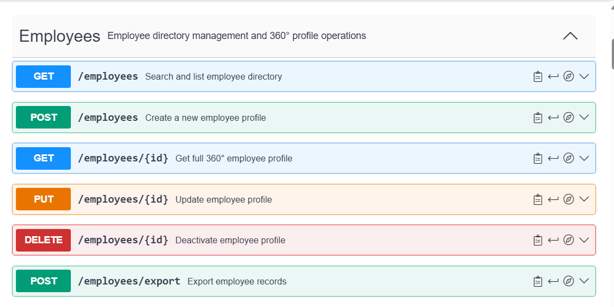


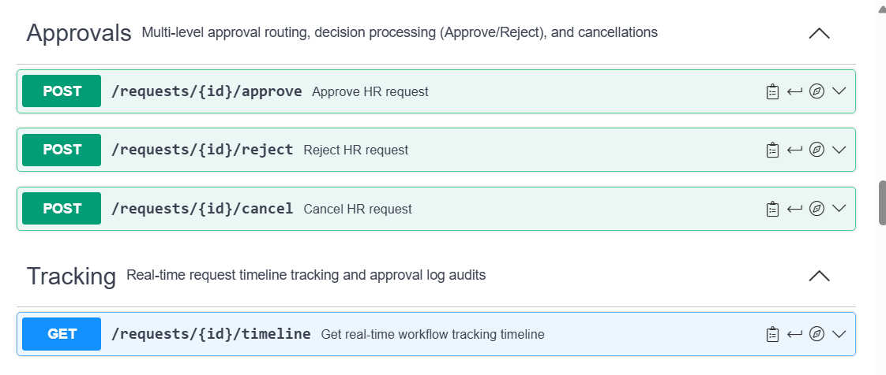
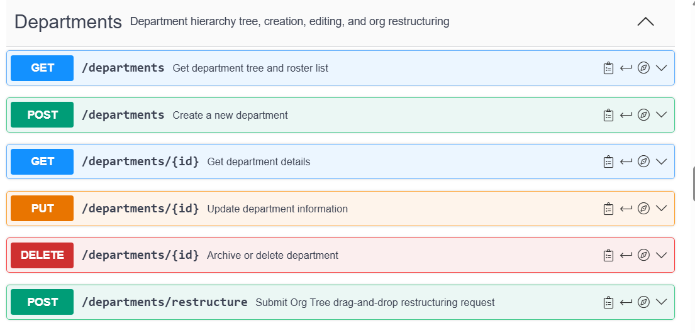


---

### 2. Recruitment Management API

#### 2.1 API Route Tree
```text
BBV HR - Recruitment API
│
├── Requirements
│   ├── GET     /requirements
│   ├── POST    /requirements
│   ├── GET     /requirements/{requirementId}
│   ├── PATCH   /requirements/{requirementId}
│   └── DELETE  /requirements/{requirementId}
│
├── Jobs
│   ├── GET     /jobs
│   ├── POST    /jobs
│   ├── GET     /jobs/{jobId}
│   ├── PATCH   /jobs/{jobId}
│   ├── DELETE  /jobs/{jobId}
│   └── POST    /jobs/{jobId}/publish
│
├── Applications
│   ├── GET     /applications
│   ├── POST    /applications
│   ├── GET     /applications/{applicationId}
│   ├── PATCH   /applications/{applicationId}
│   ├── PATCH   /applications/{applicationId}/stage
│   └── POST    /applications/{applicationId}/reject
│
├── Schedules
│   ├── GET     /schedules
│   ├── POST    /schedules
│   ├── GET     /schedules/{scheduleId}
│   ├── PATCH   /schedules/{scheduleId}
│   └── POST    /schedules/{scheduleId}/cancel
│
├── Interviews
│   ├── GET     /interviews
│   ├── GET     /interviews/{interviewId}
│   ├── PATCH   /interviews/{interviewId}
│   ├── POST    /interviews/{interviewId}/evaluations
│   └── POST    /interviews/{interviewId}/decision
│
├── Offers
│   ├── GET     /offers
│   ├── POST    /offers
│   ├── GET     /offers/{offerId}
│   ├── PATCH   /offers/{offerId}
│   └── POST    /offers/{offerId}/send
│
└── Templates
    ├── GET     /templates
    ├── POST    /templates
    ├── GET     /templates/{templateId}
    ├── PATCH   /templates/{templateId}
    └── DELETE  /templates/{templateId}
```

#### 2.2 Swagger UI Screenshots


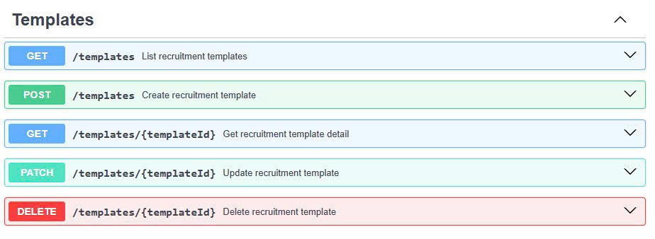

---

### 3. Onboarding Management API

#### 3.1 API Route Trees
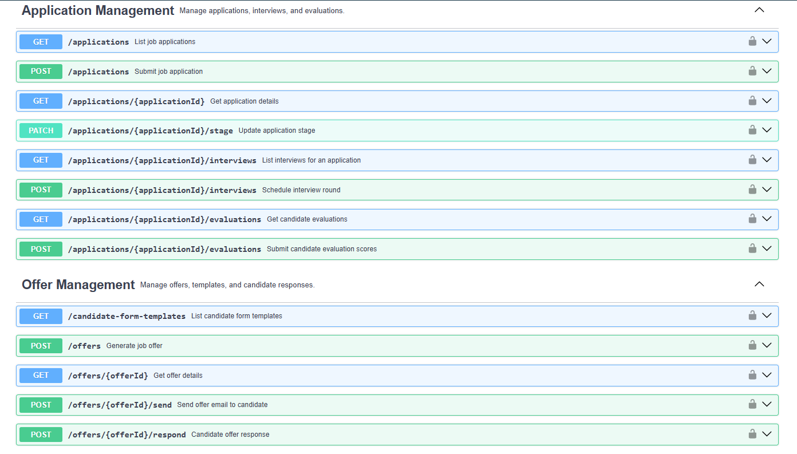
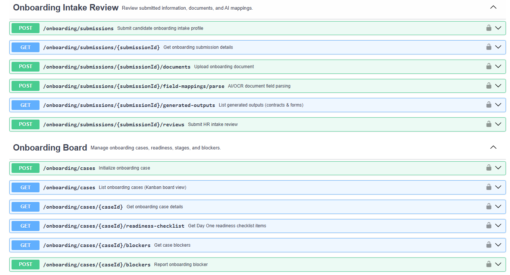
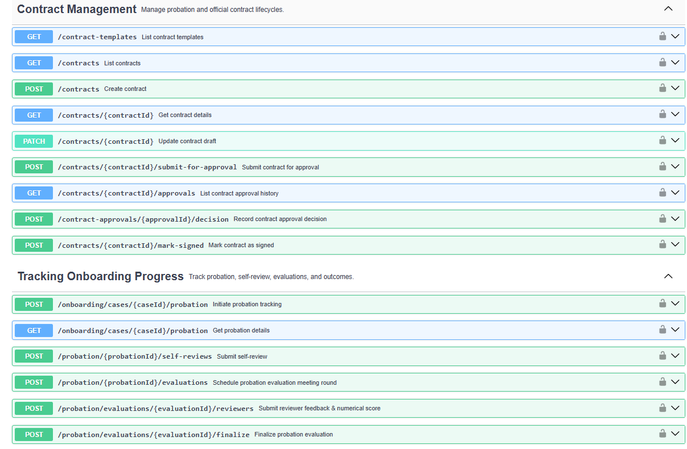

```text
Copilot HR - Employee Onboarding API
│
├── Application Management
│   ├── GET    /applications
│   ├── POST   /applications
│   ├── GET    /applications/{applicationId}
│   ├── PATCH  /applications/{applicationId}/stage
│   ├── GET    /applications/{applicationId}/interviews
│   ├── POST   /applications/{applicationId}/interviews
│   ├── GET    /applications/{applicationId}/evaluations
│   └── POST   /applications/{applicationId}/evaluations
│
├── Offer Management
│   ├── GET    /candidate-form-templates
│   ├── POST   /offers
│   ├── GET    /offers/{offerId}
│   ├── POST   /offers/{offerId}/send
│   └── POST   /offers/{offerId}/respond
│
├── Onboarding Intake Review
│   ├── POST   /onboarding/submissions
│   ├── GET    /onboarding/submissions/{submissionId}
│   ├── POST   /onboarding/submissions/{submissionId}/documents
│   ├── POST   /onboarding/submissions/{submissionId}/field-mappings/parse
│   ├── GET    /onboarding/submissions/{submissionId}/generated-outputs
│   └── POST   /onboarding/submissions/{submissionId}/reviews
│
├── Onboarding Board
│   ├── POST   /onboarding/cases
│   ├── GET    /onboarding/cases
│   ├── GET    /onboarding/cases/{caseId}
│   ├── GET    /onboarding/cases/{caseId}/readiness-checklist
│   ├── GET    /onboarding/cases/{caseId}/blockers
│   └── POST   /onboarding/cases/{caseId}/blockers
│
├── My Assigned Tasks
│   ├── GET    /onboarding/cases/{caseId}/tasks
│   ├── POST   /onboarding/cases/{caseId}/tasks
│   ├── POST   /onboarding/tasks/{taskId}/assignments
│   ├── GET    /onboarding/tasks/{taskId}/comments
│   └── POST   /onboarding/tasks/{taskId}/comments
│
├── Contract Management
│   ├── GET    /contract-templates
│   ├── GET    /contracts
│   ├── POST   /contracts
│   ├── GET    /contracts/{contractId}
│   ├── PATCH  /contracts/{contractId}
│   ├── POST   /contracts/{contractId}/submit-for-approval
│   ├── GET    /contracts/{contractId}/approvals
│   ├── POST   /contract-approvals/{approvalId}/decision
│   └── POST   /contracts/{contractId}/mark-signed
│
└── Tracking Onboarding Progress
    ├── POST   /onboarding/cases/{caseId}/probation
    ├── GET    /onboarding/cases/{caseId}/probation
    ├── POST   /probation/{probationId}/self-reviews
    ├── POST   /probation/{probationId}/evaluations
    ├── POST   /probation/evaluations/{evaluationId}/reviewers
    └── POST   /probation/evaluations/{evaluationId}/finalize
```

---

### 4. Payroll Management API

#### 4.1 API Route Tree
```text
BBV HR - Payroll Management API
│
├── Payrolls
│   ├── GET     /payrolls
│   ├── POST    /payrolls
│   ├── POST    /payrolls/import
│   ├── GET     /payrolls/{payrollId}
│   ├── PUT     /payrolls/{payrollId}
│   └── DELETE  /payrolls/{payrollId}
│
├── Payroll Items
│   ├── GET     /payrolls/{payrollId}/items
│   ├── POST    /payrolls/{payrollId}/items
│   ├── PUT     /payrolls/{payrollId}/items/{itemId}
│   └── DELETE  /payrolls/{payrollId}/items/{itemId}
│
├── Compensations
│   ├── GET     /compensations
│   ├── POST    /compensations
│   ├── GET     /compensations/{compensationId}
│   ├── PUT     /compensations/{compensationId}
│   └── DELETE  /compensations/{compensationId}
│
├── Employee Compensations
│   ├── GET     /employee-compensations
│   ├── POST    /employee-compensations
│   ├── GET     /employee-compensations/{employeeCompensationId}
│   ├── PUT     /employee-compensations/{employeeCompensationId}
│   └── DELETE  /employee-compensations/{employeeCompensationId}
│
├── Payslips
│   ├── GET     /payslips
│   ├── POST    /payrolls/{payrollId}/payslip
│   └── GET     /payslips/{payslipId}
│
└── Payslip Email
    ├── POST    /payslips/{payslipId}/send-email
    └── GET     /email-logs
```

#### 4.2 Swagger UI Screenshots
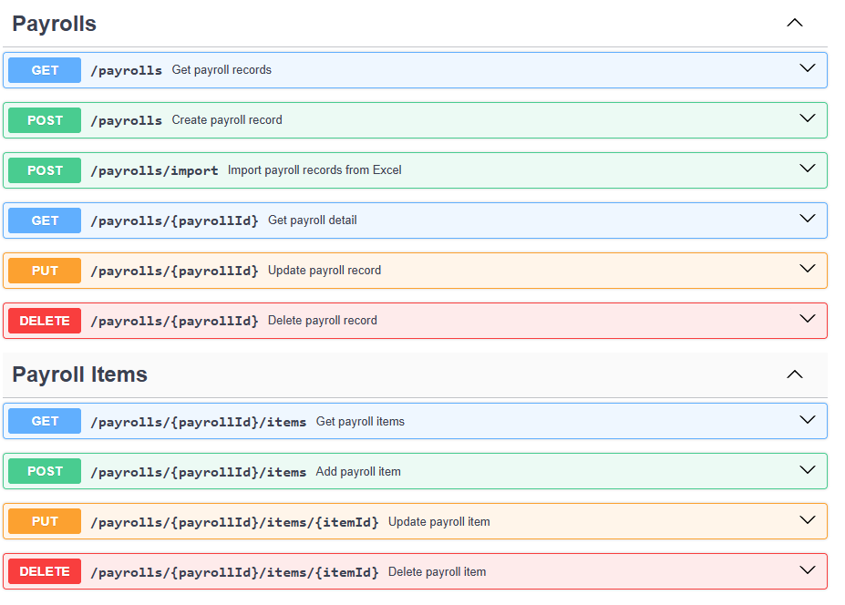
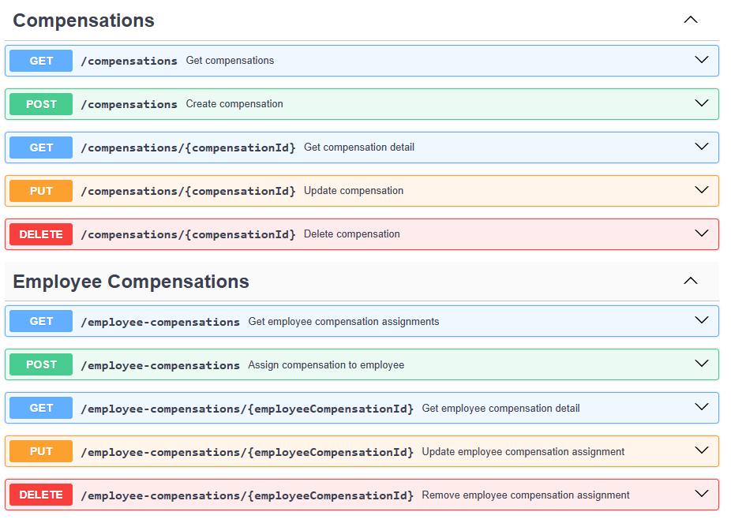
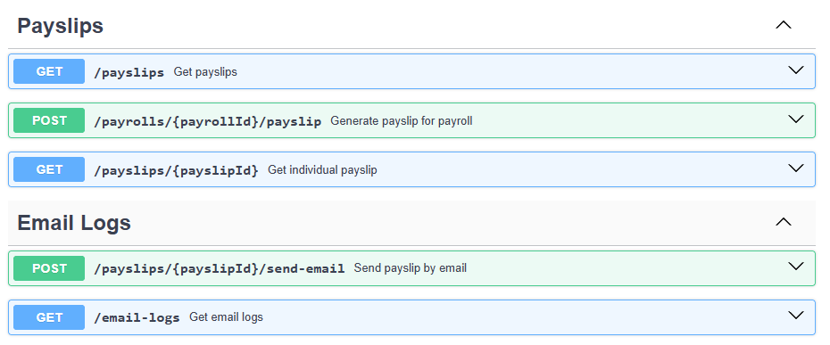

---

### 5. Workforce Management API

#### 5.1 API Route Tree
```text
Workforce
└── Attendance Management
    ├── Attendance Dashboard
    │   ├── Dashboard Summary
    │   │   └── GET    /attendance/dashboard/summary
    │   ├── Recent Clock-ins
    │   │   └── GET    /attendance/dashboard/recent-clock-ins
    │   └── Export
    │       └── GET    /attendance/dashboard/export
    ├── Attendance Records & Exceptions
    │   ├── Attendance Records
    │   │   ├── GET    /attendance-records
    │   │   ├── POST   /attendance-records
    │   │   ├── GET    /attendance-records/summary
    │   │   ├── GET    /attendance-records/export
    │   │   ├── GET    /attendance-records/{recordId}
    │   │   ├── PATCH  /attendance-records/{recordId}
    │   │   └── GET    /attendance-records/{recordId}/breaks
    │   └── Attendance Exceptions
    │       ├── GET    /attendance-exceptions
    │       └── GET    /attendance-exceptions/summary
    └── Attendance Corrections
        ├── Correction Requests
        │   ├── GET    /attendance-corrections
        │   ├── POST   /attendance-corrections
        │   ├── GET    /attendance-corrections/summary
        │   ├── GET    /attendance-corrections/export
        │   ├── GET    /attendance-corrections/{correctionId}
        │   └── PATCH  /attendance-corrections/{correctionId}
        └── Correction Review
            ├── GET    /attendance-corrections/{correctionId}/review
            ├── POST   /attendance-corrections/{correctionId}/approve
            ├── POST   /attendance-corrections/{correctionId}/reject
            └── GET    /attendance-corrections/{correctionId}/review/history
```

---

### 6. Project Management API

#### 6.1 API Route Tree
```text
BBV HR - Project Management API
│
├── Core Projects
│   ├── GET     /projects
│   ├── POST    /projects
│   ├── GET     /projects/{projectId}
│   ├── PATCH   /projects/{projectId}
│   └── DELETE  /projects/{projectId}
│
├── Project Members
│   ├── GET     /projects/{projectId}/members
│   ├── POST    /projects/{projectId}/members
│   └── DELETE  /projects/{projectId}/members/{memberId}
│
└── Time Tracking & Allocation
    ├── GET     /projects/{projectId}/time-entries
    └── POST    /projects/{projectId}/time-entries
```

---

### 7. Integration Management API

#### 7.1 API Route Tree
```text
BBV HR - Integration Management API
│
├── Connected Providers
│   ├── GET     /integrations
│   └── POST    /integrations/connect
│
├── Calendar & Event Sync
│   ├── GET     /calendar-connections
│   └── POST    /calendar-connections/sync
│
└── Email Sync & Logs
    ├── GET     /email-connections
    └── GET     /email-sync-logs
```
