# Integration Management

## Use Case


## Sitemap


## System ERD


## UI/UX Designs and Entity Relationship Diagrams

### Integration Overview


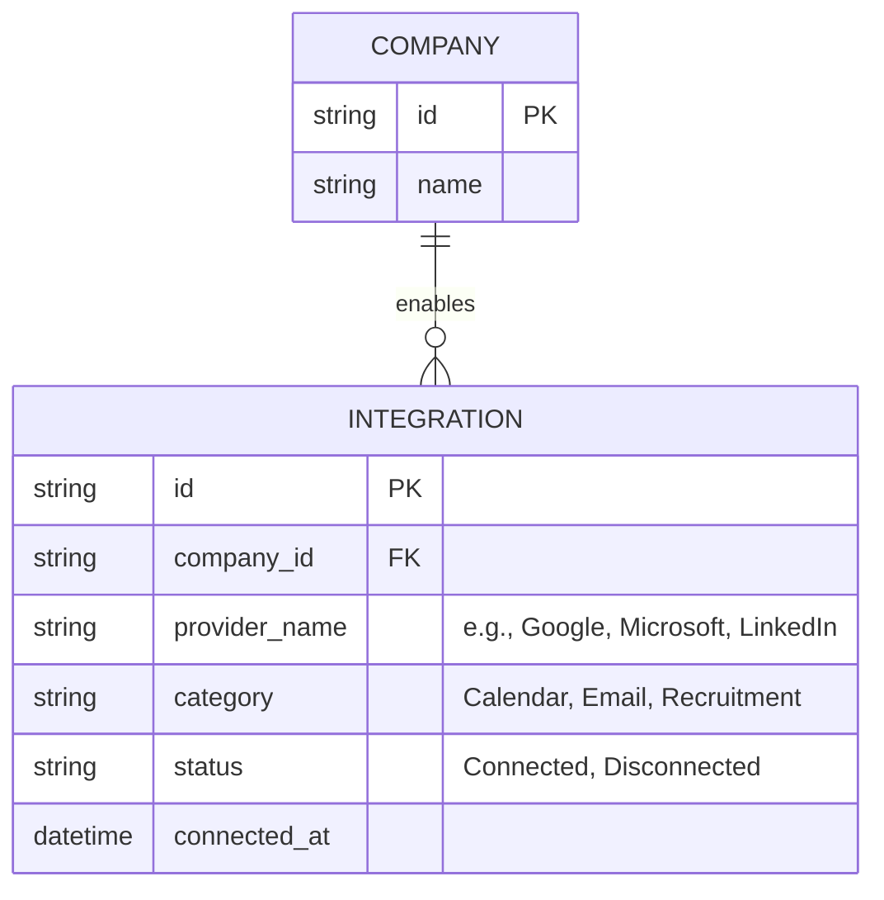

### Calendar Integration


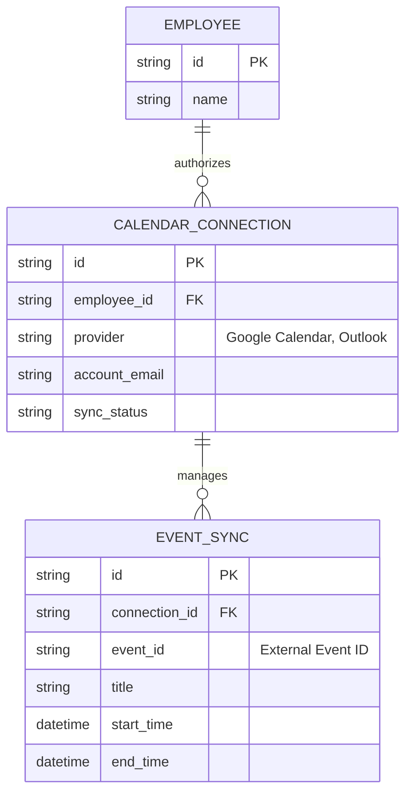

### Email Integration


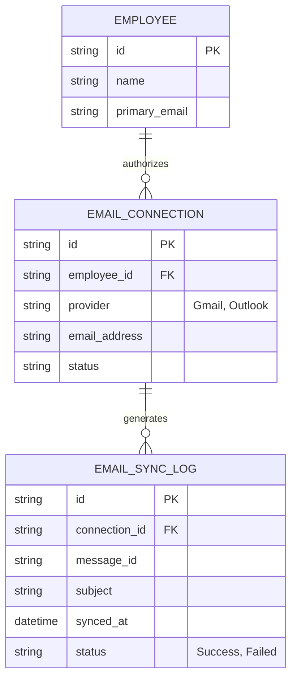

### Recruitment Integration


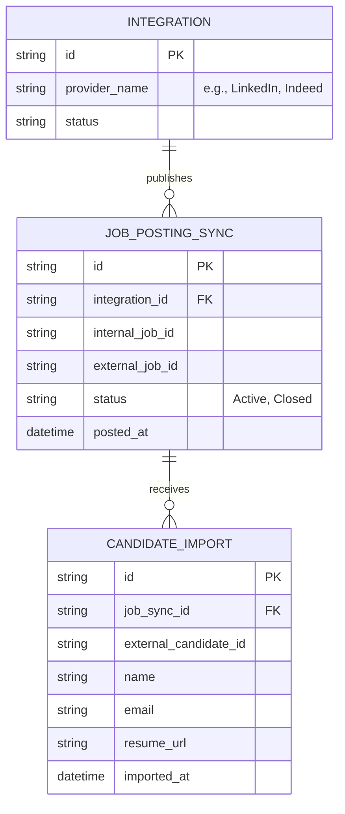

### Sync History


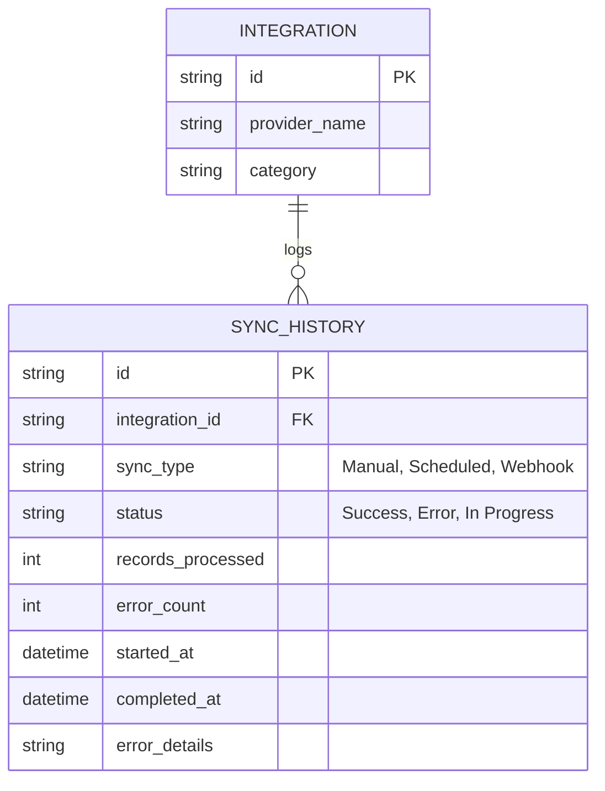

### Full Integration ERD

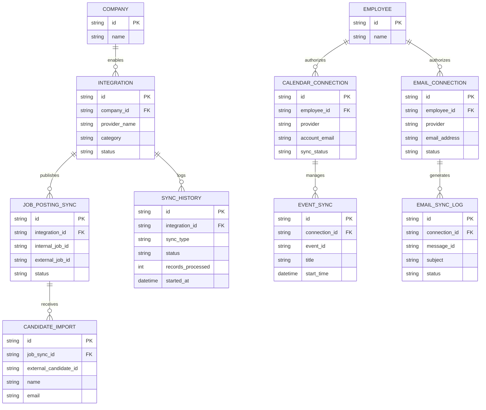

## API Documentation

```text
BBV HR - Integration Management API
│
├── Integrations
│   ├── GET     /integrations
│   ├── POST    /integrations
│   ├── GET     /integrations/{integrationId}
│   ├── PUT     /integrations/{integrationId}
│   ├── DELETE  /integrations/{integrationId}
│   ├── POST    /integrations/{integrationId}/test
│   └── POST    /integrations/{integrationId}/reconnect
│
├── Calendar Integration
│   ├── GET     /integrations/{integrationId}/calendar-config
│   ├── PUT     /integrations/{integrationId}/calendar-config
│   └── GET     /integrations/{integrationId}/calendar-events
│
├── Email Integration
│   ├── GET     /integrations/{integrationId}/email-config
│   ├── PUT     /integrations/{integrationId}/email-config
│   ├── GET     /integrations/{integrationId}/email-templates
│   ├── POST    /integrations/{integrationId}/email-templates
│   ├── PUT     /email-templates/{templateId}
│   ├── DELETE  /email-templates/{templateId}
│   ├── GET     /integrations/{integrationId}/email-logs
│   └── POST    /integrations/{integrationId}/send-test-email
│
├── Recruitment Integration
│   ├── GET     /integrations/{integrationId}/recruitment-config
│   ├── PUT     /integrations/{integrationId}/recruitment-config
│   ├── GET     /integrations/{integrationId}/job-postings
│   ├── POST    /integrations/{integrationId}/job-postings
│   ├── POST    /job-postings/{jobPostingSyncId}/sync
│   ├── POST    /job-postings/{jobPostingSyncId}/close
│   ├── GET     /job-postings/{jobPostingSyncId}/candidate-imports
│   └── POST    /integrations/{integrationId}/application-sync
│
└── Sync History
    ├── POST    /integrations/{integrationId}/sync
    ├── GET     /sync-history
    ├── GET     /sync-history/{syncId}
    └── POST    /sync-history/{syncId}/retry
```

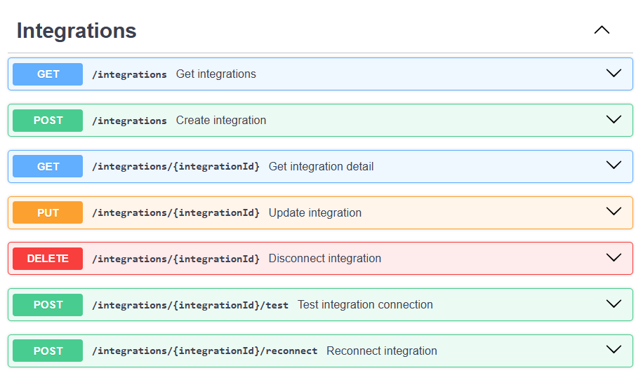
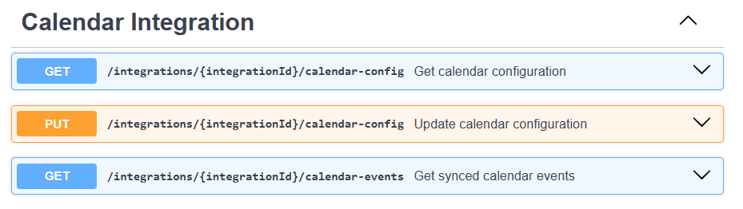
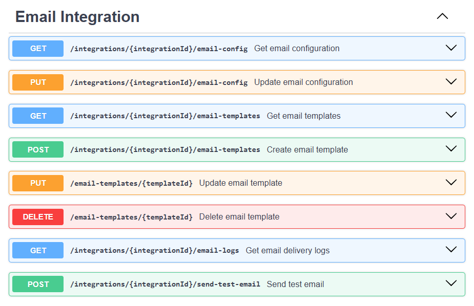
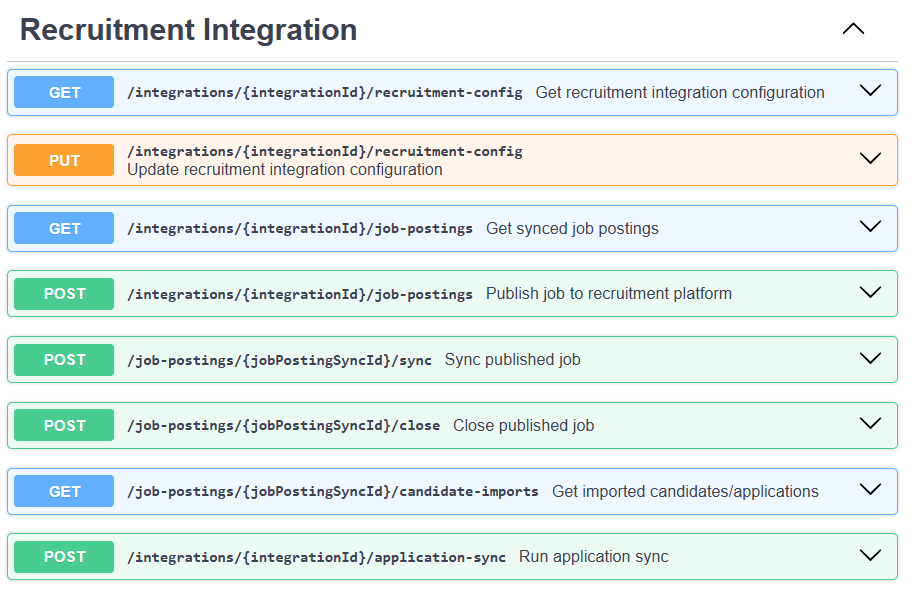
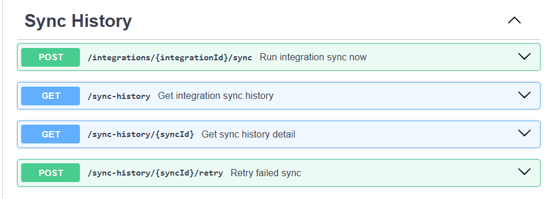
