# Onboarding Documents

## Onboarding Sitemap 
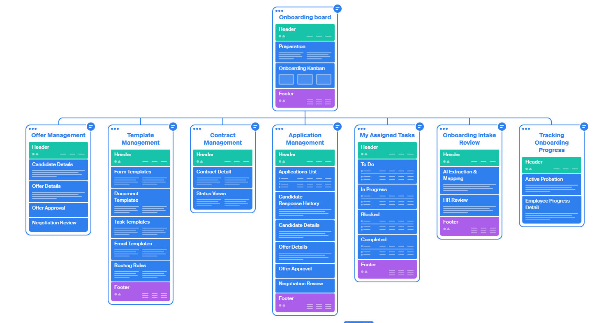

## Onboarding Use Case
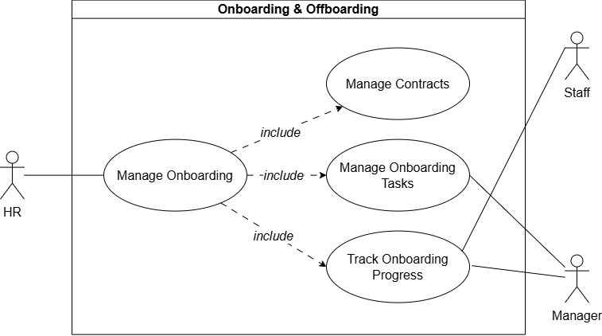

## UI/UX and Database

### 1. Application Management
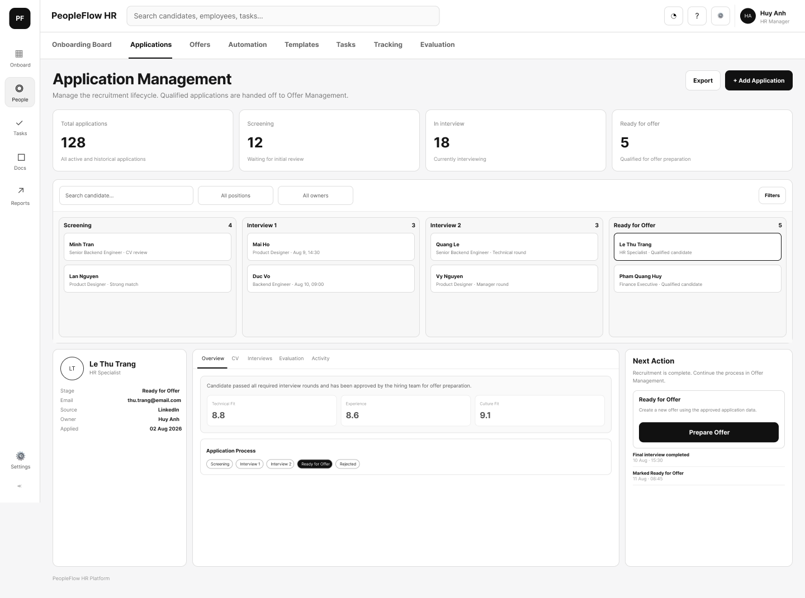
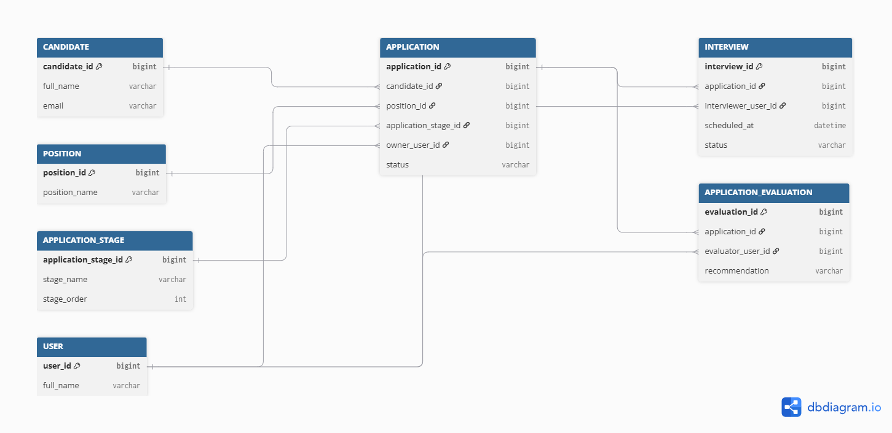

### 2. Offer Management
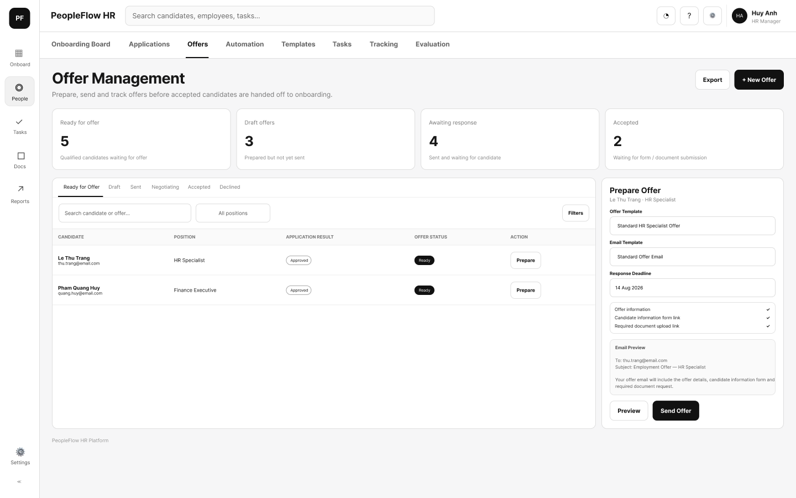
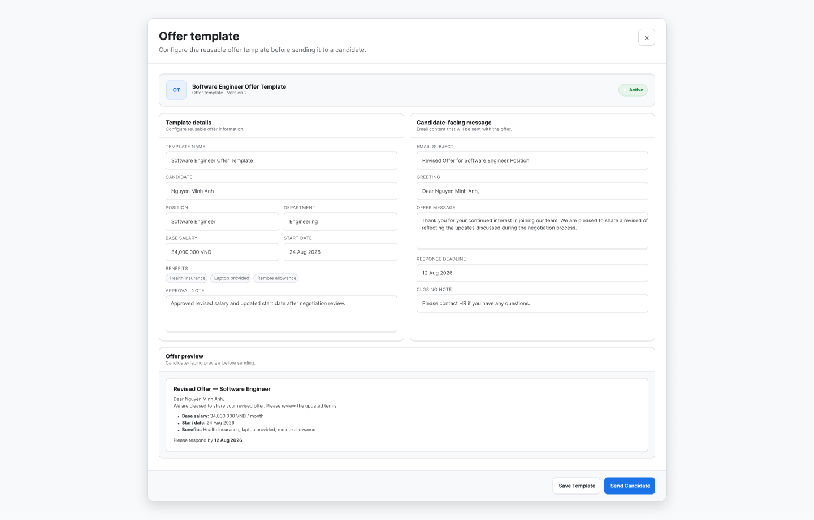
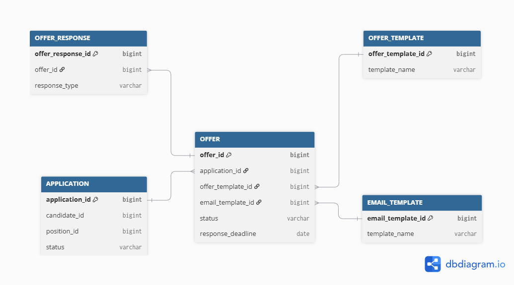

### 3. Contract Management
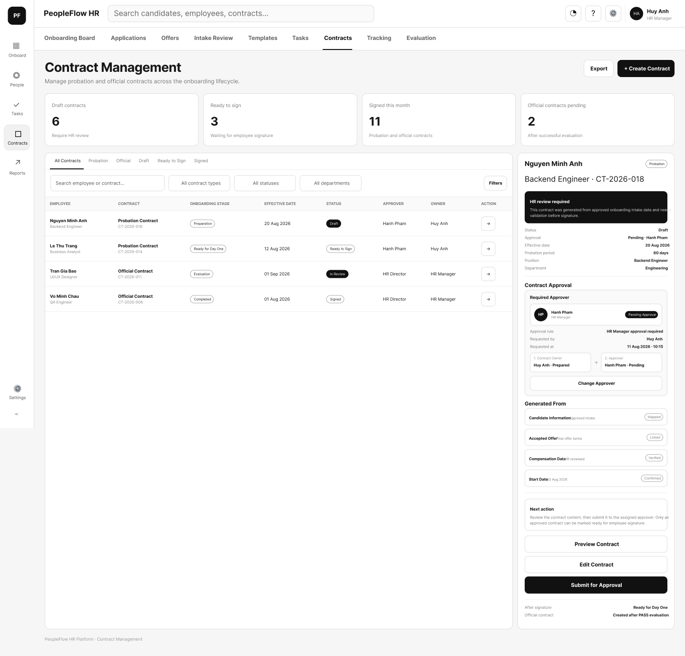


### 4. Intake Review


### 5. Onboarding Board 
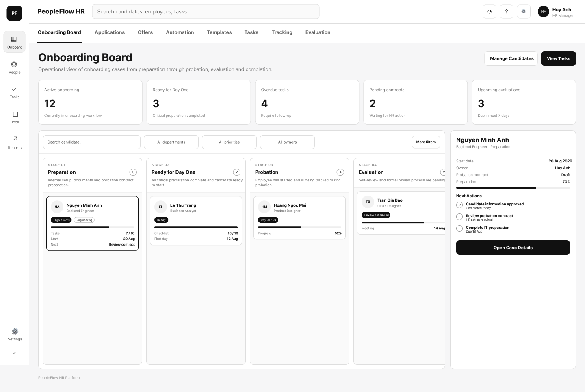
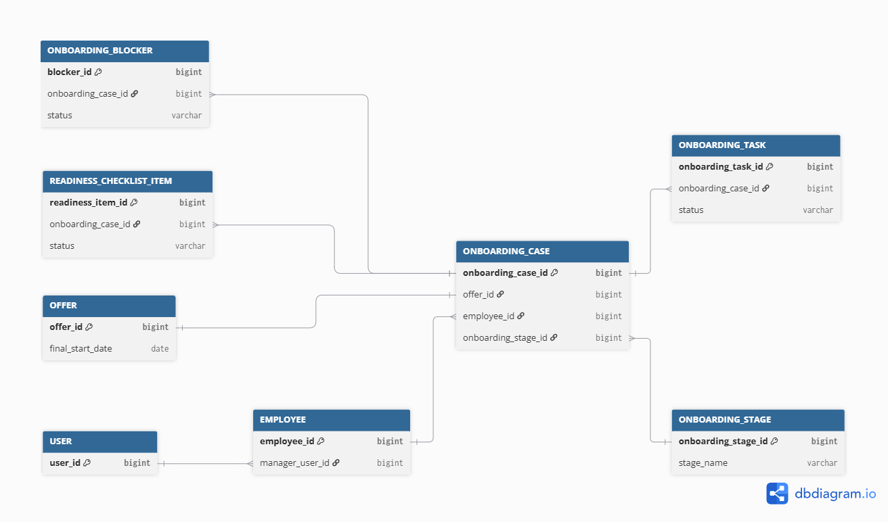

### 6. Assigned Task by Role
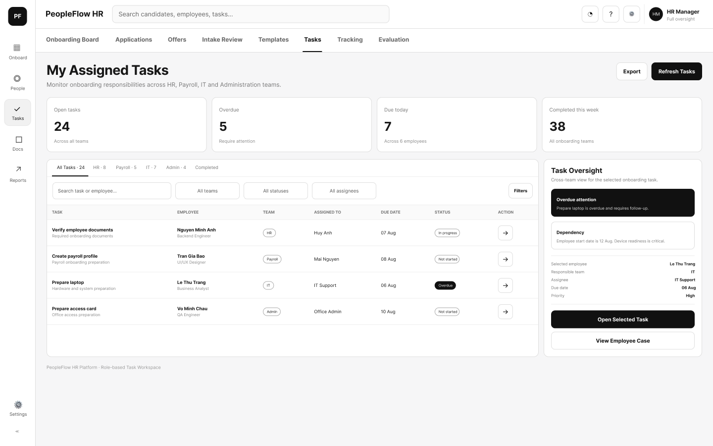


### 7. Tracking Onboard Progress 
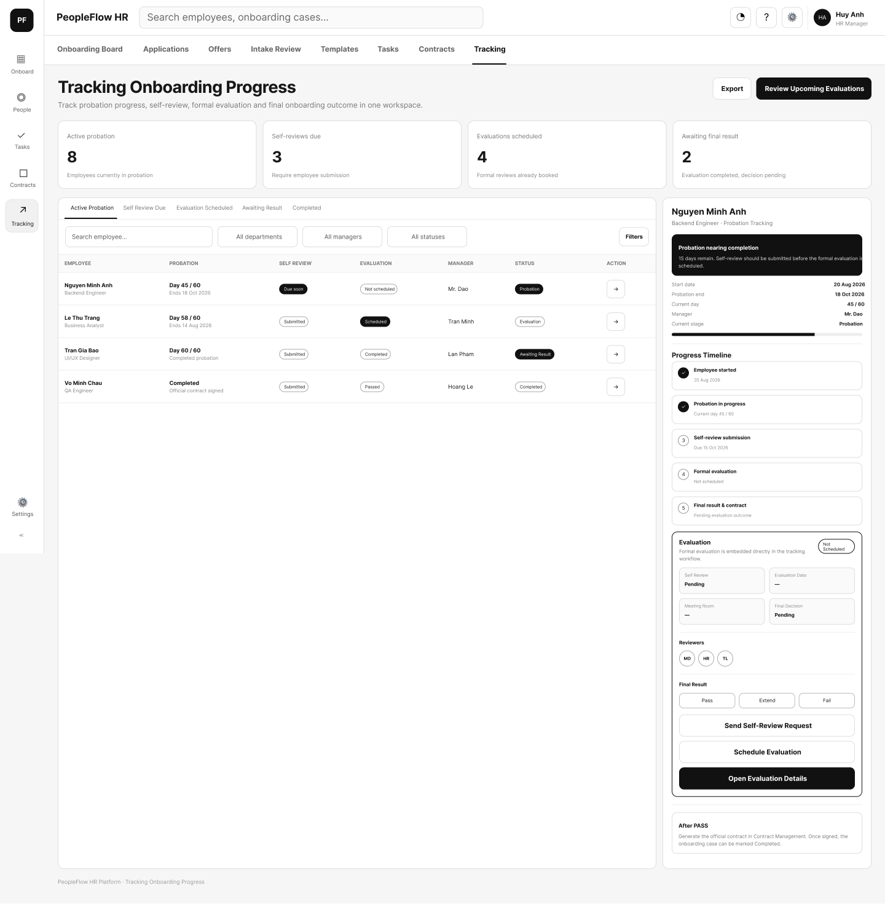


## API route tree structure
https://app.swaggerhub.com/apis/bbv-a74/Onboarding/1.0.0#/
```text
Copilot HR - Employee Onboarding API
│
├── Application Management
│   ├── GET    /applications
│   ├── POST   /applications
│   ├── GET    /applications/{applicationId}
│   ├── PATCH  /applications/{applicationId}/stage
│   ├── GET    /applications/{applicationId}/interviews
│   ├── POST   /applications/{applicationId}/interviews
│   ├── GET    /applications/{applicationId}/evaluations
│   └── POST   /applications/{applicationId}/evaluations
│
├── Offer Management
│   ├── GET    /candidate-form-templates
│   ├── POST   /offers
│   ├── GET    /offers/{offerId}
│   ├── POST   /offers/{offerId}/send
│   └── POST   /offers/{offerId}/respond
│
├── Intake Review & Document Submission
│   ├── POST   /onboarding/submissions
│   ├── GET    /onboarding/submissions/{submissionId}
│   ├── POST   /onboarding/submissions/{submissionId}/documents
│   ├── POST   /onboarding/submissions/{submissionId}/field-mappings/parse
│   ├── GET    /onboarding/submissions/{submissionId}/generated-outputs
│   └── POST   /onboarding/submissions/{submissionId}/reviews
│
├── Onboarding Board & Case Management
│   ├── POST   /onboarding/cases
│   ├── GET    /onboarding/cases
│   ├── GET    /onboarding/cases/{caseId}
│   ├── PATCH  /onboarding/cases/{caseId}/stage
│   ├── GET    /onboarding/cases/{caseId}/readiness-checklist
│   ├── PATCH  /onboarding/cases/{caseId}/readiness-checklist/{itemId}
│   ├── GET    /onboarding/cases/{caseId}/blockers
│   └── POST   /onboarding/cases/{caseId}/blockers
│
├── Task Assignment & Workflows
│   ├── GET    /onboarding/cases/{caseId}/tasks
│   ├── POST   /onboarding/cases/{caseId}/tasks
│   ├── PATCH  /onboarding/tasks/{taskId}
│   ├── POST   /onboarding/tasks/{taskId}/assignments
│   ├── GET    /onboarding/tasks/{taskId}/comments
│   └── POST   /onboarding/tasks/{taskId}/comments
│
└── Probation & Performance Tracking
    ├── POST   /onboarding/cases/{caseId}/probation
    ├── GET    /onboarding/cases/{caseId}/probation
    ├── POST   /probation/{probationId}/self-reviews
    ├── POST   /probation/{probationId}/evaluations
    ├── POST   /probation/evaluations/{evaluationId}/reviewers
    └── POST   /probation/evaluations/{evaluationId}/finalize
```