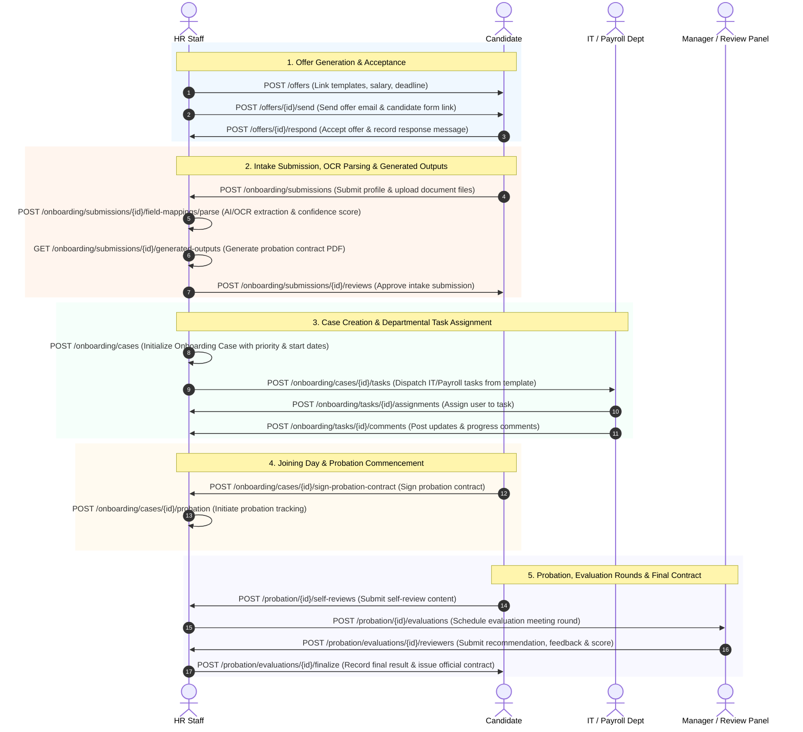
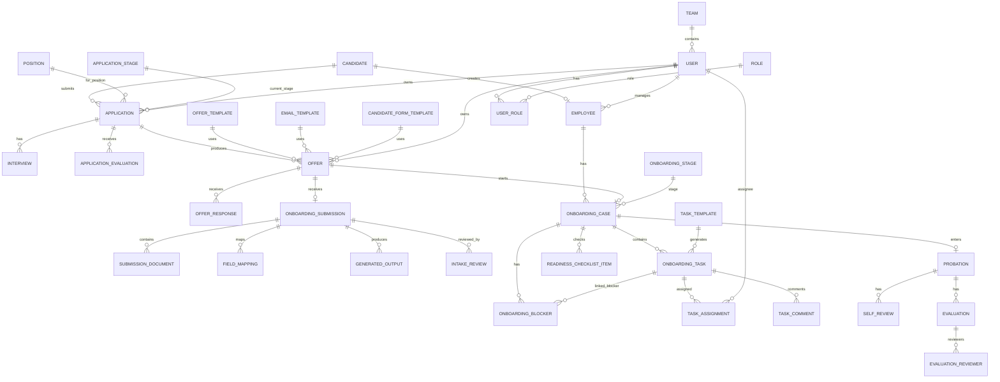
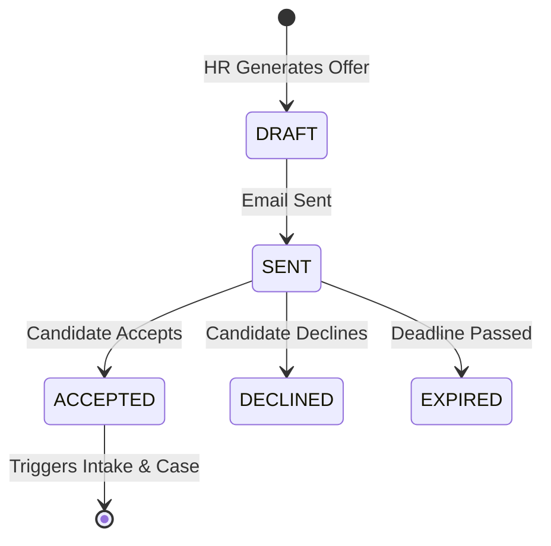
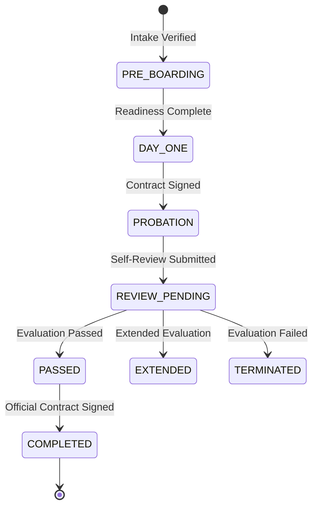

# Copilot HR - Employee Onboarding System API Documentation

## 1. Overview & Architecture

The **Employee Onboarding System** in Copilot HR automates and streamlines the end-to-end journey of newly hired candidates—from recruitment application selection and formal job offer dispatch (linking offer templates, email templates, and candidate intake form templates) to digital document intake, AI/OCR field extraction, contract generation, day-one readiness tracking, role-based task assignments with comments, and probation performance reviews.

### Key Features:
- **Refined Data Architecture**: 33 relational entities defining granular timestamps, evaluation scores, document verification statuses, and task comments matching `db.md`.
- **Seamless Candidate Experience**: Digital offer acceptance, automated intake document uploads, candidate form templates, and AI field mapping.
- **Cross-Departmental Collaboration**: Automated task dispatch to HR, IT, Payroll, Facilities, and Line Managers with real-time assignment tracking and comments.
- **Day-One Readiness**: Real-time checklists with mandatory requirement flags (`is_required`) and blocker severity tracking (`LOW`, `MEDIUM`, `HIGH`, `CRITICAL`).
- **Probation & Multi-Round Evaluations**: Structured probation tracking, candidate self-reviews, reviewer panel evaluations with scores and feedback, and final labor contract confirmation.

### 1.1 API Route Tree Structure

```text
Copilot HR - Employee Onboarding System API
│
├── Application Management
│   ├── GET    /applications
│   ├── POST   /applications
│   ├── GET    /applications/{applicationId}
│   ├── PATCH  /applications/{applicationId}/stage
│   ├── GET    /applications/{applicationId}/interviews
│   ├── POST   /applications/{applicationId}/interviews
│   ├── GET    /applications/{applicationId}/evaluations
│   └── POST   /applications/{applicationId}/evaluations
│
├── Offer Management
│   ├── GET    /candidate-form-templates
│   ├── POST   /offers
│   ├── GET    /offers/{offerId}
│   ├── POST   /offers/{offerId}/send
│   └── POST   /offers/{offerId}/respond
│
├── Intake Review & Document Submission
│   ├── POST   /onboarding/submissions
│   ├── GET    /onboarding/submissions/{submissionId}
│   ├── POST   /onboarding/submissions/{submissionId}/documents
│   ├── POST   /onboarding/submissions/{submissionId}/field-mappings/parse
│   ├── GET    /onboarding/submissions/{submissionId}/generated-outputs
│   └── POST   /onboarding/submissions/{submissionId}/reviews
│
├── Onboarding Board & Case Management
│   ├── POST   /onboarding/cases
│   ├── GET    /onboarding/cases
│   ├── GET    /onboarding/cases/{caseId}
│   ├── PATCH  /onboarding/cases/{caseId}/stage
│   ├── GET    /onboarding/cases/{caseId}/readiness-checklist
│   ├── PATCH  /onboarding/cases/{caseId}/readiness-checklist/{itemId}
│   ├── GET    /onboarding/cases/{caseId}/blockers
│   └── POST   /onboarding/cases/{caseId}/blockers
│
├── Task Assignment & Workflows
│   ├── GET    /onboarding/cases/{caseId}/tasks
│   ├── POST   /onboarding/cases/{caseId}/tasks
│   ├── PATCH  /onboarding/tasks/{taskId}
│   ├── POST   /onboarding/tasks/{taskId}/assignments
│   ├── GET    /onboarding/tasks/{taskId}/comments
│   └── POST   /onboarding/tasks/{taskId}/comments
│
└── Probation & Performance Tracking
    ├── POST   /onboarding/cases/{caseId}/probation
    ├── GET    /onboarding/cases/{caseId}/probation
    ├── POST   /probation/{probationId}/self-reviews
    ├── POST   /probation/{probationId}/evaluations
    ├── POST   /probation/evaluations/{evaluationId}/reviewers
    └── POST   /probation/evaluations/{evaluationId}/finalize
```


---

## 2. Actors & System Roles

| Role | Description & Responsibilities |
| :--- | :--- |
| **Candidate** | Reviews and accepts/declines job offers, fills candidate form templates, uploads identity/tax/banking documents, signs probation contracts, and submits probation self-reviews. |
| **HR Staff** | Manages offer templates, email templates, candidate form templates, dispatches offers, performs intake reviews, creates external HR system profiles, tracks Kanban boards, schedules probation evaluation meetings, and issues final labor contracts. |
| **Line Manager** | Conducts application interviews, evaluates candidates, tracks onboarding tasks for new team members, participates in probation review panels, and submits evaluation recommendations with scores. |
| **Department Staff (IT / Payroll)** | Receives automated departmental onboarding tasks, posts task comments, updates task progress (`NOT_STARTED`, `IN_PROGRESS`, `COMPLETED`, `BLOCKED`), and resolves blockers. |
| **Review Panel Member** | Participates in probation review meetings, submits formal recommendations (`RECOMMEND_PASS`, `RECOMMEND_EXTEND`, `RECOMMEND_TERMINATE`), numerical scores, and text feedback. |
| **System Admin** | Manages system roles, permissions, workflow templates, team definitions, and integrations with external platforms. |

---

## 3. End-to-End Business Flow Mapping

The API endpoints map directly to the **Employee Onboarding Process** flow:



---

## 4. Complete Database ERD Entity Table (`db.md`)

Below is the complete entity relationship mapping corresponding to all 33 tables in `db.md`:



---

## 5. Detailed Module Endpoint Reference

### 5.1 Application Management

#### `GET /api/v1/applications`
Retrieve a paginated list of job applications.
- **Query Parameters**: `status`, `application_stage_id`, `page`, `limit`.
- **Response 200 OK**:
```json
{
  "total": 42,
  "page": 1,
  "limit": 20,
  "data": [
    {
      "application_id": 5001,
      "candidate_id": 1001,
      "position_id": 201,
      "application_stage_id": 3,
      "owner_user_id": 50,
      "status": "INTERVIEWING",
      "applied_at": "2026-08-01T08:00:00Z",
      "moved_to_stage_at": "2026-08-05T10:30:00Z"
    }
  ]
}
```

#### `POST /api/v1/applications/{applicationId}/interviews`
Schedule an interview round.
- **Request Body**:
```json
{
  "interviewer_user_id": 50,
  "interview_round": "Round 2 - Technical Architecture",
  "interview_type": "ONLINE",
  "scheduled_at": "2026-08-20T14:00:00Z",
  "duration_minutes": 60,
  "location": "MS Teams",
  "meeting_link": "https://teams.microsoft.com/l/meetup/123"
}
```

#### `POST /api/v1/applications/{applicationId}/evaluations`
Submit candidate multi-criteria interview scores.
- **Request Body**:
```json
{
  "evaluator_user_id": 50,
  "technical_score": 5,
  "experience_score": 4,
  "communication_score": 5,
  "culture_fit_score": 5,
  "recommendation": "HIRE",
  "comment": "Strong candidate with solid backend experience."
}
```

---

### 5.2 Offer Management

#### `POST /api/v1/offers`
Create a job offer linking offer, email, and candidate form templates.
- **Request Body**:
```json
{
  "application_id": 5001,
  "offer_template_id": 10,
  "email_template_id": 15,
  "candidate_form_template_id": 5,
  "owner_user_id": 12,
  "salary_amount": 3500.00,
  "salary_currency": "USD",
  "response_deadline": "2026-08-30T23:59:59Z",
  "proposed_start_date": "2026-09-01"
}
```

#### `POST /api/v1/offers/{offerId}/respond`
Candidate accepts or declines job offer.
- **Request Body**:
```json
{
  "response_type": "ACCEPTED",
  "message": "I am delighted to accept the offer terms."
}
```

---

### 5.3 Intake Review & Document Submission

#### `POST /api/v1/onboarding/submissions/{submissionId}/documents`
Upload candidate onboarding document files.
- **Content-Type**: `multipart/form-data`
- **Fields**: `document_type`, `file` (binary).
- **Response 201 Created**: Returns `SubmissionDocument` with `upload_status`, `extraction_status`, `verification_status`.

#### `POST /api/v1/onboarding/submissions/{submissionId}/field-mappings/parse`
Trigger AI/OCR extraction.
- **Response 200 OK**:
```json
[
  {
    "field_mapping_id": 1201,
    "submission_id": 4001,
    "source_field": "id_number",
    "source_value": "0123456789",
    "target_field": "employee.identity_card_number",
    "mapped_value": "0123456789",
    "confidence_score": 0.98,
    "mapping_status": "VERIFIED"
  }
]
```

#### `GET /api/v1/onboarding/submissions/{submissionId}/generated-outputs`
List generated contract documents & PDFs.

---

### 5.4 Onboarding Board & Case Management

#### `POST /api/v1/onboarding/cases`
Initialize an onboarding case.
- **Request Body**:
```json
{
  "offer_id": 7001,
  "employee_id": 505,
  "onboarding_stage_id": 1,
  "priority": "HIGH",
  "planned_start_date": "2026-09-01"
}
```

#### `POST /api/v1/onboarding/cases/{caseId}/blockers`
Report a blocker impeding onboarding progress.
- **Request Body**:
```json
{
  "onboarding_task_id": 1501,
  "blocker_type": "HARDWARE_VENDOR_DELAY",
  "description": "Laptop delivery delayed by hardware vendor.",
  "severity": "HIGH"
}
```

---

### 5.5 Task Assignment & Workflows

#### `POST /api/v1/onboarding/tasks/{taskId}/assignments`
Assign onboarding task to department user.
- **Request Body**:
```json
{
  "assigned_user_id": 88,
  "assigned_by_user_id": 12
}
```

#### `POST /api/v1/onboarding/tasks/{taskId}/comments`
Post a comment/update on an onboarding task.
- **Request Body**:
```json
{
  "author_user_id": 88,
  "comment": "Workstation ordered and configured with standard dev tools."
}
```

---

### 5.6 Probation & Performance Tracking

#### `POST /api/v1/probation/{probationId}/self-reviews`
Candidate submits self-review content.
- **Request Body**:
```json
{
  "review_content": "Successfully onboarded into project. Delivered 3 major sprint features.",
  "status": "SUBMITTED"
}
```

#### `POST /api/v1/probation/evaluations/{evaluationId}/reviewers`
Review panel member submits recommendation, text feedback, and numerical score.
- **Request Body**:
```json
{
  "reviewer_user_id": 5,
  "recommendation": "RECOMMEND_PASS",
  "feedback": "Excellent technical output and team synergy.",
  "score": 4.8
}
```

#### `POST /api/v1/probation/evaluations/{evaluationId}/finalize`
Record final review summary and issue official contract.
- **Request Body**:
```json
{
  "result": "PASSED",
  "summary": "Candidate passed probation evaluation unanimously. Official labor contract issued."
}
```

---

## 6. Status Lifecycle State Machines

### 6.1 Offer Lifecycle


### 6.2 Onboarding Case Lifecycle


---

## 7. Error Handling & Standard Responses

All error responses adhere to RFC 7807:

```json
{
  "code": "INVALID_STATE_TRANSITION",
  "message": "Cannot move Onboarding Case to PROBATION stage until all required readiness items are marked COMPLETED.",
  "details": [
    "Required item ID 2201 (Laptop Provisioning) status is PENDING."
  ],
  "timestamp": "2026-08-11T15:16:05Z"
}
```
