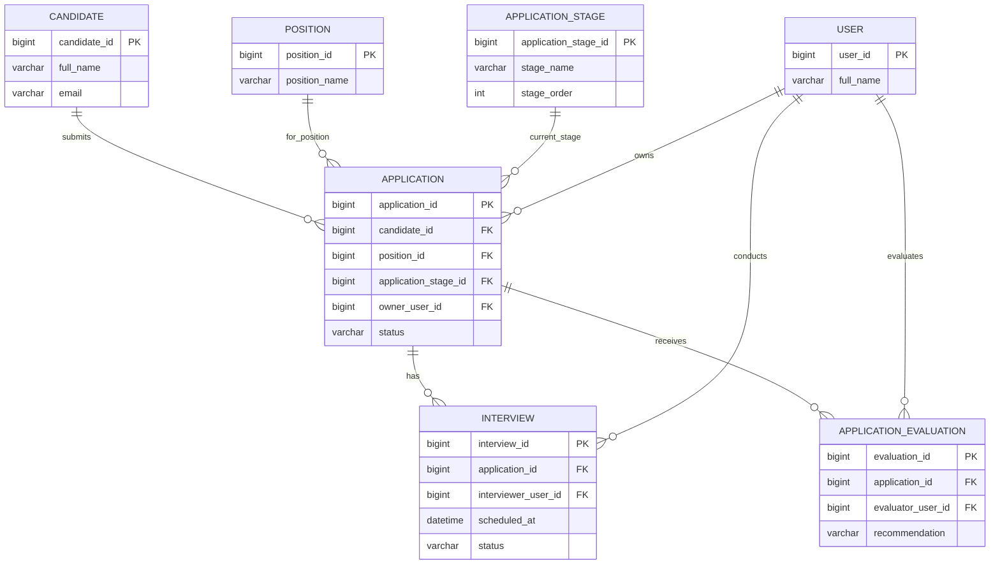
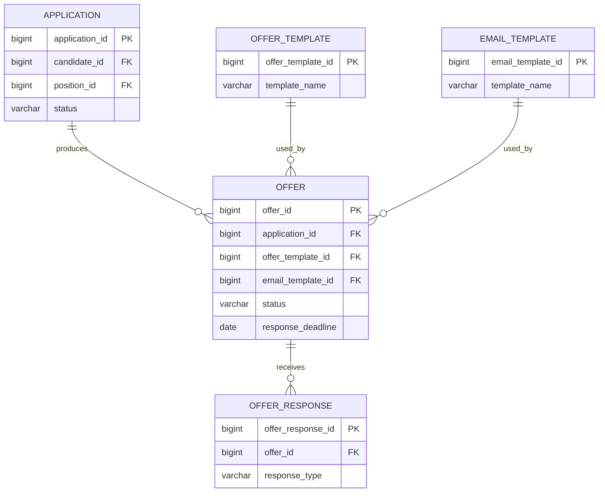
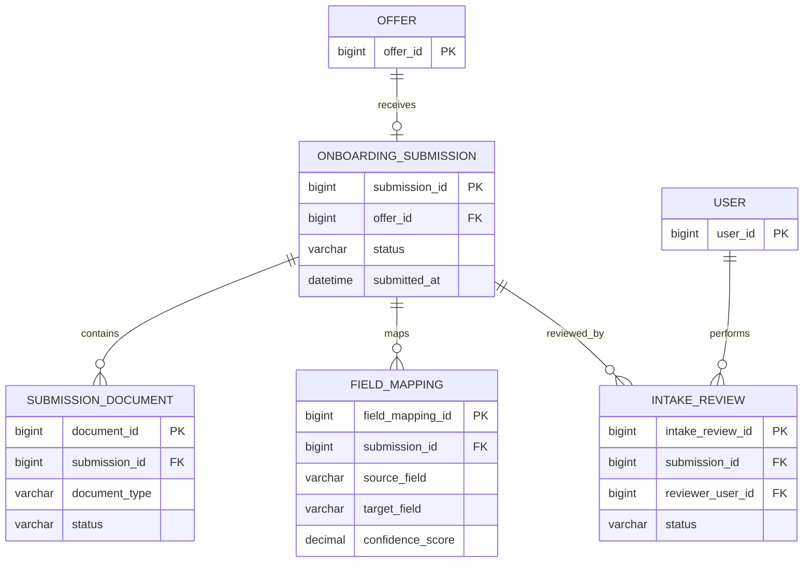
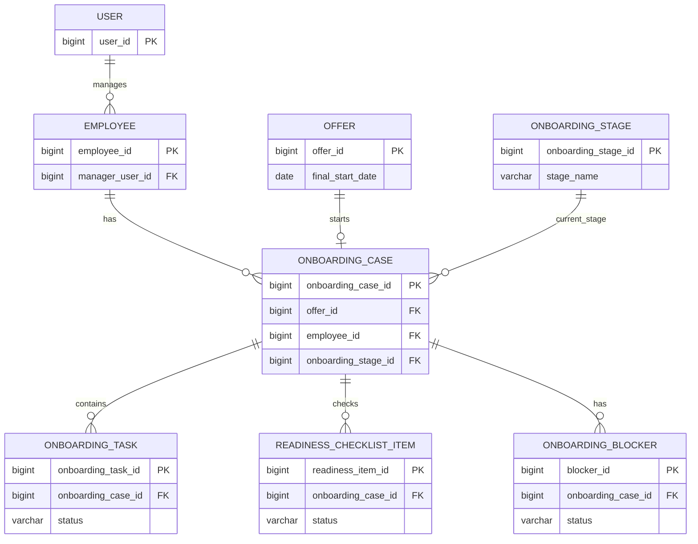
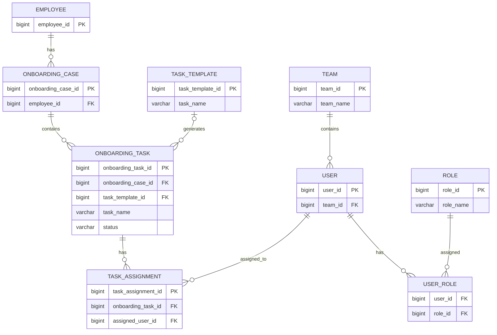
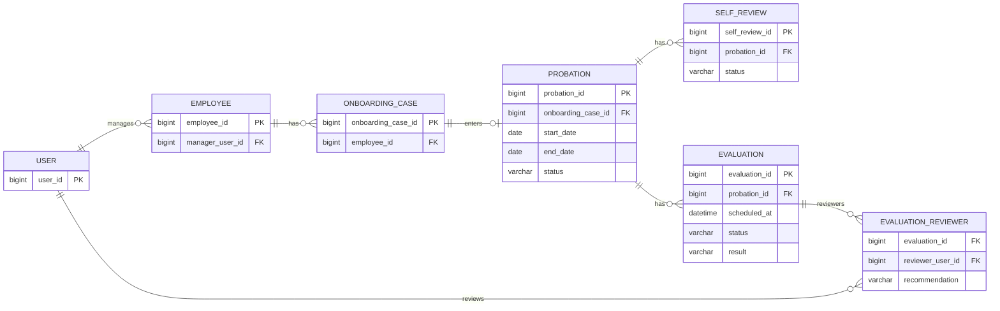

### 3. Core ERD Appllication Management

### 4. Core ERD Offer Management

### 5. Core ERD Intake Review

### 6. Core ERD Onboarding Board 

### 7. Core ERD Assigned Task by Role

### 8. Core ERD Tracking Progress 
