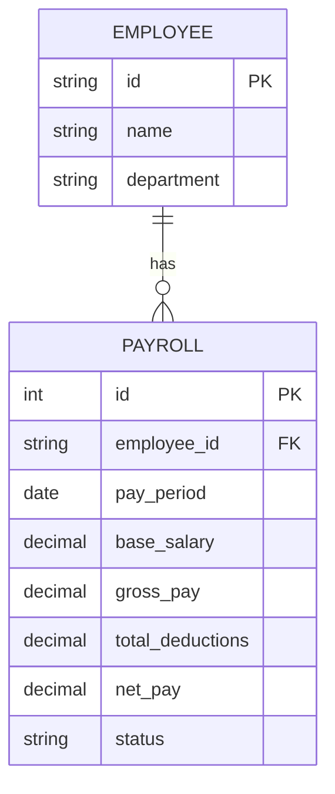
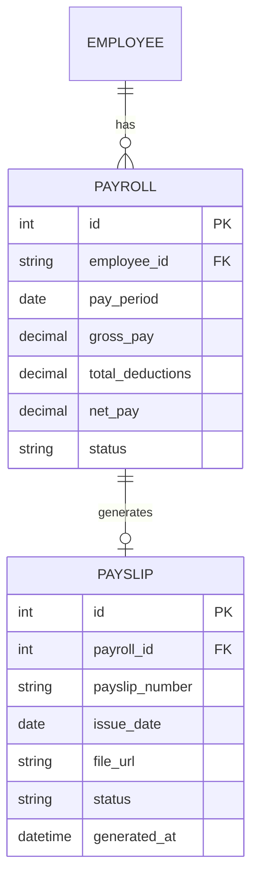
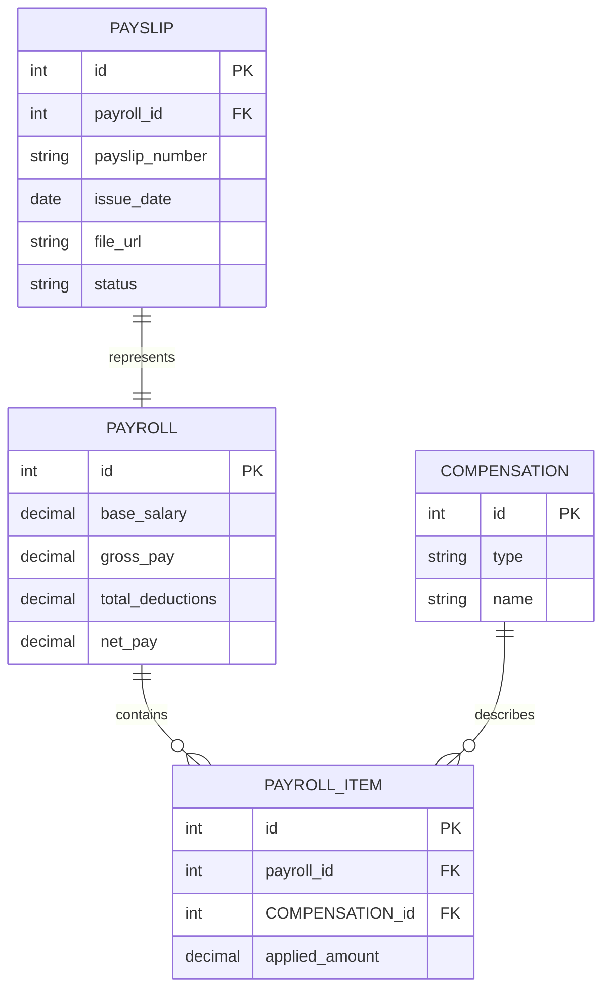
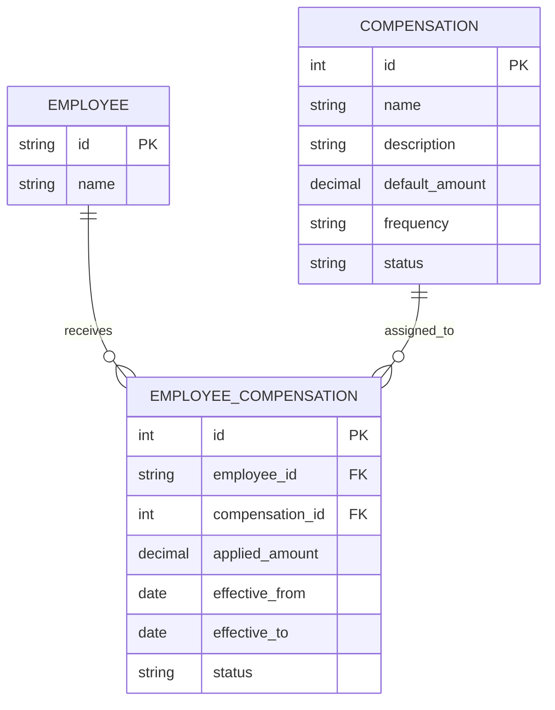
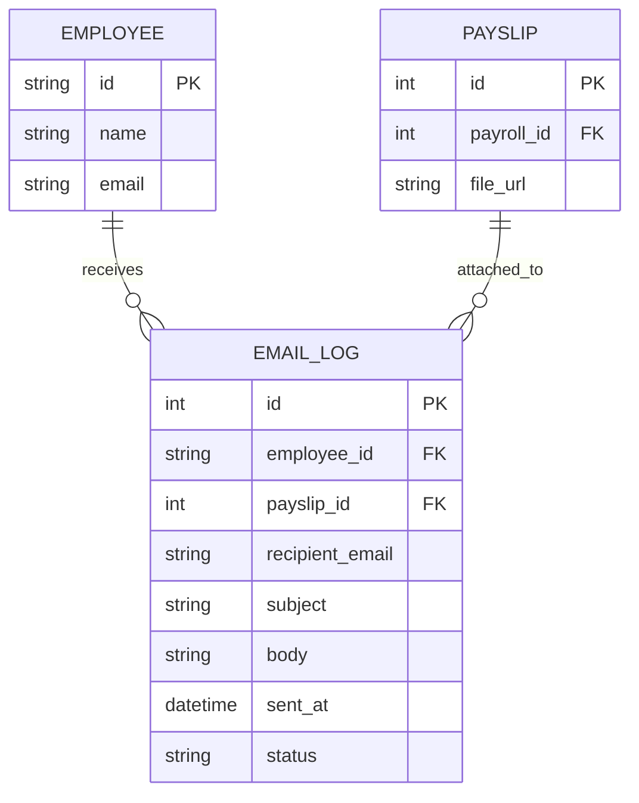
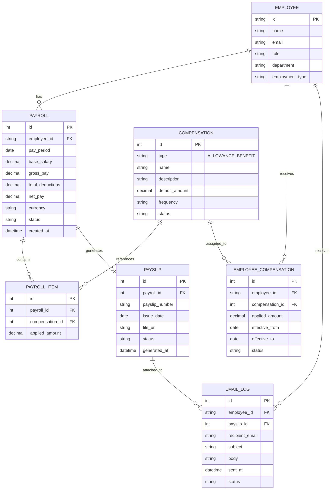
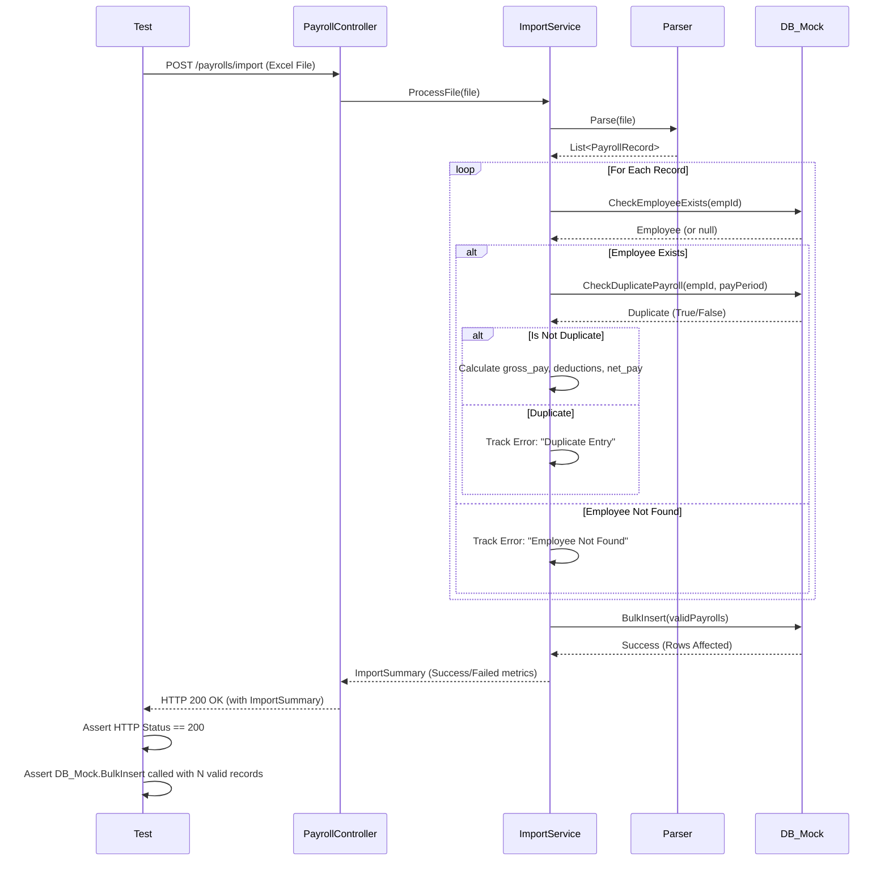
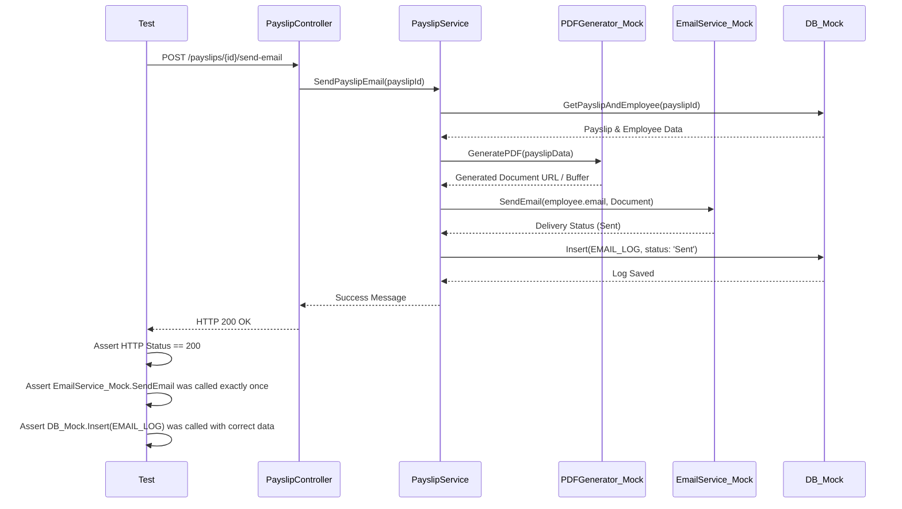

# Payroll Management

## Use Case


## Sitemap


## System ERD


## UI/UX Designs and Entity Relationship Diagrams

### Payroll Management

.png>)



### Add Payroll

```mermaid
erDiagram
    EMPLOYEE ||--o{ PAYROLL : "has"
    PAYROLL ||--o{ PAYROLL_ITEM : "contains"
    COMPENSATION ||--o{ PAYROLL_ITEM : "references"

    EMPLOYEE {
        string id PK "e.g. EMP-00246"
        string name
        string role
        string department
        string employment_type
    }

    COMPENSATION {
        int id PK
        string type "ALLOWANCE, BENEFIT, BONUS, DEDUCTION"
        string name "e.g. Transport Allowance"
        string description
        decimal default_amount
        string status
    }

    PAYROLL {
        int id PK
        string employee_id FK
        date pay_period
        decimal base_salary
        decimal gross_pay
        decimal total_deductions
        decimal net_pay
        string status
    }

    PAYROLL_ITEM {
        int id PK
        int payroll_id FK
        int COMPENSATION_id FK
        decimal applied_amount
    }
```




### Payslips




### Individual Payslip




_Note: PAYSLIP_DETAIL is not required. Individual payslip lines are derived from PAYROLL and PAYROLL_ITEM, while PAYSLIP represents the generated payslip document._

### Compensation




### Send Email




### Full Payroll ERD



## API Documentation

```text
BBV HR - Payroll Management API
│
├── Payrolls
│   ├── GET     /payrolls
│   ├── POST    /payrolls
│   ├── POST    /payrolls/import
│   ├── GET     /payrolls/{payrollId}
│   ├── PUT     /payrolls/{payrollId}
│   └── DELETE  /payrolls/{payrollId}
│
├── Payroll Items
│   ├── GET     /payrolls/{payrollId}/items
│   ├── POST    /payrolls/{payrollId}/items
│   ├── PUT     /payrolls/{payrollId}/items/{itemId}
│   └── DELETE  /payrolls/{payrollId}/items/{itemId}
│
├── Compensations
│   ├── GET     /compensations
│   ├── POST    /compensations
│   ├── GET     /compensations/{compensationId}
│   ├── PUT     /compensations/{compensationId}
│   └── DELETE  /compensations/{compensationId}
│
├── Employee Compensations
│   ├── GET     /employee-compensations
│   ├── POST    /employee-compensations
│   ├── GET     /employee-compensations/{employeeCompensationId}
│   ├── PUT     /employee-compensations/{employeeCompensationId}
│   └── DELETE  /employee-compensations/{employeeCompensationId}
│
├── Payslips
│   ├── GET     /payslips
│   ├── POST    /payrolls/{payrollId}/payslip
│   └── GET     /payslips/{payslipId}
│
└── Payslip Email
    ├── POST    /payslips/{payslipId}/send-email
    └── GET     /email-logs
```


## Unit Test Summary

| Test Group | Number of Tests |
| --- | --- |
| Payroll Management | 10 |
| Payroll Import | 6 |
| Compensation | 6 |
| Employee Compensation | 7 |
| Payroll Item | 5 |
| Payslip | 7 |
| Payslip Email | 5 |
| API / Controller | 4 |
| **Total** | **50** |

### 1. Payroll Management — 10 Tests

| Unit Test | Expected Result | Priority |
| --- | --- | --- |
| Create payroll with valid data | Payroll is created successfully | Critical |
| Create payroll for a nonexistent employee | Request is rejected | Critical |
| Create payroll with missing required fields | Validation error is returned | Critical |
| Create duplicate payroll for the same employee and pay period | Duplicate payroll is rejected | Critical |
| Update existing payroll | Payroll is updated successfully | Critical |
| Create payroll with invalid monetary values | Validation error is returned | High |
| Get payroll by valid ID | Correct payroll is returned | High |
| Get nonexistent payroll | Not Found is returned | High |
| Get payroll list with pagination | Correct paginated result is returned | High |
| Delete existing payroll | Payroll is deleted successfully | High |

### 2. Payroll Import — 6 Tests

| Unit Test | Expected Result | Priority |
| --- | --- | --- |
| Import valid Excel payroll file | Payroll records are imported successfully | Critical |
| Import multiple valid payroll rows | All valid rows are imported | Critical |
| Import row with nonexistent employee | Invalid row is rejected | Critical |
| Import duplicate employee and pay period | Duplicate record is detected | Critical |
| Import unsupported file format | File is rejected | High |
| Import payroll row with invalid data | Validation error is returned | High |

### 3. Compensation — 6 Tests

| Unit Test | Expected Result | Priority |
| --- | --- | --- |
| Create valid compensation | Compensation is created successfully | Critical |
| Create compensation with invalid type | Validation error is returned | Critical |
| Create compensation without required fields | Validation error is returned | High |
| Create compensation with invalid amount | Validation error is returned | High |
| Update compensation | Compensation is updated successfully | High |
| Delete or deactivate compensation | Compensation is deleted or deactivated | High |

### 4. Employee Compensation — 7 Tests

| Unit Test | Expected Result | Priority |
| --- | --- | --- |
| Assign compensation to valid employee | Assignment is created successfully | Critical |
| Assign compensation to nonexistent employee | Assignment is rejected | Critical |
| Assign nonexistent compensation | Assignment is rejected | Critical |
| Assign custom applied_amount | Correct custom amount is stored | Critical |
| Set effective_to before effective_from | Validation error is returned | Critical |
| Assign inactive compensation | Assignment is rejected | High |
| Update employee compensation | Assignment is updated successfully | High |

### 5. Payroll Item — 5 Tests

| Unit Test | Expected Result | Priority |
| --- | --- | --- |
| Add compensation to payroll | Payroll item is created successfully | Critical |
| Add item to nonexistent payroll | Not Found is returned | Critical |
| Add nonexistent compensation to payroll | Request is rejected | Critical |
| Update payroll item | Payroll item is updated successfully | High |
| Delete payroll item | Payroll item is removed successfully | High |

### 6. Payslip — 7 Tests

| Unit Test | Expected Result | Priority |
| --- | --- | --- |
| Generate payslip from valid payroll | Payslip is generated successfully | Critical |
| Generate payslip for nonexistent payroll | Not Found is returned | Critical |
| Generate second payslip for the same payroll | Duplicate payslip is rejected | Critical |
| Map payroll values to payslip | Payslip values match payroll data | Critical |
| Map payroll items and compensations to payslip | Correct compensation lines are generated | Critical |
| Generate unique payslip_number | Unique payslip number is generated | High |
| Generate payslip document | Valid file_url is stored | High |

### 7. Payslip Email — 5 Tests

| Unit Test | Expected Result | Priority |
| --- | --- | --- |
| Send valid payslip email | Email is sent successfully | Critical |
| Send email for nonexistent payslip | Not Found is returned | Critical |
| Send payslip when employee has no email | Email sending is rejected | Critical |
| Email provider succeeds | Successful EMAIL_LOG is recorded | Critical |
| Email provider fails | Failed EMAIL_LOG is recorded | Critical |

### 8. API / Controller — 4 Tests

| Endpoint | Scenario | Expected Result | Priority |
| --- | --- | --- | --- |
| GET /payrolls | Valid request with pagination | 200 OK with paginated result | Critical |
| POST /payrolls | Valid or invalid request | 201 Created or 400 Bad Request | Critical |
| POST /payrolls/{payrollId}/payslip | Valid payroll or duplicate payslip | 201 Created or 409 Conflict | Critical |
| POST /payslips/{payslipId}/send-email | Valid request or provider failure | Email result is handled correctly | Critical |

## Complex Unit Test Sequence Diagrams

### 1. Bulk Payroll Import Test Flow
This sequence diagram illustrates the complex unit testing scenario for importing payrolls from a bulk Excel/CSV file, highlighting parsing, validation, duplicate checking, and database mocking.



### 2. Payslip Generation & Email Test Flow
This sequence diagram outlines the testing flow for generating a payslip document and sending it to an employee via email, showcasing how external services (PDF Generator, Email Provider) are mocked in a unit test.


