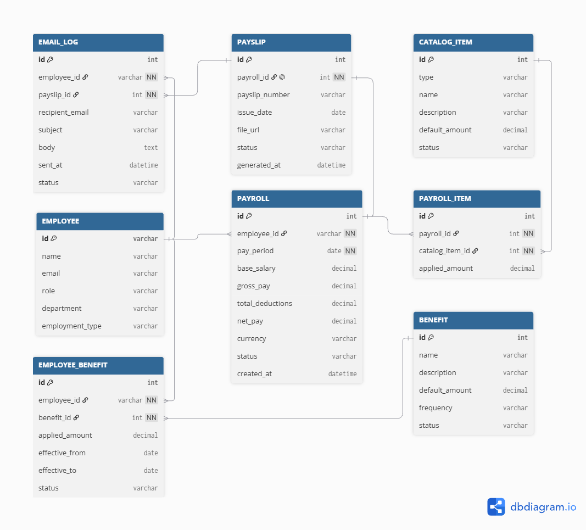
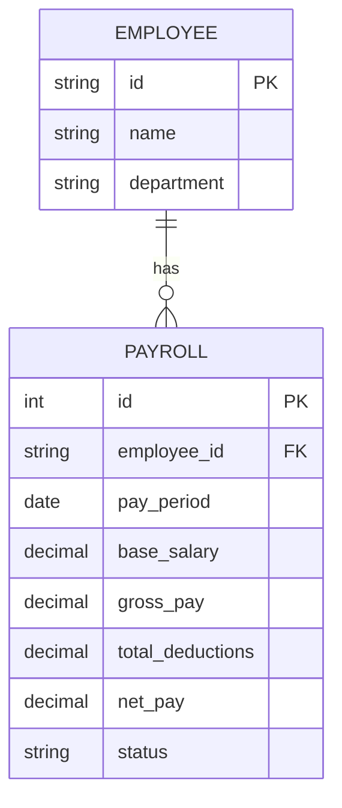
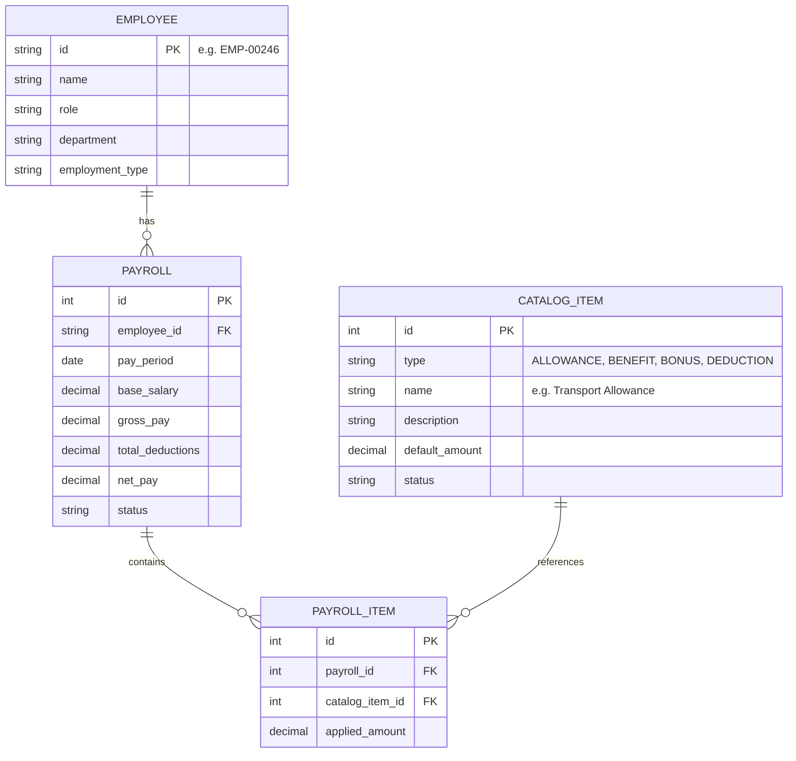
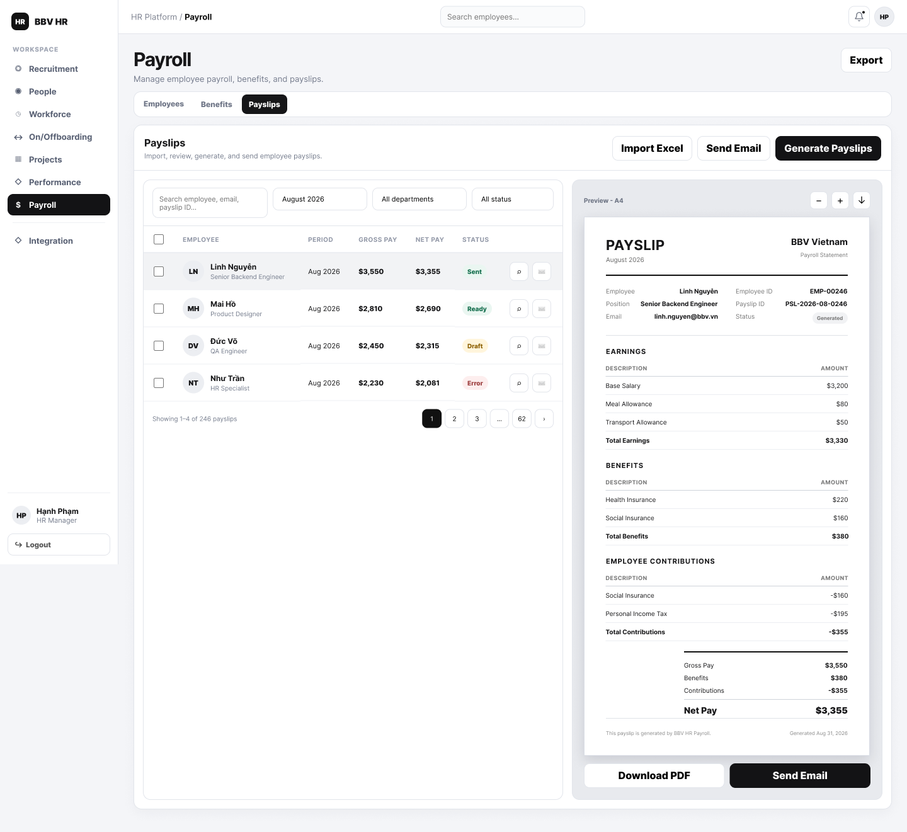
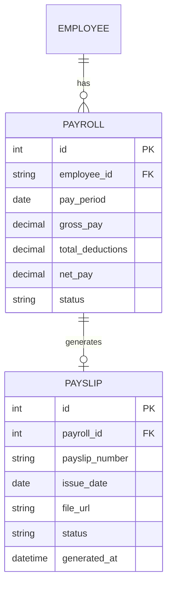
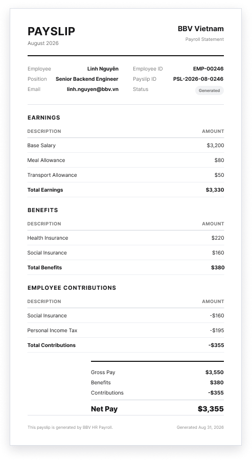
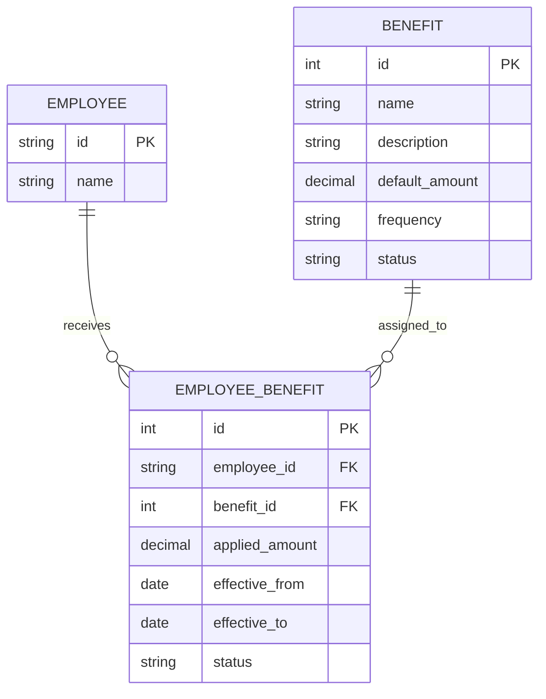
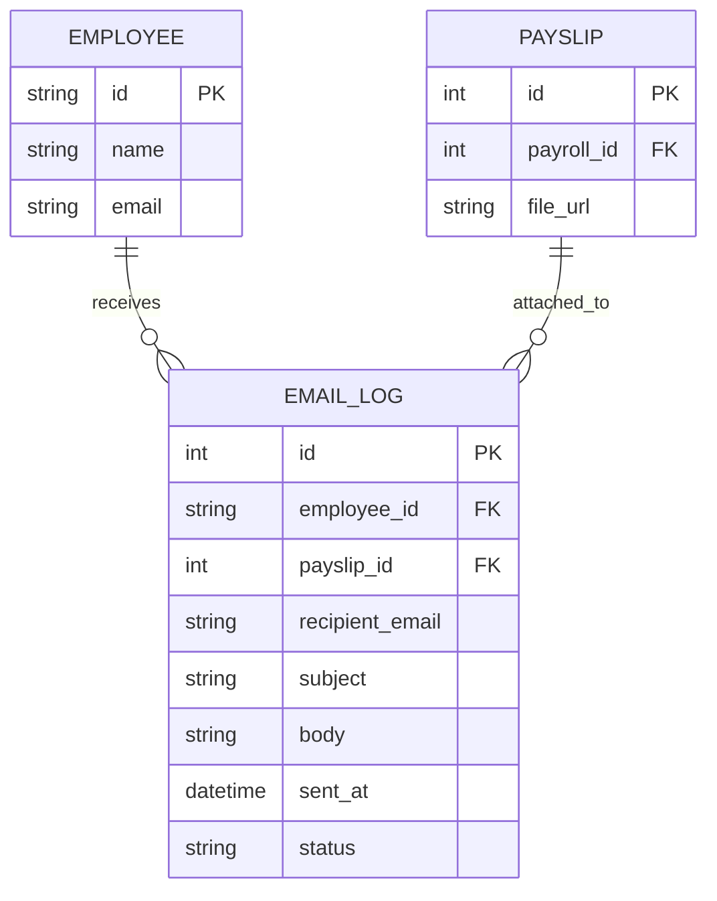
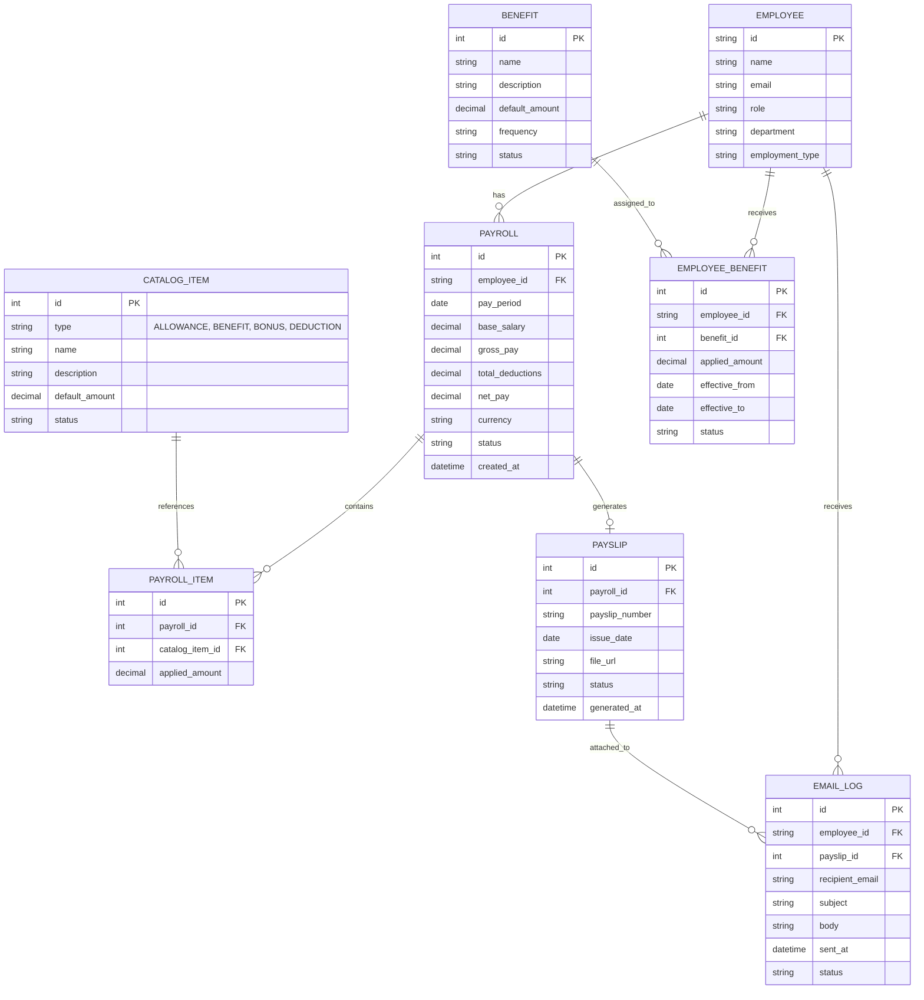

# Payroll Management

## UI/UX Designs and Entity Relationship Diagrams

### Payroll Management
.png)

### Add Payroll

### Payslips

### Individual Payslip

*Note: PAYSLIP_DETAIL is not required. Individual payslip lines are derived from PAYROLL and PAYROLL_ITEM, while PAYSLIP represents the generated payslip document.*

### Benefits
.png)

### Send Email

### Full Payroll ERD
