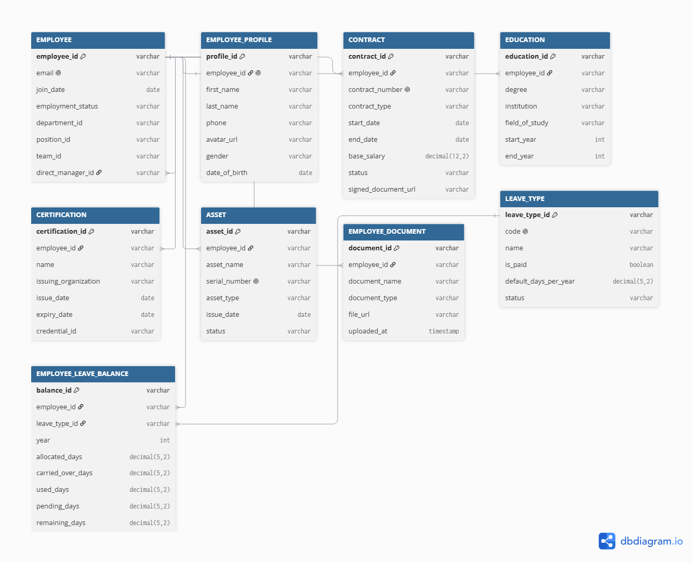
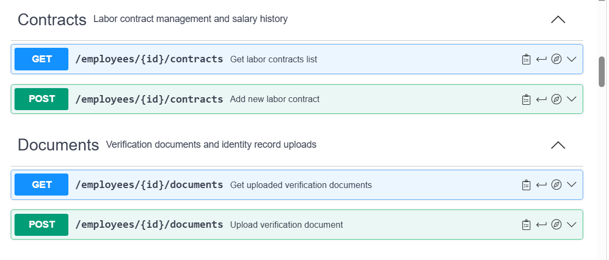
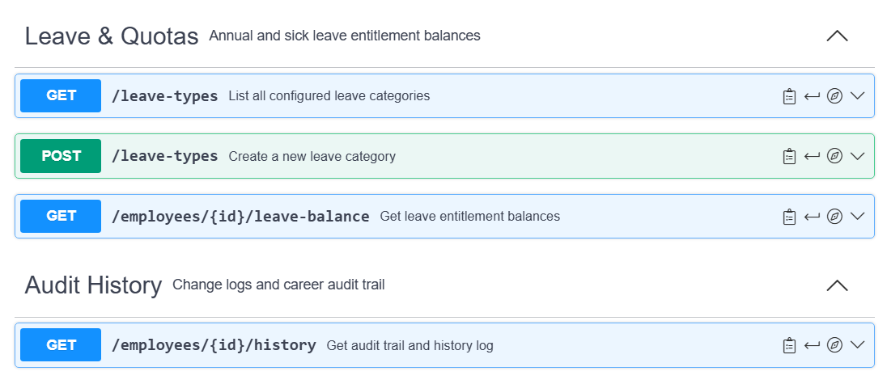
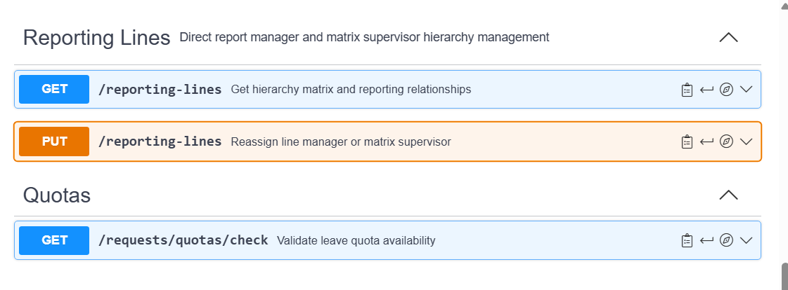
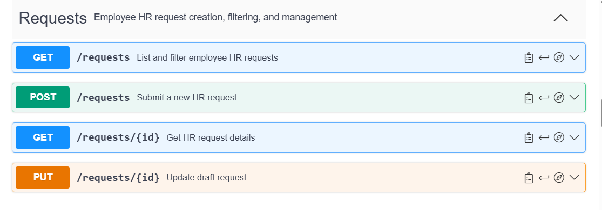
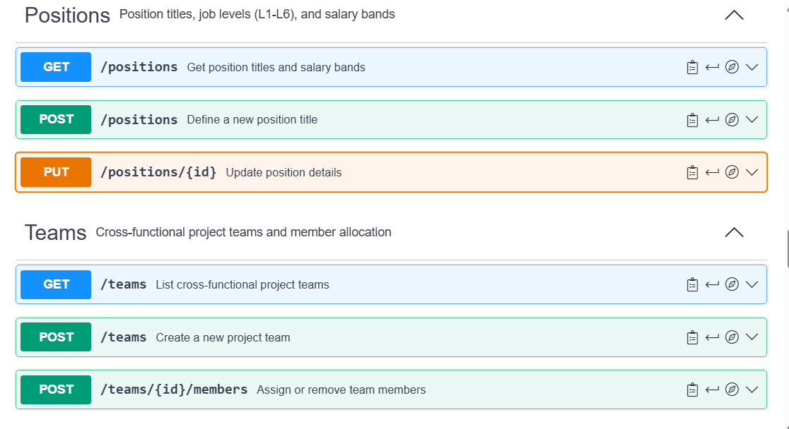

# People Management Module Documentation

Comprehensive architectural documentation for the **People Management** module in **Copilot.HR**, including Use Case diagrams, Information Architecture (IA) sitemap, UI/UX specifications, Database Schema ERDs, API tree architecture, and interactive Swagger API documentation.

---

## 1. Use Case Diagram

The People Management Use Case Diagram defines the primary system interactions between System Actors (Staff, HR Staff, Manager, HR Manager, Tenant Admin) and key module capabilities (Directory, Profile, Org Tree, Request Workflow).


---

## 2. Information Architecture (IA) Sitemap


---

## 3. UI/UX Specifications

User interface screens, slide-over drawers, and modal dialogs designed for the People Management module following minimal monochrome wireframe aesthetics.

### 3.1 Main Screens & Sub-Screens

#### Employee Directory Screen
Central workforce catalog featuring searchable employee records, KPI metrics, status filters, and quick action toolbars.


---

#### Employee Profile Detail Screen
Dedicated 360-degree employee profile view with breadcrumb navigation, header banner, and consolidated tabs for Overview, Contract & Documents, Education, and Audit History.


---

#### Organization & Department Screen
Interactive organizational structure canvas featuring department hierarchy tree, roster headcount metrics, branch location filters, and zoom controls.


---

#### Request Management Screen
Management dashboard for employee HR requests, leave approvals, status filtering, and workflow processing.


---

#### Create HR Request Screen
Two-column interactive form for submitting annual leave, equipment, or policy requests with automatic quota balance validation and document uploads.


---

#### Tracking Request Progress Screen
Real-time request progress tracker displaying step-by-step approval workflow stages, reviewer audit logs, and timeline timestamps.


---

#### Position & Job Title Management Screen
Management screen defining organizational job titles, competency levels (L1-L6), salary band ranges, and headcount quotas.


---

#### Team Management Screen
Workspace for organizing cross-functional project teams, designating team leads, and allocating member capacity.


---

#### Reporting Lines & Hierarchy Matrix Screen
Organizational matrix displaying direct report supervisors, functional line managers, and reporting relationships.


---

### 3.2 Major PopUp Modals & Drawers

#### Add New Employee Profile Modal
Modal popup form for registering a new employee profile with personal demographics, corporate email, role assignment, and department placement.


---

#### Add Department Drawer
Slide-over drawer for configuring new department entities, parent division alignment, location branch, and department lead assignment.


---

#### Add Labor Contract Modal
Form popup for registering official labor contracts, compensation terms, effective start/end dates, and document attachments.


---

## 4. Database Schema ERD

Entity Relationship Diagrams (ERD) illustrating the relational schema across Organization, Employee Directory, and Request Management domains.

#### Organization Domain Schema ERD
Database relationship model covering Company Branches, Departments, Teams, Positions, and Reporting Line relationships.


---

#### Employee Directory Domain Schema ERD
Database entity structure covering Employee Accounts, 1:1 Profiles, Labor Contracts, Verification Documents, Education, Assets, Leave Types, and Leave Balances.



---

#### Request Management Domain Schema ERD
Workflow database model covering Ticket Requests, Request Types, Workflow Steps, Multi-Stage Approval Logs, and Attachments.


---

## 6. Interactive Swagger API Documentation

Access the interactive online Swagger API documentation for real-time request testing, request/response schema inspection, and live endpoint execution:

[Copilot.HR Employee Directory API - Interactive SwaggerHub Documentation](https://app.swaggerhub.com/apis/ouuniversity/copilothr-employee-directory-api/1.0.0#/Documents)

### 6.1 API Endpoint Tree Structure

```text
Copilot.HR - People Management API
│
├── Employees & Profiles
│   ├── GET     /employees
│   ├── POST    /employees
│   ├── POST    /employees/export
│   ├── GET     /employees/{id}
│   ├── PUT     /employees/{id}
│   ├── DELETE  /employees/{id}
│   ├── GET     /employees/{id}/contracts
│   ├── POST    /employees/{id}/contracts
│   ├── GET     /employees/{id}/documents
│   ├── POST    /employees/{id}/documents
│   └── GET     /employees/{id}/history
│
├── Leave Categories & Balances
│   ├── GET     /leave-types
│   ├── POST    /leave-types
│   ├── GET     /employees/{id}/leave-balance
│   └── GET     /requests/quotas/check
│
├── HR Request Management & Workflows
│   ├── GET     /requests
│   ├── POST    /requests
│   ├── GET     /requests/{id}
│   ├── PUT     /requests/{id}
│   ├── POST    /requests/{id}/approve
│   ├── POST    /requests/{id}/reject
│   ├── POST    /requests/{id}/cancel
│   └── GET     /requests/{id}/timeline
│
└── Organization & Hierarchy Matrix
    ├── GET     /departments
    ├── POST    /departments
    ├── GET     /departments/{id}
    ├── PUT     /departments/{id}
    ├── DELETE  /departments/{id}
    ├── POST    /departments/restructure
    ├── GET     /positions
    ├── POST    /positions
    ├── PUT     /positions/{id}
    ├── GET     /teams
    ├── POST    /teams
    ├── POST    /teams/{id}/members
    ├── GET     /reporting-lines
    └── PUT     /reporting-lines
```

### 6.2 Swagger UI Endpoint Documentation Screenshots

#### Employee Directory APIs
Swagger interactive endpoint documentation for searching, creating, and fetching employee profiles.


---

#### Labor Contracts & Documents APIs
Swagger documentation for managing labor contracts, salary history, and employee document uploads.



---

#### Leave & Audit History APIs
Swagger documentation for fetching career audit trails and event logs.



---

#### Leave Categories & Quotas APIs
Swagger documentation for leave category configurations and leave balance quota validation.



---

#### Request Management APIs
Swagger documentation for submitting, filtering, and managing employee HR requests.



---

#### Approvals & Workflow Tracking APIs
Swagger documentation for multi-level approval routing, decision processing, and workflow timeline tracking.


---

#### Department Management APIs
Swagger documentation for department tree hierarchy, creation, modification, and organizational restructuring.


---

#### Positions, Teams & Reporting Lines APIs
Swagger documentation for position titles, job levels, project teams, and reporting line hierarchy matrix.


