# Performance Management

## I. Use Cases

### 1. Goal Management
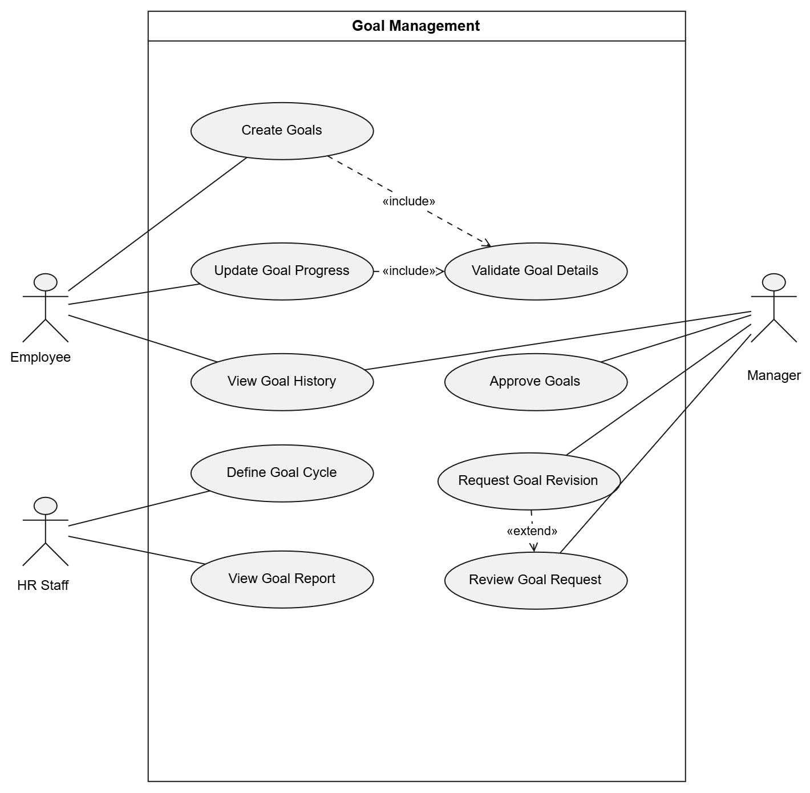

### 2. Performance Review
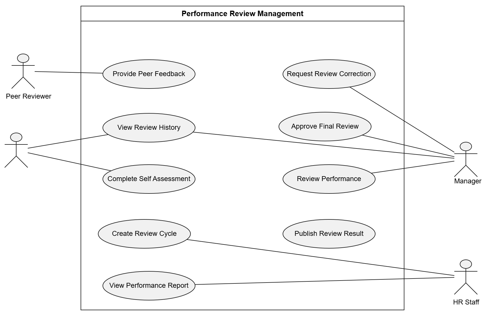

### 3. 1-on-1 Coaching
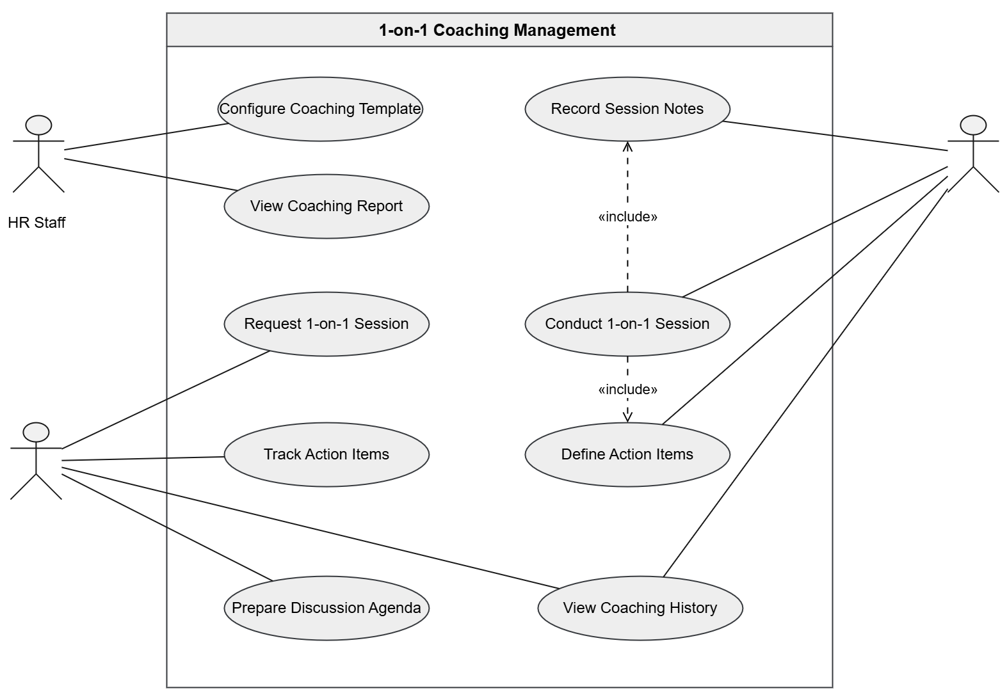

---

## II. UI/UX

### 1. Performance Dashboard
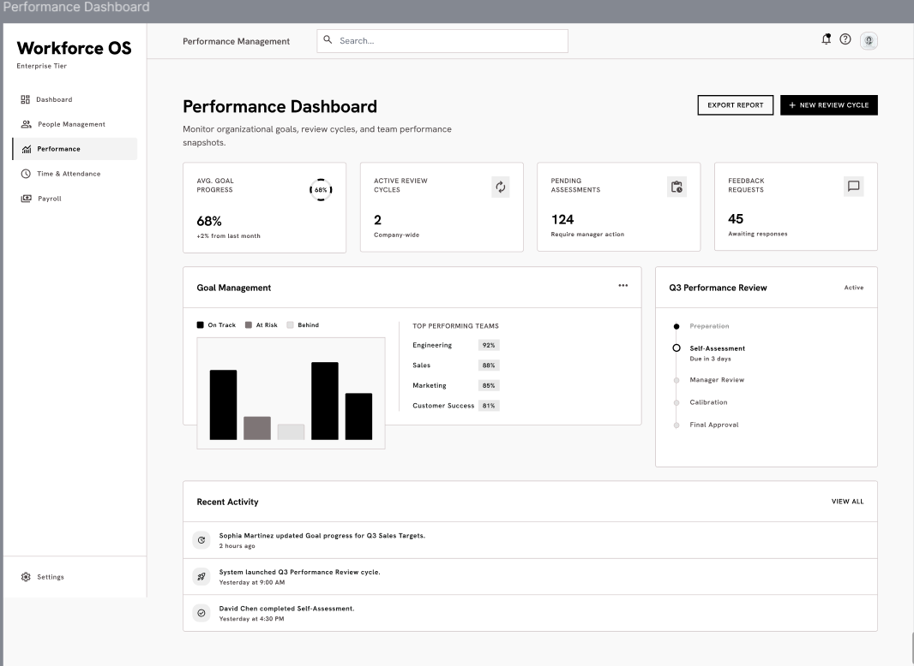

### 2. Goal Directory
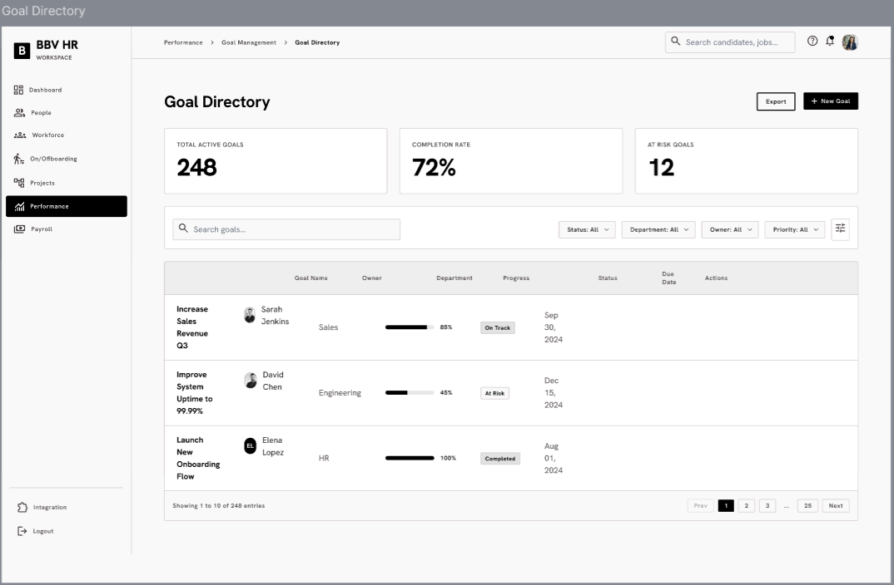

### 3. Goal Detail
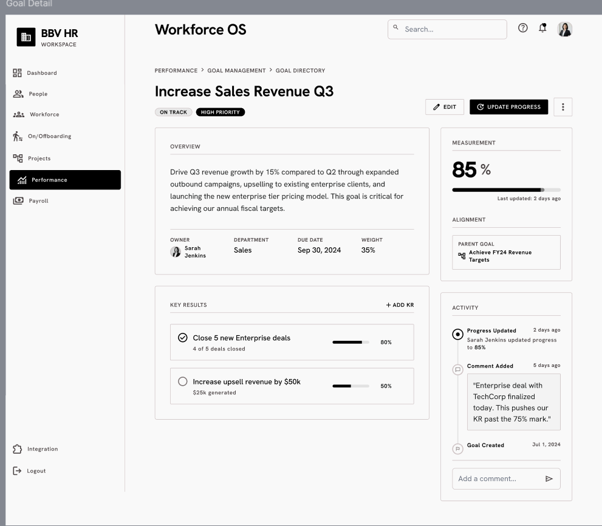

### 4. Self Assessment
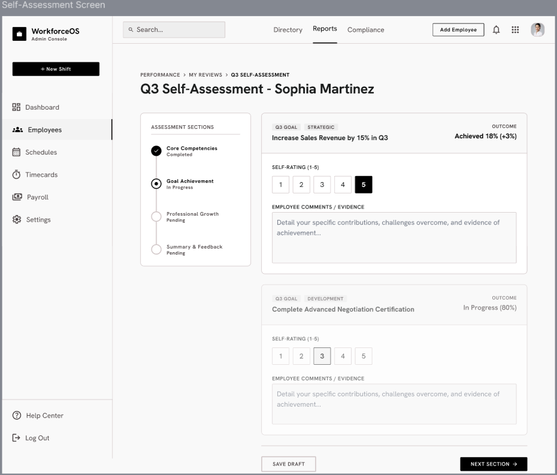

### 5. 360 Feedback Portal
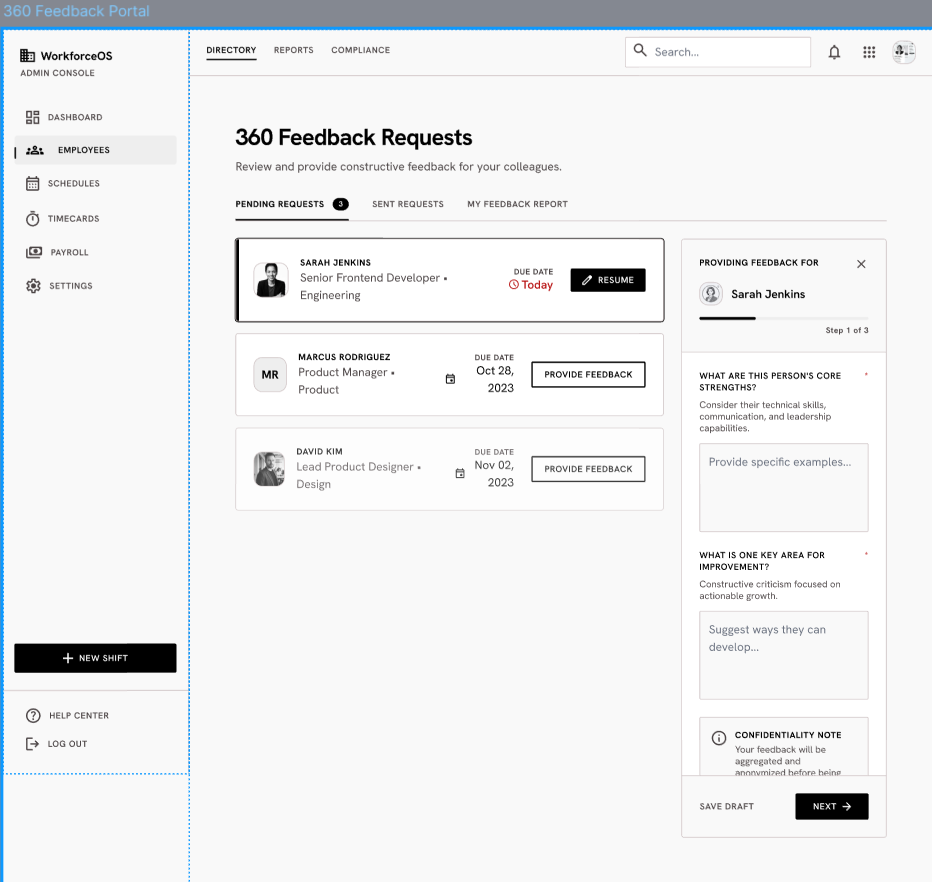

### 6. Manager Evaluation
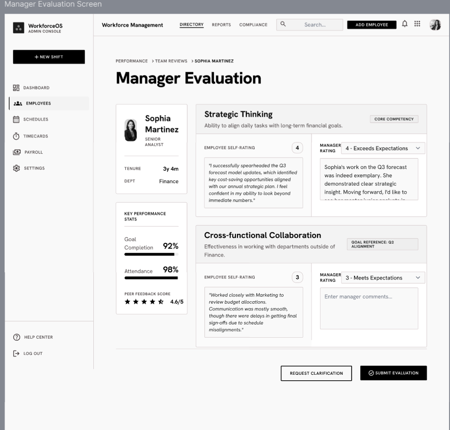

---

## III. Sitemap

### Performance Review Sitemap
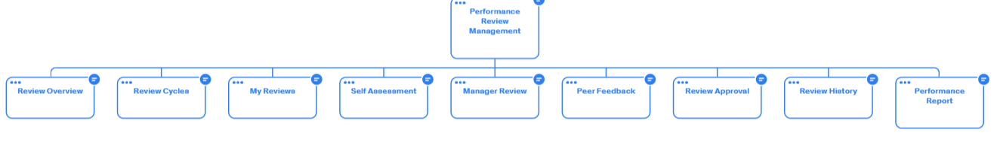

---

## IV. ERD (DB, Entity Diagram)

### 1. Performance Review ERD
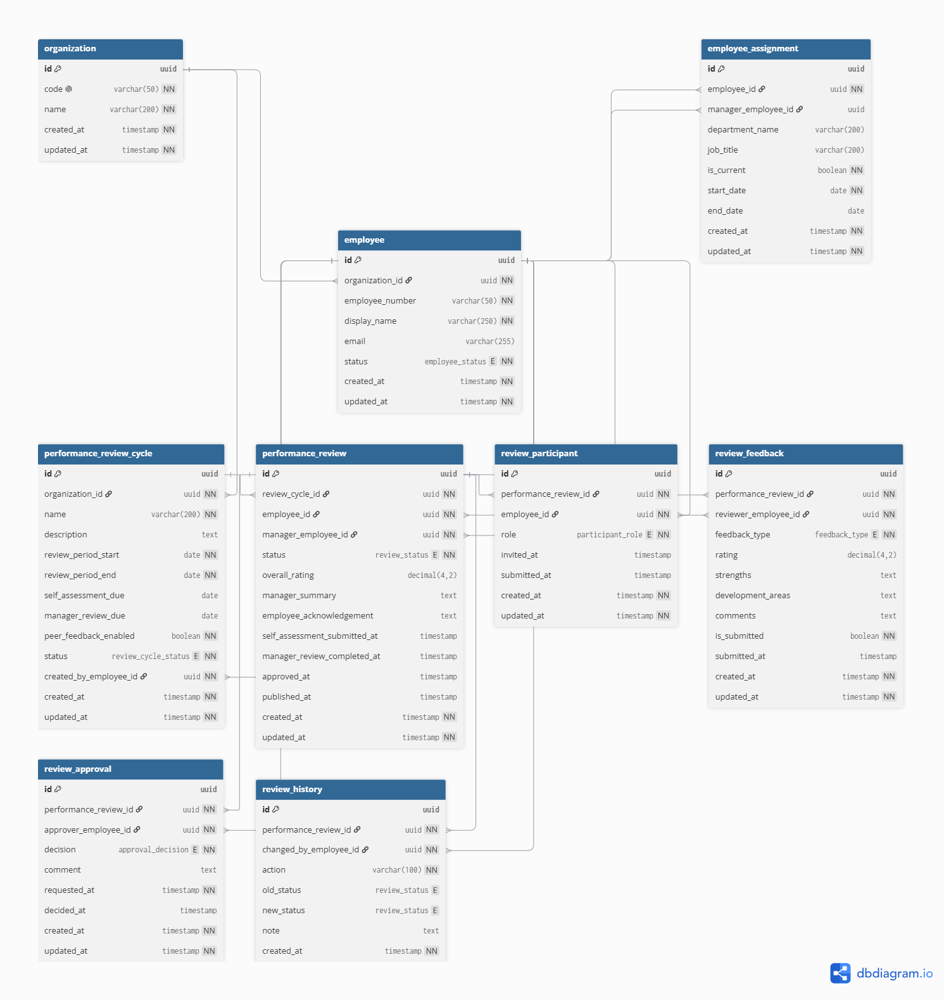

### 2. 1-on-1 Coaching ERD
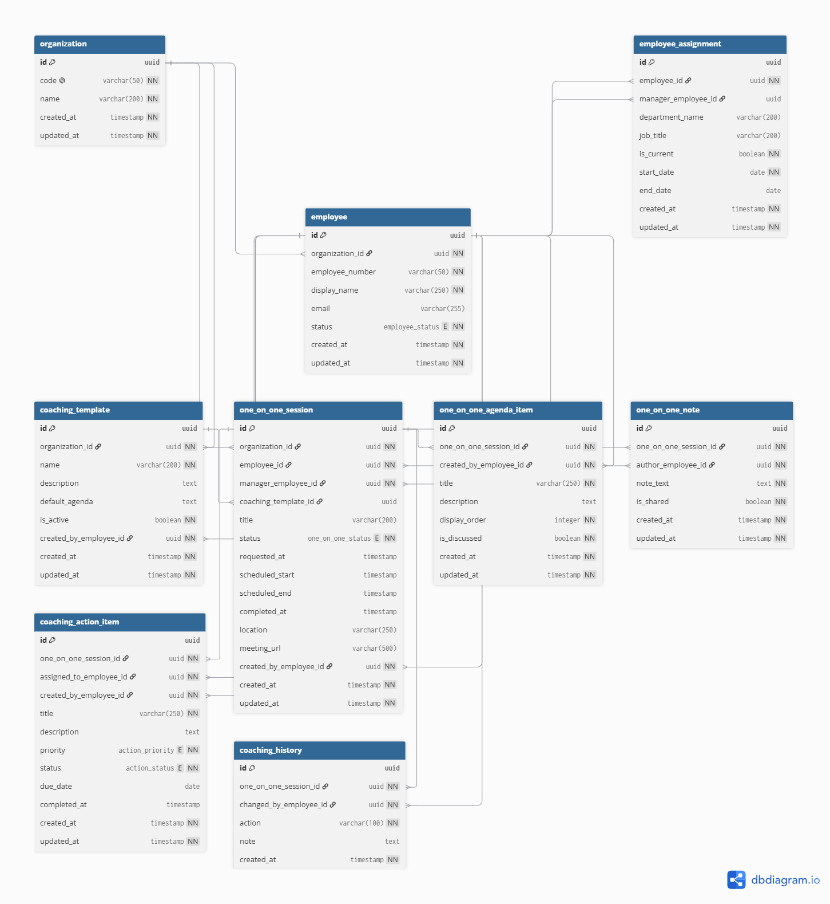

---

## V. API Swagger

### 1. Performance Review API Swagger
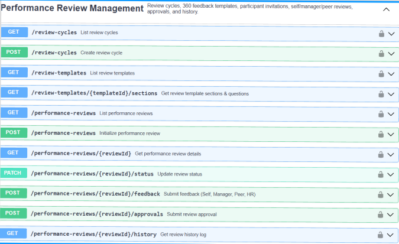

### 2. 1-on-1 Coaching API Swagger
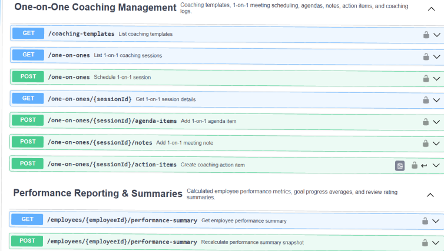

---

## VI. API docs

### Performance Management

```text
Performance
└── Performance Management
    ├── Goal Management
    │   ├── Goal Cycles
    │   │   ├── GET    /goal-cycles
    │   │   ├── POST   /goal-cycles
    │   │   └── GET    /goal-cycles/{cycleId}
    │   ├── Performance Goals
    │   │   ├── GET    /goals
    │   │   ├── POST   /goals
    │   │   ├── GET    /goals/{goalId}
    │   │   ├── PUT    /goals/{goalId}
    │   │   └── PATCH  /goals/{goalId}/progress
    │   └── Goal Workflow & History
    │       ├── POST   /goals/{goalId}/approvals
    │       ├── POST   /goals/{goalId}/revisions
    │       └── GET    /goals/{goalId}/history
    ├── Performance Review Management
    │   ├── Review Cycles & Templates
    │   │   ├── GET    /review-cycles
    │   │   ├── POST   /review-cycles
    │   │   ├── GET    /review-cycles/{cycleId}
    │   │   ├── GET    /review-templates
    │   │   ├── POST   /review-templates
    │   │   └── GET    /review-templates/{templateId}/sections
    │   ├── Performance Reviews & Feedback
    │   │   ├── GET    /performance-reviews
    │   │   ├── POST   /performance-reviews
    │   │   ├── GET    /performance-reviews/{reviewId}
    │   │   ├── PATCH  /performance-reviews/{reviewId}/status
    │   │   ├── GET    /performance-reviews/{reviewId}/participants
    │   │   └── POST   /performance-reviews/{reviewId}/feedback
    │   └── Approvals & Corrections
    │       ├── POST   /performance-reviews/{reviewId}/approvals
    │       ├── POST   /performance-reviews/{reviewId}/corrections
    │       └── GET    /performance-reviews/{reviewId}/history
    ├── One-on-One Coaching Management
    │   ├── Coaching Templates & Sessions
    │   │   ├── GET    /coaching-templates
    │   │   ├── POST   /coaching-templates
    │   │   ├── GET    /one-on-ones
    │   │   ├── POST   /one-on-ones
    │   │   ├── GET    /one-on-ones/{sessionId}
    │   │   └── PATCH  /one-on-ones/{sessionId}/status
    │   └── Session Artifacts & Follow-ups
    │       ├── POST   /one-on-ones/{sessionId}/agenda-items
    │       ├── POST   /one-on-ones/{sessionId}/notes
    │       ├── POST   /one-on-ones/{sessionId}/action-items
    │       └── GET    /one-on-ones/{sessionId}/history
    └── Performance Reporting & Summaries
        └── Performance Summaries
            ├── GET    /employees/{employeeId}/performance-summary
            └── POST   /employees/{employeeId}/performance-summary/recalculate
```
