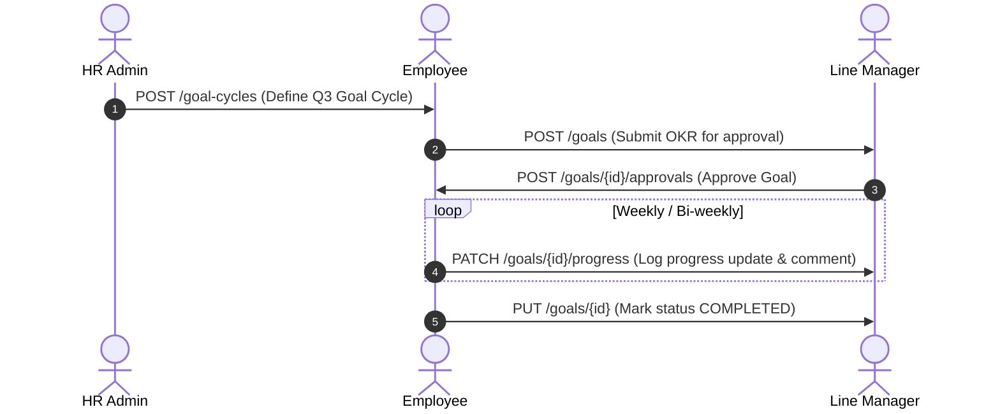
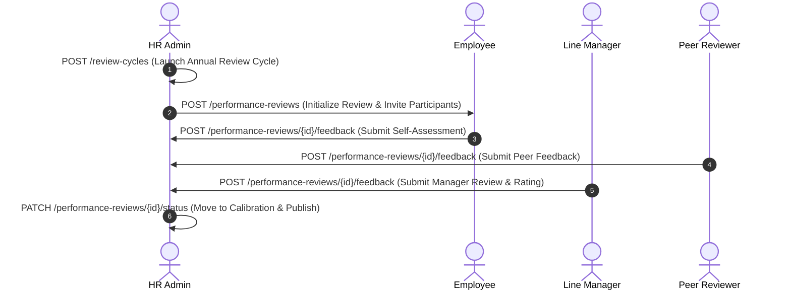
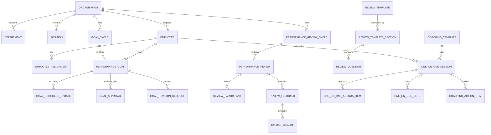
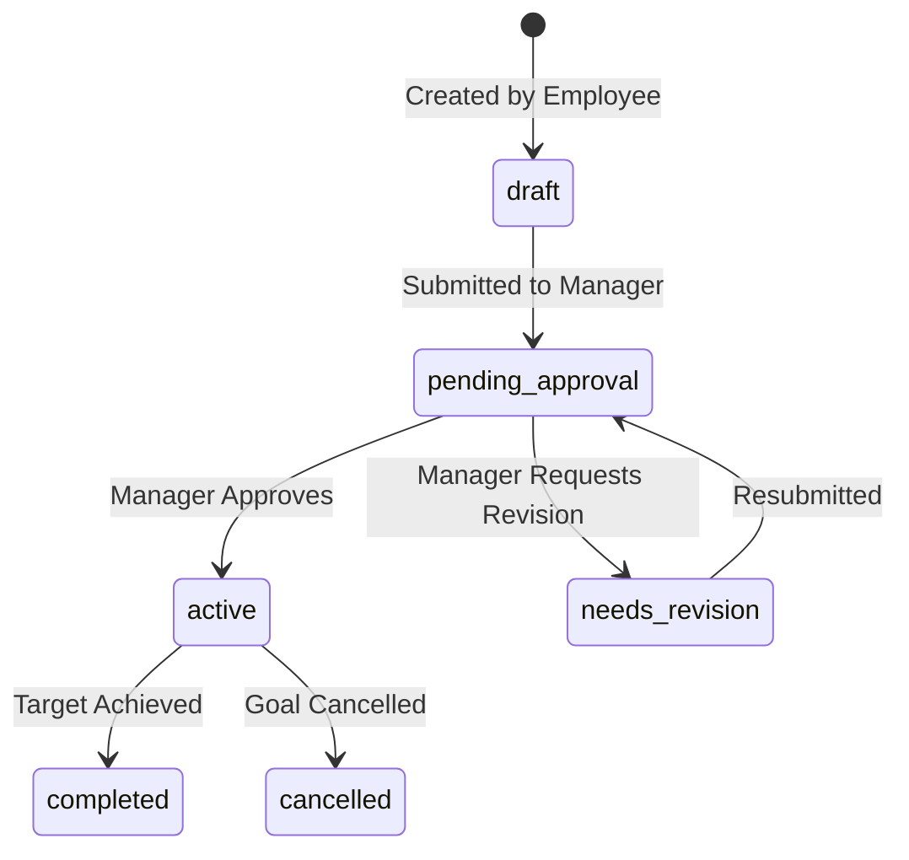
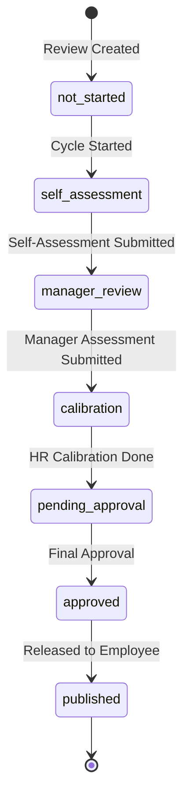

# Copilot HR - Performance Management System API Documentation

## 1. Overview & Architecture

The **Performance Management System** in Copilot HR provides a modern framework for managing Objectives and Key Results (OKRs), KPIs, 360-degree performance reviews, continuous 1-on-1 coaching sessions, and real-time performance analytics.

### Key Features:
- **Comprehensive Database Architecture**: Fully synchronized with `performance/overall.dbml` (30+ tables and enumerations).
- **Goal Management (OKRs & KPIs)**: Goal cycles, multi-level goal ownership (Individual, Team, Department, Organization), progress updates, manager approvals, revision requests, and full change history.
- **360-Degree Performance Reviews**: Flexible review cycles, customizable section/question templates, multi-role feedback (Self, Manager, Peer, HR), calibration workflow, manager summaries, approvals, and dispute/correction requests.
- **Continuous 1-on-1 Coaching**: Meeting scheduling, coaching templates, agenda items, shared/private meeting notes, priority action items, and coaching audit logs.
- **Executive Summaries & Reporting**: Materialized performance snapshots tracking goal completion %, review ratings, and open coaching action items.

---

## 1.1 API Route Tree Structure

```text
Performance Management System API
│
├── Goal Management
│   ├── GET    /goal-cycles
│   ├── POST   /goal-cycles
│   ├── GET    /goal-cycles/{cycleId}
│   ├── GET    /goals
│   ├── POST   /goals
│   ├── GET    /goals/{goalId}
│   ├── PUT    /goals/{goalId}
│   ├── PATCH  /goals/{goalId}/progress
│   ├── POST   /goals/{goalId}/approvals
│   ├── POST   /goals/{goalId}/revisions
│   └── GET    /goals/{goalId}/history
│
├── Performance Review Management
│   ├── GET    /review-cycles
│   ├── POST   /review-cycles
│   ├── GET    /review-cycles/{cycleId}
│   ├── GET    /review-templates
│   ├── POST   /review-templates
│   ├── GET    /review-templates/{templateId}/sections
│   ├── GET    /performance-reviews
│   ├── POST   /performance-reviews
│   ├── GET    /performance-reviews/{reviewId}
│   ├── PATCH  /performance-reviews/{reviewId}/status
│   ├── GET    /performance-reviews/{reviewId}/participants
│   ├── POST   /performance-reviews/{reviewId}/feedback
│   ├── POST   /performance-reviews/{reviewId}/approvals
│   ├── POST   /performance-reviews/{reviewId}/corrections
│   └── GET    /performance-reviews/{reviewId}/history
│
├── One-on-One Coaching Management
│   ├── GET    /coaching-templates
│   ├── POST   /coaching-templates
│   ├── GET    /one-on-ones
│   ├── POST   /one-on-ones
│   ├── GET    /one-on-ones/{sessionId}
│   ├── PATCH  /one-on-ones/{sessionId}/status
│   ├── POST   /one-on-ones/{sessionId}/agenda-items
│   ├── POST   /one-on-ones/{sessionId}/notes
│   ├── POST   /one-on-ones/{sessionId}/action-items
│   └── GET    /one-on-ones/{sessionId}/history
│
└── Performance Reporting & Summaries
    ├── GET    /employees/{employeeId}/performance-summary
    └── POST   /employees/{employeeId}/performance-summary/recalculate
```

---

## 2. Actors & System Roles

| Role | Description & Responsibilities |
| :--- | :--- |
| **Employee** | Creates individual OKRs/KPIs, logs progress updates, requests goal revisions, submits self-assessments, participates in peer feedback, schedules 1-on-1 coaching sessions, and completes assigned action items. |
| **Manager** | Reviews & approves employee goals, conducts manager performance evaluations, participates in calibration sessions, conducts 1-on-1 coaching meetings, and assigns action items. |
| **Peer Reviewer** | Submits 360-degree peer feedback and ratings when invited into a performance review participant list. |
| **HR Specialist / Admin** | Configures goal cycles, review cycles, review templates, manages calibration meetings, approves final performance evaluations, and oversees organizational performance analytics. |

---

## 3. End-to-End Business Flow Mapping

### 3.1 OKR & Goal Lifecycle Sequence


### 3.2 360-Degree Performance Review Sequence


---

## 4. Entity Relationship Diagram (`overall.dbml`)



---

## 5. Detailed Module Endpoint Reference

### 5.1 Goal Management

#### `POST /api/v1/goals`
Create a performance goal (OKR / KPI).
- **Request Body**:
```json
{
  "goal_cycle_id": "11111111-1111-1111-1111-111111111111",
  "organization_id": "22222222-2222-2222-2222-222222222222",
  "owner_type": "individual",
  "owner_employee_id": "33333333-3333-3333-3333-333333333333",
  "title": "Increase API Test Coverage to 90%",
  "description": "Improve unit and integration test coverage across all microservices.",
  "success_criteria": "All core endpoints must pass automated pipeline tests.",
  "weight": 25.00,
  "target_value": 90.00,
  "current_value": 65.00,
  "unit": "%",
  "start_date": "2026-07-01",
  "due_date": "2026-09-30",
  "status": "pending_approval",
  "progress_status": "on_track",
  "created_by_employee_id": "33333333-3333-3333-3333-333333333333"
}
```

#### `PATCH /api/v1/goals/{goalId}/progress`
Log progress update on a goal.
- **Request Body**:
```json
{
  "new_value": 80.00,
  "new_progress_status": "on_track",
  "comment": "Completed integration tests for authentication module.",
  "updated_by_employee_id": "33333333-3333-3333-3333-333333333333"
}
```

---

### 5.2 Performance Review Management

#### `POST /api/v1/performance-reviews/{reviewId}/feedback`
Submit 360-degree feedback (Self, Manager, Peer, or HR).
- **Request Body**:
```json
{
  "reviewer_employee_id": "33333333-3333-3333-3333-333333333333",
  "feedback_type": "self_assessment",
  "overall_rating": 4.50,
  "strengths": "Strong architectural delivery and proactive team mentorship.",
  "development_areas": "Need to delegate routine test monitoring tasks.",
  "comments": "Overall very productive cycle.",
  "answers": [
    {
      "review_question_id": "44444444-4444-4444-4444-444444444444",
      "rating_value": 5.00,
      "text_value": "Exceeded targets for Q2 sprint feature deliverables."
    }
  ]
}
```

---

### 5.3 One-on-One Coaching Management

#### `POST /api/v1/one-on-ones`
Schedule a 1-on-1 coaching session.
- **Request Body**:
```json
{
  "organization_id": "22222222-2222-2222-2222-222222222222",
  "employee_id": "33333333-3333-3333-3333-333333333333",
  "manager_employee_id": "55555555-5555-5555-5555-555555555555",
  "title": "Bi-Weekly Career Coaching & Goal Check-in",
  "scheduled_start": "2026-08-25T10:00:00Z",
  "scheduled_end": "2026-08-25T10:30:00Z",
  "location": "Meeting Room B",
  "meeting_url": "https://meet.google.com/abc-defg-hij",
  "created_by_employee_id": "55555555-5555-5555-5555-555555555555"
}
```

#### `POST /api/v1/one-on-ones/{sessionId}/action-items`
Assign follow-up action item.
- **Request Body**:
```json
{
  "assigned_to_employee_id": "33333333-3333-3333-3333-333333333333",
  "created_by_employee_id": "55555555-5555-5555-5555-555555555555",
  "title": "Complete System Architecture Workshop Registration",
  "priority": "high",
  "status": "open",
  "due_date": "2026-09-15"
}
```

---

### 5.4 Performance Reporting & Summaries

#### `GET /api/v1/employees/{employeeId}/performance-summary`
Retrieve employee performance snapshot.
- **Response 200 OK**:
```json
{
  "id": "77777777-7777-7777-7777-777777777777",
  "employee_id": "33333333-3333-3333-3333-333333333333",
  "review_cycle_id": "11111111-1111-1111-1111-111111111111",
  "goal_completion_percent": 85.50,
  "average_goal_progress": 92.00,
  "overall_review_rating": 4.50,
  "one_on_one_sessions_count": 12,
  "open_action_items_count": 2,
  "calculated_at": "2026-08-11T16:00:00Z"
}
```

---

## 6. Status Lifecycle State Machines

### 6.1 Goal Status State Machine


### 6.2 Performance Review Status State Machine


---

## 7. Error Handling

Standard RFC 7807 Error Response:

```json
{
  "code": "INVALID_GOAL_STATUS_TRANSITION",
  "message": "Cannot set progress update for goal in 'draft' status until approved.",
  "details": [
    "Goal ID 33333333-3333-3333-3333-333333333333 current status is draft."
  ],
  "timestamp": "2026-08-11T16:24:50Z"
}
```
