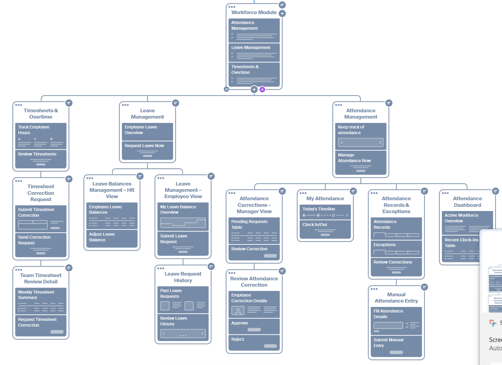

## II. Use case images

### 28. Attendance Management


### 29. Leave Management


### 30. Timesheet and Overtime Management


### 32. Work Schedule Management


## III. IA

## IV. UI/UX
### 28. Attendence Management

#### Attendance Corrections


## V. API docs
### Attendence Management
[Link to API documents](https://app.swaggerhub.com/apis-docs/digitaltransformatio-4d0/Attendence-management/1.0.0)
```text
Workforce
└── Attendance Management
    ├── Attendance Dashboard
    │   ├── Dashboard Summary
    │   │   └── GET    /attendance/dashboard/summary
    │   ├── Recent Clock-ins
    │   │   └── GET    /attendance/dashboard/recent-clock-ins
    │   └── Export
    │       └── GET    /attendance/dashboard/export
    ├── Attendance Records & Exceptions
    │   ├── Attendance Records
    │   │   ├── GET    /attendance-records
    │   │   ├── POST   /attendance-records
    │   │   │          └── Create Manual Entry
    │   │   ├── GET    /attendance-records/summary
    │   │   ├── GET    /attendance-records/export
    │   │   ├── GET    /attendance-records/{recordId}
    │   │   ├── PATCH  /attendance-records/{recordId}
    │   │   └── GET    /attendance-records/{recordId}/breaks
    │   └── Attendance Exceptions
    │       ├── GET    /attendance-exceptions
    │       └── GET    /attendance-exceptions/summary
    ├── Attendance Corrections
    │   ├── Correction Requests
    │   │   ├── GET    /attendance-corrections
    │   │   ├── POST   /attendance-corrections
    │   │   ├── GET    /attendance-corrections/summary
    │   │   ├── GET    /attendance-corrections/export
    │   │   │
    │   │   ├── GET    /attendance-corrections/{correctionId}
    │   │   └── PATCH  /attendance-corrections/{correctionId}
    │   ├── Correction Review
    │   │   ├── GET    /attendance-corrections/{correctionId}/review
    │   │   ├── POST   /attendance-corrections/{correctionId}/approve
    │   │   ├── POST   /attendance-corrections/{correctionId}/reject
    │   │   └── GET    /attendance-corrections/{correctionId}/review/history
    │   └── Correction History
    │       ├── GET    /employees/{employeeId}/attendance-corrections
    │       └── GET    /attendance-records/{recordId}/corrections
    └── Reference Data
        ├── Employees
        │   ├── GET    /employees/{employeeId}
        │   └── GET    /employees/{employeeId}/attendance-records
        └── Shifts
            └── GET    /shifts/{shiftId}
```

### Leave Management
[Link to API documents](https://app.swaggerhub.com/apis-docs/digitaltransformatio-4d0/leave-management)
```text
Leave Management API
|
├── Leave Requests
|   ├── GET   /leave-requests
|   ├── POST  /leave-requests
|   ├── GET   /leave-requests/{requestId}
|   ├── PATCH /leave-requests/{requestId}
|   └── POST  /leave-requests/{requestId}/cancel
|
├── Leave Balances
|   ├── GET /employees/{employeeId}/leave-balances
|   ├── GET /employees/{employeeId}/leave-balances/{leaveTypeId}
|   └── GET /employees/{employeeId}/leave-balances/{leaveTypeId}/adjustments
|
├── Team Leave Calendar
|   └── GET /teams/{teamId}/leave-calendar
|
└── Reference Data
    ├── GET /leave-types
    ├── GET /leave-policies
    └── GET /holidays
```

### Time Sheet View
[Link to API documents](images/erd/workforce/time-sheet-review.png)
```text
Timesheet Review API
|
├── Team Timesheets
|   ├── GET  /timesheets
|   ├── GET  /timesheets/{timesheetId}
|   ├── POST /timesheets/{timesheetId}/approve
|   └── POST /timesheets/{timesheetId}/reject
|
├── Timesheet Entries
|   ├── GET   /timesheets/{timesheetId}/entries
|   └── PATCH /timesheets/{timesheetId}/entries/{entryId}
|
├── Timesheet Corrections
|   ├── GET  /timesheets/{timesheetId}/corrections
|   └── POST /timesheets/{timesheetId}/corrections
|
└── Reference Data
    ├── GET /employees/{employeeId}
    └── GET /departments/{departmentId}
```
