## II. Use case images

### 28. Attendance Management
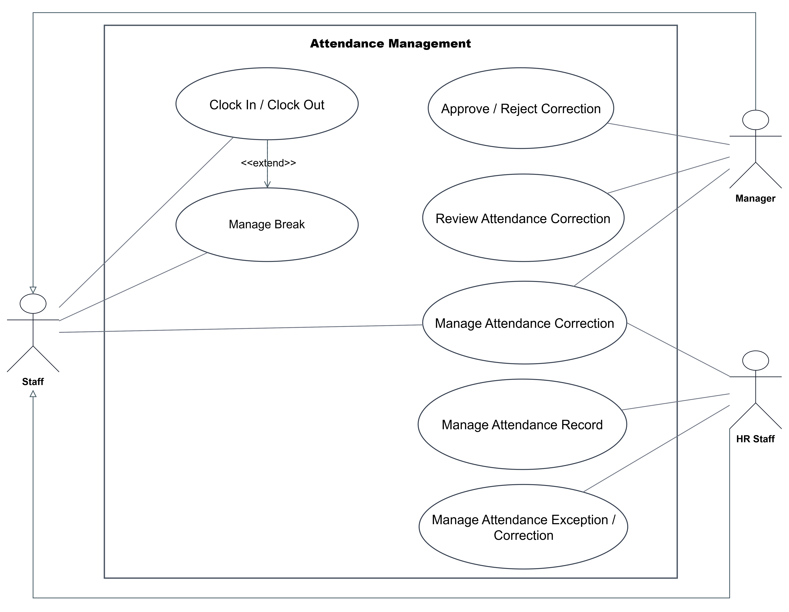

### 29. Leave Management

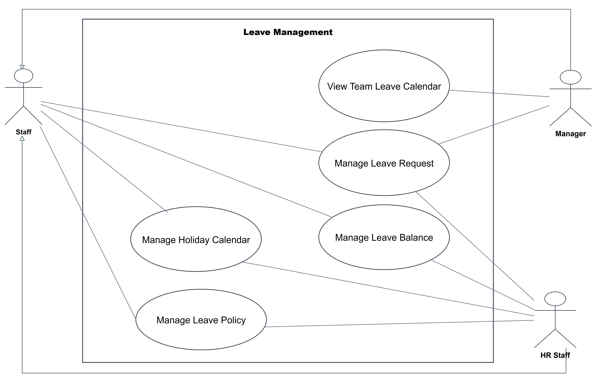

### 30. Timesheet and Overtime Management


### 32. Work Schedule Management
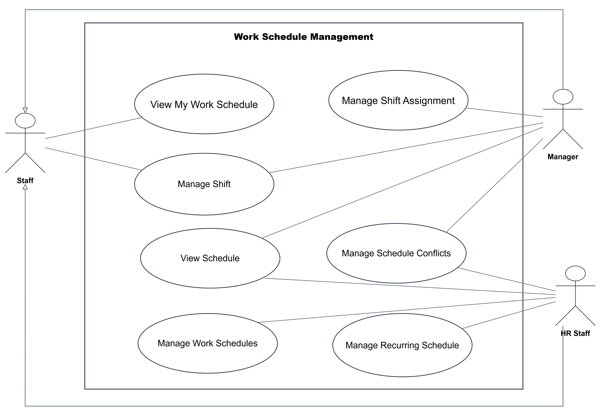

## III. IA
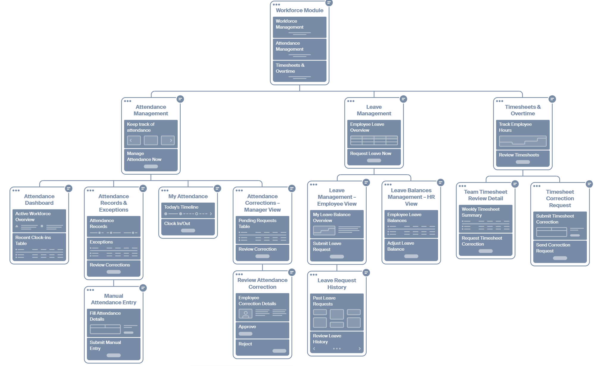

## IV. UI/UX
### 28. Attendence Management
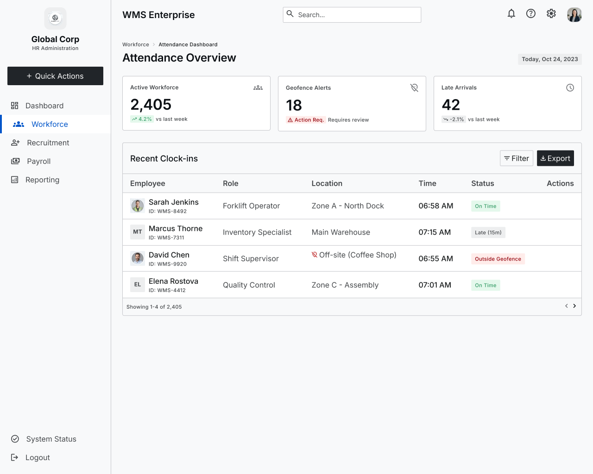

#### Attendance Corrections

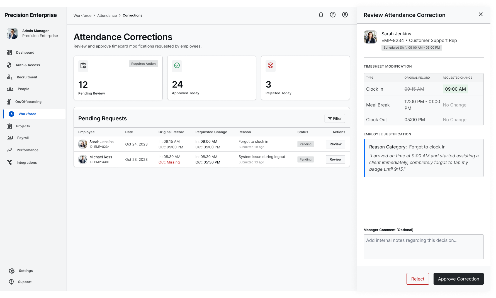
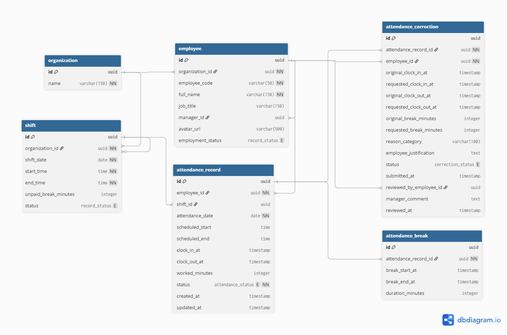
---

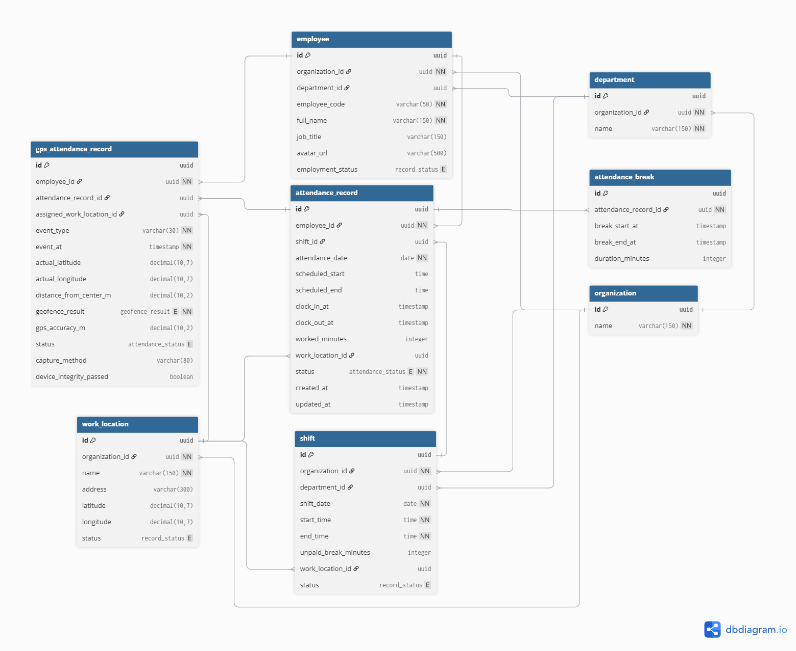
---
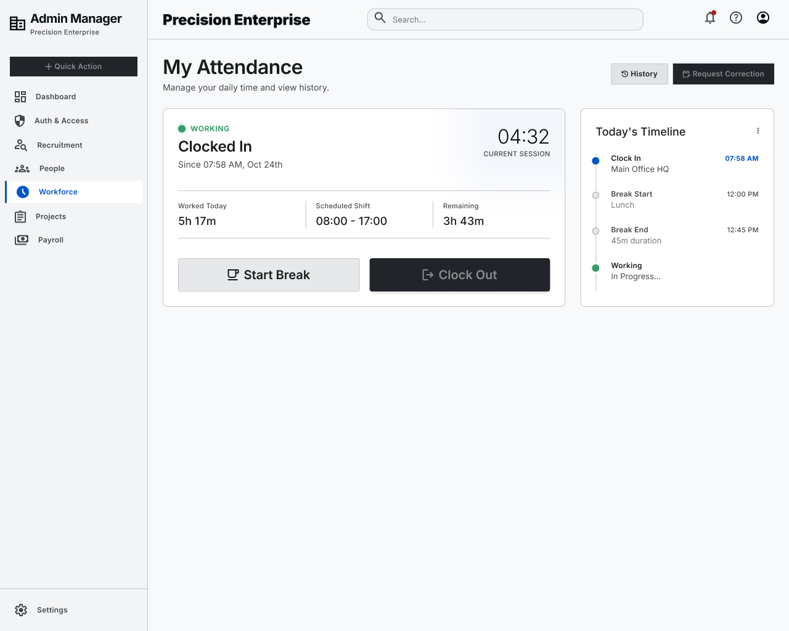
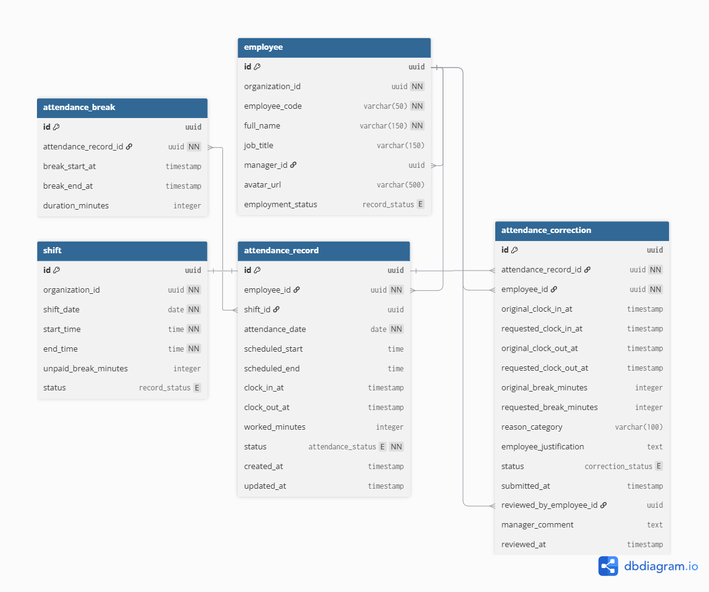
---
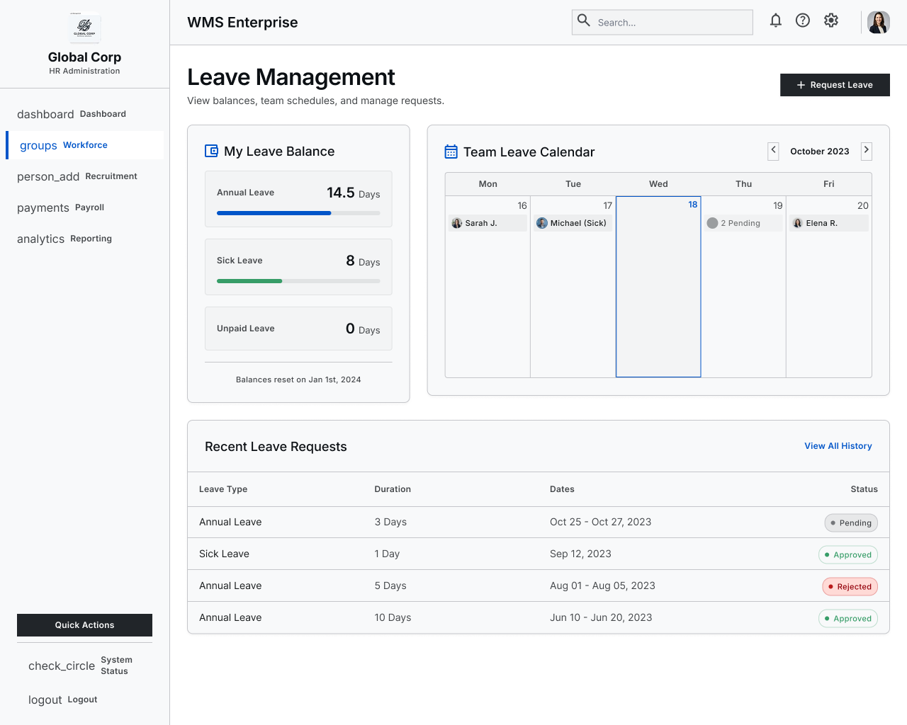
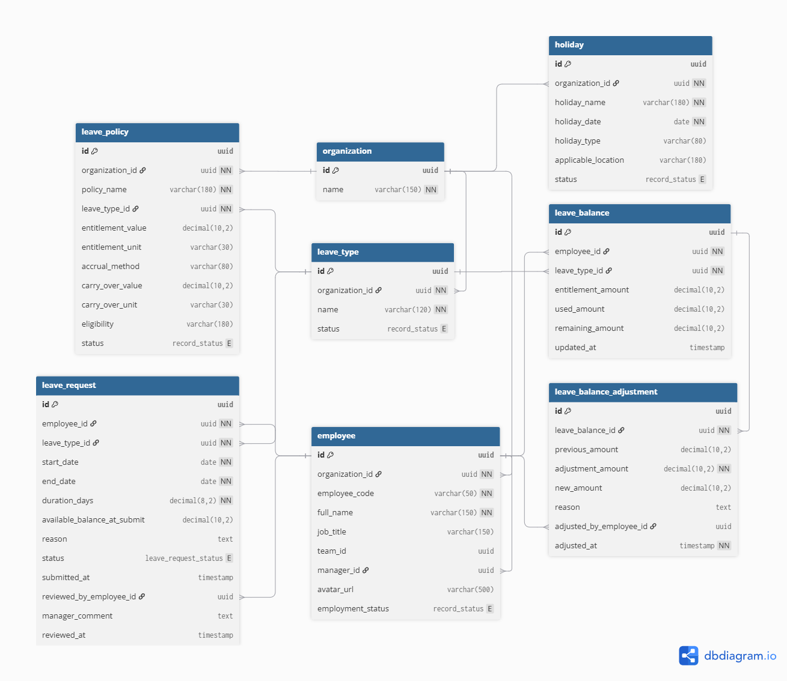
---
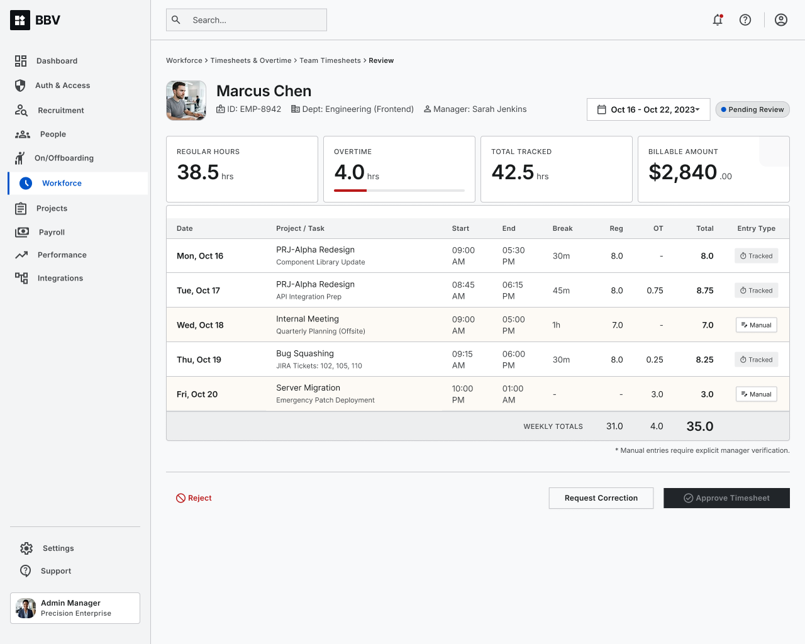
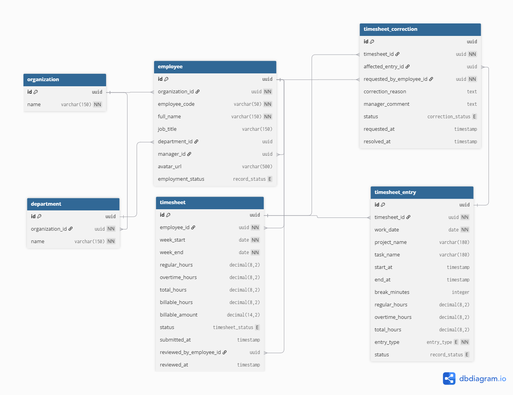

## V. API docs
### Entire Workforce API docs

[Link to API documents](https://app.swaggerhub.com/apis-docs/digitaltransformatio-4d0/index-workforce/1.0.0)

#### Attendence Management (27)
[Link to API documents](https://app.swaggerhub.com/apis-docs/digitaltransformatio-4d0/Attendence-management/1.0.0)
```text
Workforce
└── Attendance Management
    ├── Attendance Dashboard
    │   ├── Dashboard Summary
    │   │   └── GET    /attendance/dashboard/summary
    │   ├── Recent Clock-ins
    │   │   └── GET    /attendance/dashboard/recent-clock-ins
    │   └── Export
    │       └── GET    /attendance/dashboard/export
    ├── Attendance Records & Exceptions
    │   ├── Attendance Records
    │   │   ├── GET    /attendance-records
    │   │   ├── POST   /attendance-records
    │   │   │          └── Create Manual Entry
    │   │   ├── GET    /attendance-records/summary
    │   │   ├── GET    /attendance-records/export
    │   │   ├── GET    /attendance-records/{recordId}
    │   │   ├── PATCH  /attendance-records/{recordId}
    │   │   └── GET    /attendance-records/{recordId}/breaks
    │   └── Attendance Exceptions
    │       ├── GET    /attendance-exceptions
    │       └── GET    /attendance-exceptions/summary
    ├── Attendance Corrections
    │   ├── Correction Requests
    │   │   ├── GET    /attendance-corrections
    │   │   ├── POST   /attendance-corrections
    │   │   ├── GET    /attendance-corrections/summary
    │   │   ├── GET    /attendance-corrections/export
    │   │   │
    │   │   ├── GET    /attendance-corrections/{correctionId}
    │   │   └── PATCH  /attendance-corrections/{correctionId}
    │   ├── Correction Review
    │   │   ├── GET    /attendance-corrections/{correctionId}/review
    │   │   ├── POST   /attendance-corrections/{correctionId}/approve
    │   │   ├── POST   /attendance-corrections/{correctionId}/reject
    │   │   └── GET    /attendance-corrections/{correctionId}/review/history
    │   └── Correction History
    │       ├── GET    /employees/{employeeId}/attendance-corrections
    │       └── GET    /attendance-records/{recordId}/corrections
    └── Reference Data
        ├── Employees
        │   ├── GET    /employees/{employeeId}
        │   └── GET    /employees/{employeeId}/attendance-records
        └── Shifts
            └── GET    /shifts/{shiftId}
```

#### Leave Management (12)
[Link to API documents](https://app.swaggerhub.com/apis-docs/digitaltransformatio-4d0/leave-management)
```text
Leave Management API 
|
├── Leave Requests
|   ├── GET   /leave-requests
|   ├── POST  /leave-requests
|   ├── GET   /leave-requests/{requestId}
|   ├── PATCH /leave-requests/{requestId}
|   └── POST  /leave-requests/{requestId}/cancel
|
├── Leave Balances
|   ├── GET /employees/{employeeId}/leave-balances
|   ├── GET /employees/{employeeId}/leave-balances/{leaveTypeId}
|   └── GET /employees/{employeeId}/leave-balances/{leaveTypeId}/adjustments
|
├── Team Leave Calendar
|   └── GET /teams/{teamId}/leave-calendar
|
└── Reference Data
    ├── GET /leave-types
    ├── GET /leave-policies
    └── GET /holidays
```

#### Time Sheet View (10)
[Link to API documents](https://app.swaggerhub.com/apis-docs/digitaltransformatio-4d0/time-sheet-review/1.0.0)
```text
Timesheet Review API
|
├── Team Timesheets
|   ├── GET  /timesheets
|   ├── GET  /timesheets/{timesheetId}
|   ├── POST /timesheets/{timesheetId}/approve
|   └── POST /timesheets/{timesheetId}/reject
|
├── Timesheet Entries
|   ├── GET   /timesheets/{timesheetId}/entries
|   └── PATCH /timesheets/{timesheetId}/entries/{entryId}
|
├── Timesheet Corrections
|   ├── GET  /timesheets/{timesheetId}/corrections
|   └── POST /timesheets/{timesheetId}/corrections
|
└── Reference Data
    ├── GET /employees/{employeeId}
    └── GET /departments/{departmentId}
```


## VI. Test Cases

This section defines the planned API test cases for the Workforce Management modules.

The test cases focus on:

* Successful request scenarios
* Request validation
* Authentication and authorization
* Resource not found scenarios
* Business rule validation
* Conflict handling
* Response validation
* Data persistence
* Filtering and pagination
* Export functionality

---

### 6.1 Attendance Management Test Cases

#### Attendance Dashboard

##### `GET /attendance/dashboard/summary`

```java
@Test void getDashboardSummary_shouldReturnSummary_whenRequestIsValid();
@Test void getDashboardSummary_shouldReturnZeroValues_whenNoAttendanceDataExists();
@Test void getDashboardSummary_shouldReturnUnauthorized_whenTokenIsMissing();
@Test void getDashboardSummary_shouldReturnForbidden_whenUserHasNoPermission();
```

##### `GET /attendance/dashboard/recent-clock-ins`

```java
@Test void getRecentClockIns_shouldReturnRecentClockIns_whenDataExists();
@Test void getRecentClockIns_shouldReturnEmptyList_whenNoClockInsExist();
@Test void getRecentClockIns_shouldReturnResultsOrderedByLatestFirst();
@Test void getRecentClockIns_shouldReturnUnauthorized_whenTokenIsMissing();
```

##### `GET /attendance/dashboard/export`

```java
@Test void exportAttendanceDashboard_shouldReturnFile_whenRequestIsValid();
@Test void exportAttendanceDashboard_shouldReturnCorrectContentType();
@Test void exportAttendanceDashboard_shouldReturnFileWithExpectedFilename();
@Test void exportAttendanceDashboard_shouldReturnForbidden_whenUserHasNoExportPermission();
```

---

#### Attendance Records

##### `GET /attendance-records`

```java
@Test void getAttendanceRecords_shouldReturnRecords_whenRecordsExist();
@Test void getAttendanceRecords_shouldReturnEmptyList_whenNoRecordsExist();
@Test void getAttendanceRecords_shouldFilterByEmployeeId();
@Test void getAttendanceRecords_shouldFilterByDateRange();
@Test void getAttendanceRecords_shouldFilterByStatus();
@Test void getAttendanceRecords_shouldSupportPagination();
@Test void getAttendanceRecords_shouldReturnBadRequest_whenDateRangeIsInvalid();
@Test void getAttendanceRecords_shouldReturnUnauthorized_whenTokenIsMissing();
@Test void getAttendanceRecords_shouldReturnForbidden_whenUserHasNoPermission();
```

##### `POST /attendance-records`

```java
@Test void createAttendanceRecord_shouldCreateManualEntry_whenRequestIsValid();
@Test void createAttendanceRecord_shouldReturnCreatedRecord();
@Test void createAttendanceRecord_shouldReturnBadRequest_whenEmployeeIdIsMissing();
@Test void createAttendanceRecord_shouldReturnBadRequest_whenAttendanceDateIsMissing();
@Test void createAttendanceRecord_shouldReturnBadRequest_whenClockInTimeIsInvalid();
@Test void createAttendanceRecord_shouldReturnBadRequest_whenClockOutTimeIsBeforeClockInTime();
@Test void createAttendanceRecord_shouldReturnNotFound_whenEmployeeDoesNotExist();
@Test void createAttendanceRecord_shouldReturnConflict_whenRecordAlreadyExists();
@Test void createAttendanceRecord_shouldReturnForbidden_whenUserCannotCreateManualEntry();
```

##### `GET /attendance-records/summary`

```java
@Test void getAttendanceRecordsSummary_shouldReturnSummary_whenDataExists();
@Test void getAttendanceRecordsSummary_shouldReturnZeroSummary_whenNoDataExists();
@Test void getAttendanceRecordsSummary_shouldFilterByDateRange();
@Test void getAttendanceRecordsSummary_shouldFilterByEmployeeId();
@Test void getAttendanceRecordsSummary_shouldReturnBadRequest_whenFilterIsInvalid();
```

##### `GET /attendance-records/export`

```java
@Test void exportAttendanceRecords_shouldReturnFile_whenRequestIsValid();
@Test void exportAttendanceRecords_shouldApplyFilters();
@Test void exportAttendanceRecords_shouldReturnCorrectContentType();
@Test void exportAttendanceRecords_shouldReturnForbidden_whenUserHasNoExportPermission();
```

##### `GET /attendance-records/{recordId}`

```java
@Test void getAttendanceRecordById_shouldReturnRecord_whenRecordExists();
@Test void getAttendanceRecordById_shouldReturnNotFound_whenRecordDoesNotExist();
@Test void getAttendanceRecordById_shouldReturnBadRequest_whenRecordIdIsInvalid();
@Test void getAttendanceRecordById_shouldReturnForbidden_whenUserCannotAccessRecord();
```

##### `PATCH /attendance-records/{recordId}`

```java
@Test void updateAttendanceRecord_shouldUpdateRecord_whenRequestIsValid();
@Test void updateAttendanceRecord_shouldUpdateClockInTime();
@Test void updateAttendanceRecord_shouldUpdateClockOutTime();
@Test void updateAttendanceRecord_shouldRecalculateWorkedHours();
@Test void updateAttendanceRecord_shouldReturnNotFound_whenRecordDoesNotExist();
@Test void updateAttendanceRecord_shouldReturnBadRequest_whenClockOutIsBeforeClockIn();
@Test void updateAttendanceRecord_shouldReturnConflict_whenRecordIsLocked();
@Test void updateAttendanceRecord_shouldReturnForbidden_whenUserHasNoEditPermission();
```

##### `GET /attendance-records/{recordId}/breaks`

```java
@Test void getAttendanceBreaks_shouldReturnBreaks_whenBreaksExist();
@Test void getAttendanceBreaks_shouldReturnEmptyList_whenNoBreaksExist();
@Test void getAttendanceBreaks_shouldReturnNotFound_whenRecordDoesNotExist();
```

---

#### Attendance Exceptions

##### `GET /attendance-exceptions`

```java
@Test void getAttendanceExceptions_shouldReturnExceptions_whenExceptionsExist();
@Test void getAttendanceExceptions_shouldReturnEmptyList_whenNoExceptionsExist();
@Test void getAttendanceExceptions_shouldFilterByEmployeeId();
@Test void getAttendanceExceptions_shouldFilterByExceptionType();
@Test void getAttendanceExceptions_shouldFilterByDateRange();
@Test void getAttendanceExceptions_shouldSupportPagination();
```

##### `GET /attendance-exceptions/summary`

```java
@Test void getAttendanceExceptionsSummary_shouldReturnSummary_whenExceptionsExist();
@Test void getAttendanceExceptionsSummary_shouldReturnZeroValues_whenNoExceptionsExist();
@Test void getAttendanceExceptionsSummary_shouldGroupByExceptionType();
```

---

#### Attendance Corrections

##### `GET /attendance-corrections`

```java
@Test void getAttendanceCorrections_shouldReturnCorrections_whenDataExists();
@Test void getAttendanceCorrections_shouldReturnEmptyList_whenNoCorrectionsExist();
@Test void getAttendanceCorrections_shouldFilterByStatus();
@Test void getAttendanceCorrections_shouldFilterByEmployeeId();
@Test void getAttendanceCorrections_shouldFilterByDateRange();
@Test void getAttendanceCorrections_shouldSupportPagination();
```

##### `POST /attendance-corrections`

```java
@Test void createAttendanceCorrection_shouldCreateRequest_whenRequestIsValid();
@Test void createAttendanceCorrection_shouldReturnCreatedRequest();
@Test void createAttendanceCorrection_shouldReturnBadRequest_whenRecordIdIsMissing();
@Test void createAttendanceCorrection_shouldReturnBadRequest_whenReasonIsMissing();
@Test void createAttendanceCorrection_shouldReturnNotFound_whenAttendanceRecordDoesNotExist();
@Test void createAttendanceCorrection_shouldReturnConflict_whenPendingCorrectionAlreadyExists();
@Test void createAttendanceCorrection_shouldReturnConflict_whenAttendanceRecordIsLocked();
```

##### `GET /attendance-corrections/summary`

```java
@Test void getAttendanceCorrectionsSummary_shouldReturnSummary();
@Test void getAttendanceCorrectionsSummary_shouldCountPendingRequests();
@Test void getAttendanceCorrectionsSummary_shouldCountApprovedRequests();
@Test void getAttendanceCorrectionsSummary_shouldCountRejectedRequests();
```

##### `GET /attendance-corrections/export`

```java
@Test void exportAttendanceCorrections_shouldReturnFile();
@Test void exportAttendanceCorrections_shouldApplyFilters();
@Test void exportAttendanceCorrections_shouldReturnCorrectContentType();
```

##### `GET /attendance-corrections/{correctionId}`

```java
@Test void getAttendanceCorrectionById_shouldReturnCorrection_whenCorrectionExists();
@Test void getAttendanceCorrectionById_shouldReturnNotFound_whenCorrectionDoesNotExist();
```

##### `PATCH /attendance-corrections/{correctionId}`

```java
@Test void updateAttendanceCorrection_shouldUpdateRequest_whenStatusIsPending();
@Test void updateAttendanceCorrection_shouldReturnNotFound_whenCorrectionDoesNotExist();
@Test void updateAttendanceCorrection_shouldReturnConflict_whenCorrectionIsAlreadyApproved();
@Test void updateAttendanceCorrection_shouldReturnConflict_whenCorrectionIsAlreadyRejected();
```

---

#### Correction Review

##### `GET /attendance-corrections/{correctionId}/review`

```java
@Test void getCorrectionReview_shouldReturnReviewDetails_whenCorrectionExists();
@Test void getCorrectionReview_shouldReturnNotFound_whenCorrectionDoesNotExist();
```

##### `POST /attendance-corrections/{correctionId}/approve`

```java
@Test void approveAttendanceCorrection_shouldApprovePendingCorrection();
@Test void approveAttendanceCorrection_shouldUpdateAttendanceRecord();
@Test void approveAttendanceCorrection_shouldRecalculateWorkedHours();
@Test void approveAttendanceCorrection_shouldReturnNotFound_whenCorrectionDoesNotExist();
@Test void approveAttendanceCorrection_shouldReturnConflict_whenCorrectionAlreadyApproved();
@Test void approveAttendanceCorrection_shouldReturnConflict_whenCorrectionAlreadyRejected();
@Test void approveAttendanceCorrection_shouldReturnForbidden_whenUserIsNotReviewer();
```

##### `POST /attendance-corrections/{correctionId}/reject`

```java
@Test void rejectAttendanceCorrection_shouldRejectPendingCorrection();
@Test void rejectAttendanceCorrection_shouldSaveRejectionReason();
@Test void rejectAttendanceCorrection_shouldReturnBadRequest_whenReasonIsMissing();
@Test void rejectAttendanceCorrection_shouldReturnNotFound_whenCorrectionDoesNotExist();
@Test void rejectAttendanceCorrection_shouldReturnConflict_whenCorrectionAlreadyProcessed();
@Test void rejectAttendanceCorrection_shouldReturnForbidden_whenUserIsNotReviewer();
```

##### `GET /attendance-corrections/{correctionId}/review/history`

```java
@Test void getCorrectionReviewHistory_shouldReturnHistory();
@Test void getCorrectionReviewHistory_shouldReturnEmptyList_whenNoHistoryExists();
@Test void getCorrectionReviewHistory_shouldReturnNotFound_whenCorrectionDoesNotExist();
```

---

#### Correction History

##### `GET /employees/{employeeId}/attendance-corrections`

```java
@Test void getEmployeeAttendanceCorrections_shouldReturnEmployeeCorrectionHistory();
@Test void getEmployeeAttendanceCorrections_shouldReturnEmptyList_whenEmployeeHasNoCorrections();
@Test void getEmployeeAttendanceCorrections_shouldReturnNotFound_whenEmployeeDoesNotExist();
```

##### `GET /attendance-records/{recordId}/corrections`

```java
@Test void getAttendanceRecordCorrections_shouldReturnCorrectionsForRecord();
@Test void getAttendanceRecordCorrections_shouldReturnEmptyList_whenRecordHasNoCorrections();
@Test void getAttendanceRecordCorrections_shouldReturnNotFound_whenRecordDoesNotExist();
```

---

#### Attendance Reference Data

##### `GET /employees/{employeeId}`

```java
@Test void getEmployeeById_shouldReturnEmployee_whenEmployeeExists();
@Test void getEmployeeById_shouldReturnNotFound_whenEmployeeDoesNotExist();
```

##### `GET /employees/{employeeId}/attendance-records`

```java
@Test void getEmployeeAttendanceRecords_shouldReturnRecords();
@Test void getEmployeeAttendanceRecords_shouldReturnEmptyList_whenNoRecordsExist();
@Test void getEmployeeAttendanceRecords_shouldReturnNotFound_whenEmployeeDoesNotExist();
```

##### `GET /shifts/{shiftId}`

```java
@Test void getShiftById_shouldReturnShift_whenShiftExists();
@Test void getShiftById_shouldReturnNotFound_whenShiftDoesNotExist();
```

---

### 6.2 Leave Management Test Cases

#### Leave Requests

##### `GET /leave-requests`

```java
@Test void getLeaveRequests_shouldReturnRequests_whenRequestsExist();
@Test void getLeaveRequests_shouldReturnEmptyList_whenNoRequestsExist();
@Test void getLeaveRequests_shouldFilterByEmployeeId();
@Test void getLeaveRequests_shouldFilterByLeaveType();
@Test void getLeaveRequests_shouldFilterByStatus();
@Test void getLeaveRequests_shouldFilterByDateRange();
@Test void getLeaveRequests_shouldSupportPagination();
@Test void getLeaveRequests_shouldReturnBadRequest_whenDateRangeIsInvalid();
@Test void getLeaveRequests_shouldReturnForbidden_whenUserCannotViewRequests();
```

##### `POST /leave-requests`

```java
@Test void createLeaveRequest_shouldCreateRequest_whenRequestIsValid();
@Test void createLeaveRequest_shouldReturnCreatedRequest();
@Test void createLeaveRequest_shouldCalculateLeaveDaysCorrectly();
@Test void createLeaveRequest_shouldExcludeHolidaysFromLeaveDays();
@Test void createLeaveRequest_shouldReturnBadRequest_whenEmployeeIdIsMissing();
@Test void createLeaveRequest_shouldReturnBadRequest_whenLeaveTypeIdIsMissing();
@Test void createLeaveRequest_shouldReturnBadRequest_whenStartDateIsMissing();
@Test void createLeaveRequest_shouldReturnBadRequest_whenEndDateIsBeforeStartDate();
@Test void createLeaveRequest_shouldReturnNotFound_whenLeaveTypeDoesNotExist();
@Test void createLeaveRequest_shouldReturnNotFound_whenEmployeeDoesNotExist();
@Test void createLeaveRequest_shouldReturnConflict_whenLeaveDatesOverlap();
@Test void createLeaveRequest_shouldReturnConflict_whenLeaveBalanceIsInsufficient();
@Test void createLeaveRequest_shouldReturnConflict_whenLeavePolicyDoesNotAllowRequest();
```

##### `GET /leave-requests/{requestId}`

```java
@Test void getLeaveRequestById_shouldReturnRequest_whenRequestExists();
@Test void getLeaveRequestById_shouldReturnNotFound_whenRequestDoesNotExist();
@Test void getLeaveRequestById_shouldReturnForbidden_whenUserCannotViewRequest();
```

##### `PATCH /leave-requests/{requestId}`

```java
@Test void updateLeaveRequest_shouldUpdateRequest_whenRequestIsPending();
@Test void updateLeaveRequest_shouldUpdateDateRange();
@Test void updateLeaveRequest_shouldRecalculateLeaveDays();
@Test void updateLeaveRequest_shouldReturnNotFound_whenRequestDoesNotExist();
@Test void updateLeaveRequest_shouldReturnBadRequest_whenDateRangeIsInvalid();
@Test void updateLeaveRequest_shouldReturnConflict_whenUpdatedDatesOverlap();
@Test void updateLeaveRequest_shouldReturnConflict_whenRequestIsAlreadyApproved();
@Test void updateLeaveRequest_shouldReturnConflict_whenRequestIsCancelled();
```

##### `POST /leave-requests/{requestId}/cancel`

```java
@Test void cancelLeaveRequest_shouldCancelPendingRequest();
@Test void cancelLeaveRequest_shouldCancelApprovedRequest_whenCancellationIsAllowed();
@Test void cancelLeaveRequest_shouldRestoreLeaveBalance_whenApprovedRequestIsCancelled();
@Test void cancelLeaveRequest_shouldReturnNotFound_whenRequestDoesNotExist();
@Test void cancelLeaveRequest_shouldReturnConflict_whenRequestAlreadyCancelled();
@Test void cancelLeaveRequest_shouldReturnConflict_whenLeaveHasAlreadyStarted();
@Test void cancelLeaveRequest_shouldReturnForbidden_whenUserCannotCancelRequest();
```

---

#### Leave Balances

##### `GET /employees/{employeeId}/leave-balances`

```java
@Test void getEmployeeLeaveBalances_shouldReturnAllBalances();
@Test void getEmployeeLeaveBalances_shouldReturnEmptyList_whenNoBalancesExist();
@Test void getEmployeeLeaveBalances_shouldReturnNotFound_whenEmployeeDoesNotExist();
@Test void getEmployeeLeaveBalances_shouldReturnForbidden_whenUserCannotViewBalance();
```

##### `GET /employees/{employeeId}/leave-balances/{leaveTypeId}`

```java
@Test void getLeaveBalanceByType_shouldReturnBalance_whenBalanceExists();
@Test void getLeaveBalanceByType_shouldReturnCorrectEntitlement();
@Test void getLeaveBalanceByType_shouldReturnCorrectUsedAmount();
@Test void getLeaveBalanceByType_shouldReturnCorrectRemainingAmount();
@Test void getLeaveBalanceByType_shouldReturnNotFound_whenEmployeeDoesNotExist();
@Test void getLeaveBalanceByType_shouldReturnNotFound_whenLeaveTypeDoesNotExist();
@Test void getLeaveBalanceByType_shouldReturnNotFound_whenBalanceDoesNotExist();
```

##### `GET /employees/{employeeId}/leave-balances/{leaveTypeId}/adjustments`

```java
@Test void getLeaveBalanceAdjustments_shouldReturnAdjustmentHistory();
@Test void getLeaveBalanceAdjustments_shouldReturnEmptyList_whenNoAdjustmentsExist();
@Test void getLeaveBalanceAdjustments_shouldReturnAdjustmentsOrderedByNewestFirst();
@Test void getLeaveBalanceAdjustments_shouldReturnNotFound_whenBalanceDoesNotExist();
```

---

#### Team Leave Calendar

##### `GET /teams/{teamId}/leave-calendar`

```java
@Test void getTeamLeaveCalendar_shouldReturnTeamLeaveEvents();
@Test void getTeamLeaveCalendar_shouldFilterByDateRange();
@Test void getTeamLeaveCalendar_shouldIncludeApprovedLeave();
@Test void getTeamLeaveCalendar_shouldExcludeCancelledLeave();
@Test void getTeamLeaveCalendar_shouldReturnEmptyList_whenNoTeamLeaveExists();
@Test void getTeamLeaveCalendar_shouldReturnNotFound_whenTeamDoesNotExist();
@Test void getTeamLeaveCalendar_shouldReturnForbidden_whenUserCannotViewTeam();
```

---

#### Leave Reference Data

##### `GET /leave-types`

```java
@Test void getLeaveTypes_shouldReturnActiveLeaveTypes();
@Test void getLeaveTypes_shouldReturnEmptyList_whenNoLeaveTypesExist();
```

##### `GET /leave-policies`

```java
@Test void getLeavePolicies_shouldReturnPolicies();
@Test void getLeavePolicies_shouldReturnOnlyApplicablePolicies();
@Test void getLeavePolicies_shouldReturnEmptyList_whenNoPoliciesExist();
```

##### `GET /holidays`

```java
@Test void getHolidays_shouldReturnHolidays();
@Test void getHolidays_shouldFilterByYear();
@Test void getHolidays_shouldReturnEmptyList_whenNoHolidaysExist();
@Test void getHolidays_shouldReturnBadRequest_whenYearIsInvalid();
```

---

### 6.3 Timesheet Review Test Cases

#### Team Timesheets

##### `GET /timesheets`

```java
@Test void getTimesheets_shouldReturnTimesheets_whenDataExists();
@Test void getTimesheets_shouldReturnEmptyList_whenNoTimesheetsExist();
@Test void getTimesheets_shouldFilterByEmployeeId();
@Test void getTimesheets_shouldFilterByDepartmentId();
@Test void getTimesheets_shouldFilterByStatus();
@Test void getTimesheets_shouldFilterByDateRange();
@Test void getTimesheets_shouldSupportPagination();
@Test void getTimesheets_shouldReturnBadRequest_whenDateRangeIsInvalid();
@Test void getTimesheets_shouldReturnForbidden_whenUserCannotViewTeamTimesheets();
```

##### `GET /timesheets/{timesheetId}`

```java
@Test void getTimesheetById_shouldReturnTimesheet_whenTimesheetExists();
@Test void getTimesheetById_shouldIncludeEmployeeInformation();
@Test void getTimesheetById_shouldIncludeTotalHours();
@Test void getTimesheetById_shouldIncludeEntries();
@Test void getTimesheetById_shouldReturnNotFound_whenTimesheetDoesNotExist();
@Test void getTimesheetById_shouldReturnForbidden_whenUserCannotViewTimesheet();
```

##### `POST /timesheets/{timesheetId}/approve`

```java
@Test void approveTimesheet_shouldApproveSubmittedTimesheet();
@Test void approveTimesheet_shouldSaveReviewerInformation();
@Test void approveTimesheet_shouldSaveApprovalTimestamp();
@Test void approveTimesheet_shouldReturnNotFound_whenTimesheetDoesNotExist();
@Test void approveTimesheet_shouldReturnConflict_whenTimesheetIsNotSubmitted();
@Test void approveTimesheet_shouldReturnConflict_whenTimesheetAlreadyApproved();
@Test void approveTimesheet_shouldReturnConflict_whenTimesheetAlreadyRejected();
@Test void approveTimesheet_shouldReturnForbidden_whenUserIsNotManager();
```

##### `POST /timesheets/{timesheetId}/reject`

```java
@Test void rejectTimesheet_shouldRejectSubmittedTimesheet();
@Test void rejectTimesheet_shouldSaveRejectionReason();
@Test void rejectTimesheet_shouldSaveReviewerInformation();
@Test void rejectTimesheet_shouldReturnBadRequest_whenReasonIsMissing();
@Test void rejectTimesheet_shouldReturnNotFound_whenTimesheetDoesNotExist();
@Test void rejectTimesheet_shouldReturnConflict_whenTimesheetIsNotSubmitted();
@Test void rejectTimesheet_shouldReturnConflict_whenTimesheetAlreadyApproved();
@Test void rejectTimesheet_shouldReturnConflict_whenTimesheetAlreadyRejected();
@Test void rejectTimesheet_shouldReturnForbidden_whenUserIsNotManager();
```

---

#### Timesheet Entries

##### `GET /timesheets/{timesheetId}/entries`

```java
@Test void getTimesheetEntries_shouldReturnEntries_whenEntriesExist();
@Test void getTimesheetEntries_shouldReturnEmptyList_whenNoEntriesExist();
@Test void getTimesheetEntries_shouldReturnEntriesOrderedByDate();
@Test void getTimesheetEntries_shouldReturnNotFound_whenTimesheetDoesNotExist();
@Test void getTimesheetEntries_shouldReturnForbidden_whenUserCannotViewTimesheet();
```

##### `PATCH /timesheets/{timesheetId}/entries/{entryId}`

```java
@Test void updateTimesheetEntry_shouldUpdateEntry_whenRequestIsValid();
@Test void updateTimesheetEntry_shouldUpdateStartTime();
@Test void updateTimesheetEntry_shouldUpdateEndTime();
@Test void updateTimesheetEntry_shouldRecalculateDuration();
@Test void updateTimesheetEntry_shouldUpdateProjectOrTask();
@Test void updateTimesheetEntry_shouldReturnBadRequest_whenEndTimeIsBeforeStartTime();
@Test void updateTimesheetEntry_shouldReturnNotFound_whenTimesheetDoesNotExist();
@Test void updateTimesheetEntry_shouldReturnNotFound_whenEntryDoesNotExist();
@Test void updateTimesheetEntry_shouldReturnConflict_whenTimesheetIsApproved();
@Test void updateTimesheetEntry_shouldReturnConflict_whenTimesheetIsLocked();
@Test void updateTimesheetEntry_shouldReturnForbidden_whenUserCannotEditEntry();
```

---

#### Timesheet Corrections

##### `GET /timesheets/{timesheetId}/corrections`

```java
@Test void getTimesheetCorrections_shouldReturnCorrections_whenCorrectionsExist();
@Test void getTimesheetCorrections_shouldReturnEmptyList_whenNoCorrectionsExist();
@Test void getTimesheetCorrections_shouldReturnCorrectionsOrderedByNewestFirst();
@Test void getTimesheetCorrections_shouldReturnNotFound_whenTimesheetDoesNotExist();
```

##### `POST /timesheets/{timesheetId}/corrections`

```java
@Test void createTimesheetCorrection_shouldCreateCorrection_whenRequestIsValid();
@Test void createTimesheetCorrection_shouldReturnCreatedCorrection();
@Test void createTimesheetCorrection_shouldSaveCorrectionReason();
@Test void createTimesheetCorrection_shouldReturnBadRequest_whenReasonIsMissing();
@Test void createTimesheetCorrection_shouldReturnNotFound_whenTimesheetDoesNotExist();
@Test void createTimesheetCorrection_shouldReturnConflict_whenPendingCorrectionAlreadyExists();
@Test void createTimesheetCorrection_shouldReturnConflict_whenTimesheetCannotBeCorrected();
@Test void createTimesheetCorrection_shouldReturnForbidden_whenUserCannotRequestCorrection();
```

---

#### Timesheet Reference Data

##### `GET /employees/{employeeId}`

```java
@Test void getEmployeeById_shouldReturnEmployee_whenEmployeeExists();
@Test void getEmployeeById_shouldReturnNotFound_whenEmployeeDoesNotExist();
```

##### `GET /departments/{departmentId}`

```java
@Test void getDepartmentById_shouldReturnDepartment_whenDepartmentExists();
@Test void getDepartmentById_shouldReturnNotFound_whenDepartmentDoesNotExist();
```

---

### 6.4 Common API Test Cases

The following test cases can be applied to endpoints where relevant.

#### Authentication

```java
@Test void endpoint_shouldReturnUnauthorized_whenAuthenticationTokenIsMissing();
@Test void endpoint_shouldReturnUnauthorized_whenAuthenticationTokenIsInvalid();
@Test void endpoint_shouldReturnUnauthorized_whenAuthenticationTokenIsExpired();
```

#### Authorization

```java
@Test void endpoint_shouldReturnForbidden_whenUserDoesNotHaveRequiredPermission();
```

#### Request Validation

```java
@Test void endpoint_shouldReturnBadRequest_whenPathParameterIsInvalid();
@Test void endpoint_shouldReturnBadRequest_whenQueryParameterIsInvalid();
@Test void endpoint_shouldReturnBadRequest_whenRequestBodyIsMalformed();
```

#### Resource Validation

```java
@Test void endpoint_shouldReturnNotFound_whenResourceDoesNotExist();
```

#### Response Validation

```java
@Test void endpoint_shouldReturnCorrectHttpStatus();
@Test void endpoint_shouldReturnCorrectContentType();
@Test void endpoint_shouldReturnExpectedResponseBody();
@Test void endpoint_shouldReturnExpectedResponseSchema();
```

#### Error Handling

```java
@Test void endpoint_shouldReturnInternalServerError_whenUnexpectedServerErrorOccurs();
```

---

### 6.5 Test Coverage Summary

| Module                | API Endpoints | Main Test Areas                                                                  |
| --------------------- | ------------: | -------------------------------------------------------------------------------- |
| Attendance Management |            27 | Dashboard, records, exceptions, corrections, review, export, reference data      |
| Leave Management      |            12 | Requests, balances, calendar, policies, leave types, holidays                    |
| Timesheet Review      |            10 | Timesheet review, approval, rejection, entries, corrections                      |
| **Total**             |        **49** | Functional, validation, security, business rules, response and data verification |
