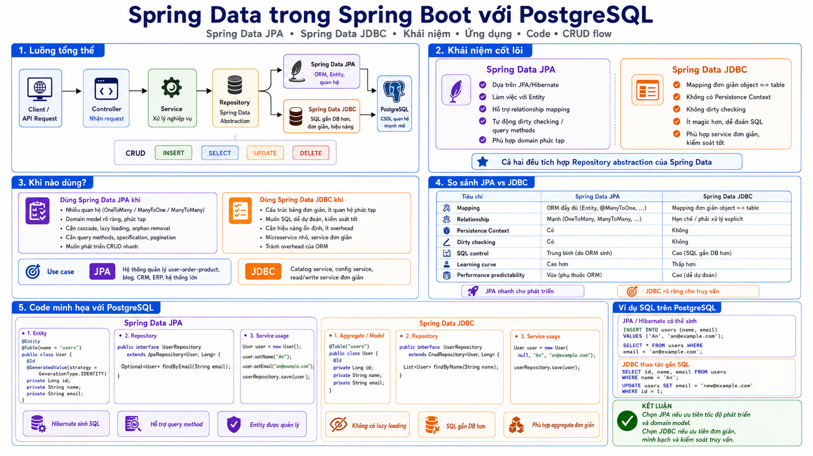
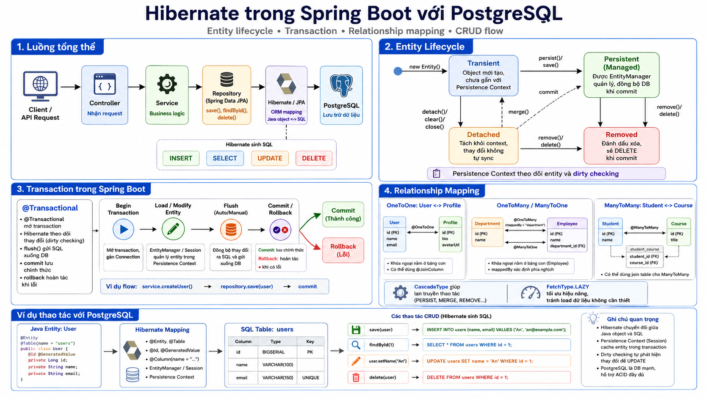
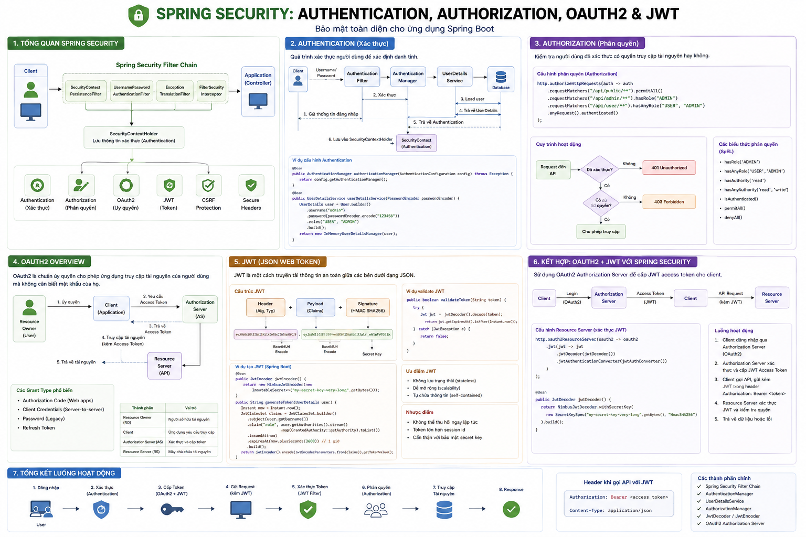

# People Management Module - Core Unit Test Specifications

Streamlined unit test specifications featuring **37 core, high-priority test cases** for the **People Management** module, prioritized by business impact (**P0 - Critical**, **P1 - High**, **P2 - Medium**).

---

## System Architecture & Spring Framework Diagrams

### 1. Overview Architecture

### 2. Architecture & Data Flow

### 3. Dependency Injection (DI) & IoC Container

### 4. Spring MVC Flow

### 5. Spring Data JPA Architecture

### 6. Hibernate ORM Layer

### 7. Spring Security Architecture

---

## 1. Core Unit Test Diagram

```mermaid
flowchart LR
    Root(("People Management Unit Tests (37 Core TCs)"))

    %% =====================================================
    %% Categories (Top to Bottom Hierarchy)
    %% =====================================================

    Cat1(["1. EmployeeDirectoryApiTest"])
    Cat2(["2. OrganizationDepartmentApiTest"])
    Cat3(["3. RequestManagementApiTest"])

    Root --> Cat1
    Root --> Cat2
    Root --> Cat3

    %% =====================================================
    %% 1. Employee Directory APIs
    %% =====================================================

    Cat1 --> TC01("TC-01 [P0] Search & Paginated Employees List")
    Cat1 --> TC02("TC-02 [P0] Register Employee Profile")
    Cat1 --> TC03("TC-03 [P0] Validate Duplicate Email Error")
    Cat1 --> TC04("TC-04 [P0] Fetch 360-Degree Profile Details")
    Cat1 --> TC05("TC-05 [P1] Update Demographics & Contact Info")
    Cat1 --> TC06("TC-06 [P1] Offboard & Deactivate Employee Profile")
    Cat1 --> TC07("TC-07 [P1] Fetch Labor Contract History")
    Cat1 --> TC08("TC-08 [P1] Register Labor Contract & Salary")
    Cat1 --> TC09("TC-09 [P2] Fetch Verification Documents List")
    Cat1 --> TC10("TC-10 [P2] Upload Document File & Validation")
    Cat1 --> TC11("TC-11 [P1] Retrieve Leave Quota Balances")
    Cat1 --> TC12("TC-12 [P2] Fetch Career Promotion Audit Logs")
    Cat1 --> TC13("TC-13 [P2] Export Employee Directory to CSV/XLSX")

    %% =====================================================
    %% 2. Organization & Department APIs
    %% =====================================================

    Cat2 --> TC14("TC-14 [P0] Fetch Org Hierarchy Tree")
    Cat2 --> TC15("TC-15 [P0] Register Operational Department")
    Cat2 --> TC16("TC-16 [P1] Fetch Department Roster & Budget")
    Cat2 --> TC17("TC-17 [P1] Update Department Metadata")
    Cat2 --> TC18("TC-18 [P0] Validate Parent Cyclic Loop Error")
    Cat2 --> TC19("TC-19 [P0] Prevent Active Department Deletion")
    Cat2 --> TC20("TC-20 [P2] Queue Executive Restructure Event")
    Cat2 --> TC21("TC-21 [P1] Fetch Position Titles & Salary Bands")
    Cat2 --> TC22("TC-22 [P1] Create Position & Validate Salary Band")
    Cat2 --> TC23("TC-23 [P1] List Active Project Teams")
    Cat2 --> TC24("TC-24 [P1] Manage Team Member Allocations")
    Cat2 --> TC25("TC-25 [P1] Fetch Supervisor Hierarchy Matrix")
    Cat2 --> TC26("TC-26 [P0] Update Supervisor & Validate Self Report")

    %% =====================================================
    %% 3. Request Management APIs
    %% =====================================================

    Cat3 --> TC27("TC-27 [P0] Filter Paginated HR Requests")
    Cat3 --> TC28("TC-28 [P0] Submit HR Request & Validate Quota")
    Cat3 --> TC29("TC-29 [P0] Validate Exceeded Leave Quota Conflict")
    Cat3 --> TC30("TC-30 [P1] Fetch Request Details & Documents")
    Cat3 --> TC31("TC-31 [P1] Modify Draft Request Before Approval")
    Cat3 --> TC32("TC-32 [P0] Advance Approval Workflow Step")
    Cat3 --> TC33("TC-33 [P0] Execute Final Approval & Quota Deduction")
    Cat3 --> TC34("TC-34 [P0] Reject Request & Enforce Comment")
    Cat3 --> TC35("TC-35 [P1] Cancel Pending Submitted Request")
    Cat3 --> TC36("TC-36 [P2] Fetch Request Audit Timeline")
    Cat3 --> TC37("TC-37 [P0] Check Available Leave Quota Balance")
```

---

## 2. Core Unit Test Cases Inventory (37 Test Cases)

### 2.1 Employee Directory Unit Tests (`EmployeeDirectoryApiTest`)

| Test Code | Priority | Target Endpoint | Category / Description | Status Code | Test Method Name |
| :---: | :---: | :--- | :--- | :---: | :--- |
| **TC-01** | `P0 - Critical` | `GET /api/v1/employees` | Search & Paginated Employees List | `200` | `getEmployees_shouldReturnPaginatedList_whenRequestIsValid()` |
| **TC-02** | `P0 - Critical` | `POST /api/v1/employees` | Register New Employee Profile | `201` | `createEmployee_shouldCreateProfile_whenPayloadIsValid()` |
| **TC-03** | `P0 - Critical` | `POST /api/v1/employees` | Duplicate Corporate Email Check | `409` | `createEmployee_shouldReturnConflict_whenCorporateEmailAlreadyExists()` |
| **TC-04** | `P0 - Critical` | `GET /api/v1/employees/{id}` | Fetch 360-Degree Profile Details | `200` | `getEmployeeById_shouldReturnFullProfile_whenEmployeeExists()` |
| **TC-05** | `P1 - High` | `PUT /api/v1/employees/{id}` | Update Contact & Demographics | `200` | `updateEmployee_shouldUpdateDetails_whenRequestIsValid()` |
| **TC-06** | `P1 - High` | `DELETE /api/v1/employees/{id}` | Offboard & Deactivate Account | `200` | `deleteEmployee_shouldDeactivateAccount_whenEmployeeExists()` |
| **TC-07** | `P1 - High` | `GET /api/v1/employees/{id}/contracts` | Fetch Contract History | `200` | `getEmployeeContracts_shouldReturnContractHistory_whenEmployeeExists()` |
| **TC-08** | `P1 - High` | `POST /api/v1/employees/{id}/contracts` | Register Labor Contract & Salary | `201` | `createContract_shouldRegisterContract_whenPayloadIsValid()` |
| **TC-09** | `P2 - Medium` | `GET /api/v1/employees/{id}/documents` | Fetch Verification Documents | `200` | `getEmployeeDocuments_shouldReturnDocumentList_whenDocumentsExist()` |
| **TC-10** | `P2 - Medium` | `POST /api/v1/employees/{id}/documents` | Upload Document File & Format Check | `201` | `uploadDocument_shouldSaveDocument_whenFileAndTypeAreValid()` |
| **TC-11** | `P1 - High` | `GET /api/v1/employees/{id}/leave-balance` | Retrieve Leave Quotas | `200` | `getLeaveBalance_shouldReturnQuotas_whenEmployeeExists()` |
| **TC-12** | `P2 - Medium` | `GET /api/v1/employees/{id}/history` | Fetch Career Audit Trail Logs | `200` | `getEmployeeHistory_shouldReturnAuditLogs_whenHistoryExists()` |
| **TC-13** | `P2 - Medium` | `POST /api/v1/employees/export` | Export Directory to CSV/XLSX | `200` | `exportEmployees_shouldReturnFileStream_whenFormatIsValid()` |
| **TOTAL** | **13 TCs** | **13 Endpoints** | **Employee Directory APIs Coverage** | **200, 201, 409** | **Total: 13 Test Cases (`TC-01` ➔ `TC-13`)** |

---

### 2.2 Organization & Department Unit Tests (`OrganizationDepartmentApiTest`)

| Test Code | Priority | Target Endpoint | Category / Description | Status Code | Test Method Name |
| :---: | :---: | :--- | :--- | :---: | :--- |
| **TC-14** | `P0 - Critical` | `GET /api/v1/departments` | Fetch Org Hierarchy Tree | `200` | `getDepartments_shouldReturnTreeHierarchy_whenDataExists()` |
| **TC-15** | `P0 - Critical` | `POST /api/v1/departments` | Register Operational Department | `201` | `createDepartment_shouldCreateEntity_whenPayloadIsValid()` |
| **TC-16** | `P1 - High` | `GET /api/v1/departments/{id}` | Fetch Department Roster & Details | `200` | `getDepartmentById_shouldReturnDetails_whenDepartmentExists()` |
| **TC-17** | `P1 - High` | `PUT /api/v1/departments/{id}` | Update Department Metadata | `200` | `updateDepartment_shouldUpdateRecord_whenRequestIsValid()` |
| **TC-18** | `P0 - Critical` | `PUT /api/v1/departments/{id}` | Parent Cyclic Dependency Check | `400` | `updateDepartment_shouldReturnBadRequest_whenParentIdCausesCyclicDependency()` |
| **TC-19** | `P0 - Critical` | `DELETE /api/v1/departments/{id}` | Prevent Deleting Active Dept | `400` | `deleteDepartment_shouldReturnBadRequest_whenDepartmentHasActiveMembers()` |
| **TC-20** | `P2 - Medium` | `POST /api/v1/departments/restructure` | Queue Restructuring Approval | `202` | `requestRestructure_shouldQueueApprovalTask_whenRequestIsValid()` |
| **TC-21** | `P1 - High` | `GET /api/v1/positions` | List Positions & Salary Bands | `200` | `getPositions_shouldReturnPositionList_whenPositionsExist()` |
| **TC-22** | `P1 - High` | `POST /api/v1/positions` | Create Position & Check Salary Range | `201` | `createPosition_shouldCreatePosition_whenPayloadIsValid()` |
| **TC-23** | `P1 - High` | `GET /api/v1/teams` | List Project Teams & Members | `200` | `getTeams_shouldReturnTeamList_whenTeamsExist()` |
| **TC-24** | `P1 - High` | `POST /api/v1/teams/{id}/members` | Manage Team Member Allocation | `200` | `updateTeamMembers_shouldUpdateAllocation_whenActionIsValid()` |
| **TC-25** | `P1 - High` | `GET /api/v1/reporting-lines` | Fetch Supervisor Matrix | `200` | `getReportingLines_shouldReturnHierarchyMatrix_whenDataExists()` |
| **TC-26** | `P0 - Critical` | `PUT /api/v1/reporting-lines` | Update Supervisor & Check Self-Report | `400` | `updateReportingLine_shouldReturnBadRequest_whenEmployeeIsAssignedToSelf()` |
| **TOTAL** | **13 TCs** | **13 Endpoints** | **Organization & Department APIs Coverage** | **200, 201, 202, 400** | **Total: 13 Test Cases (`TC-14` ➔ `TC-26`)** |

---

### 2.3 Request Management API Tests (`RequestManagementApiTest`)

| Test Code | Priority | Target Endpoint | Category / Description | Status Code | Test Method Name |
| :---: | :---: | :--- | :--- | :---: | :--- |
| **TC-27** | `P0 - Critical` | `GET /api/v1/requests` | Filter Paginated HR Requests | `200` | `getRequests_shouldReturnFilteredRequests_whenFiltersProvided()` |
| **TC-28** | `P0 - Critical` | `POST /api/v1/requests` | Submit HR Request & Check Quota | `201` | `createRequest_shouldCreateRequest_whenPayloadAndQuotaValid()` |
| **TC-29** | `P0 - Critical` | `POST /api/v1/requests` | Exceeded Leave Quota Check | `409` | `createRequest_shouldReturnConflict_whenLeaveQuotaIsInsufficient()` |
| **TC-30** | `P1 - High` | `GET /api/v1/requests/{id}` | Fetch Request Details & Documents | `200` | `getRequestById_shouldReturnFullMetadata_whenRequestExists()` |
| **TC-31** | `P1 - High` | `PUT /api/v1/requests/{id}` | Modify Draft Request Before Approval | `200` | `updateRequest_shouldModifyDraft_whenRequestIsDraft()` |
| **TC-32** | `P0 - Critical` | `POST /api/v1/requests/{id}/approve` | Advance Approval Workflow Step | `200` | `approveRequest_shouldAdvanceWorkflowStep_whenStepIsPending()` |
| **TC-33** | `P0 - Critical` | `POST /api/v1/requests/{id}/approve` | Execute Final Approval & Quota Deduction | `200` | `approveRequest_shouldExecuteFinalApproval_whenLastStepApproved()` |
| **TC-34** | `P0 - Critical` | `POST /api/v1/requests/{id}/reject` | Reject Request & Mandatory Comment | `200` | `rejectRequest_shouldRejectRequest_whenReasonIsProvided()` |
| **TC-35** | `P1 - High` | `POST /api/v1/requests/{id}/cancel` | Cancel Pending Request | `200` | `cancelRequest_shouldCancelRequest_whenPendingApproval()` |
| **TC-36** | `P2 - Medium` | `GET /api/v1/requests/{id}/timeline` | Fetch Approval Timeline Audit Logs | `200` | `getRequestTimeline_shouldReturnWorkflowHistory_whenRequestExists()` |
| **TC-37** | `P0 - Critical` | `GET /api/v1/requests/quotas/check` | Check Available Leave Quota Balance | `200` | `checkQuota_shouldReturnSufficientStatus_whenBalanceIsEnough()` |
| **TOTAL** | **11 TCs** | **11 Endpoints** | **Request Management APIs Coverage** | **200, 201, 409** | **Total: 11 Test Cases (`TC-27` ➔ `TC-37`)** |

---

## 3. Overall Unit Test Summary

| Module Section | Test Code Range | Total Test Cases | Priority Breakdown | Key Focus Areas |
| :--- | :---: | :---: | :---: | :--- |
| **2.1 Employee Directory** | `TC-01` ➔ `TC-13` | **13** | **4 P0**, **5 P1**, **4 P2** | Profile CRUD, Duplicate Email, Contracts, Documents Upload, Quota Calc, Export |
| **2.2 Organization & Department** | `TC-14` ➔ `TC-26` | **13** | **5 P0**, **7 P1**, **1 P2** | Org Hierarchy Tree, Department CRUD, Cyclic Parent Check, Restructuring, Positions, Team Allocations, Self-Report Check |
| **2.3 Request Management** | `TC-27` ➔ `TC-37` | **11** | **7 P0**, **3 P1**, **1 P2** | Request Lifecycle, Exceeded Quota Check, Draft Updates, Workflow Step Advance & Final Execution, Mandatory Rejection Comment, Timeline Logs |
| **TOTAL** | **`TC-01` ➔ `TC-37`** | **37** | **16 P0**, **15 P1**, **6 P2** | **Comprehensive Core API Coverage** |